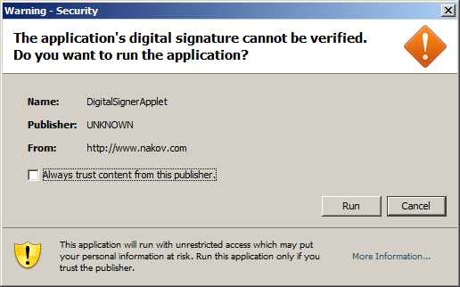

# Альтернативные браузерные технологии

Современный JavaScript используется во многих областях. Если говорить о браузерах, то вместе с JavaScript на страницах используются и другие технологии.

Самые извеcтные -- это Flash, Java, ActiveX/NPAPI. Связка с ними может помочь достигнуть более интересных результатов в тех местах, где браузерный JavaScript пока не столь хорош, как хотелось бы. 

[cut]

## Java   

Java -- язык общего назначения, на нем можно писать самые разные программы. Для интернет-страниц есть особая возможность - написание *апплетов*.

*Апплет* -- это программа на языке Java, которую можно подключить к HTML при помощи тега `applet`:

```html
<!--+ run -->
<applet code="BTApplet.class" codebase="/files/tutorial/intro/alt/">
  <param name="nodes" value="50,30,70,20,40,60,80,35,65,75,85,90">
  <param name="root" value="50">
</applet>
```

Такой тег загружает Java-программу из файла `BTApplet.class` и выполняет ее с параметрами `param`. Апплет выполняется в отдельной части страницы, в прямоугольном "контейнере". Все действия пользователя внутри него обрабатывает апплет. Контейнер, впрочем, может быть и спрятан, если апплету нечего показывать.

Конечно, для этого на компьютере должна быть установлена и включена среда выполнения Java, включая браузерный плагин. Статистика показывает, что это около 80% компьютеров. Кроме того, апплет должен быть подписан сертификатом издателя (в примере выше апплет без подписи), иначе Java заблокирует его.

**Чем нам, JavaScript-разработчикам, может быть интересен Java?**

В первую очередь тем, что подписанный Java-апплет может всё то же, что и обычная программа, установлена на компьютере посетителя.

При попытке сделать потенциально опасное действие -- пользователь получает вопрос, который выглядит примерно так:



Обойти это подтверждение или поменять его внешний вид нельзя. То есть, согласие посетителя действительно необходимо. 

И если оно есть -- то Java-апплет может выполнять любые действия, в отличие от JavaScript.

[compare]
+Java может делать *всё* от имени посетителя, совсем как установленная программа. В целях безопасности, потенциально опасные действия требуют подписанного апплета и доверия пользователя.
-Java требует больше времени для загрузки.
-Среда выполнения Java, включая браузерный плагин, должна быть установлена на компьютере посетителя и включена. Таких посетителей в интернет -- около 80%.
-Java-апплет не интегрирован с HTML-страницей, а выполняется отдельно. Но он может вызывать функции JavaScript.
[/compare]

Подписанный Java-апплет -- это возможность делать все, что угодно, на компьютере посетителя, если он вам доверяет. 

Java и JavaScript могут взаимодействовать, так что можно вынести в Java те вызовы, которым нужно обойти контекст безопасности, а для самой страницы использовать JavaScript.


## ActiveX/NPAPI, плагины и расширения для браузера

ActiveX для IE и NPAPI для остальных браузеров позволяют писать плагины для браузера, в том числе на языке C. Как и в ситуации с Java-апплетом, посетитель поставит их в том случае, если вам доверяет.

Эти плагины могут как отображать содержимое специального формата (плагин для проигрывания музыки, для показа PDF), так и взаимодействовать со страницей.

ActiveX при этом еще и очень удобен в установке. Лично я - не фанат Microsoft, но видел отличные приложения, написанные на ActiveX и я могу понять, почему люди используют его и привязываются к IE.

## Adobe Flash   

Adobe Flash -- кросс-браузерная платформа для мультимедиа-приложений, анимаций, аудио и видео. 

*Flash-ролик* -- это скомпилированная программа, написанная на языке ActionScript. Ее можно подключить к HTML-странице и запустить в прямоугольном контейнере.

В первую очередь Flash полезен тем, что позволяет **кросс-браузерно** работать с микрофоном, камерой, с буфером обмена, а также поддерживает продвинутые возможности по работе с сетевыми соединениями. 

[compare]
+Сокеты, UDP для P2P и другие продвинутые возможности по работе с сетевыми соединениями
+Поддержка мультмедиа: изображения, аудио, видео. Работа с веб-камерой и микрофоном.
-Flash должен быть установлен и включен. А на некоторых устройствах он вообще не поддерживается.
-Flash не интегрирован с HTML-страницей, а выполняется отдельно.
-Существуют ограничения безопасности, однако они немного другие, чем в JavaScript.
[/compare]

**JavaScript и ActionScript могут вызывать функции друг друга**, поэтому обычно сайты используют JavaScript, а там, где он не справляется -- можно подумать о Flash.

## Dart

Язык Dart предложен компанией Google как замена JavaScript, у которого, по выражению создателей Dart, есть [фатальные недостатки](http://lurkmore.to/%D0%A4%D0%B0%D1%82%D0%B0%D0%BB%D1%8C%D0%BD%D1%8B%D0%B9_%D0%BD%D0%B5%D0%B4%D0%BE%D1%81%D1%82%D0%B0%D1%82%D0%BE%D0%BA). 

Сейчас этот язык, хотя и доступен, находится в стадии разработки. Многие из возможностей еще ожидают своей реализации, есть ряд проблем. Другие ведущие интернет-компании объявляли о своей незаинтересованности в Dart. Но в будущем он может составить конкуренцию JS, если его доведут до ума.

Программы на языке Dart специальным инструментом могут быть преобразованы в JavaScript. Конечно, при этом часть важных возможностей Dart теряется.

## CoffeeScript

Язык [CoffeeScript](http://coffeescript.org) -- это "синтаксический сахар" для JavaScript, который короче и, местами, проще. 

Этот язык напрямую в браузере не работает, но предлагается специальная программа для преобразования CoffeeScript в JavaScript, и при этом, так как CoffeeScript изначально задумывался как преобразуемый в JavaScript, результирующий код выглядит вполне хорошо и работает тоже.

Есть и другие языки, которые написаны "поверх" JavaScript, например [TypeScript](http://www.typescriptlang.org/). 

Строго говоря, это не альтернативные технологии, для их использования необходимо, как базу, хорошо знать и понимать JavaScript.

Возможно, вы захотите изучить этот язык после того, как освоите JavaScript, многим он нравится. 

## Итого

Язык JavaScript уникален благодаря своей полной интеграции с HTML/CSS. Он работает почти у всех посетителей.

**...Но хороший JavaScript-программист не должен забывать и о других технологиях.** Ведь наша цель -- создание хороших приложений, и здесь Flash, Java, ActiveX/NPAPI имеют свои уникальные возможности, которые можно использовать вместе с JavaScript.
