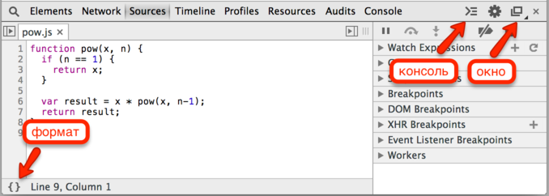
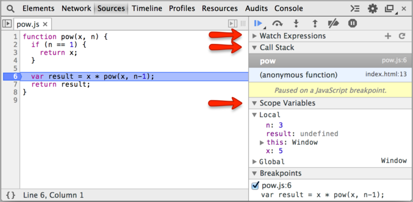
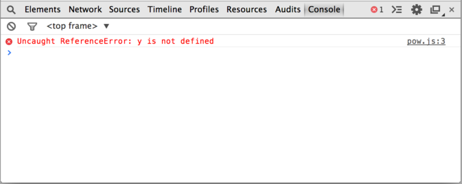
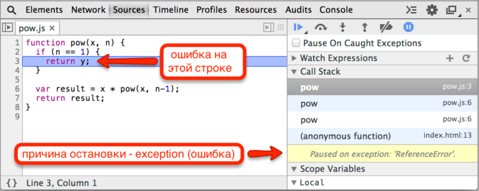

# Отладка в браузере Chrome

Перед тем, как двигаться дальше, поговорим об отладке скриптов. 

Все современные браузеры поддерживают для этого "инструменты разработчика". Исправление ошибок с их помощью намного проще и быстрее.

На текущий момент самые многофункциональные инструменты -- в браузере Chrome. Также очень хорош Firebug (для Firefox).

[cut]

## Общий вид панели Sources

**В вашей версии Chrome панель может выглядеть несколько по-иному, но что где находится, должно быть понятно.**

Зайдите на страницу [debugging/pow/index.html](/debugging/pow/index.html) браузером Chrome.

Откройте инструменты разработчика: [key F12] или в меню `Инструменты > Инструменты Разработчика`.

Выберите сверху `Sources` (вместо иконок у вас могут быть просто надписи "Elements", "Resources", "Network", "Sources"...)


Вы видите три зоны:

<ol>
<li>**Зона исходных файлов.** В ней находятся все подключённые к странице файлы, включая JS/CSS. Выберите `pow.js`, если он не выбран.</li>
<li>**Зона текста.** В ней находится текст файлов.</li>
<li>**Зона информации и контроля.** Мы поговорим о ней позже.</li>
</ol>

Обычно зона исходных файлов при отладке не нужна. Скройте её кнопкой <span class="devtools" style="background-position:-200px -76px"></span>.

## Общие кнопки управления



Три полезные кнопки управления:
<dl>
<dt>Формат <span class="devtools" style="background-position:-264px 94px"></span></dt>
<dd>Нажатие форматирует текст текущего файла, расставляет отступы. Нужна, если вы хотите разобраться в чужом коде, плохо отформатированном или сжатом.</dd>
<dt>Консоль <span class="devtools" style="background-position:-70px 94px"></span></dt>
<dd>Очень полезная кнопка, открывает тут же консоль для запуска команд. Можно смотреть код и тут же запускайть функции. Её нажатие можно заменить на клавишу <code class="key">Esc</code>.</dd>
<dt>Окно <span class="devtools" style="background-position:-6px 70px"></span></dt>
<dd>Если код очень большой, то можно вынести инструменты разработки вбок или в отдельное окно, зажав эту кнопку и выбрав соответствующий вариант из списка.</dd>
</dl>

## Точки остановки

Открыли `pow.js` в зоне текста? Кликните на 6й строке файла `pow.js`, прямо на цифре 6.

Поздравляю! Вы поставили "точку остановки" или, как чаще говорят, "брейкпойнт".


Слово *Брейкпойнт* (breakpoint) -- часто используемый английский жаргонизм. Это то место в коде, где отладчик будет *автоматически* останавливать выполнение JavaScript, как только оно до него дойдёт.


**В остановленном коде можно посмотреть текущие значения переменных, выполнять команды и т.п., в общем -- отлаживать его.**

Вы можете видеть, что информация о точке остановки появилась справа, в подвкладке Breakpoints. 

Вкладка Breakpoints очень удобна, когда код большой, она позволяет:

<ul>
<li>Быстро перейти на место кода, где стоит брейкпойнт -- кликом на текст.</li>
<li>Временно выключить брейкпойнт -- кликом на чекбокс.</li>
<li>Быстро удалить брейкпойнт -- правым кликом на текст и выбором Remove...</li>
</ul>

[smart header="Дополнительные возможности"]
<ul>
<li>Остановку можно инициировать и напрямую из кода скрипта, командой `debugger`:

```js
function pow(x, n) {
  ...
  debugger; // <-- отладчик остановится тут
  ...
}
```

</li>
<li>*Правый клик* на номер строки `pow.js` позволит создать условную точку остановки (conditional breakpoint), т.е. задать условие, при котором точка остановки сработает.

Это удобно, если остановка нужна только при определённом значении переменной или параметра функции.
</li>
</ul>
[/smart]

## Остановиться и осмотреться

Наша функция выполняется сразу при загрузке страницы, так что самый простой способ активировать JavaScript -- перезагрузить её. Итак, нажимаем [key F5] (Windows, Linux) или [key Cmd+R] (Mac).

Если вы сделали всё, как описано выше, то выполнение прервётся как раз на 6й строке.



Обратите внимание на информационные вкладки справа (отмечены стрелками). 

В них мы можем посмотреть текущее состояние:
<ol>
<li>**`Watch Expressions` -- показывает текущие значения любых выражений.**

Можно раскрыть эту вкладку, нажать мышью `+` на ней и ввести любое выражение. Отладчик будет отображать его значение на текущий момент, автоматически перевычисляя его при проходе по коду.</li>
<li>**`Call Stack` -- стек вызовов, все вложенные вызовы, которые привели к текущему месту кода.** 

На текущий момент видно, отладчик находится в функции `pow` (pow.js, строка 6), вызванной из анонимного кода (index.html, строка 13).</li>
<li>**`Scope Variables` -- переменные.**

На текущий момент строка 6 ещё не выполнилась, поэтому `result` равен `undefined`.

В `Local` показываются переменные функции: объявленные через `var` и параметры. Вы также можете там видеть ключевое слово `this`, если вы не знаете, что это такое -- ничего страшного, мы это обсудим позже, в следующих главах учебника.

В `Global` -- глобальные переменные и функции.
</li>
</ol>

## Управление выполнением

Пришло время "погонять" скрипт и "оттрейсить" (от англ. trace, отслеживать) его работу.

Обратим внимание на панель управления справа-сверху, в ней есть 6 кнопок:

<dl>
<dt> -- продолжить выполнение, горячая клавиша [key F8].</dt>
<dd> Если скрипт не встретит новых точек остановки, то на этом работа в отладчике закончится.

Нажмите на эту кнопку. 

Вы увидите, что отладчик остался на той же строке, но в `Call Stack` появился новый вызов. Это произошло потому, что в 6й строке находится рекурсивный вызов функции `pow`, т.е. управление перешло в неё опять, но с другими аргументами.

Походите по стеку вверх-вниз -- вы увидите, что действительно аргументы разные.
</dd>
<dt> -- сделать шаг, не заходя внутрь функции, горячая клавиша [key F10].</dt>
<dd>Выполняет одну команду скрипта. Если в ней есть вызов функции -- то отладчик обходит его стороной, т.е. не переходит на код внутри.

Эта кнопка очень удобна, если в текущей строке вызывается функция JS-фреймворка или какая-то другая, которая нас ну совсем не интересует. Тогда выполнение продолжится дальше, без захода в эту функцию, что нам и нужно.

Обратим внимание, в данном случае эта кнопка при нажатии всё-таки перейдёт внутрь вложенного вызова `pow`, так как внутри `pow` находится брейкпойнт, а на включённых брейкпойнтах отладчик останавливается всегда. 
</dd>
<dt> -- сделать шаг, горячая клавиша [key F11].</dt>
<dd>Выполняет одну команду скрипта и переходит к следующей. Если есть вложенный вызов, то заходит внутрь функции.

Эта кнопка позволяет подробнейшим образом пройтись по очереди по командам скрипта.
</dd>
<dt> -- выполнять до выхода из текущей функции, горячая клавиша [key Shift+F11].</dt>
<dd>Выполняет команды до завершения текущей функции.

Эта кнопка очень удобна в случае, если мы нечаянно вошли во вложенный вызов, который нам не интересен -- чтобы быстро из него выйти.
</dd>
<dt> -- отключить/включить все точки остановки.</dt>
<dd>Эта кнопка никак не двигает нас по коду, она позволяет временно отключить все точки остановки в файле.
</dd>
<dt> -- включить/отключить автоматическую остановку при ошибке.</dt>
<dd>Эта кнопка -- одна из самых важных. 

Нажмите её несколько раз. В старых версиях Chrome у неё три режима  -- нужен фиолетовый, в новых -- два, тогда достаточно синего.

Когда она включена, то при ошибке в коде он автоматически остановится и мы сможем посмотреть в отладчике текущие значения переменных, при желании выполнить команды и выяснить, как так получилось.
</dd>
</dl>

**Процесс отладки заключается в том, что мы останавливаем скрипт, смотрим, что с переменными, переходим дальше и ищем, где поведение отклоняется от правильного.**

[smart header="Дополнительные возможности"]
Правый клик на номер строки открывает контекстное меню, в котором можно запустить выполнение кода до неё (Continue to here). 

Это очень удобно, если промежуточные строки нас не интересуют.
[/smart]


## Консоль

При отладке, кроме просмотра переменных, бывает полезно запускать команды JavaScript. Для этого нужна консоль.

В неё можно перейти, нажав кнопку "Console" вверху-справа, а можно и открыть в дополнение к отладчику, нажав на кнопку <span class="devtools" style="background-position:-72px -28px"></span> или клавишей [key ESC].

**Самая любимая команда разработчиков: `console.log(...)`.**

Она пишет переданные ей аргументы в консоль, например:

```js
//+ run
// результат будет виден в консоли
for(var i=0; i<5; i++) {
  console.log("значение", i);
}
```

Полную информацию по специальным командам консоли вы можете получить на странице [](https://developers.google.com/chrome-developer-tools/docs/commandline-api?hl=ru). Эти команды также действуют в Firebug (отладчик для браузера Firefox).

Консоль поддерживают все браузеры, и, хотя IE10- поддерживает далеко не все функции, `console.log` работает везде, пользуйтесь им вместо `alert`.

## Ошибки

**Ошибки JavaScript выводятся в консоли.**

Например, прервите отладку -- для этого достаточно закрыть инструменты разрабтчика -- и откройте страницу [debugging/pow-error/index.html](/debugging/pow-error/index.html). 

Перейдите во вкладку Console инструментов разработчика ([key Ctrl+Shift+J] / [key Cmd+Shift+J]).

В консоли вы увидите что-то подобное:


Красная строка -- это сообщение об ошибке.

В чём дело? Если мы хотим понять, что случилось -- перейдём в отладчик. 

Для этого:
<ol>
<li>Перейдите на вкладку Sources.</li>
<li>Включите останов при ошибке, используя кнопку .</li>
<li>Перезагрузите страницу.</li>
</ol>

После перезагрузки страницы JavaScript-код запустится снова и отладчик остановит выполнение на строке с ошибкой:



Можно посмотреть значения переменных. Открыть консоль и попробовать запустить что-то в ней. Поставить брейкпойнты раньше по коду и посмотреть, что привело к такой печальной картине, и так далее.

В данном случае-то всё просто: опечатка в имени переменной `y` вместо `x`. Этот тип ошибки называется `ReferenceError`.

## Итого

Отладчик позволяет:
<ul>
<li>Останавливаться на отмеченном месте (breakpoint) или по команде `debugger`.</li>
<li>Выполнять код -- по одной строке или до определённого места.</li>
<li>Смотреть переменные, выполнять команды в консоли и т.п.</li>
</ul>

В этой главе кратко описаны возможности отладчика Google Chrome, относящиеся именно к работе с кодом. 

Пока что это всё, что нам надо, но, конечно, инструменты разработчика умеют много чего ещё. В частности, вкладка Elements -- позволяет работать со страницей (понадобится позже), Timeline -- смотреть, что именно делает браузер и сколько это у него занимает и т.п. 

Осваивать можно двумя путями:
<ol>
<li>[Официальная документация](https://developers.google.com/chrome-developer-tools/docs/overview) (на англ.)</li>
<li>Кликать в разных местах и смотреть, что получается. Не забывать о клике правой кнопкой мыши.</li>
</ol>

Мы ещё вернёмся к отладчику позже, когда будем работать с HTML.
[head]
<style>
span.devtools {
  display: inline-block;
  background-image: url(/article/debugging-chrome/statusbarButtonGlyphs.svg);
  height:16px;
  width:16px;
}
</style>
[/head]