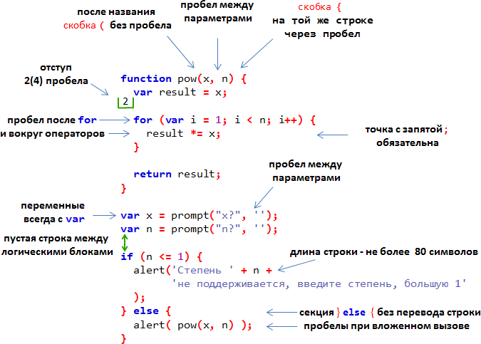

# Советы по стилю кода 

Код должен быть максимально читаемым и понятным. Для этого нужен *хороший стиль* написания кода. В этой главе мы рассмотрим компоненты такого стиля.

[cut]
## Синтаксис

Шпаргалка с правилами синтаксиса:



Разберём основные моменты.

### Фигурные скобки

Пишутся на той же строке, так называемый "египетский" стиль. Перед скобкой -- пробел.


Если у вас уже есть опыт в разработке и вы привыкли делать скобку на отдельной строке -- это тоже вариант. В конце концов, решать вам. Но в основных JavaScript-фреймворках (jQuery, Dojo, Google Closure Library, Mootools, Ext.JS, YUI...) стиль именно такой.

Если условие и код достаточно короткие, например `if (cond) return null;`, то запись в одну строку вполне читаема... Но, как правило, отдельная строка всё равно воспринимается лучше.

### Длина строки

Максимальную длину строки согласовывают в команде. Как правило, это либо `80`, либо `120` символов, в зависимости от того, какие мониторы у разработчиков. 

Более длинные строки необходимо разбивать. Если этого не сделать, то перевод очень длинной строки сделает редактор, и это может быть менее красиво и читаемо.

### Отступы 

Отступы нужны двух типов:

<ul>
<li>**Горизонтальный отступ, при вложенности -- два(или четыре) пробела.** 

Как правило, используются именно пробелы, т.к. они позволяют сделать более гибкие "конфигурации отступов", чем символ "Tab".

Например:

```js
function fib(n) {
*!*
  var a = 1;
  var b = 1;
*/!*
  for (var i = 3; i <= n; i++) {
    var c = a + b;
    a = b;
    b = c;
  }          
  return b;
}
```

Кстати, обратите внимание, переменные в выделенном фрагменте объявлены по вертикали, а не в строку `var a=1, b=1`. Так более наглядно, человеческий глаз лучше воспринимает ("сканирует") вертикально выравненную информацию, нежели по горизонтали. Это известный факт среди дизайнеров и нам, программистам, он тоже будет полезен для лучшей организации кода.

</li>
<li>**Вертикальный отступ, для лучшей разбивки кода -- перевод строки.** 

Используется, чтобы разделить логические блоки внутри одной функции. В примере ниже разделены функция `pow`, получение данных `x,n` и их обработка `if`.

```js
function pow(x, n) {
  return (n != 1) ? pow(x, n-1) : x;
}
           // <--
x = prompt(...);
n = prompt(...);
           // <--
if (n >= 1) {
  var result = pow(x, n);
  alert(result);
}
```

Вставляйте дополнительный перевод строки туда, где это сделает код более читаемым. Не должно быть более 9 строк кода подряд без вертикального отступа.
</li>
</ul>

### Точка с запятой

Точки с запятой нужно ставить, даже если их, казалось бы, можно пропустить. 

Есть языки, в которых точка с запятой не обязательна, и её там никто не ставит. В JavaScript она тоже не обязательна, но ставить нужно. В чём же разница?

Она в том, что **в JavaScript без точки с запятой возможны трудноуловимые ошибки.** С некоторыми примерами вы встретитесь дальше в учебнике. Такая вот особенность синтаксиса. И поэтому рекомендуется её всегда ставить. 

## Именование

Общее правило:
<ul>
<li>Имя переменной -- существительное.</li>
<li>Имя функции -- глагол или начинается с глагола. Бывает, что имена для краткости делают существительными, но глаголы понятнее.</li>
</ul>

Для имён используется английский язык (не транслит) и верблюжья нотация.

Более подробно -- читайте про [имена функций](#function-naming) и [имена переменных](#variable-naming).

## Уровни вложенности

**Уровней вложенности должно быть немного.**

Например, [проверки в циклах лучше делать через "continue"](#continue), чтобы не было дополнительного уровня `if(..) { ... }`:

Вместо:

```js
for (var i=0; i<10; i++) {
  if (i подходит) {
    ... // <- уровень вложенности 2
  }
}
```

Используйте:

```js
for (var i=0; i<10; i++) {
  if (i *!*не*/!* подходит) *!*continue*/!*;
  ...  // <- уровень вложенности 1
}
```

Аналогичная ситуация -- с `if/else` и `return`. Следующие две конструкции идентичны.

Первая:

```js
function isEven(n) { // проверка чётности
  if (n % 2 == 0) {
    return true;
*!*
  } else { 
    return false;
  }
*/!*
}
```

Вторая:

```js
function isEven(n) { // проверка чётности
  if (n % 2 == 0) {
    return true;
  }
 
*!*
  return false; 
*/!*
}
```

Если в блоке `if` идёт `return`, то `else` за ним не нужен. 

**Лучше быстро обработать простые случаи, вернуть результат, а дальше разбираться со сложным, без дополнительного уровня вложенности.**

В случае с функцией `isEven` можно было бы поступить и проще:

```js
function isEven(n) { // проверка чётности
  return n % 2 == 0; 
}
```

..Казалось бы, можно пойти дальше, есть ещё более короткий вариант:

```js
function isEven(n) { // проверка чётности
  return !(n % 2); 
}
```

...Однако, код `!(n % 2)` менее очевиден чем `n % 2 == 0`. Поэтому, на самом деле, последний вариант хуже. **Главное для нас -- не краткость кода, а его простота и читаемость.**

## Функции = Комментарии

**Функции должны быть небольшими.** Если функция большая -- желательно разбить её на несколько.

Этому правилу бывает сложно следовать, но оно стоит того. При чем же здесь комментарии? 

Вызов отдельной небольшой функции не только легче отлаживать и тестировать -- сам факт его наличия является *отличным комментарием*.

Сравните, например, две функции `showPrimes(n)` для вывода простых чисел до `n`.

Первый вариант:

```js
function showPrimes(n) {
  nextPrime: 
  for (var i=2; i<n; i++) {

    for (var j=2; j<i; j++) {
      if ( i % j == 0) continue nextPrime;
    }
    
    alert(i);  // простое
  }
}
```

Второй вариант, вынесена подфункция `isPrime(n)` для проверки на простоту:

```js
function showPrimes(n) {
  
  for (var i=2; i<n; i++) {
    *!*if (!isPrime(i)) continue;*/!*
     
    alert(i);  // простое         
  }
}

function isPrime(n) {
  for (var i=2; i<n; i++) {
    if ( n % i == 0) return false;
  }
  return true;
}
```

Второй вариант проще и понятнее, не правда ли? Вместо участка кода мы видим описание действия, которое там совершается (проверка `isPrime`).
 
## Функции -- под кодом

Есть два способа расположить функции, необходимые для выполнения кода.

<ol>
<li>Функции над кодом, который их использует:

```js
// *!*объявить функции*/!*
function createElement() {
  ...
}

function setHandler(elem) {
  ...
}

function walkAround() {
  ...
}

// *!*код, использующий функции*/!*
var elem = createElement();
setHandler(elem);
walkAround();
```

</li>
<li>Сначала код, а функции внизу:

```js
// *!*код, использующий функции*/!*
var elem = createElement();
setHandler(elem);
walkAround();

// --- *!*функции*/!* ---

function createElement() {
  ...
}

function setHandler(elem) {
  ...
}

function walkAround() {
  ...
}
```

</li>
</ol>

...На самом деле существует еще третий "стиль", при котором функции хаотично разбросаны по коду ;), но это ведь не наш метод, да? 

**Как правило, лучше располагать функции под кодом, который их использует.** То есть, это 2й способ. 

Дело в том, что при чтении такого кода мы хотим знать в первую очередь, *что он делает*, а уже затем *какие функции ему помогают.* Если первым идёт код, то это как раз дает необходимую информацию. Что же касается функций, то вполне возможно нам и не понадобится их читать, особенно если они названы адекватно и то, что они делают, понятно.

У первого способа, впрочем, есть то преимущество, что на момент чтения мы уже знаем, какие функции существуют. 

Таким образом, если над названиями функций никто не думает -- может быть, это будет лучшим выбором :). Попробуйте оба варианта, но по моей практике предпочтителен всё же второй.


## Комментарии

В коде нужны комментарии. 

**Как правило, комментарии отвечают на вопрос "что происходит в коде?"**

Например:
<ul>
<li>**Архитектурный комментарий -- "как оно, вообще, устроено".** 

Какие компоненты есть, какие технологии использованы, поток взаимодействия. О чём и зачем этот скрипт. Эти комментарии особенно нужны, если вы не один.

Для описания архитектуры, кстати, создан специальный язык [UML](http://ru.wikipedia.org/wiki/Unified_Modeling_Language), красивые диаграммы, но можно и без этого. Главное -- чтобы понятно.
</li>
<li>**Справочный комментарий перед функцией -- о том, что именно она делает, какие параметры принимает и что возвращает.** 

Для таких комментариев существует синтаксис [JSDoc](http://en.wikipedia.org/wiki/JSDoc).

```js
/**
 * Возвращает x в степени n, только для натуральных n
 *
 * @param {number} x Число для возведения в степень.
 * @param {number} n Показатель степени, натуральное число.
 * @return {number} x в степени n.
 */
function pow(x, n) {
  ...
}
```

Такие комментарии позволяют сразу понять, что принимает и что делает функция, не вникая в код. 

Кстати, они автоматически обрабатываются многими редакторами, например [Aptana](http://aptana.com) и редакторами от [JetBrains](http://www.jetbrains.com/), которые  учитывают их при автодополнении.
</li>
<li>**Краткий комментарий, что именно происходит в данном блоке кода.**

Что интересно, в коде начинающих разработчиков обычно комментариев либо нет, либо они как раз такого типа: "что делается в этих строках кода". 

На самом деле именно эти комментарии, как правило, являются самыми ненужными. Хороший код и так самоочевиден, если не используются особо сложные алгоритмы. 

Об этом замечательно выразился Р. Мартин в книге ["Чистый код"](http://www.ozon.ru/context/detail/id/21916535/): "Если вам кажется, что нужно добавить комментарий для улучшения понимания, это значит, что ваш код не достаточно прост, и, может, стоит переписать его".

</li>
</ul>

**...Но куда более важными могут быть комментарии, которые объясняют не *что*, а *почему* в коде происходит именно это!**

Как правило, из кода можно понять, что он делает. Бывает, конечно, всякое, но, в конце концов, вы этот код *видите*. Однако гораздо важнее может быть то, чего вы *не видите*!

*Почему* это сделано именно так? На это сам код ответа не даёт.

Например:

<ul>
<li>**Есть несколько способов решения задачи. Почему выбран именно этот?**

Например, пробовали решить задачу по-другому, но не получилось -- напишите об этом. Почему вы выбрали именно этот способ решения? Особенно это важно в тех случаях, когда используется не первый приходящий в голову способ, а какой-то другой.

Без этого возможна, например, такая ситуация:
<ul>
<li>Вы открываете код, который был написан какое-то время назад, и видите, что он "неоптимален".</li>
<li>Думаете: "Какой я был дурак", и переписываете под "более очевидный и правильный" вариант.</li>
<li>...Порыв, конечно, хороший, да только этот вариант вы уже обдумали раньше. И отказались, а почему -- забыли. В процессе переписывания вспомнили, конечно (к счастью), но результат - потеря времени на повторное обдумывание.</li>
</ul>

Комментарии, которые объясняют поведение кода, очень важны. Они помогают понять происходящее и принять правильное решение о развитии кода.

</li>
<li>**Какие неочевидные возможности обеспечивает этот код?** Где в другом месте кода они используются?

В хорошем коде должно быть минимум неочевидного. Но там, где это есть -- пожалуйста, комментируйте.
</li>

</ul>

Один из показателей хорошего разработчика -- качество комментариев, которые позволяют эффективно поддерживать код, возвращаться к нему после любой паузы и легко вносить изменения.


## Руководства по стилю

Когда написанием проекта занимается целая команда, то должен существовать один стандарт кода, описывающий где и когда ставить пробелы, запятые, переносы строк и т.п. 

Сейчас, когда есть столько готовых проектов, нет смысла придумывать целиком своё руководство по стилю. Можно взять уже готовое, и которому, по желанию, всегда можно что-то добавить.

Большинство есть на английском, сообщите мне, если найдёте хороший перевод:

<ul>
<li>[Google JavaScript Style Guide](http://google-styleguide.googlecode.com/svn/trunk/javascriptguide.xml)</li>
<li>[JQuery Core Style Guidelines](http://docs.jquery.com/JQuery_Core_Style_Guidelines)</li>
<li>[Idiomatic.JS](https://github.com/rwldrn/idiomatic.js) (есть [перевод](https://github.com/rwldrn/idiomatic.js/tree/master/translations/ru_RU))</li>
<li>[Dojo Style Guide](http://dojotoolkit.org/community/styleGuide)</li>
</ul>

Для того, чтобы начать разработку, вполне хватит элементов стилей, обозначенных в этой главе. В дальнейшем, посмотрите на эти руководства, найдите "свой" стиль ;) 

### Автоматизированные средства проверки

Существуют онлайн-сервисы, проверяющие стиль кода.

Самые известные -- это:

<ul>
<li>[JSLint](http://www.jslint.com/) -- проверяет код на соответствие [стилю JSLint](http://www.jslint.com/lint.html), в онлайн-интерфейсе вверху можно ввести код, а внизу различные настройки проверки, чтобы сделать её более мягкой. </li>
<li>[JSHint](http://www.jshint.com/) -- ещё один вариант JSLint, ослабляющий требования в ряде мест.</li>
<li>[Closure Linter](https://developers.google.com/closure/utilities/) -- проверка на соответствие [Google JavaScript Style Guide](http://google-styleguide.googlecode.com/svn/trunk/javascriptguide.xml).</li>
</ul>

Все они также доступны в виде программ, которые можно скачать.

## Итого

Описанные принципы оформления кода уместны в большинстве проектов. Есть и другие полезные соглашения.

Следуя (или не следуя) им, необходимо помнить, что любые советы по стилю хороши лишь тогда, когда делают код читаемее, понятнее, проще в поддержке.

