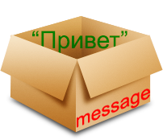
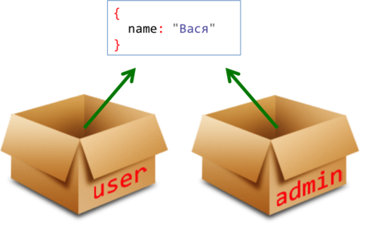
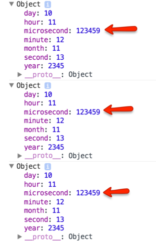

# Объекты: передача по ссылке

Фундаментальным отличием объектов от примитивов, является их копирование "по ссылке".

[cut]

## Копирование по значению

Обычные значения: строки, числа, булевы значения, `null/undefined` при присваивании переменных копируются целиком или, как говорят, *"по значению"*.

```js
var message = "Привет";
var phrase = message;
```

В результате такого копирования получились две полностью независимые переменные, в каждой из которых хранится значение `"Привет"`.

 

## Копирование по ссылке

С объектами -- всё не так.

**В переменной, которой присвоен объект, хранится не сам объект, а "адрес его места в памяти", иными словами -- "ссылка" на него.**

Например, обычную переменную можно изобразить как коробку с данными:

```js
var message = "Привет"; // значение в переменной
```


А вот как выглядит переменная, которой присвоен объект:

```js
var user = { name: "Вася" };
```


Внимание: объект -- вне переменной. В переменной -- лишь ссылка на него.

**При копировании переменной с объектом -- копируется эта ссылка, а объект по-прежнему остается в единственном экземпляре.** 

Например:

```js
var user = { name: "Вася" }; // в переменной - ссылка 

var admin = user; // скопировали ссылку
```

Получили две переменные, в которых находятся ссылки на один и тот же объект:



**Так как объект всего один, то изменения через любую переменную видны в других переменных:**

```js
//+ run
var user = { name: 'Вася' };

var admin = user;

*!*admin.name*/!* = 'Петя'; // поменяли данные через admin

alert(*!*user.name*/!*); // 'Петя', изменения видны в user
```

[smart header="Переменная с объектом как \"ключ\" к сейфу с данными"]
Ещё одна аналогия: переменная, в которую присвоен объект, на самом деле хранит не сами данные, а ключ к сейфу, где они хранятся.

При копировании её, получается что мы сделали копию ключа, но сейф по-прежнему один. По какому бы ключу мы не залезли в сейф, данные -- одни и те же.
[/smart]

## Клонирование объектов

Иногда, на практике -- очень редко, нужно скопировать объект целиком, создать именно полную копию, "независимый клон".

Что ж, можно сделать и это. Для этого нужно пройти по объекту, достать данные и скопировать на уровне примитивов.

Примерно так:

```js
//+ run
var user = {
  name: "Вася",
  age: 30 
};

*!*
var clone = {}; // новый пустой объект

// скопируем в него все свойства user
for(var key in user) {
  clone[key] = user[key];
}
*/!*

// теперь clone -- полностью независимая копия
clone.name = "Петя"; // поменяли данные в clone

alert(user.name); // по-прежнем "Вася"
```

В этом коде не учитывается, что свойства объектов, в свою очередь, могут хранить ссылки на другие объекты. Можно обойти такие подобъекты и тоже склонировать их.

Это называют "глубоким" клонированием. Для того, чтобы это сделать, нужно рекурсивно обойти объект вместе с подобъектами. 

## Вывод в консоли

Откройте консоль браузера (обычно [key F12]) и запустите следующий код:

```js
//+ run
var time = {
  year: 2345,
  month: 11,
  day: 10,
  hour: 11,
  minute: 12,
  second: 13,
  microsecond: 123456
}

console.log(time);  // (*)
time.microsecond++; // (**)

console.log(time);
time.microsecond++;

console.log(time);
time.microsecond++;
```

Как видно, некий объект выводится `(*)`, затем он меняется `(**)` и снова выводится, и так несколько раз. Пока ничего необычного, типичная ситуация -- скрипт делает какую-то работу с объектом и выводит в консоли то, как она продвигается.

Необычное -- в другом!

При раскрытии каждый объект будет выглядеть примерно так (в Chrome):



**Судя по выводу, свойство `microsecond` всегда было равно `123459`... Или нет?**

Конечно, нет! Консоль нас просто дурит. 

**При "раскрытии" свойств объекта в консоли -- браузер всегда выводит их текущие (на момент раскрытия) значения.**

Так происходит именно потому, что вывод не делает "копию" текущего содержимого, а сохраняет лишь ссылку на объект. В будущем, при отладке скриптов у вас не раз возникнет подобная ситуация :)


## Итого

<ul>
<li>Объект присваивается и копируется "по ссылке". То есть, в переменной хранится не сам объект а, условно говоря, адрес в памяти, где он находится.</li>
<li>Если переменная-объект скопирована или передана в функцию, то копируется именно эта ссылка, а объект остаётся один в памяти.</li>
</ul>

Это -- одно из ключевых отличий объекта от примитива (числа, строки...), который при присвоении как раз копируется "по значению", то есть полностью.

