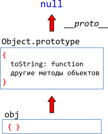

# Встроенные "классы" в JavaScript

В JavaScript есть встроенные объекты: `Date`, `Array`, `Object` и другие. Они используют прототипы и демонстрируют организацию "псевдоклассов" на JavaScript, которую мы вполне можем применить и для себя.

[cut]

## Откуда методы у {} ?

Начнём мы с того, что создадим пустой объект и выведем его.

```js
//+ run
var obj = { };
alert( obj ); // "[object Object]" ?
```

В объекте, очевидно, ничего нет... Но кто же тогда генерирует строковое представление для `alert(obj)`?

## Object.prototype

...Конечно же, это сделал метод `toString`, который находится во встроенном прототипе `Object.prototype`. Этот прототип ставится всем объектам `Object` при создании и содержит все встроенные методы и свойства для объектов.
 
В деталях, работает это так:
<ol>
<li>Запись `obj = {}` является краткой формой `obj = new Object`, где `Object` -- встроенная функция-конструктор для объектов.</li>
<li>При выполнении `new Object`, создаваемому объекту ставится `__proto__` по `prototype` конструктора, то есть в данном случае `Object.prototype`.</li>
<li>В дальнейшем при обращении к `obj.toString()` -- функция будет взята из `Object.prototype`.</li>
</ol>


Это можно легко проверить:

```js
//+ run
var obj = { };

// метод берётся из прототипа?
alert(obj.toString == Object.prototype.toString); // true, да

// проверим, правда ли что __proto__ это Object.prototype?
alert(obj.__proto__ == Object.prototype); // true
```

## Встроенные "классы" в JavaScript

Точно такой же подход используется в массивах `Array`, функциях `Function` и других объектах. Встроенные методы для них находятся в `Array.prototype`, `Function.prototype` и т.п.


Как видно из картинки, `Array.prototype` в свою очередь имеет прототипом `Object.prototype`, поэтому если метода нет у массива, то он ищется в объекте.

Например, при вызове `arr.hasOwnProperty(...)` для массива `arr` метод `hasOwnProperty` берётся из `Object.prototype`.

Получается иерархия наследования, которая всегда заканчивается на `Object.prototype`. Объект `Object.prototype` -- вершина иерархии, единственный, у которого `__proto__` равно `null`.

**Поэтому говорят, что "все объекты наследуют от `Object`", а если более точно, то от `Object.prototype`.**

**"Псевдоклассом" или, более коротко, "классом", называют функцию-конструктор вместе с её `prototype`.**

[smart header="Переопределение методов в наследниках"]
**При наследовании часть методов переопределяется, например, у массива `Array` есть свой `toString`, который находится в `Array.prototype.toString`:**

```js
//+ run
var arr = [1, 2, 3]
alert( arr ); // 1,2,3 <-- результат Array.prototype.toString
```

Для вывода объекта JavaScript ищет `toString` сначала в самом объекте `arr`, затем в `arr.__proto__`, который равен `Array.prototype`. 

Конечно, если бы его там не было -- поиск пошёл бы выше в `Array.prototype.__proto__`, который по стандарту (см. диаграмму выше) равен `Object.prototype`, и тогда использовался бы стандартный метод для объектов.
[/smart]

Ранее мы говорили о применении методов массивов к "псевдомассивам", например, можно использовать `[].join` для произвольных объектов, имеющих нумерованные свойства и `length`:

```js
//+ run
function showList() {
*!*
  alert( [].join.call(arguments, " - ") );
*/!*
}

showList("Вася", "Паша", "Маша"); // Вася - Паша - Маша
```

Так как метод `join` находится в `Array.prototype`, то можно вызвать его оттуда напрямую, вот так:

```js
//+ run
function showList() {
*!*
  alert( Array.prototype.join.call(arguments, " - ") );
*/!*
}

showList("Вася", "Паша", "Маша"); // Вася - Паша - Маша
```

Это лучше, потому что не создаётся лишний объект массива `[]`, хотя, с другой стороны -- так больше писать.


## Примитивы

**Примитивы не являются объектами, но методы берут из соответствующих прототипов: `Number.prototype`, `Boolean.prototype`, `String.prototype`.**

По стандарту, если обратиться к свойству примитива, то будет создан объект соответствующего типа, например `new String`, произведена операция со свойством или вызов метода по обычным правилам, с поиском в прототипе, а затем этот объект будет уничтожен. 

Именно так работает код ниже:

```js
//+ run
var user = "Вася"; // создали строку (примитив)

*!*
alert( user.toUpperCase() ); // ВАСЯ
// создан временный объект new String
// вызван метод 
// new String уничтожен, результат возвращён
*/!*
```

**Принципиальное отличие от объектов -- в примитив нельзя записать свойство.**

```js
//+ run
// а теперь попытаемся записать свойство в строку:
var user = "Вася";
user.age = 30;

*!*
alert(user.age); // undefined
*/!*
```

Свойство `age` было записано во временный объект, который был тут же уничтожен. 

[warn header="Конструкторы `String/Number/Boolean` -- только для внутреннего использования"]
Технически, можно создавать объекты для примитивов и вручную, например `new Number`. Но в ряде случаев получится откровенно бредовое поведение. Например:

```js
//+ run
alert(typeof 1); // "number"

alert(typeof new Number(1)); // "object" ?!?
```

Или, ещё страннее:

```js
//+ run
var zero = new Number(0);

if (zero) {  // объект - true, так что alert выполнится
  alert("число ноль -- true?!?");
}
```

Поэтому в явном виде `new String`, `new Number` и `new Boolean` никогда не вызываются.
[/warn]

[warn header="Значения `null` и `undefined` не имеют свойств"]
Значения `null` и `undefined` стоят особняком. Вышесказанное к ним не относится.

Для них нет соответствующих классов, в них нельзя записать свойство (будет ошибка), в общем, на конкурсе "самое примитивное значение" они точно разделили бы первое место.

[/warn]


## Изменение встроенных прототипов [#native-prototype-change]

**Встроенные прототипы можно изменять. В том числе -- добавлять свои методы.**

Мы можем написать метод для многократного повторения строки, и он тут же станет доступным для всех строк:

```js
//+ run
String.prototype.repeat = function(times) {
  return new Array(times+1).join(this);
};

alert( "ля".repeat(3) ) // ляляля
```

Аналогично мы могли бы создать метод `Object.prototype.each(func)`, который будет применять `func` к каждому свойству:

```js
//+ run
Object.prototype.each = function(f) {
  for (var prop in this) {
    var value = this[prop];
    f.call(value, prop, value); // вызовет f(prop, value), this=value
  }
}

// Попробуем! (внимание, пока что это работает неверно!) 
var obj = { name: 'Вася', age: 25 };

obj.each(function(prop, val) { 
  alert(prop); // name -> age -> (!) each
});
```

Обратите внимание -- пример выше работает неправильно. Он выводит лишнее свойство `each`, т.к. цикл `for..in` перебирает свойства в прототипе. Встроенные методы при этом пропускаются, а наш метод -- вылез.

В данном случае это легко поправить добавлением проверки `hasOwnProperty`:

```js
//+ run
Object.prototype.each = function(f) {

  for (var prop in this) {

*!*
    if (!this.hasOwnProperty(prop)) continue;
*/!*

    var value = this[prop];
    f.call(value, prop, value);

  }

};

// Теперь все будет в порядке
var obj = { name: 'Вася', age: 25 };

obj.each(function(prop, val) { 
  alert(prop); // name -> age
});
```

Здесь это сработало, теперь код работает верно. Но мы же не хотим добавлять  `hasOwnProperty` в цикл по любому объекту! Поэтому...


[warn header="Не добавляйте свойства в `Object.prototype`"]

Свойства, добавленные в `Object.prototype`, появятся во всех `for..in` циклах. Они в них будут лишними.

[/warn]


[smart header="Современный стандарт и `for..in`"]

Встроенные свойства и методы не перебираются в `for..in`, так как у них есть специальный внутренний флаг `[[Enumerable]]`, установленный в `false`.

Современные браузеры (включая IE с версии 9) позволяют устанавливать этот флаг для любых свойств, используя специальные вызовы, описанные в главе [](/descriptors-getters-setters). При таком добавлении предупреждение станет неактуальным, так как они тоже не будут видны в `for..in`.
[/smart]

**Многие объекты не участвуют в циклах `for..in`, например строки, функции... С ними уж точно нет такой проблемы, и в их прототипы, пожалуй, можно добавлять свои методы.**

Но здесь есть свои "за" и "против":

[compare]
+Методы в прототипе автоматически доступны везде, их вызов прост и красив.
-Новые свойства, добавленные в прототип из разных мест, могут конфликтовать между собой. Представьте, что вы подключили две библиотеки, которые добавили одно и то же свойство в прототип, но определили его по-разному. Конфликт неизбежен.
-Изменения встроенных прототипов влияют глобально, на все-все скрипты, делать их не очень хорошо с архитектурной точки зрения.
[/compare]

С другой стороны, есть одно исключение, когда изменения встроенных прототипов не только разрешены, но и приветствуются.

**Допустимо изменение прототипа встроенных объектов, которое добавляет поддержку метода из современных стандартов в те браузеры, где её пока нет.**

Например, добавим `Object.create(proto)` в старые браузеры:

```js
if (!Object.create) {

  Object.create = function(proto) {
    function F() {}
    F.prototype = proto;
    return new F;
  };

}
```

Именно так работает библиотека [es5-shim](https://github.com/kriskowal/es5-shim), которая предоставляет многие функции современного JavaScript для старых браузеров. Они добавляются во встроенные объекты и их прототипы.

## Итого

<ul>
<li>Методы встроенных объектов хранятся в их прототипах.</li>
<li>Встроенные прототипы можно расширить или поменять.</li>
<li>Добавление методов в `Object.prototype`, если оно не сопровождается `Object.defineProperty` с установкой `enumerable` (IE9+), "сломает" циклы `for..in`, поэтому стараются в этот прототип методы не добавлять. 

Другие прототипы изменять менее опасно, но все же не рекомендуется во избежание конфликтов.

Отдельно стоит изменение с целью добавления современных методов в старые браузеры, таких как <a href="https://developer.mozilla.org/en/JavaScript/Reference/Global_Objects/Object/create">Object.create</a>, <a href="https://developer.mozilla.org/en/JavaScript/Reference/Global_Objects/Object/keys">Object.keys</a>, <a href="https://developer.mozilla.org/en/JavaScript/Reference/Global_Objects/Function/bind">Function.prototype.bind</a> и т.п. Это допустимо и как раз делается [es5-shim](https://github.com/kriskowal/es5-shim).</li>
</ul>

