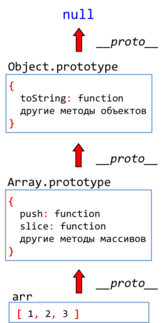
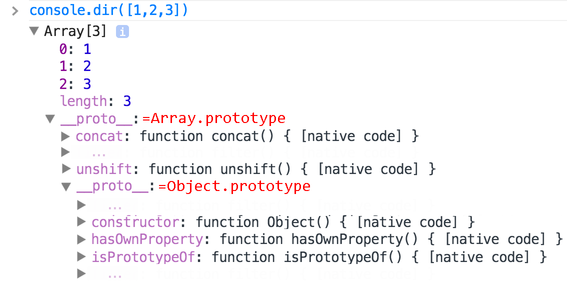
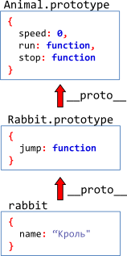

# Наследование классов в JavaScript

*Наследование* -- это когда мы на основе одного объекта создаём другой, который его расширяет: добавляет свои свойства, методы и так далее.

Наследование на уровне объектов в JavaScript, как мы видели, реализуется через ссылку `__proto__`.

Теперь поговорим о наследовании на уровне классов, то есть когда объекты, создаваемые, к примеру, через `new Admin`, должны иметь все методы, которые есть у объектов, создаваемых через `new User`, и ещё какие-то свои.
[cut]

## Наследование Array от Object

Примеры организации наследования мы встречаем среди встроенных типов JavaScript. Например, массивы, которые создаются при помощи `new Array` (или квадратных скобок `[...]`), используют методы из своего прототипа `Array.prototype`, а если их там нет -- то методы из родителя `Object.prototype`.

Как JavaScript это организует?

Очень просто: встроенный `Array.prototype` имеет ссылку `__proto__` на `Object.prototype`:



То есть, как и раньше, методы хранятся в прототипах, а для наследования прототипы организованы в `__proto__`-цепочку.

Самый наглядный способ это увидеть -- запустить в консоли команду `console.dir([1,2,3])`.

Вывод в Chrome будет примерно таким:



Здесь отчётливо видно, что сами данные и `length` находятся в массиве, дальше в `__proto__` идут методы для массивов `concat`, то есть `Array.prototype`, а далее -- `Object.prototype`.

[smart header="`console.dir` для доступа к свойствам"]
Обратите внимание, я использовал именно `console.dir`, а не `console.log`, поскольку `log` зачастую выводит объект в виде строки, без доступа к свойствам.
[/smart]

## Наследование в наших классах

Применим тот же подход для наших классах. Объявим класс `Rabbit`, который будет наследовать от `Animal`.

Вначале создадим два этих класса по отдельности, они пока что будут совершенно независимы.

`Animal`:

```js
function Animal(name) {
  this.name = name;
}

Animal.prototype.speed = 0;

Animal.prototype.run = function(speed) {
  this.speed += speed;
  alert(this.name + ' бежит, скорость ' + this.speed);
};

Animal.prototype.stop = function() {
  this.speed = 0;
  alert(this.name + ' стоит');
};
```

`Rabbit`:

```js
function Rabbit(name) {
  this.name = name;
}

Rabbit.prototype.jump = function() {
  this.speed++;
  alert(this.name + ' прыгает');
};

var rabbit = new Rabbit('Кроль');
```

Для того, чтобы наследование работало, объект `rabbit = new Rabbit` должен использовать свойства и методы из своего прототипа `Rabbit.prototype`, а если их там нет, то -- свойства и метода родителя, которые хранятся в `Animal.prototype`.

Если ещё короче -- порядок поиска свойств и методов должен быть таким: `rabbit -> Rabbit.prototype -> Animal.prototype`, по аналогии с тем, как это сделано для объектов и массивов. 

Для этого можно поставить ссылку `__proto__` явно: `Rabbit.prototype.__proto__ = Animal.prototype`. Но это не будет работать в IE10-. 

Поэтому лучше используем функцию `Object.create`, благо она либо встроена либо легко эмулируется во всех браузерах.

Класс `Animal` остаётся без изменений, а для `Rabbit` добавим установку `prototype`:

```js
function Rabbit(name) {
  this.name = name;
}

*!*
// задаём наследование
Rabbit.prototype = Object.create(Animal.prototype);
*/!*

// и добавим свой метод (или методы...)
Rabbit.prototype.jump = function() { ... };
```

Теперь выглядеть иерархия будет так:



Для наглядности -- вот итоговый код с двумя классами `Animal` и `Rabbit`:

```js
// 1. Конструктор Animal 
function Animal(name) {
  this.name = name;
}

// 1.1. Методы и свойства по умолчанию -- в прототип 
Animal.prototype.speed = 0;

Animal.prototype.stop = function() {
  this.speed = 0;
  alert(this.name + ' стоит');
}

Animal.prototype.run = function(speed) {
  this.speed += speed;
  alert(this.name + ' бежит, скорость ' + this.speed);
};


// 2. Конструктор Rabbit
function Rabbit(name) {
  this.name = name;
}

// 2.1. Наследование
Rabbit.prototype = Object.create(Animal.prototype);

// 2.2. Методы Rabbit
Rabbit.prototype.jump = function() {
  this.speed++;
  alert(this.name + ' прыгает, скорость ' + this.speed);
}
```

Как видно, наследование задаётся всего одной строчкой, поставленной в правильном месте.

Обратим внимание: `Rabbit.prototype = Object.create(proto)` присваивается сразу после объявления конструктора, иначе он перезатрёт уже записанные в прототип методы.

[warn header="Альтернативный вариант: `Rabbit.prototype = new Animal`"]

Можно унаследовать от `Animal` и по-другому:

```js
// вместо Rabbit.prototype = Object.create(Animal.prototype)
Rabbit.prototype = new Animal();
```

В этом случае мы получаем в прототипе не пустой объект с прототипом `Animal.prototype`, а полноценный `Animal`.

Можно даже сконфигурировать его:

```js
Rabbit.prototype = new Animal("Зверь номер два");
```

Теперь новые `Rabbit` будут создаваться на основе конкретного экземпляра `Animal`. Это интересная возможность, но  как правило мы не хотим создавать `Animal`, а хотим только унаследовать его методы!

Более того, на практике создание объекта, скажем, меню `new Menu`, может иметь побочные эффекты, показывать что-то посетителю, и так далее, и этого мы хотели бы избежать. Поэтому рекомендуется использовать вариант с `Object.create`.
[/warn]

## Вызов конструктора родителя

Посмотрим внимательно на конструкторы `Animal` и `Rabbit` из примеров выше:

```js
function Animal(name) {
  this.name = name;
}

function Rabbit(name) {
  this.name = name;
}
```

Как видно, объект `Rabbit` не добавляет никакой особенной логики при создании, которой не было в `Animal`.

Чтобы упростить поддержку кода, имеет смысл не дублировать код конструктора `Animal`, а напрямую вызвать его:

```js
function Rabbit(name) {
  Animal.apply(this, arguments);
}
```

Такой вызов запустит функцию `Animal` в контексте текущего объекта, со всеми аргументами, она выполнится и запишет в `this` всё, что нужно. 

Здесь можно было бы использовать и `Animal.call(this, name)`, но `apply` надёжнее, так как работает с любым количеством аргументов.

## Переопределение метода  

Итак, `Rabbit` наследует `Animal`. Теперь если какого-то метода нет в `Rabbit.prototype` -- он будет взят из `Animal.prototype`. 

В `Rabbit` может понадобиться задать какие-то методы, которые у родителя уже есть. Например, кролики бегают не так, как остальные животные, поэтому переопределим метод `run()`:

```js
Rabbit.prototype.run = function(speed) {
  this.speed++;
  this.jump();
};
```

Вызов `rabbit.run()` теперь будет брать `run` из своего прототипа:


[smart]
Кстати, можно назначить метод и на уровне конкретного объекта:

```js
rabbit.run = function() {
  alert('Особый метод подпрыгивания для этого кролика');
};
```

[/smart]

### Вызов метода родителя после переопределения

Более частая ситуация -- когда мы хотим не просто заменить метод на свой, а взять метод родителя и расширить его. Скажем, кролик бежит так же, как и другие звери, но время от времени подпрыгивает.

Для вызова метода родителя можно обратиться к нему напрямую, взяв из прототипа:

```js
//+ run
 
Rabbit.prototype.run = function() {
*!*
  Animal.prototype.run.apply(this, arguments); 
  this.jump();
*/!*
}
```

Обратите внимание на `apply` и явное указание контекста. Если вызвать просто `Animal.prototype.run()`, то в качестве `this` функция `run` получит `Animal.prototype`, а это неверно, нужен текущий объект.

## Итого

<ul>
<li>Для наследования нужно, чтобы "склад методов потомка" (`Child.prototype`) наследовал от "склада метода родителей" (`Parent.prototype`).

Это можно сделать при помощи `Object.create`:

Код:

```js
Rabbit.prototype = Object.create(Animal.prototype);
```

</li>
<li>Для того, чтобы наследник создавался так же, как и родитель, он вызывает конструктор родителя в своём контексте, используя `apply(this, arguments)`, вот так:

```js
function Rabbit(...) {
  Animal.apply(this, arguments);
}
```

</li>
<li>При переопределении метода родителя в потомке, к исходному методу можно обратиться, взяв его напрямую из прототипа:

```js
Rabbit.prototype.run = function() {
  var result = Animal.prototype.run.apply(this, ...);
  // result -- результат вызова метода родителя 
}
```

</li>
</ul>

Структура наследования полностью:

```js
//+ run
// --------- *!*Класс-Родитель*/!* ------------
// Конструктор родителя
function Animal(name) {
  this.name = name;
}

// Методы родителя 
Animal.prototype.run= function() {
  alert(this + " бежит!")
}

Animal.prototype.toString = function() {
  return this.name;
}

// --------- *!*Класс-потомок*/!* -----------
// Конструктор потомка
function Rabbit(name) {
  Animal.apply(this, arguments);
}

// *!*Унаследовать*/!*
*!*
Rabbit.prototype = Object.create(Animal.prototype);
*/!*

// Методы потомка
Rabbit.prototype.run = function() { 
  Animal.prototype.run.apply(this); // метод родителя вызвать
  alert(this + " подпрыгивает!");  
};

var rabbit = new Rabbit('Кроль');
rabbit.run();
```

<ul>
<li>Если метод или свойство начинается с `_`, то оно существует исключительно для внутренних нужд объекта, не нужно обращаться к нему из внешнего кода, но можно -- из методов объекта и наследников.</li>
<li>Остальные свойства и методы -- публичные.</li>
</ul>

