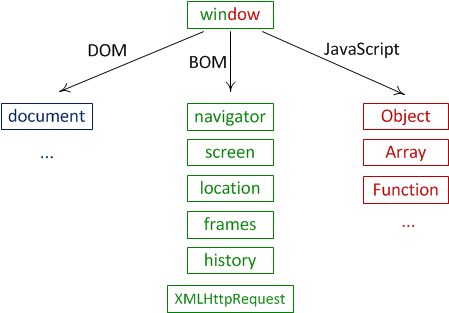

# Окружение: DOM, BOM и JS

Сам по себе язык JavaScript не предусматривает работы с браузером, он вообще не знает про HTML.

Но в браузере есть ряд специальных объектов, которые образуют Document Object Model (DOM) и дают доступ к документу, а также объекты Browser Object Model (BOM), которые позволяют использовать различные возможности браузера, такие как коммуникация с сервером, открытие новых окон и т.п.
[cut]

На рисунке ниже схематически отображена структура, которая получается если посмотреть на совокупность браузерных объектов с "высоты птичьего полёта".

Как видно из рисунка, на вершине стоит `window`, который играет роль *глобального объекта*, но вместе с этим даёт доступ к функционалу по управлению окном браузера, у него есть методы `window.focus()`, `window.open()` и другие.
Все остальные объекты делятся на 3 группы. 

## Объектная модель документа (DOM)

Глобальный объект `document` даёт возможность взаимодействовать с содержимым страницы.

Он и громадное количество его свойств, методов и связанных с ним интерфейсов описаны в [стандарте W3C DOM](http://www.w3.org/DOM/DOMTR).

По историческим причинам когда-то появилась первая версия стандарта DOM Level 1, затем придумали ещё свойства и методы, и появился DOM Level 2, на текущий момент поверх них добавили ещё DOM Level 3 и готовится DOM 4.

Современные браузеры также поддерживают некоторые возможности, которые не вошли в стандарты, но де-факто существуют давным-давно и отказываться от них никто не хочет. Их условно называют "DOM Level 0".

Также информацию по работе с элементами страницы можно найти в стандарте [HTML 5](http://www.w3.org/TR/html5/Overview.html).

## Объектная модель браузера (BOM)

BOM -- это объекты для работы с чем угодно, кроме документа.

Например:
<ul>
<li>Объект [navigator](https://developer.mozilla.org/en/DOM/window.navigator) содержит общую информацию о браузере и операционной системе. Особенно примечательны два свойства: `navigator.userAgent` -- содержит информацию о браузере и `navigator.platform` -- содержит информацию о платформе, позволяет различать Windows/Linux/Mac и т.п.</li>
<li>Объект [location](https://developer.mozilla.org/en-US/docs/Web/API/Window.location) содержит информацию о текущем URL страницы и позволяет перенаправить посетителя на новый URL.</li>
<li>Функции `alert/confirm/prompt` -- тоже входят в BOM.
</li>
</ul>

Большинство возможностей BOM стандартизированы в [HTML 5](http://www.w3.org/TR/html5/Overview.html), но браузеры любят изобрести что-нибудь своё, особенное.

## Объекты и функции JavaScript

JavaScript -- объекты и методы языка JavaScript, который даёт возможность управлять всем этим. Именно их описывает стандарт EcmaScript.

Далее в этом курсе мы будем, преимущественно, изучать DOM, поскольку именно документ занимает центральную роль в организации интерфейса, и работа с ним -- сложнее всего.