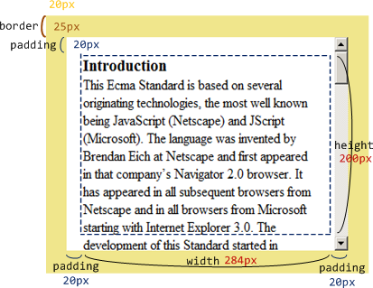
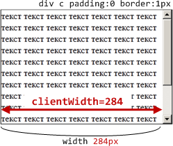
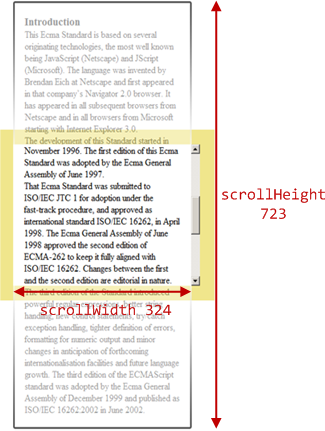
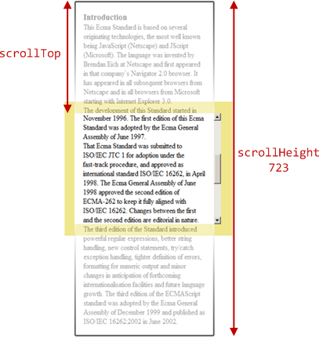
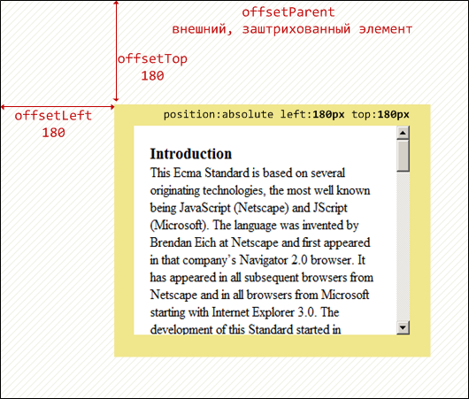

# Размеры и прокрутка элементов 

Для того, чтобы показывать элементы правильно, подгонять на нужные места страницы, управлять ими при помощи мыши, необходимо во-первых, знать CSS-позиционирование, а во-вторых -- уметь работать с "геометрией элементов" из JavaScript.

В этой главе мы поговорим о размерах элементов DOM, способах их вычисления и *метриках* -- различных свойствах, которые содержат эту информацию.
[cut]
## Образец документа

Мы будем использовать для примера блок, у которого есть рамка (border), поля (padding), отступы (margin) и прокрутка:

```html
<div id="example">
  ...Текст...
</div>
<style>
##example {
  width: 300px;
  height: 200px;

  border: 25px solid #F0E68C; /* рамка 25px */

  padding: 20px;              /* поля 20px */
  margin: 20px;               /* отступы 20px */

  overflow: auto;             /* прокрутка */
}
</style>
```

Результат выглядит так:



Вы можете открыть документ [edit src="metric"]по этой ссылке[/edit].
## Получение width/height из CSS

Какой способ первый приходит на ум, когда есть задача определить `width/height`?

Если вы внимательно читали до этого момента, то уж точно знаете, что CSS-высоту и ширину `width/height` можно установить с помощью `elem.style` и извлечь, используя `getComputedStyle()/currentStyle`, которые в подробностях  обсуждаются в главе [](/styles-and-classes).

Решение может быть таким:

```js
//+ run
var elem = document.body;

var style = window.getComputedStyle ? getComputedStyle(elem, "") : elem.currentStyle;
alert(style.width); // вывести CSS-ширину body
```

Всегда ли такой подход сработает? Увы, нет!

<ol>
<li>Во-первых, CSS-свойства `width/height` зависят от другого свойства -- `box-sizing`, которое определяет, что такое, собственно, эти ширина и высота. По умолчанию они относятся к размеру внутренней части элемента, которая лежит внутри `padding`, а если нужно узнать полную высоту/ширину?</li>
<li>В IE8- могут быть нестыковки с единицами измерения -- как мы помним, `currentStyle` не пересчитывает размеры в пиксели.</li>
<li>И, наконец, самое главное, свойства `width/height` могут быть равны `auto`!

Например, для инлайн-элемента:

```html
<!--+ run -->
<span id="elem">Привет!</span>

<script>
  alert( getComputedStyle(elem, "").width );  // auto
</script>
```

Конечно, с точки зрения CSS размер `auto`  -- совершенно нормально, но нам-то в JavaScript нужен конкретный размер в пикселях, который мы сможем использовать для вычислений.
</li>
</ol>


## Полоса прокрутки

Полоса прокрутки -- причина многих проблем и недопониманий. Как говорится, "дьявол кроется в деталях". Недопустимо, чтобы наш код работал на элементах без прокрутки и начинал "глючить" с ней. Поэтому мы с самого начала будем её учитывать.

**При наличии вертикальной полосы прокрутки -- она забирает себе часть ширины элемента.**

Ширина полосы прокрутки обычно составляет около `14-18px`, в зависимости от браузера и операционной системы. Бывает и `0` для полупрозрачной прокрутки, не отъедающей место. В примере подразумевается, что прокрутка место ест, поэтому внутренняя область будет уже не `300px`, а около `284px`.

**Несмотря на то, что на рисунке полоса прокрутки находится визуально в правом поле -- отнимает место она не у `padding`, а у внутренней области элемента.**

...Но при этом некоторые браузеры отражают это уменьшение ширины в результате `getComputedStyle(...).width`, а некоторые -- нет. 

В примере ниже в стилях указано `width:300px`. А вот `getComputedStyle` возвращает `300px/284px`, в зависимости от браузера.

Если ваш браузер в принципе показывает полосу прокрутки (например, под Windows почти все браузеры так делают), то вы можете протестировать это сами, нажав на кнопку в ифрейме ниже:

[iframe src="cssWidthScroll" link border=1]

Описанные разночтения касаются только чтения свойства `getComputedStyle(...).width` из JavaScript, визуальное отображение корректно в обоих случаях -- ширина текста при наличии прокрутки в обоих случаях уменьшается.

**Здесь и далее, мы будем понимать под `width` именно реальную ширину внутренней области (около `284px`), а не результат чтения CSS-свойства `width`, который может быть разным в зависимости от браузера/OS.**

## JavaScript-метрики

В JavaScript существует ряд дополнительных свойств, содержащих размеры элементов. Мы будем называть их "метриками".

**Метрики JavaScript, в отличие от свойств CSS, содержат числа, всегда в пикселях и без единиц измерения на конце.**

### clientWidth/Height
**Размер *клиентской зоны*, а именно: внутренняя область плюс `padding`.**


Общая ширина внутри рамки -- это `284 (width) + 20(padding left) + 20 (padding right) = 324`.

Получаем:

```js
clientWidth = 284(width) + 2*20(padding) = 324
clientHeight = 200(height) + 2*20(padding) = 240
```

Обратите внимание, в `clientHeight` входят и верхнее и нижнее поля, несмотря на то, что нижнее поле заполнено текстом.

**Если `padding` нет, то `clientWidth/Height` покажет реальный размер области данных, внутри рамок и полосы прокрутки.**



### scrollWidth/Height

**Ширина и высота контента *с учетом прокручиваемой области*.**

<ul>
<li>`scrollHeight = 723` -- полная высота, включая прокрученную область</li>
<li>`scrollWidth = 324` -- полная ширина, включая прокрученную область</li>
</ul>

**`scrollWidth/Height` то же самое, что и `clientWidth/Height`, но включает в себя прокручиваемую область.**



Эти свойства можно использовать, чтобы "распахнуть" элемент на всю ширину/высоту:

```js
element.style.height = element.scrollHeight + 'px';
```

Нажмите на кнопку, чтобы распахнуть элемент:

<div id="scrollOpen" style="width:300px;height:200px; padding: 0;overflow: auto; border:1px solid black;">текст текст текст текст текст текст текст текст текст текст текст текст текст текст текст текст текст текст текст текст текст текст текст текст текст текст текст текст текст текст текст текст текст текст текст текст текст текст текст текст текст текст текст текст текст текст текст текст текст текст текст текст текст текст текст текст текст текст текст текст текст текст текст текст текст текст текст текст текст текст текст текст текст текст текст текст текст текст текст текст текст текст текст текст текст текст текст текст текст текст текст текст текст текст текст текст текст текст текст текст текст текст текст текст текст</div>

    <button style="padding:0" onclick="document.getElementById('scrollOpen').style.height = document.getElementById('scrollOpen').scrollHeight + 'px'">element.style.height = element.scrollHeight + 'px'</button>

### scrollTop/scrollLeft

**Размеры текущей прокрученной части элемента -- вертикальной и горизонтальной.** 

Следующее изображение иллюстрирует `scrollHeight` и `scrollTop` для блока с вертикальной прокруткой.



[smart header="`scrollLeft/scrollTop` можно изменять"]
**В отличие от большинства свойств, которые доступны только для чтения, значения `scrollLeft/scrollTop` можно изменить, и браузер выполнит прокрутку элемента**.

При клике на следующий элемент будет выполняться код `elem.scrollTop += 10`. Поэтому он будет прокручиваться на `10px` вниз:

<div onclick="this.scrollTop+=10" style="cursor:pointer;border:1px solid black;width:100px;height:80px;overflow:auto">Кликни<br>Меня<br>1<br>2<br>3<br>4<br>5<br>6<br>7<br>8<br>9</div>
[/smart]


### offsetWidth/Height

**Внешняя ширина/высота блока, полный размер, включая рамки, исключая внешние отступы `margin`.**

<ul>
<li>`offsetWidth = 390` -- внешняя ширина блока</li>
<li>`offsetHeight = 290` -- внешняя высота блока</li>
</ul>


Эти свойства показывают *внешние* ширину и высоту блока, то как блок выглядит снаружи.

### clientTop/Left
**Отступ *клиентской области* от внешнего угла блока.**

Другими словами, это ширина верхней/левой рамки(border) в пикселях.

<ul>
<li>`clientLeft = 25` -- ширина левой рамки</li>
<li>`clientTop = 25` -- ширина верхней рамки</li>
</ul>


Казалось бы, зачем еще какие-то свойства, если ширину рамки можно получить напрямую из CSS? Обычно они действительно не нужны.

Но есть две ситуации, когда эти свойства бывают полезны:

<ol>
<li>В случае, когда документ располагается *справа налево* (арабский язык, иврит), свойство `clientLeft` включает в себя еще и ширину *правой* полосы прокрутки.</li>
<li>В IE&lt;8 документ, а точнее -- элемент `document.documentElement` немного смещен относительно верхнего левого угла документа. Несмотря на то, что рамки там нет, сдвиг существует и хранится в `document.body.clientLeft/clientTop` (обычно это 2 пикселя).</li>
</ol>

### offsetParent, offsetLeft/Top

[warn header="Используются редко..."]
Ситуации, когда эти свойства нужны, можно перечислить по пальцам. Они возникают действительно редко. Как правило, эти свойства используют по ошибке, потому что не знают средств правильной работы с координатами, о которых мы поговорим позже. 
[/warn]

**`offsetParent` -- это родительский элемент в смысле отображения на странице.**

Когда браузер рисует страницу, то он высчитывает дерево расположения элементов, иначе говоря "дерево геометрии" или "дерево рендеринга".

Обычно элементы вложены друг в друга и структура дерева рендеринга повторяет DOM.

Но, к примеру, если у элемента стоит `position: absolute`, то его расположение вычисляется уже не относительно непосредственного родителя `parentNode`, а относительно ближайшего <a href="http://www.w3.org/TR/CSS21/visuren.html#position-props">позиционированного элемента</a> (т.е. свойство `position` которого не равно `static`), или `BODY`, если таковой отсутствует. 

Получается, что элемент имеет одного родителя в DOM и другого -- в плане позиционирования, относительно которого он рисуется. Этот элемент и будет в свойстве `offsetParent`.

**Свойства `offsetLeft/Top` задают смещение относительно `offsetParent`.**

```html
<div style="position: relative">
  <div style="position: absolute; left: 180px; top: 180px">...</div>
</div>
```


</dd>
</dl>


[smart header="Метрики для невидимых элементов равны нулю."]

Координаты и размеры в JavaScript устанавливаются только для *видимых* элементов.

Для элементов с `display:none` или находящихся вне документа дерево рендеринга не строится. Для них метрики равны нулю. Кстати, и `offsetParent` для таких элементов тоже `null`.

Это дает нам **замечательный способ для проверки, виден ли элемент**:

```js
function isHidden(elem)
  return !elem.offsetWidth && !elem.offsetHeight;
}
```

<ul>
<li>Работает, даже если родителю элемента установлено свойство `display:none`.</li>
<li>Работает для всех элементов, кроме `TR`, с которым возникают некоторые проблемы в разных браузерах. Обычно, проверяются не `TR`, поэтому всё ок :).</li>
<li>Считает элемент видимым, даже если позиционирован за пределами экрана или  имеет свойство `visibility:hidden`.</li>
<li>"Схлопнутый" элемент, например пустой `div` без высоты и ширины, будет считаться невидимым.</li>
</ul>
[/smart]


## Итого

У элементов есть следующие метрики:
<ul>
<li>`clientWidth/clientHeight` -- ширина/высота видимой области, включая поля, но не полосы прокрутки.</li>
<li>`clientLeft/clientTop` -- ширина левой/верхней рамки или, точнее, сдвиг клиентской области, относительно верхнего левого угла блока.
Используется, преимущественно, в IE<8 для вычисления сдвига `document.body`.
</li>
<li>`scrollWidth/scrollHeight` -- ширина/высота прокручиваемой области. Включает в себя `padding` и не включает полосы прокрутки.</li>
<li>`scrollLeft/scrollTop` -- ширина/высота прокрученной части документа, считается от верхнего левого угла.</li>
<li>`offsetWidth/offsetHeight` -- "внешняя" ширина/высота блока, не считая отступов.</li>
<li>`offsetParent` -- "родитель по дереву рендеринга" -- ближайшая ячейка таблицы, body для статического позиционирования или ближайший позиционированный элемент для других типов позиционирования.</li>
<li>`offsetLeft/offsetTop` -- позиция в пикселях левого верхнего угла блока, относительно его `offsetParent`.</li>
</ul>

Все свойства, кроме `scrollLeft/scrollTop` доступны только для чтения. Изменение этих свойств заставляет браузер прокручивать элемент.

Краткая схема:


**Прокрутку *элемента* можно прочитать или изменить через свойства `scrollLeft/Top`.**

В этой главе мы считали, что страница находится в режиме соответствия стандартам. В режиме совместимости -- всё так же, но некоторые старые браузеры требуют `document.body` вместо `documentElement`.

