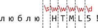

# Символьные классы

Рассмотрим задачу -- есть телефонный номер `"+7(903)-123-45-67"`, и нам нужно найти в этой строке цифры, а остальные символы нас не интересуют.

**Для поиска символов определённого вида, в регулярных выражениях предусмотрены "классы символов".**
[cut]
Класс символов -- это, в первую очередь, специальное обозначение.

Например, в данном случае нам нужен класс "произвольная цифра", он обозначается `\d`. 

Это обозначение вставляется в паттерн наравне с остальными символами. При поиске под него подходит любая цифра.

Пример ниже ищет все цифры в строке:

```js
//+ run
var str = "+7(903)-123-45-67";

var reg = /\d/g

alert( str.match(reg) ); // 7,9,0,3,1,2,3,4,5,6,7
```

Есть и другие классы. Самые полезные:
<dl>
<dt>`\d` (от английского "digit" - "цифра")</dt>
<dd>Цифра, символ от `0` до `9`.</dd>
<dt>`\s` (от английского "space" - "пробел")</dt>
<dd>Пробельный символ, включая табы, переводы строки и т.п.</dd>
<dt>`\w` (от английского "word" -- "слово") </dt>
<dd>Символ латинского алфавита или цифра или подчёркивание `'_'`</dd>
</dl>

**Регулярное выражение обычно содержит одновременно и обычные символы и классы**:

Например, найдём строку `CSS` с любой цифровой версией:

```js
//+ run
var str = "Стандарт CSS4 - наше будущее";
var reg = /CSS\d/

alert( str.match(reg) );
```

Несколько классов в одном регэкспе:

```js
//+ run
showMatch( "Я люблю HTML5!", /\s\w\w\w\w\d/ ); // 'HTML5'
```

Совпадение (каждому классу в регэкспе соответствует один символ результата):



**Также существуют обратные символьные классы:**

<dl>
<dt>`\D`</dt>
<dd>Не-цифра, любой символ кроме `\d`</dd>
<dt>`\S`</dt>
<dd>Не-пробел, любой символ кроме `\s`.</dd>
<dt>`\W`</dt>
<dd>Символ, не принадлежащий латиннице, а также не буква и не подчёркивание, алфавиту, т.е. любой кроме `\w`</dd>
</dl>

Например, мы хотим получить из телефона <code class="subject">+7(903)-123-45-67</code> только цифры.

Есть два способа сделать это. 

<ol>
<li>Первый -- найти все цифры и объединить их:
Например:

```js
//+ run
var str = "+7(903)-123-45-67";

var digits = str.match( /\d/g ).join("");
alert(digits); // 79031234567
```

</li>
<li>Второй -- найти все НЕцифры и удалить их из строки:

```js
//+ run
var str = "+7(903)-123-45-67";

alert( str.replace(/\D/g, "") ); // 79031234567
```

Второй способ короче, не правда ли?
</li>
</ol>

**Регулярное выражение может также содержать стандартные спецсимволы строк, такие как `\n, \t` и другие.** 

Они являются обычными символами. Отличить их от классов очень просто -- для классов зарезервированы другие буквы.

[warn header="Пробелы важны!"]
Обычно мы не обращаем внимание на пробелы. Для нашего взгляда строки <code class="subject">1-5</code> и <code class="subject">1 - 5</code> почти идентичны.

Но в регулярных выражениях **пробел - такой же символ, как и другие**.

Поиск ниже не сработает, т.к. не учитывает пробелы вокруг дефиса:

```js
//+ run
alert(  "1 - 5".match (/\d-\d/) );  // null, нет совпадений!
```

Поправим это, добавив в паттерн пробелы:

```js
//+ run
alert(  "1 - 5".match (/\d - \d/) );  // работает, пробелы вокруг дефиса
```

В регулярные выражения также не надо вставлять лишние пробелы. Все они имеют значение:

```js
//+ run
alert( "1-5".match( /\d - \d/ ) ); // null, так как в строке 1-5 нет пробелов
```

[/warn]
 
Особым классом символов является точка `"."`.

**В регулярном выражении, точка <code class="pattern">"."</code> обозначает *любой символ*, кроме перевода строки**:

```js
//+ run
var re = /CS.4/;

alert( "Стандарт CSS4".match(re) ); // найдено "CSS4"
alert( "Сталь CS-4".match(re) ); // найдено "CS-4" 
alert( "CS 4".match(re) ); // найдено "CS 4", пробел тоже символ
```

Обратим внимание -- точка означает именно "произвольный символ". 

То есть какой-то символ на этом месте в строке должен быть:

```js
//+ run
 
alert( "CS4".match (/CS.4/) ); // нет совпадений, так как для точки нет символа
```

