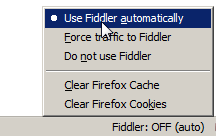
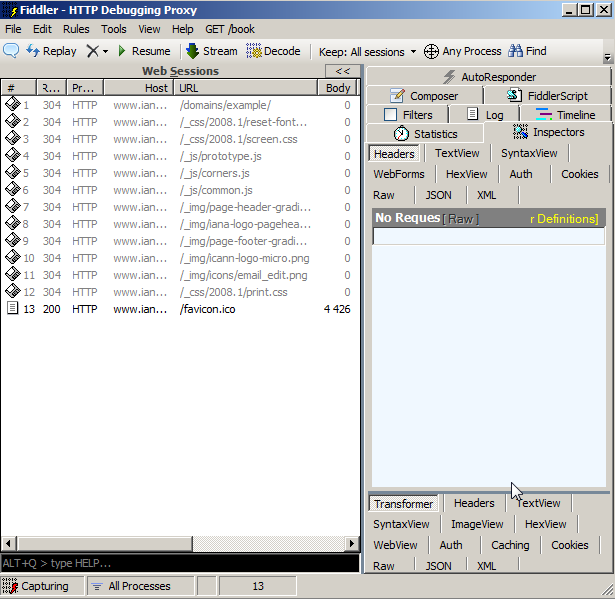

# Скриптуемый отладочный прокси Fiddler

Fiddler -- прокси, который работает с трафиком между Вашим компьютером и удаленным сервером, и позволяет инспектировать и менять его.

Fiddler можно расширять с помощью скриптов на языке JScript.NET (писать их очень просто), менять меню программы, и вообще -- замечательный инструмент.

Использовать его можно с любым браузером.

Эта статья описывает Fiddler 2.4. В вашей версии Fiddler какие-то возможности могут измениться, какие-то образоваться.
[cut]

## Режимы подключения

У Fiddler есть 2 способа подключения. 

<ol>
<li>Первый -- это просто запустить его. При этом он автоматически будет работать для программ, использующих WinINET.

Это, например, Internet Explorer, Chrome, приложения MS Office.

Firefox тоже автоматически подхватит Fiddler, за счёт того что при установке Fiddler в него ставится соответствующее расширение:

</li>
<li>Второй -- это явно поставить Fiddler как прокси для браузера, по адресу `127.0.0.1:8888`. Например, так можно сделать для Opera, если уж не хочется перезапускать.</li>
</ol>

## Fiddler не под Windows

**Если вы работаете не под Windows, то Fiddler можно поставить в виртуальную машину.**

Чтобы сделать возможной подключение внешних браузеров, нужно включить настройках Fiddler: Tools -> Fiddler Options -> Connections(вкладка) галочку "Allow remote clients to connect".  После этого Fiddler станет доступен как прокси на интерфейсе `0.0.0.0`, так что можно будет браузеру из внешней ОС указать в качестве прокси виртуальную машину. И пользоваться Fiddler.

Если вы так захотите поступить, то вдобавок возьмите удобный переключатель прокси, например Elite Proxy Switcher под Firefox или [Proxy Pick](http://www.bayden.com/ietoys/) для IE, чтобы переключение на прокси осуществлялось в один клик.

## Операции над запросами

При заходе в Fiddler, открывается окно запросов слева и рабочие вкладки справа.

Как видно, опций много, и на изображении они еле-еле помещаются. И, поверьте, возможностей -- ещё больше.

## Возможности

<ul>
<li>**В окне запросов** слева можно просматривать и выбирать запросы, смотреть их заголовки, сохранять их на диск все вместе или по отдельности.</li>
<li>**AutoResponder** -- позволяет подставить свой файл вместо сервера.

Например, приятель попросил поправить скрипт `vasya.js` на сайте, но доступа к серверу не дал. 

С Fiddler задача решается просто -- сохраняете скрипт на диске, в AutoResponder указываете, что `vasya.js` нужно брать с диска, а не с сайта -- и исправляете, что нужно, перезагружаете страницу, проверяете -- всё с комфортом.</li>
<li>**Composer** -- позволяет составить запрос на сервер вручную.

Например, вы хотите сделать такой же AJAX-запрос, как только что делали. Для этого можно просто выбрать его слева и нажать кнопку Replay (слева-сверху).

А если хочется поменять? Нет ничего проще -- выбираем справа Composer и перетаскиваем запрос слева в него. После этого исправляем, что хотим и Execute.</li>
<li>**Filters** -- позволяет назначить действия в зависимости от вида запроса. Опции станут понятны после перехода на вкладку.</li>
<li>**FiddlerScript** -- основа мощи Fiddler: скрипт, задающий функционал. Его редактированием можно добавить или удалить пункты меню, колонки в списке запросов, и, вообще, поменять почти всё. 

Язык программирования JScript.NET, который здесь используется, может взаимодействовать с Windows в полном объеме, включая коммуникацию с базой данных, Word, Excel.</li>
</ol>

## Правила

Слева-сверху в меню находится пункт Rules (правила). В нём изначально находятся некоторые возможности FiddlerScript, которые поставляются "из коробки".

Хотите посмотреть, как ваш сайт будет грузиться "на GPRS"? Выбирайте Rules -> Performance -> Simulate Modem speeds.

Для добавления новых правил можно их задать через пункт "Customize Rules" (на JScript.NET, разумеется). В открывающемся скрипте есть пункты меню и их реализация.

При наступлении любого события из обширного списка, Fiddler вызывает соответствующий обработчик из правил. Например, onBeforeRequest, onShutdown. Стандартные правила отлично прокомментированы, и писать новые весьма просто.

FiddlerScript позволяет манипулировать заголовками, запросом, менять ширину канала, управлять выводом запроса в Fiddler и так далее и т.п.

## Брейкпойнт на запросе
В меню Rules -&gt; Automatic Breakpoints можно включить автоматическое прерывание Fiddler при обработке запроса.

После этого, если сделать запрос в браузере, подключенном к Fiddler, то  его выполнение зависнет, а в левом окошке Fiddler этот запрос будет отмечен специальным значком.

Если выбрать такой подвисший запрос мышкой, то во вкладке SessionInspector им можно управлять: менять сам запрос и ответ сервера (после Break on Response, когда сервер уже ответил).

Задавать прерывание на запросах определенного вида также можно через Filters.

## Отладка HTTPS

Fiddler является прокси, а HTTPS шифруется от браузера до сервера-получателя, поэтому по умолчанию Fiddler не имеет доступа к содержимому HTTPS-запросов.

Чтобы его получить, Fiddler должен сыграть роль хакера-перехватчика: расшифровывать запросы, и потом отправлять дальше. Это возможно, если инсталлировать специальный сертификат: Tools -> Fiddler Options -> HTTPS(вкладка) -> выбрать все галочки.

После окончания отладки этот сертификат можно убрать.

## Скачать

Fiddler можно бесплатно скачать с <a href="http://www.fiddler2.com/fiddler2/">сайта разработчика</a>. Там же доступна <a href="http://www.fiddler2.com/Fiddler/help/">документация и видео</a>.

К фиддлеру прилагается галерея расширений <a href="http://www.fiddlertool.com/fiddler2/extensions.asp">http://www.fiddlertool.com/fiddler2/extensions.asp</a>. 

Примеры скриптов для Fiddler, которые дают общее представление о том, на что он может быть способен: <a href="http://www.fiddlertool.com/fiddler/dev/scriptsamples.asp">http://www.fiddlertool.com/fiddler/dev/scriptsamples.asp</a>.