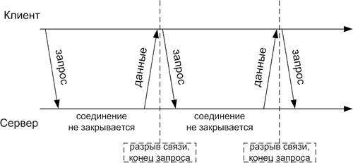

# XMLHttpRequest: длинные опросы

Способ организации COMET, который мы рассмотрим в этой главе, прост и подходит в 90% реальных случаев.

[cut]

## Частые опросы

Первое решение, которое приходит в голову для получения событий с сервера -- это "частые опросы" (polling), т.е периодические запросы на сервер: "эй, я тут, изменилось ли что-нибудь?". Например, раз в 10 секунд.

В ответ сервер во-первых помечает у себя, что клиент онлайн, а во-вторых посылает сообщение, в котором в специальном формате содержится весь пакет событий, накопившихся к данному моменту.

**У частых опросов есть одна большая проблема, а именно -- большие задержки между созданием и получением данных.**

Сервер отсылает их не тогда, когда они появились, а когда настанет время очередного запроса.

[summary]
Задержка = время между опросами + установление соединения + передача данных.
[/summary]

Другой минус -- лишний входящий трафик на сервер. При каждом запросе браузер передает множество заголовков и в ответ получает, кроме данных, также заголовки. Для некоторых приложений трафик заголовков может в 10 и более раз превосходить трафик реальных данных.

[compare]
-Задержки между событием и уведомлением.
-Лишний трафик и запросы на сервер.
+Простота реализации.
[/compare]

Причём, простота реализации тут достаточно условная. Клиентская часть -- довольно проста, а вот сервер получает сразу большой поток запросов. 

Даже если клиент ушёл пить чай -- его браузер каждые 10 секунд будет "долбить" сервер запросами. Готов ли сервер к такому? 

## Длинные опросы

Длинные опросы -- отличная альтернатива частым опросам. Они также удобны в реализации, и при этом сообщения доставляются без задержек.

Схема:
<ol>
<li>Отправляется запрос на сервер.</li>
<li>Соединение не закрывается сервером, пока не появится сообщение.</li>
<li>Когда сообщение появилось -- сервер отвечает на запрос, пересылая данные.</li>
<li>Браузер тут же делает новый запрос.</li>
</ol>

Ситуация, когда браузер отправил запрос и держит соединение с сервером, ожидая ответа, является стандартной и прерывается только доставкой сообщений.

Схема коммуникации:



При этом если соединение рвётся само, например, закрыто прокси-сервером, то браузер тут же отсылает новый запрос.

Примерный код клиентской части:

```js
function subscribe(url) {
  var xhr = new XMLHttpRequest();
  xhr.onreadystatechange = function() {
    if (this.readyState != 4) return;

    if (this.status == 200) {
      onMessage(this.responseText);
    } else {
      onError(this);
    }

    subscribe(url);
  }
  xhr.open("GET", url, true);
  xhr.send('');
}
```

Функция `subscribe` делает запрос, при ответе обрабатывает результат, и тут же запускает процесс по новой.

[compare]
-Сообщение отправляются клиенту тут же.
-Сервер должен уметь держать большое количество ожидающих соединений.
-Простота реализации.
[/compare]

## Демо: чат

Для примера вы можете скачать простейший чат, где в качестве сервера -- Node.JS: [longpoll.zip](/zip/tutorial/ajax/xhr/longpoll.zip).

Демо:

[iframe src="longpoll" border="1" height="200px" link zip]

## Область применения

Длинные опросы отлично работают в тех случаях, когда сообщения приходят редко. 

При большом количестве частых сообщений график приёма-отправки, приведённый выше, превращается в "пилу". Каждое сообщение -- это новый запрос, дополнительный трафик.

В этих случаях используются другие способы получения данных, подразумевающие непрерывное соединение с сервером. Мы рассмотрим их в следующих главах.


