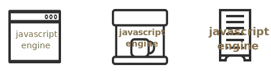

# Hello, JavaScript!

JavaScript has a rich history. 

It was created in 1995 as a simple language exclusively for web browsers, to “make web pages alive”. Since then it has greatly evolved. 

Today we can use JavaScript on many platforms:

- In a web-browser, by embedding it into a web page.
- On a general purpose computer or a server, using [Node.js](https://nodejs.org) and other means.
- ...Or actually on any device that has a special piece of software, called "JavaScript engine". 

Technically, even a coffee machine can include its own JavaScript engine to allow programming of coffee recipes.



There's a formal language description called [ECMAScript Language Specification](https://tc39.es/ecma262/), it describes how a JavaScript engine works. Sometimes we'll give references to it, but, though technically strict, it's hard to read for humans. At least at first.

Programs in JavaScript are called *scripts*. 

Browsers have built-in JavaScript engines, so they can run scripts. They can be embedded right into HTML using the `<script>` tag and run automatically as the page loads.

For example, this HTML-page shows the "Hello, world!" message:

```html run height=0
<!doctype html>
<script>
  alert("Hello, world!");
</script>
```

To see it in action, you can click the "run" button in the upper-right corner. Also you can create a new file, e.g. `my.html` with this text and open it locally in a browser. 

Depending on the environment, JavaScript may provide platform-specific functionality.

- In a browser, JavaScript can manipulate the web-page, send network requests, show messages and so on.  
- In node.js we can use JavaScript to run a web-server, read and write arbitrary files.
- ...And so on. 

**In this course we concentrate on the core JavaScript, that's the same everywhere.**

We'll try to keep browser-specific notes at minimum. After you learn the core, you can go in any direction: browsers, frameworks, servers and so on.

Turn the page to start learning JavaScript!
