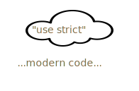

# Code structure

## Statements

Just like a human speech consists of sentences, JavaScript code consists of *statements*.

Statements are commands and syntax constructs that perform actions, "do" something.

Here's an example of a statement:

```js run
alert("Hello, world!");
```

Click the "run" icon ▷ in the right-upper corner to see how it works.

We can have as many statements in our code as we want. 

Statements can be separated with a semicolon.

For example, we can split "Hello World" into two messages, one after the other:

```js run no-beautify
alert("Hello"); alert("World");
```

Usually, statements are written on separate lines to make the code more readable:

```js run no-beautify
alert("Hello");
alert("World");
```

### Semicolons..or not?

A semicolon may be omitted in most cases when a line break exists beween statements.

This code is the same as above, just without semicolons:

```js run no-beautify
alert("Hello")
alert("World")
```

It also works, because usually JavaScript interprets a line break as an "implicit" semicolon. This is called an "automatic semicolon insertion".

There are exceptions for that rule, for example:

```js run no-beautify
alert(1 +
2);
```

This code outputs `3`, same as a single-line `alert(1 + 2)`. Here JavaScript does not treat the line-break after `+` as the end of the statement. 

Why so? It's intuitively obvious that if the line ends with a plus `+`, then the expression is incomplete and will be continued on the next line. JavaScript "understands" that too. And in this case that works as intended.

**But there are situations where our intuition differs from JavaScript auto-insertion rules.**

That may lead to subtle errors.

````spoiler header="See an example of such error"

If you're curious to see a concrete example of such an error, check this code out:

```js run
[1, 2].forEach(alert)
```

The code may be too advanced to understand right now, but that's all right.

All you need to do is to run the code and remember the result: it shows `1` then `2`.

Let's add an `alert` before the code and *not* finish it with a semicolon:

```js run no-beautify
alert("Without a semicolon after the alert - error")

[1, 2].forEach(alert)
```

Now if you run the code, only the first `alert` is shown and then there's an error!

...But everything becomes fine again we add a semicolon after the `alert`:
```js run
alert("With a semicolon after me - all ok");

[1, 2].forEach(alert)  
```

The error in the no-semicolon variant occurs because JavaScript doesn't "auto-insert" a semicolon if a newline is followed by squares brackets `[...]`.

So, because the semicolon is not auto-inserted, the code in the first example is treated as a single statement. Here's how the engine sees it:

```js run no-beautify
alert("There will be an error")[1, 2].forEach(alert)
```

But such a merge in this case is just wrong, hence the error. This can happen in other situations as well.
````

To prevent such errors, we recommend putting semicolons between statements, even if they are separated by newlines.

Let's note once again -- *it is possible* to leave out semicolons most of the time. But it's safer, especially for a beginner, to use them.

## Comments

As time goes on, programs become more and more complex. It becomes necessary to add *comments* which describe what the code does and why.

Comments can be put into any place of a script. They don't affect its execution because the engine simply ignores them.

**One-line comments start with two forward slash characters `//`. The rest of the line is a comment.**

Such comment may occupy a full line of its own or follow a statement.

Like here:
```js run
// This comment occupies a line of its own
alert("Hello");

alert("World"); // This comment follows the statement
```

For longer, descriptive comments that span multiple lines, we can use the `/* ... */` syntax.

**Multiline comments start with a forward slash and an asterisk <code>/&#42;</code> and end with an asterisk and a forward slash <code>&#42;/</code>.**

Like this:

```js run
/* An example with two messages.
This is a multiline comment.
*/
alert("Hello");
alert("World");
```

The content of comments is ignored, so if we wrap a piece of code into `/* ... */`, it won't execute.

It can be handy to temporarily disable a part of code:

```js run
/* Commenting out the code
alert("Hello");
*/
alert("World");
```

```smart header="Use hotkeys!"
In most editors, a line of code can be commented out by pressing the `key:Ctrl+/` hotkey for a single-line comment and something like `key:Ctrl+Shift+/` -- for multiline comments (select a piece of code and press the hotkey). 

For Mac, try `key:Cmd` instead of `key:Ctrl` and `key:Option` instead of `key:Shift`.
```

````warn header="Nested comments are not supported!"
There may not be `/*...*/` inside another `/*...*/`.

Such code will die with an error:

```js run no-beautify
/*
  /* nested comment leads to an error! */
*/
alert( "World" );
```
````

Please, don't hesitate to comment your code.

Comments increase the overall code footprint, but that's not a problem at all. There are many tools which minify code before publishing to a production server. They remove comments, so they don't appear in the working scripts. Therefore, comments do not have negative effects on production at all.

## Strict mode

JavaScript appeared in 1995 as a simple, browser-only language. Then, for a long time, it evolved without compatibility issues. New features were added to the language while old functionality didn't change.

That had the benefit of never breaking existing code. But the downside was that any mistake or an imperfect decision made by JavaScript creators got stuck in the language forever.

This was the case until 2009, when the 5th version of the standard appeared. It added new features to the language and modified some of the existing ones. 

Now the important part about it. 

**To keep the old code working, the newer 2009+ modifications are off by default.** 

Yes, a lot of time has passed, but still it's so. 

We need to explicitly enable them with a special directive: `"use strict"`

A script with the `"use strict"` directive on top runs in so-called "strict mode". Or we'd better say "modern mode", because that's what it essentially is.



Some JavaScript features enable strict mode automatically, e.g. classes and modules, so that we don't need to write `"use strict"` for them. We'll cover these features later.

**Here, in the tutorial, we'll always use strict mode, unless explicitly stated otherwise.**

We're studying modern JavaScript after all. But you'll also see notes about how things work without `use strict`, just in case you forget to put that directive or meet a script without it.
