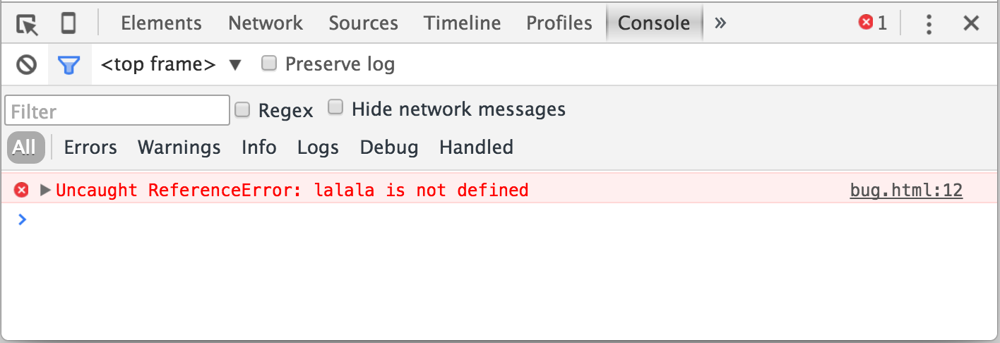

# Developer console

Code is prone to errors. You are quite likely to have errors... Oh, what am I'm talking about? You are *absolutely* going to make errors, at least if you're a human, not a [robot](https://en.wikipedia.org/wiki/Bender_(Futurama)).

But in the browser, a user doesn't see the errors by default. So, if something goes wrong in the script, we won't see what's broken and can't fix it.

To see errors and get a lot of other useful information about scripts, browsers have embedded "developer tools".

Most often developers lean towards Chrome or Firefox for the development, because those browsers have the best developer tools. Other browsers also provide developer tools, sometimes with special features, but are usually playing "catching-up" to Chrome or Firefox. So most people have a "favorite" browser and switch to others if a problem is browser-specific.

Developer tools are really powerful, there are many features. To start, we'll learn how to open them, look at errors and run JavaScript commands.

[cut]

## Google Chrome

Open the page [bug.html](bug.html).

There's an error in the JavaScript code on it. It's hidden from a regular visitor's eyes, so let's open developer tools to see it.

Press the key `key:F12` or, if you're on Mac, then `key:Cmd+Opt+J`.

The developer tools will open on the Console tab by default.

It looks somewhat like this:

The exact message you see will depend on your version of Chrome. It changes from time to time, but should be similar.

- Here we can see the red-colored error message. In this case the script contains an unknown "lalala" command.
- On the right, there is a clickable link to the source `bug.html:12` with the line number where the error has occured.

Below the error message there is a blue `>` symbol. It marks a "command line" where we can type JavaScript commands and press `key:Enter` to run them (`key:Shift+Enter` to input multiline commands).

Now we can see errors and that's enough for the start. We'll be back to developer tools later and cover debugging more in-depth in the chapter <info:debugging-chrome>.

## Firefox, Edge and others

Most other browsers use `key:F12` to open developer tools.

The look & feel of them is quite similar. Once you know how to use one of them (can start with Chrome), you can easily switch to another.

## Safari

Safari (Mac browser, not supported for Windows/Linux) is a little bit special here. We need to enable the "Develop menu" first.

Open Preferences and go to "Advanced" pane. There's a checkbox at the bottom of it:

Now `key:Cmd+Opt+C` can toggle the console. Also note that the new top menu item named "Develop" has appeared. It has many commands and options.

## Summary

- Developer tools allow us to see errors, run commands, examine variables and much more.
- They can be opened with `key:F12` for most browsers under Windows. Chrome for Mac needs `key:Cmd+Opt+J`, Safari: `key:Cmd+Opt+C` (need to enable first).

Now we have the environment ready. In the next section we get down to JavaScript.
