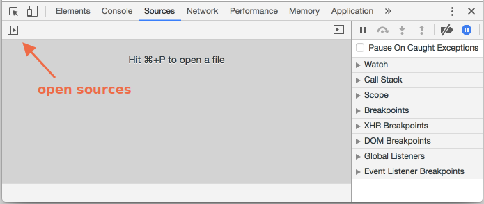
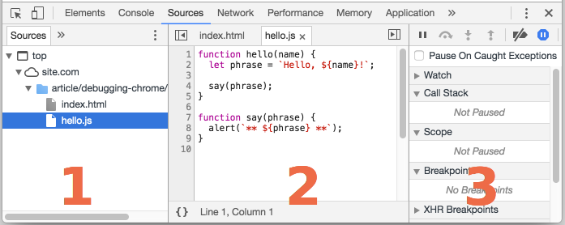
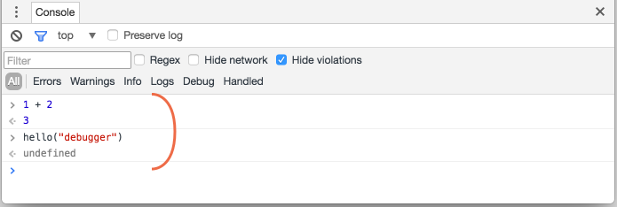
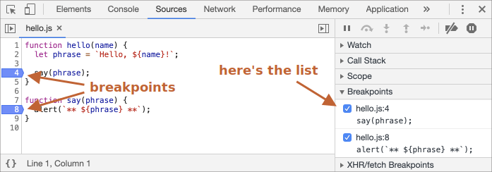
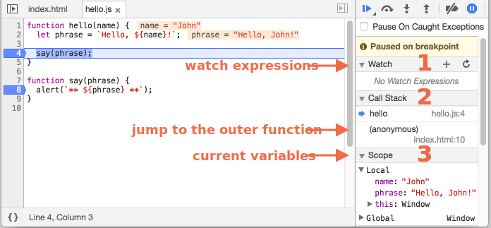
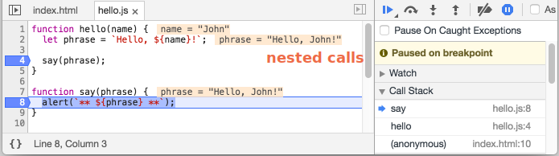

# Brauzerda debug qilish 

 Murakkab kodlar yozishdan oldin, keling avval debugging haqida gaplashib chiqamiz. 

[Debugging](https://en.wikipedia.org/wiki/Debugging) scriptdagi xatolarni topish va tuzatish jarayoni. Barcha brauzerlar va boshqa muhitlar debugging vositalarini qo'llab quvvatlaydi -- developer toolardagi debuggingni osonlashtiruvchi maxsus UI dir. U shuningdek, nima sodir bo'layotkanini ko'rish uchun bosqichma-bosqich kuzatish imkonini beradi. 

Bu yerda Chrome dan foydalanamiz, chunki unda yetarlicha xususiyatlar mavjud. Boshqa ko'plab brauzerlareda ham o'xshash jarayon bor. 

## "Manbalar" paneli 

Sizning Chrome versiyangiz biroz boshqacha ko'rinishda bo'lishi mumkin, lekin u yerda nimalar borligi aniq ko'rinib turadi. 

- Chromdagi [example page](debugging/index.html) sahifasini oching. 
- `key:F12` (Mac: `key:Cmd+Opt+I`) tugmasi bilan developer toollarini yoqing.
- `Sources` (manbalar) panelini tanlang.

Agar siz buni birinchi marta qilayotkan bo'lsangiz quyidagilar ko'rinadi: 



<span class="devtools" style="background-position:-172px -98px"></span> almashtituvchi tugmasi fayllarga ega bo'lgan sahifani ochib beradi. 

Uning ustiga bosing va`hello.js` ni tanlang. Quyidagilar kelib chiqadi: 



Manbalar panelini 3 ta qismi bor:

1. **File Navigator** oynasi HTML, JavaScript, CSS va boshqa fayllarni o'z ichiga oladi, jumladan sahifaga yopishtirilgan rasmlarni ham. Chrome kengaytmalari ham bu yerda ko'rinishi mumkin. 
2. **Code Editor** oynasi manba kodini ko'rsatadi.
3. **JavaScript Debugging** oynasi debugging uchun. Uni tez orada o'rganib chiqamiz. 

Endi yana  <span class="devtools" style="background-position:-172px -122px"></span> tugmasini bosib, manbalar ro'yxatini berkita olasiz va kodga biroz bo'sh joy berishingiz mumkin. 

## Konsol

Agar `key:Esc` tugmasini bossak, u quyidagini ochadi. U yerga buyruqlarni yozishimiz mumkin va `key:Enter` ni bosish orqali uni amalga oshira olamiz. 

Statment amalga oshirilgandan so'ng, uning natijasi quyida ko'rsatiladi.

Misol uchun, bu yerda `1+2` natijasi `3` da, va `hello("debugger")` hech narsa qaytarmaydi, shu tufayli, natija `undefined` (aniqlanmagan):



## Breakpointlar

Keling, [example page](debugging/index.html) kodini ichida nimalar sodir bo'layotkanini tekshirib chiqamiz.  `hello.js` da `4` qator raqamini bosing. Ha, kodda emas, `4` raqamining o'zida. 

Tabriklayman! Siz breakpointni o'rnatdingiz.  `8` qator raqamiga ham bosing. 

Shunga o'xshash ko'rinishda bo'ladi (ko'k siz bosishingiz kerak bo'lgan joy):



*breakpoint* bu-kod nuqatsi bo'lib, unda debug JavaScript amalini avtomatik ravishda to'xtatadi.

Kod to'xtagan paytda, biz joriy o'zgaruvchilarni tekshira olamiz, konsolda buyruqlarni amalga oshira olamiz va hkz. Boshqa so'z bilan aytkanda, biz unu debug qila olamiz. 

Har doim o'ng paneldan bir qator breakdownlarni topishimiz mumkin. Bu bizda har xil fayllarda bir nechta breakdownlar borligida kerak bo'ladi. U imkon beradi:
- Kodda breakdownga qaytish imkonini ( to'g'ri panelda uning ustiga bosish orqali)
- Breakdownni bekor qilish, uni vaqtincha ishdan chiqarish. 
- O'ng tomonni tanlash va Remove(olib tashlash) tugmasini bosish orqali breakdownni olib tashlash.
- ...Va boshqalar.

```smart header="Shartli breakpointlar"
Qator raqamidagi *Right click*  *conditional* (shartli) breakdown yaratish imkonini beradi. U faqat berilgan ifoda to'g'ri bo'lgandagina ishga tushadi. 

Bu biz aniq bir o'zgaruvchi qiymat yoki aniq funksiya parametrlai uchun to'xtaganimizda  juda qo'l keladi. 
```

## Debugger burug'i

Shuningdek, `debugger` buyrug'idan foydalanib ham kodni to'xtatsa bo'ladi, bu kabi: 

```js
function hello(name) {
  let phrase = `Hello, ${name}!`;

*!*
  debugger;  // <-- debugger shu yerda to'xtaydi
*/!*

  say(phrase);
}
```

Bu biz kod tahrirlovchida bo'ib, boshqa brauzerga o'tishni va breakdownni o'rnatish uchun developer toollaridagi scriptlarni ko'rib chiqishni istamasagan hollarimizda qulay bo'ladi. 


## Pauza qiling va atrofga qarang 

Bizning misolimizda, `hello()` sahifa yuklanish jarayonida chaqiriladi, shunich uchun debugger ni ishga tushirishning eng oson yo'li sahifani qayta yuklashdir. Shunday qilib, `key:F5` (Windows, Linux) yoki `key:Cmd+R` (Mac) tugmasini bosamiz.

Breakpoint o'rnatilganligi bois, amal 4-qatorda to'xtaydi. 



O'ng tomondagi ma'lumotlarni oching ( strelka bilan belgilangan). U bizga joriy kod holatini tekshirish imkonini beradi:

1. **`Watch` -- istalgan ifodaga joriy qiymatni ko'rsatadi.**

    Plus `+` belgisini ustiga bosishingiz, va ifodani kiritishingiz mumkin. Debugger uning qiymatini istalgan vaqtda amal jarayonida hisoblab ko'rsatib beradi. 

2. **`Call Stack` -- ichki qo'ng'iroqlar zanjirini ko'rsatadi.**

    Hozirgi vaziyatda debugger `index.html` da script tomonidan chaqirilgan `hello()` qo'ng'irog'ining ichida, (buyerda funksiy yo'q, shuning uchun u "anonymous" (anonim) deb ataladi).

    Agar siz stack elementini (masalan, "anonim") bossangiz, tuzatuvchi mos keladigan kodga o'tadi va uning barcha o'zgaruvchilari ham tekshirilishi mumkin.
3. **`Scope` -- joriy o'zgaruvchilar.** 

    `Local` mahalliy funksiya o'zgaruvchilarini ko'rsatiadi. Ularning qiymatini manba ustida ta'kidlanganligini ham ko'rishingiz mumkin. 

    `Global` global o'zgaruvchilarga ega (har qanday funksiyadan tashqari). 

    U yerda yana biz o'rganib chiqmagan `this` tugmasi ham bor, lekin uni tez orada o'qib chiqamiz.  

## Amalini kuzatish 

Endi scriptni kuzatish payti keldi. 

Buning uchun o'ng panelning tepasida tugmalar mavjud.  Ularni ishga tushiramiz.
<!-- https://github.com/ChromeDevTools/devtools-frontend/blob/master/front_end/Images/src/largeIcons.svg -->
<span class="devtools" style="background-position:-146px -168px"></span> -- "Resume": amalni davom ettiradi, `key:F8` tugmasi.
: Amalni davom ettiring. Agar qo'shimcha breakpointlar mavjud bo'lmasa, amal davom etadi va debugger nazoratni yo'qotadi. 

    Quydagi biz uning ustiga bosganimzdan keyingi ko'rishimiz mumkin bo'lgan holat:

    

    Amal davom etdi, `say()` ning ichidagi boshqa bir breakpointga yetib keldi va o'sha yerda to'xtadi. O'ng tomondagi "Call Stack" ga qarang. U yana bir (call) chaqiruvga oshdi. Biz `say()` ning ichidamiz. 

<span class="devtools" style="background-position:-200px -190px"></span> -- "Step": keyingi buyruqni amalga oshiradi, `key:F9` tugmasi.
: Keyingi statementni ishga tushiramiz. Agar hozir uning ustiga bossak, `alert` ko'rsatiladi.

    Buni qayta va qayta bosish barcha script statementlarini birma bir bosib o'tadi. 

<span class="devtools" style="background-position:-62px -192px"></span> -- "Step over": keyingi buyruqni amalga oshiradi, lekin *funksiya ichiga kirmaydi*,  `key:F10` tugmasi.
: Bu avvalgi "Step" buyrug'iga o'xshaydi, ammo keyingi statement funksiya qo'n'girog'i bo'lsa, boshqacha ishlaydi. Bu: alertga o'xshab ichki qurilma emas, ammo o'zimizga tegishli funksiya. 

    "Step" buyrug'i unga kiradi va birinchi qatorda bajarishni to'xtatadi, "Step over" esa ichki funksiyalarni o'tkazib yuborgan holda ichki funksiya chaqiruvini ko'rinmas tarzda bajaradi.

    Ushbu funktsiyadan so'ng amal darhol to'xtatiladi.

    Funktsiya chaqiruvida nima sodir bo'lishini ko'rish bizni qiziqtirmasa, bu yaxshi.

<span class="devtools" style="background-position:-4px -194px"></span> -- "Step into", `key:F11` tugma.
: Bu ham "Step" ga o'xshash, lekin asinxron funksiya chaqiruvida boshqacha ishlaydi. Agar siz endi JavaScriptni o'rganishni boshlayotkan bo'lsangiz, siz farqlarini e'tiborga olmasangiz bo'ladi, chunki bizda asinxron qo'ng'roqlari hali mavjud emas. 

    Shuni yodda tutingki, "Step" buyrug'i keyinroq bajariladigan `setTimeout` (rejalashtirilgan funksiya chaqiruvi) kabi asinxron harakatlarni e'tiborsiz qoldiradi. "Step into" ularning kodiga kiradi va zarur bo'lsa ularni kutadi. Ko'proq ma'lumot uchun [DevTools manual](https://developers.google.com/web/updates/2018/01/devtools#async)ni ko'ring. 

<span class="devtools" style="background-position:-32px -194px"></span> -- "Step out": amalni joriy funksiyaning oxirigacha davom ettiradi, tugmasi `key:Shift+F11`. 

: Amalni joriy funksiyanig oxirgi qatorigacha davom ettiradi. Bu biz tasodifan <span class="devtools" style="background-position:-200px -190px"></span> dan foydalanib ichki qo'ng'iroqqa kirganimizda juda qulay, lekin bu bizni qiziqtirmaydi va oxirigacha borib imkoni boricha tezroq yakunlamoqchimiz. 

<span class="devtools" style="background-position:-61px -74px"></span> -- hamma breakpointlarga imkon beradi/ishdan chiqaradi.
: Bu tugma amalni harakatlantirmaydi, shunchaki breakdownlar uchun katta ommaviy on/off

<span class="devtools" style="background-position:-90px -146px"></span> -- xato mavjud vaziyatda avtomatik to'xtashni imkonini beradi/ishdan chiqaradi.
: Imkon berilib   va developer toollar ochiq bo'lganda, script xatosi avtomatik ravishda amalni to'xtatadi. Keyin nima xato ketkanligini ko'rish uchun o'zgaruvchilarni analiz qila olamiz. Shunday qilib, agar skriptimiz xatolik bilan buzilib qolsa, biz debuggerni ochishimiz, ushbu parametrni yoqishimiz va sahifani qayta yuklashimiz va uning qayerda buzilishini va o'sha paytdagi kontekstni ko'rishimiz mumkin. 

```smart header="Continue to here"
Kod satriga sichqonchaning o'ng tugmachasini bosish "Continue to here" (Bu yerga davom eting) deb nomlangan ajoyib tanlov bilan kontekst menyusini ochadi. 

Bu biz chiziqqa bir necha qadam oldinga siljishni hohlaganimizda qulay bo'ladi, lekin breakpointni belgilashga juda dangasamiz.
```

## Logging

Kodimizdan konsolga biror narsa chiqarish uchun `console.log` funksiyasi mavjud

Misol uchun, bu konsolda  `0` dan `4` gacha bo'lgan qiymatlarni chiqaradi:

```js run
// quyidagilarni ko'rish uchun konsolni oching 
for (let i = 0; i < 5; i++) {
  console.log("value,", i);
}
```

Oddiy foydalanuvchilar bu chiqishni ko'rmaydilar, chunki u konsolda. Uni ko'rish uchun developer toolidagi Konsol panelini oching yoki boshqa bir panelda `key:Esc` tugamasini bosing:

Agar bizda kodda yetarlicha logging bo'lsa, u holda biz yozuvlardan debuggersiz nima sodir bo'layotkanini ko'ra olamiz.

## Xulosa

Ko'rib turganimizdek, scriptni to'xtatishni uchta asosiy yo'li mavjud:
1. A breakpoint.
2. The `debugger` statements.
3. Xato ( dev toollar ochiq va <span class="devtools" style="background-position:-90px -146px"></span> tugmasi "on" bo'lsa).  

To'xtatib qo'yilganda (pauza qilinganda), debug qila olamiz - o'zgaruvchilarni teksira olamiz va qayerda xato ketayotkanini ko'riah uchun kodni kuzata olamiz. 

Developer toollarda bu yerda o'rganib chiqilganlardan ko'ra ko'proq tanlovlar mavjud. To'liq q'llanma <https://developers.google.com/web/tools/chrome-devtools> da. 

Bu yerdagi ma'lumotning o'zi debuggingni boshlashga yetarli, lekin keyinroq ayniqsa agar siz brauzerdan ko'p foydalanadigan bo'lsangiz, ko'rsatilgan joyga boring va developer toollarning yanada rivojlangan imkoniyatlarini ko'rib chiqing. 

Siz yana developer toollarning har-xil joylariga bosib, nima ko'rsatilayotkanini ko'rishingiz mumkin. Bu dev toollarni o'rganishni balki eng tez yo'li. O' tomondagi (click) bosish va kontekst menyusini unutmang!
