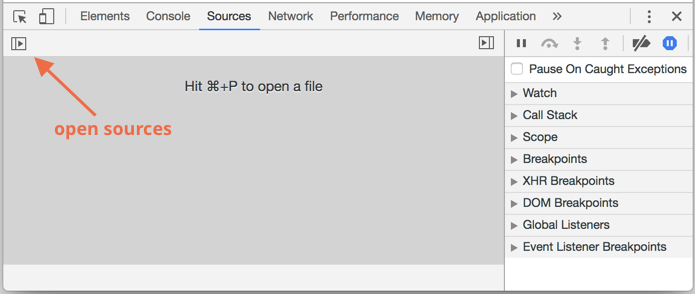
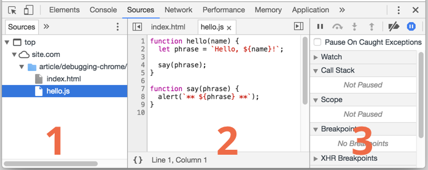
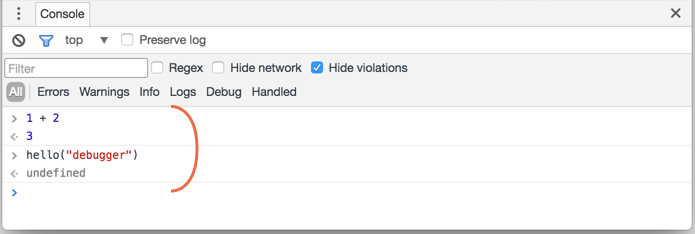
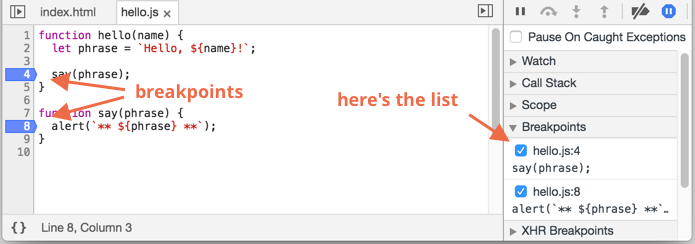
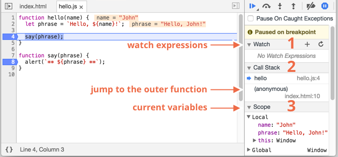
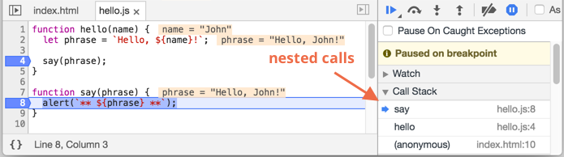

# Debugging in Chrome

Before writing more complex code, let's talk about debugging.

All modern browsers and most other environments support "debugging" -- a special UI in developer tools that makes finding and fixing errors much easier.

We'll be using Chrome here, because it's probably the most feature-rich in this aspect.

## The "sources" pane

Your Chrome version may look a little bit different, but it still should be obvious what's there.

- Open the [example page](debugging/index.html) in Chrome.
- Turn on developer tools with `key:F12` (Mac: `key:Cmd+Opt+I`).
- Select the `sources` pane.

Here's what you should see if you are doing it for the first time:



The toggler button <span class="devtools" style="background-position:-168px -76px"></span> opens the tab with files.

Let's click it and select `hello.js` in the tree view. Here's what should show up:



Here we can see three zones:

1. The **Resources zone** lists HTML, JavaScript, CSS and other files, including images that are attached to the page. Chrome extensions may appear here too.
2. The **Source zone** shows the source code.
3. The **Information and control zone** is for debugging, we'll explore it soon.

Now you could click the same toggler <span class="devtools" style="background-position:-200px -76px"></span> again to hide the resources list and give the code some space.

## Console

If we press `key:Esc`, then a console opens below. We can type commands there and press `key:Enter` to execute.

After a statement is executed, its result is shown below.

For example, here `1+2` results in `3`, and `hello("debugger")` returns nothing, so the result is `undefined`:



## Breakpoints

Let's examine what's going on within the code of the [example page](debugging/index.html). In `hello.js`, click at line number `4`. Yes, right on the `4` digit, not on the code.

Congratulations! You've set a breakpoint. Please also click on the number for line `8`.

It should look like this (blue is where you should click):



A *breakpoint* is a point of code where the debugger will automatically pause the JavaScript execution.

While the code is paused, we can examine current variables, execute commands in the console etc. In other words, we can debug it.

We can always find a list of breakpoints in the right pane. That's useful when we have many breakpoints in various files. It allows us to:
- Quickly jump to the breakpoint in the code (by clicking on it in the right pane).
- Temporarily disable the breakpoint by unchecking it.
- Remove the breakpoint by right-clicking and selecting Remove.
- ...And so on.

```smart header="Conditional breakpoints"
*Right click* on the line number allows to create a *conditional* breakpoint. It only triggers when the given expression is truthy.

That's handy when we need to stop only for a certain variable value or for certain function parameters.
```

## Debugger command

We can also pause the code by using the `debugger` command, like this:

```js
function hello(name) {
  let phrase = `Hello, ${name}!`;

*!*
  debugger;  // <-- the debugger stops here
*/!*

  say(phrase);
}
```

That's very convenient when we are in a code editor and don't want to switch to the browser and look up the script in developer tools to set the breakpoint.


## Pause and look around

In our example, `hello()` is called during the page load, so the easiest way to activate the debugger is to reload the page. So let's press `key:F5` (Windows, Linux) or `key:Cmd+R` (Mac).

As the breakpoint is set, the execution pauses at the 4th line:



Please open the informational dropdowns to the right (labeled with arrows). They allow you to examine the current code state:

1. **`Watch` -- shows current values for any expressions.**

    You can click the plus `+` and input an expression. The debugger will show its value at any moment, automatically recalculating it in the process of execution.

2. **`Call Stack` -- shows the nested calls chain.**

    At the current moment the debugger is inside `hello()` call, called by a script in `index.html` (no function there, so it's called "anonymous").

    If you click on a stack item, the debugger jumps to the corresponding code, and all its variables can be examined as well.
3. **`Scope` -- current variables.**

    `Local` shows local function variables. You can also see their values highlighted right over the source.

    `Global` has global variables (out of any functions).

    There's also `this` keyword there that we didn't study yet, but we'll do that soon.

## Tracing the execution

Now it's time to *trace* the script.

There are buttons for it at the top of the right pane. Let's engage them.

<span class="devtools" style="background-position:-7px -76px"></span> -- continue the execution, hotkey `key:F8`.
: Resumes the execution. If there are no additional breakpoints, then the execution just continues and the debugger loses control.

    Here's what we can see after a click on it:

    

    The execution has resumed, reached another breakpoint inside `say()` and paused there. Take a look at the "Call stack" at the right. It has increased by one more call. We're inside `say()` now.

<span class="devtools" style="background-position:-137px -76px"></span> -- make a step (run the next command), but *don't go into the function*, hotkey `key:F10`.
: If we click it now, `alert` will be shown. The important thing is that `alert` can be any function, the execution "steps over it", skipping the function internals.

<span class="devtools" style="background-position:-72px -76px"></span> -- make a step, hotkey `key:F11`.
: The same as the previous one, but "steps into" nested functions. Clicking this will step through all script actions one by one.

<span class="devtools" style="background-position:-104px -76px"></span> -- continue the execution till the end of the current function, hotkey `key:Shift+F11`.
: The execution would stop at the very last line of the current function. That's handy when we accidentally entered a nested call using <span class="devtools" style="background-position:-72px -76px"></span>, but it does not interest us, and we want to continue to its end as soon as possible.

<span class="devtools" style="background-position:-7px -28px"></span> -- enable/disable all breakpoints.
: That button does not move the execution. Just a mass on/off for breakpoints.

<span class="devtools" style="background-position:-264px -4px"></span> -- enable/disable automatic pause in case of an error.
: When enabled, and the developer tools is open, a script error automatically pauses the execution. Then we can analyze variables to see what went wrong. So if our script dies with an error, we can open debugger, enable this option and reload the page to see where it dies and what's the context at that moment.

```smart header="Continue to here"
Right click on a line of code opens the context menu with a great option called "Continue to here".

That's handy when we want to move multiple steps forward, but we're too lazy to set a breakpoint.
```

## Logging

To output something to console, there's `console.log` function.

For instance, this outputs values from `0` to `4` to console:

```js run
// open console to see
for (let i = 0; i < 5; i++) {
  console.log("value", i);
}
```

Regular users don't see that output, it is in the console. To see it, either open the Console tab of developer tools or press `key:Esc` while in another tab: that opens the console at the bottom.

If we have enough logging in our code, then we can see what's going on from the records, without the debugger.

## Summary

As we can see, there are three main ways to pause a script:
1. A breakpoint.
2. The `debugger` statements.
3. An error (if dev tools are open and the button <span class="devtools" style="background-position:-264px -4px"></span> is "on").

Then we can examine variables and step on to see where the execution goes wrong.

There are many more options in developer tools than covered here. The full manual is at <https://developers.google.com/web/tools/chrome-devtools>.

The information from this chapter is enough to begin debugging, but later, especially if you do a lot of browser stuff, please go there and look through more advanced capabilities of developer tools.

Oh, and also you can click at various places of dev tools and just see what's showing up. That's probably the fastest route to learn dev tools. Don't forget about the right click as well!
