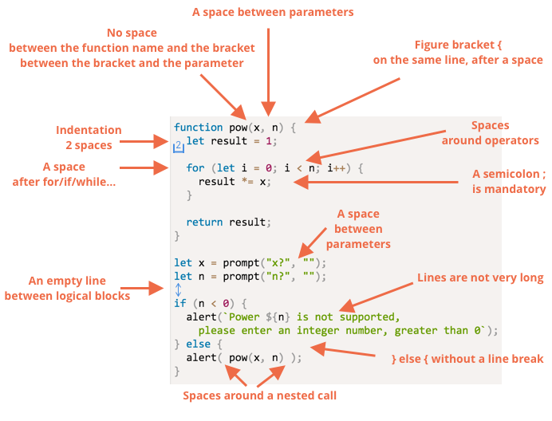
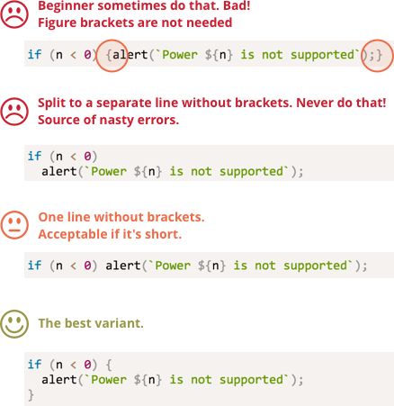

# Coding style

Our code must be as clean and easy to read as possible.

That is actually an art of programming -- to take a complex task and code it in a way that is both correct and human-readable.

One thing to help is the good code style.

## Syntax

A cheatsheet with the rules (more details below):


<!--
```js
function pow(x, n) {
  let result = 1;

  for (let i = 0; i < n; i++) {
    result *= x;
  }

  return result;
}

let x = prompt("x?", "");
let n = prompt("n?", "");

if (n < 0) {
  alert(`Power ${n} is not supported,
    please enter an integer number, greater than 0`);
} else {
  alert( pow(x, n) );
}
```

-->

Now let's discuss the rules and reasons for them in detail.

Nothing is "carved in stone" here. Everything is optional and can be changed: these are coding rules, not religious dogmas.

### Curly braces

In most JavaScript projects curly braces are written on the same line as the corresponding keyword, not on the new line, a so-called "Egyptian" style. There's also a space before an opening bracket.

Like this:

```js
if (condition) {
  // do this
  // ...and that
  // ...and that
}
```

A single-line construct is an important edge case. Should we use brackets at all? If yes, then where?

Here are the annotated variants, so you can judge about their readability on your own:

<!--
```js no-beautify
if (n < 0) {alert(`Power ${n} is not supported`);}

if (n < 0) alert(`Power ${n} is not supported`);

if (n < 0)
  alert(`Power ${n} is not supported`);

if (n < 0) {
  alert(`Power ${n} is not supported`);
}
```
-->


As a summary:
- For a really short code, one line is acceptable: like `if (cond) return null`.
- But a separate line for each statement in brackets is usually better.

### Line length

The maximal line length should be limited. No one likes to eye-follow a long horizontal line. It's better to split it.

The maximal line length is agreed on the team-level. It's usually 80 or 120 characters.

### Indents

There are two types of indents:

- **A horizontal indent: 2(4) spaces.**

    A horizontal indentation is made using either 2 or 4 spaces or the "Tab" symbol. Which one to choose is an old holy war. Spaces are more common nowadays.

    One advantage of spaces over tabs is that spaces allow more flexible configurations of indents than the "Tab" symbol.

    For instance, we can align the arguments with the opening bracket, like this:

    ```js no-beautify
    show(parameters,
         aligned, // 5 spaces padding at the left  
         one,
         after,
         another
      ) {
      // ...
    }
    ```

- **A vertical indent: empty lines for splitting code into logical blocks.**

    Even a single function can often be divided in logical blocks. In the example below, the initialization of variables, the main loop and returning the result are split vertically:

    ```js
    function pow(x, n) {
      let result = 1;
      //              <--
      for (let i = 0; i < n; i++) {
        result *= x;
      }
      //              <--
      return result;
    }
    ```

    Insert an extra newline where it helps to make the code more readable. There should not be more than nine lines of code without a vertical indentation.

### A semicolon

A semicolon should be present after each statement. Even if it could possibly be skipped.

There are languages where a semicolon is truly optional. It's rarely used there. But in JavaScript there are few cases when a line break is sometimes not interpreted as a semicolon. That leaves a place for programming errors.

As you become more mature as a programmer, you may choose a no-semicolon style, like [StandardJS](https://standardjs.com/), but that's only when you know JavaScript well and understand possible pitfalls.

### Nesting levels

There should not be too many nesting levels.

Sometimes it's a good idea to use the ["continue"](info:while-for#continue) directive in the loop to evade extra nesting in `if(..) { ... }`:

Instead of:

```js
for (let i = 0; i < 10; i++) {
  if (cond) {
    ... // <- one more nesting level
  }
}
```

We can write:

```js
for (let i = 0; i < 10; i++) {
  if (!cond) *!*continue*/!*;
  ...  // <- no extra nesting level
}
```

A similar thing can be done with `if/else` and `return`.

For example, two constructs below are identical.

The first one:

```js
function pow(x, n) {
  if (n < 0) {
    alert("Negative 'n' not supported");
  } else {
    let result = 1;

    for (let i = 0; i < n; i++) {
      result *= x;
    }

    return result;
  }  
}
```

And this:

```js
function pow(x, n) {
  if (n < 0) {
    alert("Negative 'n' not supported");
    return;
  }

  let result = 1;

  for (let i = 0; i < n; i++) {
    result *= x;
  }

  return result;
}
```

...But the second one is more readable, because the "edge case" of `n < 0` is handled early on, and then we have the "main" code flow, without an additional nesting.

## Functions below the code

If you are writing several "helper" functions and the code to use them, then there are three ways to place them.

1. Functions above the code that uses them:

    ```js
    // *!*function declarations*/!*
    function createElement() {
      ...
    }

    function setHandler(elem) {
      ...
    }

    function walkAround() {
      ...
    }

    // *!*the code which uses them*/!*
    let elem = createElement();
    setHandler(elem);
    walkAround();
    ```
2. Code first, then functions

    ```js
    // *!*the code which uses the functions*/!*
    let elem = createElement();
    setHandler(elem);
    walkAround();

    // --- *!*helper functions*/!* ---

    function createElement() {
      ...
    }

    function setHandler(elem) {
      ...
    }

    function walkAround() {
      ...
    }
    ```
3. Mixed: a function is described where it's first used.

Most of time, the second variant is preferred.

That's because when reading a code, we first want to know "what it does". If the code goes first, then it provides that information. And then maybe we won't need to read functions at all, especially if their names are adequate to what they're doing.

## Style guides

A style guide contains general rules about "how to write": which quotes to use, how many spaces to indent, where to put line breaks, etc. A lot of minor things.

In total, when all members of a team use the same style guide, the code looks uniform. No matter who of the team wrote it, it's still the same style.

Surely, a team may think out a style guide themselves. But as of now, there's no need to. There are many tried, worked-out style guides, which are easy to adopt.

For instance:

- [Google JavaScript Style Guide](https://google.github.io/styleguide/javascriptguide.xml)
- [Airbnb JavaScript Style Guide](https://github.com/airbnb/javascript)
- [Idiomatic.JS](https://github.com/rwaldron/idiomatic.js)
- [StandardJS](https://standardjs.com/)
- (there are more)

If you're a novice developer, then you could start with the cheatsheet above in the chapter, and later browse the style guides to pick up the common principles and maybe choose one.

## Automated linters

There are tools that can check the code style automatically. They are called "linters".

The great thing about them is that style-checking also finds some bugs, like a typo in a variable or function name.

So it's recommended to install one, even if you don't want to stick to a "code style". They help to find typos -- and that's already good enough.

Most well-known tools are:

- [JSLint](http://www.jslint.com/) -- one of the first linters.
- [JSHint](http://www.jshint.com/) -- more settings than JSLint.
- [ESLint](http://eslint.org/) -- probably the newest one.

All of them can do the job. The author uses [ESLint](http://eslint.org/).

Most linters are integrated with editors: just enable the plugin in the editor and configure the style.

For instance, for ESLint you should do the following:

1. Install [Node.JS](https://nodejs.org/).
2. Install ESLint with the command `npm install -g eslint` (npm is a JavaScript package installer).
3. Create a config file named `.eslintrc` in the root of your JavaScript project (in the folder that contains all your files).

Here's an example of `.eslintrc`:

```js
{
  "extends": "eslint:recommended",
  "env": {
    "browser": true,
    "node": true,
    "es6": true
  },
  "rules": {
    "no-console": 0,
  },
  "indent": 2
}
```

Here the directive `"extends"` denotes that we base on the "eslint:recommended" set of settings, and then we specify our own.

Then install/enable the plugin for your editor that integrates with ESLint. The majority of editors have it.

It is possible to download style rule sets from the web and extend them instead. See <http://eslint.org/docs/user-guide/getting-started> for more details about installation.

Using a linter has a great side-effect: linters catch typos. For instance, when an undefined variable is accessed, a linter detects it and (if integrated with an editor) highlights it. In most cases that's a mistype. So we can fix it right ahead.

For that reason even if you're not concerned about styles, using a linter is highly recommended.

Also certain IDEs support built-in linting, that also may be good, but not so tunable as ESLint.

## Summary

All syntax rules from this chapter and the style guides aim to increase readability, so all of them are debatable.

When we think about "how to write better?", the sole criterion is "what makes the code more readable and easier to understand? what helps to avoid errors?" That's the main thing to keep in mind when choosing the style or discussing which one is better.

Read style guides to see the latest ideas about that and follow those that you find the best.
