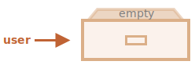
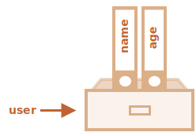
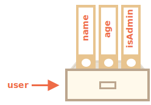
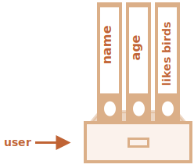

# Obyektlar

<info:types> bo'limidan ma'lumki, JavaScriptda sakkizta ma'lumot turi mavjud. Ulardan yettitasi "ibtidoiy" deb ataladi, chunki ularning qiymatlari faqat bitta narsani o'z ichiga oladi (qator, raqam va h.k).

Bundan farqli o'laroq, obyektlar turli xil ma'lumotlar va murakkabroq obyektlarning kalitli to'plamlarini saqlash uchun ishlatiladi. JavaScriptda obyektlar tilning deyarli barcha tomonlariga kirib boradi. Shuning uchun biz boshqa joyga chuqurroq kirishdan oldin ularni tushunishimiz kerak.

Obyektni `{…}` qavslar yordamida, ixtiyoriy *xususiyatlar* ro'yxati bilan yaratish mumkin. Xususiyat "key: value" juftligi bo'lib, bu yerda `key` qator ("xususiyat nomi" deb ham ataladi) va `value` har qanday narsa bo'lishi mumkin.

Obyektni imzolangan fayllarga ega kabinet sifatida tasavvur qilishimiz mumkin. Har bir ma'lumot bo'lagi kalit yordamida o'z faylida saqlanadi. Faylni nomi bo'yicha topish yoki faylni qo'shish/o'chirish oson.


Bo'sh obyekt ("bo'sh kabinet") ikkita sintaksisdan biri yordamida yaratilishi mumkin:

```js
let user = new Object(); // "obyekt konstruktori" sintaksisi
let user = {};  // "obyekt literal" sintaksisi
```



Odatda `{...}` qavslar ishlatiladi. Bu deklaratsiya *obyekt literal* deb ataladi.

## Literallar va xususiyatlar

Biz darhol ba'zi xususiyatlarni `{...}` ga "key: value" juftlari sifatida qo'yishimiz mumkin:

```js
let user = {     // obyekt
  name: "John",  // "name" kaliti bo'yicha "John" qiymatini saqlang
  age: 30        //  kalit bo'yicha "age" do'kon qiymati 30
};
```

Mulkda ikki nuqta `":"` oldida kalit ("name" yoki "identifikator" sifatida ham tanilgan) va uning o'ng tomonidagi qiymat mavjud.

`user` obyektida ikkita xususiyat mavjud:

1. Birinchi xususiyat `"name"` nomiga va `"John"` qiymatiga ega.
2. Ikkinchisida `"age"` nomi va `30` qiymati mavjud.

Natijada paydo bo'lgan `user` obyektini "name" va "age" deb nomlangan ikkita imzolangan faylga ega kabinet sifatida tasavvur qilish mumkin.



Biz istalgan vaqtda undan fayllar qo'shishimiz, o'chirishimiz va o'qishimiz mumkin.

Xususiyat qiymatlariga nuqta belgisi yordamida kirish mumkin:

```js
// obyektning xususiyat qiymatlarini oling:
alert( user.name ); // John
alert( user.age ); // 30
```

Qiymat har qanday turdagi bo'lishi mumkin. Keling, unga boolean qo'shamiz:

```js
user.isAdmin = true;
```



Xususiyatni o'chirish uchun biz `delete` operatoridan foydalanishimiz mumkin:

```js
delete user.age;
```


Biz ko'p so'zli xususiyat nomlaridan ham foydalanishimiz mumkin, ammo keyin ulardan iqtibos keltirish kerak:

```js
let user = {
  name: "John",
  age: 30,
  "likes birds": true  // ko'p so'zli xususiyat nomi iqtibos keltirilishi kerak
};
```




Ro'yxatdagi oxirgi xususiyat vergul bilan tugashi mumkin:
```js
let user = {
  name: "John",
  age: 30*!*,*/!*
}
```
Bu "ortdagi" yoki "osilgan" vergul deb ataladi. Xususiyatlarni qo'shish/o'chirish/ko'chirishni osonlashtiradi, chunki barcha qatorlar bir xil bo'ladi.

## Kvadrat qavslar

Ko'p so'zli xususiyatlar uchun nuqtali kirish ishlamaydi:

```js run
// bu sintaksis xatosini beradi
user.likes birds = true
```
JavaScript buni tushunmaydi. Biz `user.likes` ga murojaat qilamiz, deb o'ylaydi va kutilmagan qushlar, ya'ni `birds` ga duch kelganda sintaksis xatosi yuz beradi.

Nuqta kalitning yaroqli o'zgaruvchi identifikatori bo'lishini talab qiladi. Bu shuni anglatadiki: bo'sh joy yo'q, raqam bilan boshlanmaydi va maxsus belgilarni o'z ichiga olmaydi (`$` va `_` ruxsat etiladi).

Har qanday satr bilan ishlaydigan muqobil "kvadrat qavs belgisi" mavjud:

```js run
let user = {};

// set
user["likes birds"] = true;

// get
alert(user["likes birds"]); // true

// delete
delete user["likes birds"];
```

Endi hammasi yaxshi. Qavslar ichidagi satr to'g'ri keltirilishiga e'tibor bering (har qanday turdagi quote mos keladi).

Kvadrat qavslar, shuningdek, quyidagi kabi o'zgaruvchidan so'zma-so'z satrdan farqli o'laroq, har qanday ifoda natijasi sifatida xususiyat nomini olish usulini taqdim etadi:

```js
let key = "likes birds";

// foydalanuvchi bilan bir xil ["likes birds"] = true;
user[key] = true;
```
Bu yerda `key` o'zgaruvchisi ish vaqtida hisoblanishi yoki foydalanuvchi kiritishiga bog'liq bo'lishi mumkin. Va keyin biz undan xususiyatga kirish uchun foydalanamiz. Bu bizga katta moslashuvchanlikni beradi.

Masalan:

```js run
let user = {
  name: "John",
  age: 30
};

let key = prompt ("User va name haqida nima bilmoqchisiz?");

// o'zgaruvchi orqali kirish
alert( user[key] ); // John ("name" ni kiriting)
```

Nuqta belgisini o'xshash tarzda ishlatib bo'lmaydi:

```js run
let user = {
  name: "John",
  age: 30
};

let key = "name";
alert( user.key ) // undefined (aniqlanmagan)
```

### Hisoblangan xususiyatlar (Computed properties)

Obyektni yaratishda biz kvadrat qavslardan obyektning literalida foydalanishimiz mumkin. Bu *hisoblangan xususiyatlar* deb ataladi.

Masalan:

```js run
let fruit = prompt("Qaysi mevani sotib olamiz?", "olma");

let bag = {
*!*
  [fruit]: 5, //xususiyat nomi o'zgaruvchan mevadan olingan
*/!*
};

alert( bag.apple ); // 5 agar meva="apple" (olma) bo'lsa
```

Hisoblangan xususiyatning ma'nosi oddiy: `[fruit]` xususiyat nomi `fruit` dan olinishi kerakligini bildiradi.

Demak, agar mehmon `` apple`` ga kirsa, `bag` `{apple: 5}`ga aylanadi.

Asosan, u xuddi shunday ishlaydi:
```js run
let fruit = prompt("Qaysi mevani sotib olish kerak?", "apple");
let bag = {};

// meva o'zgaruvchisidan xususiyat nomini oling
bag[fruit] = 5;
```

...Lekin chiroyliroq ko'rinadi.

Kvadrat qavslar ichida murakkabroq ifodalardan foydalanishimiz mumkin:

```js
let fruit = 'apple';
let bag = {
  [fruit + 'Computers']: 5 // bag.appleComputers = 5
};
```

Kvadrat qavslar nuqta belgilaridan ko'ra kuchliroqdir. Ular har qanday xususiyat nomlari va o'zgaruvchilarga ruxsat beradi. Lekin ularni yozish ham qiyinroq.

Shunday qilib, ko'pncha, mulk nomlari ma'lum va sodda bo'lsa, nuqta ishlatiladi. Va agar bizga murakkabroq narsa kerak bo'lsa, biz kvadrat qavslarga o'tamiz.

## Mulk qiymati qisqartmasi

Haqiqiy kodda biz ko'pincha mavjud o'zgaruvchilarni mulk nomlari uchun qiymat sifatida ishlatamiz.

Masalan:

```js run
function makeUser(name, age) {
  return {
    name: name,
    age: age,
    // ...boshqa xususiyatlar
  };
}

let user = makeUser("John", 30);
alert(user.name); // John
```
Yuqoridagi misolda xususiyatlar o'zgaruvchilar bilan bir xil nomga ega. O'zgaruvchidan xossa yasashdan foydalanish holatlari shunchalik keng tarqalganki, uni qisqartirish uchun maxsus *xususiyat qiymati qisqartmasi* mavjud.

`name:name` o'rniga shunchaki quyidagi kabi `name` deb yozishimiz mumkin:

```js
function makeUser(name, age) {
*!*
  return {
    name, // name bilan bir xil: name
    age,  // age bilan bir xil: age
    // ...
  };
*/!*
}
```

Xuddi shu obyektda biz oddiy xususiyatlardan ham, qisqartmalardan ham foydalanishimiz mumkin:

```js
let user = {
  name,  // name bilan bir xil:name
  age: 30
};
```


## Mulk nomlari cheklovlari

Bizga ma'lumki, o'zgaruvchi tilda saqlangan so'zlardan biriga teng nomga ega bo'lishi mumkin emas, masalan, "for", "let", "return" va hokazo.

Lekin obyekt xususiyati uchun bunday cheklov yo'q:

```js run
// bu xususiyatlarвф hammasi yaxshi
let obj = {
  for: 1,
  let: 2,
  return: 3
};

alert( obj.for + obj.let + obj.return );  // 6
```
Muxtasar qilib aytganda, nomlarida hech qanday cheklovlar yo'q. Ular har qanday satr yoki belgilar bo'lishi mumkin (identifikatorlar uchun maxsus tur, keyinroq ko'rib chiqiladi).

Boshqa turlar avtomatik ravishda satrlarga aylantiriladi.

Masalan, `0` raqami xususiyat kaliti sifatida foydalanilganda `0` qatoriga aylanadi:

```js run
let obj = {
  0: "test" // "0"  bilan bir xil: "test"
};

// Ikkala ogohlantirish ham bir xil xususiyatga kirishadi (0 raqami "0" qatoriga aylantiriladi)
alert( obj["0"] ); // test
alert( obj[0] ); // test (bir xil xususiyat)
```

`__proto__` nomli maxsus xususiyatga ega kichik gotcha bor. Biz uni obyekt bo'lmagan qiymatga o'rnatolmaymiz:

```js run
let obj = {};
obj.__proto__ = 5; // raqam tayinlang
alert(obj.__proto__); // [object Object] - qiymat obyekt bo'lib, mo'ljallanganidek ishlamadi
```

Koddan ko'rinib turibdiki, ibtidoiy `5` ga tayinlash e'tiborga olinmaydi.

Biz `__proto__` ning o'ziga xos xususiyatini [keyingi boblarda](ma'lumot:prototip-meros) ko'rib chiqamiz va bunday xatti-harakatni [tuzatish yo'llarini](ma'lumot:prototip-metodlar) taklif qilamiz.

## Mulk mavjudligi testi, "in" operatori

JavaScriptdagi obyektlarning boshqa ko'plab tillarga nisbatan e'tiborga loyiq xususiyati shundaki, har qanday xususiyatga kirish mumkin. Agar xususiyat mavjud bo'lmasa, xato bo'lmaydi!

Mavjud bo'lmagan xususiyatni o'qish shunchaki `undefined`ni qaytaradi. Shunday qilib, biz mulk mavjudligini osongina tekshirishimiz mumkin:

```js run
let user = {};

alert( user.noSuchProperty === undefined ); // true "bunday xususiyat yo'q" degan ma'noni anglatadi
```

Buning uchun `"in"` maxsus operatori ham mavjud.

Sintaksis:
```js
"key" in object
```

Masalan:

```js run
let user = { name: "John", age: 30 };

alert( "age" in user ); // true, user.age mavjud
alert( "blabla" in user ); // false, user.blabla mavjud emas
```

Esda tutingki, `in` chap tomonida *xususiyat nomi* bo'lishi kerak. Bu odatda iqtibosli satrdir.

Agar biz quotelarni tashlab qo'ysak, bu o'zgaruvchida tekshiriladigan haqiqiy nom bo'lishi kerakligini anglatadi. Masalan:

```js run
let user = { age: 30 };

let key = "age";
alert( *!*key*/!* in user ); // true, "age" xususiyati mavjud
```

Nima uchun `in` operatori mavjud? `undefined` bilan solishtirish yetarli emasmi?

`undefined` bilan taqqoslash ko'p hollarda yaxshi ishlaydi. Lekin u ishlamay qolganda alohida holat bor, lekin `"in"` to'g'ri ishlaydi.

Bu obyekt xususiyati mavjud bo'lganda ishlaydi, lekin `undefined`ni saqlaydi:

```js run
let obj = {
  test: undefined
};

alert( obj.test ); // bu aniqlanmagan, shuning uchun - bunday xususiyat yo'qmi?

alert( "test" in obj ); // true, shunday xususiyat mavjud!
```

Yuqoridagi kodda `obj.test` xususiyati texnik jihatdan mavjud. Shunday qilib, `in` operatori to'g'ri ishlaydi.

Bunday holatlar juda kamdan-kam uchraydi, chunki `undefined` aniq belgilanmasligi kerak. Biz asosan "noma'lum" yoki "bo'sh" qiymatlar uchun `null` dan foydalanamiz. Shunday qilib, `in` operatori koddagi ekzotik mehmondir.


## "for..in" halqasi (loop) [#forin]

Obyektning barcha tugmalari bo'ylab yurish uchun siklning maxsus shakli mavjud: `for..in`. Bu biz avval o'rgangan `for(;;)` konstruksiyasidan butunlay boshqacha narsa.

Sintaksis:

```js
for (key in object) {
  // obyekt xususiyatlari orasida har bir kalit uchun body bajaradi
}
```

Masalan, `user` ning barcha xususiyatlarini chiqaramiz:

```js run
let user = {
  name: "John",
  age: 30,
  isAdmin: true
};

for (let key in user) {
  // kalitlar
  alert( key );  // name, age, isAdmin
  // kalitlar uchun qiymatlar
  alert( user[key] ); // John, 30, true
}
```

Shuni yodda tutingki, barcha "for" konstruksiyalari sikl ichidagi o'zgaruvchini e'lon qilish imkonini beradi, masalan, bu erda `let key`.

Bundan tashqari, biz bu erda `key` o'rniga boshqa o'zgaruvchi nomidan foydalanishimiz mumkin. Masalan, `"for (let prop in obj)` ham keng qo'llaniladi.

### Obyekt kabi buyurtma qilingan

Obyektlar buyurtma qilinganmi? Boshqacha qilib aytganda, agar biz obyektni aylantirsak, biz barcha xususiyatlarni ular qo'shilgan tartibda olamizmi? Bunga ishonishimiz mumkinmi?

Qisqa javob: "maxsus tartibda buyurtma qilingan": butun son xususiyatlar tartiblangan, boshqalari yaratish tartibida paydo bo'ladi. Tafsilotlarni keyinroq ko'rib chiqamiz.

Misol tariqasida, telefon kodlari bo'lgan obyektni ko'rib chiqaylik:

```js run
let codes = {
  "49": "Germany",
  "41": "Switzerland",
  "44": "Great Britain",
  // ..,
  "1": "USA"
};

*!*
for (let code in codes) {
  alert(code); // 1, 41, 44, 49
}
*/!*
```

Obyekt foydalanuvchiga variantlar ro'yxatini taklif qilish uchun ishlatilishi mumkin. Agar biz asosan nemis auditoriyasi uchun sayt yaratayotgan bo'lsak, ehtimol biz `49` birinchi bo'lishini xohlaymiz.

Ammo agar biz kodni ishlatsak, biz butunlay boshqacha rasmni ko'ramiz:

- AQSH (1) birinchi bo'ladi
- keyin Shvetsariya (41) va boshqalar.

Telefon kodlari o'sish bo'yicha tartiblanadi, chunki ular butun sonlardir. Shunday qilib, biz `1, 41, 44, 49` ni ko'ramiz.

````smart header="Butun son xususiyatlari? Nima u?"
Bu yerda "integer xususiyati" atamasi butun songa o'zgarishsiz aylantirilishi mumkin bo'lgan qatorni anglatadi.

Demak, ``49``` butun son xususiyati nomidir, chunki u butun songa va orqaga aylantirilganda hamon bir xil bo`ladi. Lekin `"+49"` va `"1,2"` emas:

```js run
// Number(...) aniq raqamga aylantiradi
// Math.trunc kasr qismini olib tashlaydigan o'rnatilgan funksiya
alert( String(Math.trunc(Number("49"))) ); // "49", bir xil, butun sonli xususiyat
alert( String(Math.trunc(Number("+49"))) ); // "49", bir xil emas "+49" ⇒ butun son emas
alert( String(Math.trunc(Number("1.2"))) ); // "1", bir xil emas "1.2" ⇒ butun son xususiyati emas
```
````

...Boshqa tomondan, agar kalitlar butun son bo'lmasa, ular yaratish tartibida ro'yxatga olinadi, masalan:

```js run
let user = {
  name: "John",
  surname: "Smith"
};
user.age = 25; // yana bitta qo'shing

*!*
// butun son bo'lmagan xususiyatlar yaratish tartibida keltirilgan
*/!*
for (let prop in user) {
  alert( prop ); // name, surname, age
}
```

Shunday qilib, telefon kodlari bilan bog'liq muammoni hal qilish uchun biz kodlarni butun son bo'lmagan qilib "aldashimiz" mumkin. Har bir kod oldiga plyus `"+"` belgisini qo'shish kifoya.

Quyidagi kabi:

```js run
let codes = {
  "+49": "Germaniya",
  "+41": "Shvetsariya",
  "+44": "Buyuk Britaniya",
  // ..,
  "+1": "AQSH"
};

for (let code in codes) {
  alert( +code ); // 49, 41, 44, 1
}
```

Endi u maqsadga muvofiq ishlaydi.

## Xulosa

Obyektlar bir nechta maxsus xususiyatlarga ega bo'lgan assotsiativ massivlardir (array).

Ular xususiyatlarni (kalit-qiymat juftlari) saqlaydi, bu yerda:
- Xususiyatlar kalitlari satrlar yoki belgilar (odatda satrlar) bo'lishi kerak.
- Qiymatlar har qanday turdagi bo'lishi mumkin.

Xususiyatga kirish uchun biz foydalanishimiz mumkin:
- Nuqta belgisi: `obj.property`.
- Kvadrat qavs `obj["property"]` belgisi. Kvadrat qavslar `obj[varWithKey]` kabi o'zgaruvchidan kalitni olishga imkon beradi.

Qo'shimcha operatorlar:
- Xususiyatni o'chirish uchun: `delete obj.prop`.
- Berilgan kalitga ega xususiyat mavjudligini tekshirish uchun: `"key" in obj`. 
- Obyektni takrorlash uchun: `for (let key in obj)` sikli.

Ushbu bobda biz o'rgangan narsa "oddiy obyekt" yoki shunchaki `Obyekt` deb ataladi.

JavaScriptda ko'plab boshqa turdagi obyektlar mavjud:

- `Array` to store ordered data collections,
- `Date` to store the information about the date and time,
- `Error` to store the information about an error.
- ...And so on.

- `Array` - buyurtma qilingan ma'lumotlar to'plamini saqlash uchun,
- `Date` - sana va vaqt haqidagi ma'lumotlarni saqlash uchun,
- `Error` - error haqidagi ma'lumotlarni saqlash uchun.
- ...Va hokazo.

Ularning o'ziga xos xususiyatlari bor, biz ularni keyinroq o'rganamiz. Ba'zan odamlar "Array turi" yoki "Date turi" kabi narsalarni aytadilar, lekin rasmiy ravishda ular o'zlarining turlari emas, balki bitta "obyekt" ma'lumotlar turiga tegishli. Va ular uni turli yo'llar bilan kengaytiradilar.

JavaScriptdagi obyektlar juda kuchli. Bu yerda biz haqiqatan ham ulkan mavzuni ko'rib chiqdik. Biz qo'llanmaning keyingi qismlarida obyektlar bilan yaqindan ishlaymiz va ular haqida ko'proq bilib olamiz.
