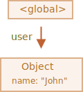
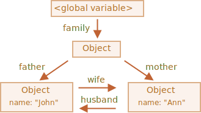
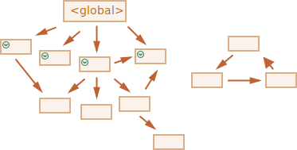

# Garbage collection

Memory management in JavaScript is performed automatically and invisibly to us. We create primitives, objects, functions... All that takes memory.

What happens when something is not needed any more? How does the JavaScript engine discover it and clean it up?

## Reachability

The main concept of memory management in JavaScript is *reachability*.

Simply put, "reachable" values are those that are accessible or usable somehow. They are guaranteed to be stored in memory.

1. There's a base set of inherently reachable values, that cannot be deleted for obvious reasons.

    For instance:

    - Local variables and parameters of the current function.
    - Variables and parameters for other functions on the current chain of nested calls.
    - Global variables.
    - (there are some other, internal ones as well)

    These values are called *roots*.

2. Any other value is considered reachable if it's reachable from a root by a reference or by a chain of references.

    For instance, if there's an object in a global variable, and that object has a property referencing another object, that object is considered reachable. And those that it references are also reachable. Detailed examples to follow.

There's a background process in the JavaScript engine that is called [garbage collector](https://en.wikipedia.org/wiki/Garbage_collection_(computer_science)). It monitors all objects and removes those that have become unreachable.

## A simple example

Here's the simplest example:

```js
// user has a reference to the object
let user = {
  name: "John"
};
```



Here the arrow depicts an object reference. The global variable `"user"` references the object `{name: "John"}` (we'll call it John for brevity). The `"name"` property of John stores a primitive, so it's painted inside the object.

If the value of `user` is overwritten, the reference is lost:

```js
user = null;
```


Now John becomes unreachable. There's no way to access it, no references to it. Garbage collector will junk the data and free the memory.

## Two references

Now let's imagine we copied the reference from `user` to `admin`:

```js
// user has a reference to the object
let user = {
  name: "John"
};

*!*
let admin = user;
*/!*
```


Now if we do the same:
```js
user = null;
```

...Then the object is still reachable via `admin` global variable, so it's in memory. If we overwrite `admin` too, then it can be removed.

## Interlinked objects

Now a more complex example. The family:

```js
function marry(man, woman) {
  woman.husband = man;
  man.wife = woman;

  return {
    father: man,
    mother: woman
  }
}

let family = marry({
  name: "John"
}, {
  name: "Ann"
});
```

Function `marry` "marries" two objects by giving them references to each other and returns a new object that contains them both.

The resulting memory structure:



As of now, all objects are reachable.

Now let's remove two references:

```js
delete family.father;
delete family.mother.husband;
```


It's not enough to delete only one of these two references, because all objects would still be reachable.

But if we delete both, then we can see that John has no incoming reference any more:


Outgoing references do not matter. Only incoming ones can make an object reachable. So, John is now unreachable and will be removed from the memory with all its data that also became unaccessible.

After garbage collection:


## Unreachable island

It is possible that the whole island of interlinked objects becomes unreachable and is removed from the memory.

The source object is the same as above. Then:

```js
family = null;
```

The in-memory picture becomes:


This example demonstrates how important the concept of reachability is.

It's obvious that John and Ann are still linked, both have incoming references. But that's not enough.

The former `"family"` object has been unlinked from the root, there's no reference to it any more, so the whole island becomes unreachable and will be removed.

## Internal algorithms

The basic garbage collection algorithm is called "mark-and-sweep".

The following "garbage collection" steps are regularly performed:

- The garbage collector takes roots and "marks" (remembers) them.
- Then it visits and "marks" all references from them.
- Then it visits marked objects and marks *their* references. All visited objects are remembered, so as not to visit the same object twice in the future.
- ...And so on until every reachable (from the roots) references are visited.
- All objects except marked ones are removed.

For instance, let our object structure look like this:


We can clearly see an "unreachable island" to the right side. Now let's see how "mark-and-sweep" garbage collector deals with it.

The first step marks the roots:



Then their references are marked:


...And their references, while possible:


Now the objects that could not be visited in the process are considered unreachable and will be removed:


We can also imagine the process as spilling a huge bucket of paint from the roots, that flows through all references and marks all reachable objects. The unmarked ones are then removed.

That's the concept of how garbage collection works. JavaScript engines apply many optimizations to make it run faster and not affect the execution.

Some of the optimizations:

- **Generational collection** -- objects are split into two sets: "new ones" and "old ones". Many  objects appear, do their job and die fast, they can be cleaned up aggressively. Those that survive for long enough, become "old" and are examined less often.
- **Incremental collection** -- if there are many objects, and we try to walk and mark the whole object set at once, it may take some time and introduce visible delays in the execution. So the engine tries to split the garbage collection into pieces. Then the pieces are executed one by one, separately. That requires some extra bookkeeping between them to track changes, but we have many tiny delays instead of a big one.
- **Idle-time collection** -- the garbage collector tries to run only while the CPU is idle, to reduce the possible effect on the execution.

There exist other optimizations and flavours of garbage collection algorithms. As much as I'd like to describe them here, I have to hold off, because different engines implement different tweaks and techniques. And, what's even more important, things change as engines develop, so studying deeper "in advance", without a real need is probably not worth that. Unless, of course, it is a matter of pure interest, then there will be some links for you below.

## Summary

The main things to know:

- Garbage collection is performed automatically. We cannot force or prevent it.
- Objects are retained in memory while they are reachable.
- Being referenced is not the same as being reachable (from a root): a pack of interlinked objects can become unreachable as a whole.

Modern engines implement advanced algorithms of garbage collection.

A general book "The Garbage Collection Handbook: The Art of Automatic Memory Management" (R. Jones et al) covers some of them.

If you are familiar with low-level programming, the more detailed information about V8 garbage collector is in the article [A tour of V8: Garbage Collection](http://jayconrod.com/posts/55/a-tour-of-v8-garbage-collection).

[V8 blog](https://v8.dev/) also publishes articles about changes in memory management from time to time. Naturally, to learn the garbage collection, you'd better prepare by learning about V8 internals in general and read the blog of [Vyacheslav Egorov](http://mrale.ph) who worked as one of V8 engineers. I'm saying: "V8", because it is best covered with articles in the internet. For other engines, many approaches are similar, but garbage collection differs in many aspects.

In-depth knowledge of engines is good when you need low-level optimizations. It would be wise to plan that as the next step after you're familiar with the language.  
