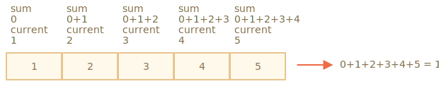

# Massiv metodlari

Massivlarda juda ko'p metodlar mavjud. O'rganishni osonlashtirish uchun ushbu bobda ular guruhlarga bo'lingan.

## Elementlarni qo'shish/o'chirish

Biz allaqachon massivning boshi yoki oxiridan elementlarni qo'shish yoki olib tashlashni bilamiz:

- `arr.push(...elementlar)` -- oxiriga elementlarni qo'shadi
- `arr.pop()` -- oxiridan element olib tashlaydi,
- `arr.shift()` -- boshidan element olib tashlaydi,
- `arr.unshift(...items)` -- boshiga elementlar qo'shadi.

Quyida yana bir nechtasi keltitilgan.

### splice

Massivdan elementni qanday o'chirib tashlasa bo'ladi?

Massivlar obyekt hisoblanadi, shuning uchun `delete` ishlatib ko'rsak bo'ladi:

```js run
let arr = ["Men", "uyga", "boraman"];

delete arr[1]; // "uyga"ni o'chiradi

alert(arr[1]); // undefined

// endi arr = ["Men",  , "boraman"];
alert(arr.length); // 3
```

Element olib tashlandi, biroq massivda hanuz 3ta element mavjud, buni `arr.length == 3` dan ko'rsak bo'ladi.

Bu tabiiy hol, chunki `delete obj.key` `key` orqali qiymatni olib tashlaydi. Hammasi shu va bu obyektlar uchun yaxshi. Ammo massivlar uchun biz odatda qolgan elementlarning siljishi va bo'sh joyni egallashini xohlaymiz. Endi biz massiv qisqaroq bo'lishini istaymiz.

Demak, maxsus metodlar ishlatilinishi zarur.

[arr.splice](mdn:js/Array/splice) metodi massivlar uchun Shveytsariya armiyasi pichog'idir. U har qanday vazifa bajara oladi: elementlarni kiritish, olib tashlash va almashtirish.

Uning sintaksisi quyidagicha:

```js
arr.splice(start[, deleteCount, elem1, ..., elemN])
```

U `start` indeksidan boshlab `arr` ni o'zgartiradi: `deleteCount` elementlarini olib tashlaydi va keyin o'z o'rniga `elem1, ..., elementN` qo'yadi. O'chirilgan elementlarni massivda qaytaradi.

Bu usulni misollar orqali tushunish oson.

O'chirishdan boshlaymiz:

```js run
let arr = ["Men", "JavaScript", "o'rganaman"];

*!*
arr.splice(1, 1); // 1-indeksdan 1 ta elementni olib tashlash
*/!*

alert( arr ); // ["Men", "o'rganaman"]
```

Oson, shundaymi? `1` indeksidan boshlab `1` elementi olib tashlandi.

Keyingi misolda biz 3 ta elementni olib tashlaymiz va ularni qolgan ikkitasi bilan almashtiramiz:

```js run
let arr = [*!*"Men", "JavaScript", "o'rganaman",*/!* "aynan", "hozir"];

// 3 ta birinchi elementni olib tashlash va ularni boshqasi bilan almashtirish
arr.splice(0, 3, "Keling", "o'ynaymiz");

alert( arr ) // endi [*!*"Keling", "o'ynaymiz"*/!*, "aynan", "hozir"]
```

Bu yerda `splice` olib tashlangan elementlarni massivda qaytarishini ko'rishimiz mumkin:

```js run
let arr = [*!*"Men", "JavaScript",*/!* "o'rganaman", "aynan", "hozir"];

// birinchi ikki elementni olib tashlash
let removed = arr.splice(0, 2);

alert( removed ); // "Men", "JavaScript" <-- olib tashlangan elementlarning massivi
```

`Splice` usuli, shuningdek, elementlarni hech qanday olib tashlamasdan kiritishga qodir. Buning uchun biz `deleteCount` ni `0` ga qo'yishimiz kerak:

```js run
let arr = ["Men", "JavaScript", "O'rganaman"];

// indeks 2dan
// 0 olib tashlash
// so'ng "mukammal" va "tilini" qo'shish
arr.splice(2, 0, "mukammal", "tilini");

alert(arr); // "Men", "JavaScript", "mukammal", "tilini", "o'rganaman"
```

`
`smart header="Manfiy indekslarga ruxsat berilgan"

Here and in other array methods, negative indexes are allowed. They specify the position from the end of the array, like here:

```js run
let arr = [1, 2, 5];

// -1 indeksdan (oxiridan bir qadam)
// 0ta element o'chirish,
// so'ng 3 va 4 qo'yish

arr.splice(-1, 0, 3, 4);

alert(arr); // 1,2,3,4,5
```

`

### slice

[arr.slice] metodi (mdn:js/Array/slice) oʻxshash koʻrinishdagi `arr.splice`ga qaraganda ancha sodda.

Uning sintaksisi quyidagicha:

```js
arr.slice([start], [end]);
```

It returns a new array copying to it all items from index `start` to `end` (not including `end`). Both `start` and `end` can be negative, in that case position from array end is assumed.

Bu `str.slice` metodiga o'xshash, biroq substring o'rniga submassiv yasaydi.

Misol uchun:

```js run
let arr = ["t", "e", "s", "t"];

alert(arr.slice(1, 3)); // e,s (1 dan 3ga ko'chirish)

alert(arr.slice(-2)); // s,t (-2 dan oxirigacha ko'chirish)
```

Uni argumentsiz chaqirsak ham bo'ladi: `arr.slice()` `arr`ning nushasini yaratadi. Bu ko'pincha asl massivga ta'sir qilmasligi kerak bo'lgan keyingi o'zgartirishlar uchun nusxa olish uchun ishlatiladi.

### concat

[arr.concat](mdn:js/Array/concat) metodii boshqa massivlar va qoʻshimcha elementlarning qiymatlarini oʻz ichiga olgan yangi massiv yaratadi..

Uning sintaksisi quyidagicha:

```js
arr.concat(arg1, arg2...)
```

U har qanday miqdordagi argumentlarni - massivlarni yoki qiymatlarni qabul qiladi.

Natijada `arr`, keyin `arg1`, `arg2` va hokazo elementlarini o`z ichiga olgan yangi massiv hosil bo`ladi.

Agar “argN” argumenti massiv boʻlsa, uning barcha elementlari koʻchiriladi. Aks holda, argumentning o'zi ko'chiriladi.

Misol uchun:

```js run
let arr = [1, 2];

// arr va [3,4]dan massiv yaratish
alert(arr.concat([3, 4])); // 1,2,3,4

// massiv yaratish: arr va [3,4] va [5,6]dan
alert(arr.concat([3, 4], [5, 6])); // 1,2,3,4,5,6

// arr va [3,4] dan massiv yaratish, keyin 5 va 6 qiymatlarini qo'shish
alert(arr.concat([3, 4], 5, 6)); // 1,2,3,4,5,6
```

Odatda, u faqat massivlardan elementlarni nusxalaydi. Boshqa ob'ektlar, hatto massivga o'xshasa ham, bir butun sifatida qo'shiladi:

```js run
let arr = [1, 2];

let arrayLike = {
  0: "something",
  length: 1,
};

alert(arr.concat(arrayLike)); // 1,2,[object Object]
```

...Agar massivga o'xshash obyekt maxsus `Symbol.isConcatSpreadable` xususiyatiga ega bo'lsa, u `concat` orqali massiv sifatida ko'rib chiqiladi: uning o'rniga uning elementlari qo'shiladi:

```js run
let arr = [1, 2];

let arrayLike = {
  0: "bir",
  1: "ikki",
*!*
  [Symbol.isConcatSpreadable]: true,
*/!*
  length: 2
};

alert( arr.concat(arrayLike) ); // 1,2,bir,ikki
```

## Iterate: forEach

[arr.forEach](mdn:js/Array/forEach) metodi massivning har bir elementi uchun funksiyani ishga tushirish imkonini beradi.

The syntax:

```js
arr.forEach(function (item, index, array) {
  // ... element bilan biror amal bajarish
});
```

Masalan, bu massivning har bir elementini ko'rsatadi:

```js run
// har bir element uchun alert chaqirish
["Bilbo", "Gandalf", "Nazgul"].forEach(alert);
```

Quyidagi kod mooljaldagi massivda pozitsiyalari haqida batafsilroq ma'lumot beradi:

```js run
["Bilbo", "Gandalf", "Nazgul"].forEach((item, index, array) => {
  alert(`${item} ${array} massivning  ${index} indeksdagi elementi`);
});
```

Funksiyaning natijasi (agar u qaytarsa) tashlanadi va e'tiborga olinmaydi.

## Massivda izlash

Endi massivda qidiradigan usullarni ko'rib chiqamiz.

### indexOf/lastIndexOf va includes

[arr.indexOf](mdn:js/Array/indexOf) va [arr.includes](mdn:js/Array/includes) metodlari oʻxshash sintaksisga ega va ular tegishli string metodlari bilan deyarli bir xil ishlaydi, lekin buning oʻrniga elementlarda ishlaydi:

- `arr.indexOf(item, from)` -- `from` indeksidan boshlab `item` ni qidiradi va u topilgan indeksni qaytaradi, aks holda `-1`.
- `arr.includes(item, from)` -- `from` indeksidan boshlab `item`ni qidiradi, topilsa `true`ni qaytaradi.

Odatda bu metodlar faqat bitta argument bilan qo'llaniladi: qidiruv uchun `item`. Odatiy bo'lib, qidiruv boshidan boshlanadi.

Misol uchun:

```js run
let arr = [1, 0, false];

alert(arr.indexOf(0)); // 1
alert(arr.indexOf(false)); // 2
alert(arr.indexOf(null)); // -1

alert(arr.includes(1)); // true
```

Taqqoslash uchun `indexOf` qat'iy `===` tengligidan foydalanishini unutmang. Demak, `false` ni qidirsak, u nolni emas, aynan `false`ni topadi.

Agar biz massivda `item` mavjudligini tekshirmoqchi bo'lsak va aniq indeks kerak bo'lmasa, u holda "arr.includes" afzalroqdir.

[arr.lastIndexOf](mdn:js/Array/lastIndexOf) metodii `indexOf` bilan bir xil, lekin oʻngdan chapga qarab qidiradi.

```js run
let fruits = ["Olma", "Apelsin", "Olma"];

alert(fruits.indexOf("Apple")); // 0 (birinchi Olma)
alert(fruits.lastIndexOf("Apple")); // 2 (oxirgi Olma)
```

````smart header= " `includes`metodi`NaN`ni to'g'ri boshqaradi"`Includes`ning kichik, ammo diqqatga sazovor xususiyati shundaki, u`indexOf`dan farqli ravishda`NaN` ni to'g'ri boshqaradi:

```js run
const arr = [NaN];
alert(arr.indexOf(NaN)); // -1 (noto'g'ri, 0 bo'lishi kerak)
alert(arr.includes(NaN)); // true (to'gri)
```

Buning sababi, `includes` JavaScriptga ancha keyinroq qo'shilgan va ichki jihatdan eng so'nggi taqqoslash algoritmidan foydalanadi.

`

### find va findIndex/findLastIndex

Tasavvur qiling, bizda obyektlar massivi bor. Muayyan shartga ega obyektni qanday topamiz?

Bu yerda [arr.find(fn)](mdn:js/Array/find) usuli qo'l keladi.

Uning sintaksisi quyidagicha:

```js
let result = arr.find(function (item, index, array) {
  // agar true qaytarilsa, element qaytariladi va iteratsiya to'xtatiladi
  // falsy stsenariy uchun aniqlanmagan qaytariladi
});
```

Funktsiya massiv elementlari uchun birin-ketin chaqiriladi:

- `item` bu element.
- `index` bu uning indeksi.
- `array` bu massivning o'zi.

Agar u `true`ni qaytarsa, qidiruv to'xtatiladi, `element` qaytariladi. Hech narsa topilmasa, `undefined` qaytariladi.

Masalan, bizda har birida `id` va `name` maydonlari bo‘lgan bir qator foydalanuvchilar bor. Keling, `id == 1` bo'lganini topamiz:

```js run
let users = [
  { id: 1, name: "John" },
  { id: 2, name: "Pete" },
  { id: 3, name: "Mary" },
];

let user = users.find((item) => item.id == 1);

alert(user.name); // John
```

Aslida obyektlar massivlari keng tarqalgan, shuning uchun "find" metodi juda foydali.

E'tibor bering, misolda biz `find` uchun `item => item.id == 1` funksiyasini bitta argument bilan taqdim etamiz. Bu odatiy, bu funksiyaning boshqa argumentlari kamdan-kam qo'llaniladi.

[arr.findIndex](mdn:js/Array/findIndex) metodi bir xil sintaksisga ega, lekin elementning o'rniga element topilgan indeksni qaytaradi. Hech narsa topilmasa, `-1` qiymati qaytariladi.

[arr.findLastIndex](mdn:js/Array/findLastIndex) metodi “findIndex”ga oʻxshaydi, lekin “lastIndexOf”ga oʻxshash oʻngdan chapga qidiradi.

Misol uchun::

```js run
let users = [
  { id: 1, name: "John" },
  { id: 2, name: "Pete" },
  { id: 3, name: "Mary" },
  { id: 4, name: "John" },
];

// Birinchi Johnning indeksini topish
alert(users.findIndex((user) => user.name == "John")); // 0

// Oxirgi Johnning indeksini topish
alert(users.findLastIndex((user) => user.name == "John")); // 3
```

### filter

`find` metodi funksiyani `true`ga qaytaradigan yagona (birinchi) elementni qidiradi.

Agar ko'p bo'lsa, biz [arr.filter(fn)] (mdn:js/Array/filter) dan foydalanishimiz mumkin.

Sintaksis `find` ga o'xshaydi, lekin `filter` barcha mos elementlar qatorini qaytaradi:

```js
let results = arr.filter(function (item, index, array) {
  // haqiqiy element natijalarga surilsa va iteratsiya davom etsa
  // hech narsa topilmasa, bo'sh massivni qaytaradi
});
```

Misol uchun:

```js run
let users = [
  { id: 1, name: "John" },
  { id: 2, name: "Pete" },
  { id: 3, name: "Mary" },
];

// birinchi ikki foydalanuvchining massivini qaytaradi
let someUsers = users.filter((item) => item.id < 3);

alert(someUsers.length); // 2
```

## Massivni aylantirish

Endi massivni o'zgartiradigan va qayta tartiblaydigan usullarga o'tamiz.

### map

[arr.map](mdn:js/Array/map) metodi eng foydali va tez-tez ishlatiladigan metodlardan biridir.

U massivning har bir elementi uchun funksiyani chaqiradi va natijalar massivini qaytaradi.

Uning sintaksisi quyidagicha:

```js
let result = arr.map(function (item, index, array) {
  // element o'rniga yangi qiymatni qaytaradi
});
```

Masalan, bu erda biz har bir elementni uzunligiga aylantiramiz:

```js run
let lengths = ["Bilbo", "Gandalf", "Nazgul"].map((item) => item.length);
alert(lengths); // 5,7,6
```

### sort(fn)

[arr.sort()](mdn:js/Array/sort) ga chaqiruv _inplace_ massivni tartiblaydi, uning element tartibini o'zgartiradi.

Shuningdek, u tartiblangan massivni qaytaradi, lekin qaytarilgan qiymat odatda e'tiborga olinmaydi, chunki `arr` ning o'zi o'zgartiriladi.

Misol uchun:

```js run
let arr = [1, 2, 15];

// metod arr kontentini qayta tartiblaydi
arr.sort();

alert(arr); // *!*1, 15, 2*/!*
```

Natijada g'alati narsani sezdingizmi?

Tartib `1, 15, 2` ga aylandi. Noto'g'ri. Lekin nega?

**Elementlar odatda qatorlar sifatida saralanadi.**

Aslida, barcha elementlar taqqoslash uchun stringlarga aylantiriladi. Satrlar uchun leksikografik tartib qo'llaniladi va haqiqatda `"2" > "15"`.

O'zimizning tartiblash tartibidan foydalanish uchun biz `arr.sort()`ning argumenti sifatida funktsiyani taqdim etishimiz kerak.

Funktsiya ikkita ixtiyoriy qiymatni solishtirishi va qaytarishi kerak:

```js
function compare(a, b) {
  if (a > b) return 1; // agar birinchi qiymat ikkinchisidan katta bo'lsa
  if (a == b) return 0; // qiymatlar teng bo'lsa
  if (a < b) return -1; // agar birinchi qiymat ikkinchisidan kichik bo'lsa
}
```

Masalan, raqamlar sifatida tartiblash uchun:

```js run
function compareNumeric(a, b) {
  if (a > b) return 1;
  if (a == b) return 0;
  if (a < b) return -1;
}

let arr = [ 1, 2, 15 ];

*!*
arr.sort(compareNumeric);
*/!*

alert(arr);  // *!*1, 2, 15*/!*
```

Endi u maqsadga muvofiq ishlaydi.

Keling, bir chetga chiqib, nima bo'layotganini o'ylab ko'raylik. `Arr` har qanday narsaning massivi bo'lishi mumkin, to'g'rimi? Unda raqamlar, satrlar, ob'ektlar yoki boshqa narsalar bo'lishi mumkin. Bizda _ba'zi narsalar_ to'plami mavjud. Uni saralash uchun bizga uning elementlarini solishtirishni biladigan _tartib berish funksiyasi_ kerak. Odatiy bo'lib string tartibi hisoblanadi.

`arr.sort(fn)` usuli umumiy tartiblash algoritmini amalga oshiradi. Biz uning ichida qanday ishlashiga ahamiyat bermasligimiz kerak (optimallashtirilgan [Quicksort](https://en.wikipedia.org/wiki/Quicksort) yoki [Timsort](https://en.wikipedia.org/wiki/Timsort) ko'pincha). U massiv bo'ylab yuradi, taqdim etilgan funksiyadan foydalanib uning elementlarini solishtiradi va ularni qayta tartiblaydi, bizga kerak bo'lgan narsa taqqoslashni amalga oshiradigan `fn` ni taqdim etishdir.

Aytgancha, agar biz qaysi elementlar taqqoslanayotganini bilmoqchi bo'lsak, ularni alertga chaqirishga hech narsa to'sqinlik qilmaydi:

```js run
[1, -2, 15, 2, 0, 8].sort(function (a, b) {
  alert(a + " <> " + b);
  return a - b;
});
```

Algoritm jarayonda elementni bir nechta boshqalar bilan solishtirishi mumkin, lekin u imkon qadar kamroq taqqoslashga harakat qiladi.

````smart header="Taqqoslash funksiyasi istalgan raqamni qaytarishi mumkin"`

Aslida, taqqoslash funktsiyasi faqat `katta` deb aytish uchun ijobiy raqamni va `kamroq` deyish uchun salbiy raqamni qaytarish uchun talab qilinadi.

Bu qisqaroq funktsiyalarni yozish imkonini beradi:

```js run
let arr = [1, 2, 15];

arr.sort(function (a, b) {
  return a - b;
});

alert(arr); // *!*1, 2, 15*/!*
```

`````

````smart header="Arrow funksiyalari eng yaxshisi"
[arrow funksiyalari](maʼlumot:arrow-functions-basics) esingizdami? Biz ulardan tozaroq saralash uchun foydalanishimiz mumkin:

```js
arr.sort( (a, b) => a - b );
```

Bu yuqoridagi uzunroq versiya bilan bir xil ishlaydi.
`````

````smart header="Stringlar uchun `localeCompare` ishlatiladi"
[strings](info:string#correct-comparisons) taqqoslash algoritmini eslaysizmi? U odatda harflarni kodlari bo'yicha taqqoslaydi.

Koʻpgina alifbolar uchun “Ö” kabi harflarni toʻgʻri saralash uchun “str.localeCompare” metodidan foydalangan maʼqul.

Masalan, nemis tilida bir nechta mamlakatlarni saralaymiz:

```js run
let countries = ["Österreich", "Andorra", "Vietnam"];

alert(countries.sort((a, b) => (a > b ? 1 : -1))); // Andorra, Vietnam, Österreich (noto'g'ri)

alert(countries.sort((a, b) => a.localeCompare(b))); // Andorra,Österreich,Vietnam (to'g'!)
```

### reverse

[arr.reverse](mdn:js/Array/reverse) metodi `arr` dagi elementlar tartibini teskari qiladi.

Misol uchun:

```js run
let arr = [1, 2, 3, 4, 5];
arr.reverse();

alert(arr); // 5,4,3,2,1
```

Shuningdek, teskari o'zgarishlardan keyin `arr` massivini qaytaradi.

### split va join

Mana haqiqiy hayotdan vaziyat. Biz xabar almashish ilovasini yozmoqdamiz va odam vergul bilan ajratilgan qabul qiluvchilar ro'yxatiga kiradi: `John, Pett, Mary`. Ammo biz uchun ismlar massivi bir stringga qaraganda ancha qulayroq bo'ladi. Uni qanday olish mumkin?

[str.split(delim)](mdn:js/String/split) metodii aynan shunday qiladi. U berilgan ajratuvchi `delim` orqali qatorni massivga ajratadi.

Quyidagi misolda biz verguldan keyin bo'sh joy bilan ajratamiz:

```js run
let names = "Bilbo, Gandalf, Nazgul";

let arr = names.split(", ");

for (let name of arr) {
  alert(`${name}ga xabar.`); // Bilbo(va boshqa ismlar)ga xabar
}
```

`Split` usuli ixtiyoriy ikkinchi raqamli argumentga ega – massiv uzunligi chegarasi. Agar u taqdim etilsa, qo'shimcha elementlar e'tiborga olinmaydi. Amalda u kamdan-kam qo'llaniladi:

```js run
let arr = "Bilbo, Gandalf, Nazgul, Saruman".split(", ", 2);

alert(arr); // Bilbo, Gandalf
```

``smart header=`Harflarga split ishlatish`

Boʻsh `s` bilan `split(s)`ni chaqirish stringni harflar qatoriga boʻladi:

```js run
let str = "test";

alert(str.split("")); // t,e,s,t
```

``

[arr.join(glue)](mdn:js/Array/join) chaqiruvi `split` ga teskari amal qiladi. U `arr` elementlari qatorini ular orasiga `yelim` bilan bog'laydi.

Misol uchun:

```js run
let arr = ["Bilbo", "Gandalf", "Nazgul"];

let str = arr.join(";"); // massivni stringga yelimlash;

alert(str); // Bilbo;Gandalf;Nazgul
```

### reduce/reduceRight

Massivni takrorlash kerak bo'lganda, biz `forEach`, `for` yoki `for..of` dan foydalanishimiz mumkin.

Har bir element uchun ma'lumotlarni takrorlash va qaytarish kerak bo'lganda, biz `map` dan foydalanishimiz mumkin.

[arr.reduce](mdn:js/Array/reduce) va [arr.reduceRight](mdn:js/Array/reduceRight) metodlari ham shu zotga tegishli, lekin biroz murakkabroq. Ular massiv asosida bitta qiymatni hisoblash uchun ishlatiladi.

Ularning sintaksisi quyidagicha:

```js
let value = arr.reduce(
  function (accumulator, item, index, array) {
    // ...
  },
  [initial]
);
```

Funksiya massivning barcha elementlariga birin-ketin qo'llaniladi va o'z natijasini keyingi chaqiruvga `davom etadi`.

Argumentlar:

- `accumulator` -- oldingi funksiya chaqiruvining natijasi bo‘lib, birinchi marta `initial`ga teng (agar “boshlang‘ich” ko‘rsatilgan bo‘lsa).
- `item` -- joriy massiv elementidir.
- `index` -- uning pozitsiyasi.
- `array` -- massiv.

Funktsiya qo'llanilganda, oldingi funktsiya chaqiruvining natijasi birinchi argument sifatida keyingisiga o'tkaziladi.

Shunday qilib, birinchi argument aslida barcha oldingi ijrolarning umumiy natijasini saqlaydigan akkumulyatordir. Va oxirida u `reduce`ning natijasi bo'ladi.

Murakkab tuyuladimi?

Buni tushunishning eng oson yo'li - bu misolda ko'rish.

Quyida biz bir qatordagi massivning yig'indisini olamiz:

```js run
let arr = [1, 2, 3, 4, 5];

let result = arr.reduce((sum, current) => sum + current, 0);

alert(result); // 15
```

`reduce` ga uzatilgan funksiya faqat 2 ta argumentdan foydalanadi, bu odatda yetarli.

Keling, nima bo'layotganini batafsil ko'rib chiqaylik.

1. Birinchi ishga tushirishda `sum` `initial` qiymatdir (`reduce` ning oxirgi argumenti), `0` ga, `current` esa massivning birinchi elementi bo'lib, `1` ga teng. Demak, funksiya natijasi `1` bo'ladi.
2. Ikkinchi ishga tushirishda, `sum = 1`, biz unga ikkinchi massiv elementini (`2`) qo'shamiz va qaytamiz.
3. Uchinchi ishga tuhsirishda `sum = 3` va biz unga yana bitta element qo'shamiz va hokazo...

Hisoblash tartibi:



Yoki jadval ko'rinishida, bu yerda har bir string keyingi massiv elementida funksiya chaqiruvini ifodalaydi:

|                     | `sum` | `current` | natija |
| ------------------- | ----- | --------- | ------ |
| birinchi chaqiruv   | `0`   | `1`       | `1`    |
| ikkinchi chaqiruv   | `1`   | `2`       | `3`    |
| uchinchi chaqiruv   | `3`   | `3`       | `6`    |
| to'rtinchi chaqiruv | `6`   | `4`       | `10`   |
| beshinchi chaqiruv  | `10`  | `5`       | `15`   |

Bu yerda biz oldingi chaqiruvning natijasi keyingisining birinchi argumentiga aylanishini aniq ko'rishimiz mumkin.

Biz boshlang'ich qiymatni ham o'tkazib yuborishimiz mumkin:

```js run
let arr = [1, 2, 3, 4, 5];

// reducedan boshlang'ich qiymat olib tashlandi (0 yo'q)
let result = arr.reduce((sum, current) => sum + current);

alert(result); // 15
```

Natija bir xil. Buning sababi, agar boshlang'ich bo'lmasa, `reduce` massivning birinchi elementini boshlang'ich qiymat sifatida qabul qiladi va iteratsiyani 2-elementdan boshlaydi.

Hisoblash jadvali yuqoridagi bilan bir xil, birinchi qator ayrilgan holda.

Ammo bunday foydalanish juda ehtiyotkorlik talab qiladi. Agar massiv bo'sh bo'lsa, boshlang'ich qiymatisiz `reduce` chaqiruvi xatolik beradi.

Misol uchun:

```js run
let arr = [];

// Error: Boshlang'ich qiymatsiz bo'sh massivni qisqartirish
// agar dastlabki qiymat mavjud bo'lsa, reduce uni bo'sh arr uchun qaytaradi.
arr.reduce((sum, current) => sum + current);
```

Shuning uchun har doim boshlang'ich qiymatni ko'rsatish tavsiya etiladi.

[arr.reduceRight](mdn:js/Array/reduceRight) metodi ham xuddi shunday qiladi, lekin o'ngdan chapga ketadi.

## Array.isArray

Massivlar alohida til tipini hosil qilmaydi. Ular obyektlarga asoslangan.

Shunday qilib, `typeof` oddiy obyektni massivdan ajratishga yordam bermaydi:

```js run
alert(typeof {}); // obyekt
alert(typeof []); // obyekt (bir xil)
```

...Ammo massivlar shunchalik tez-tez ishlatiladiki, buning uchun maxsus usul mavjud: [Array.isArray(value)](mdn:js/Array/isArray). Agar `qiymat` massiv bo‘lsa `true`, aks holda `false` qiymatini qaytaradi.

```js run
alert(Array.isArray({})); // false

alert(Array.isArray([])); // true
```

## Most methods support "thisArg"

Funksiyalarni chaqiruvchi deyarli barcha massiv usullari -- `find`, `filter`, `map` kabi, `sort` dan tashqari, ixtiyoriy qo'shimcha `thisArg` parametrini qabul qiladi.

Ushbu parametr yuqoridagi bo'limlarda tushuntirilmagan, chunki u kamdan-kam qo'llaniladi. Ammo to'liqlik uchun biz uni qoplashimiz kerak.

Quyida bu usullarning toʻliq sintaksisi:

```js
arr.find(func, thisArg);
arr.filter(func, thisArg);
arr.map(func, thisArg);
// ...
// thisArg ixtiyoriy oxirgi argumentdir
```

`ThisArg` parametrining qiymati `func` uchun `this` ga aylanadi.

Misol uchun, bu yerda biz filter sifatida `army` obyektining metodidan foydalanamiz va `thisArg` kontekstni o'tkazadi:

```js run
let army = {
  minAge: 18,
  maxAge: 27,
  canJoin(user) {
    return user.age >= this.minAge && user.age < this.maxAge;
  }
};

let users = [
  {age: 16},
  {age: 20},
  {age: 23},
  {age: 30}
];

*!*
// army.canJoin rost qaytaradigan foydalanuvchilarni topish
let soldiers = users.filter(army.canJoin, army);
*/!*

alert(soldiers.length); // 2
alert(soldiers[0].age); // 20
alert(soldiers[1].age); // 23
```

Agar yuqoridagi misolda biz `users.filter(army.canJoin)` dan foydalanilgan bo‘lsak, `army.canJoin` mustaqil funksiya sifatida chaqirilib, `this=undefined` bilan bir lahzada xatolikka olib keladi.

`users.filter(army.canJoin, army)` ga qo'ng'iroqni `users.filter(user => army.canJoin(user))` bilan almashtirish mumkin, bu xuddi shunday qiladi. Ikkinchisi tez-tez ishlatiladi, chunki ko'pchilik uchun tushunish biroz osonroq.

## Summary

Massiv metodlari:

- Elementlarni qo'shish/o'chirish:

  - `push(...items)` -- elementlarni oxiriga qo'shadi,
  - `pop()` -- elementni oxiridan olib tashlaydi,
  - `shift()` -- elementni boshidan olib tashlaydi,
  - `unshift(...items)` -- boshiga elementlar qo'shadi.
  - `splice(pos, deleteCount, ...items)` -- `pos` indeksida `deleteCount` elementlari o'chiriladi va `elementlar` qo'shiladi.
  - `slice(start, end)` -- yangi massiv yaratadi, unga `start` indeksidan `end`gacha (hisobga olinmaydi)) elementlarni ko'chiradi.
  - `concat(...items)` -- yangi massivni qaytaradi: joriy massivning barcha a'zolaridan nusxa oladi va unga `elementlar` qo'shadi. Agar `elementlar`dan birortasi massiv bo'lsa, unda uning elementlari olinadi.

- Elementlar orasida qidirish uchun:

  - `indexOf/lastIndexOf(item, pos)` -- `pos` pozitsiyasidan boshlab `element` ni qidiradi, indeksni qaytaradi yoki topilmasa `-1`.
  - `includes(value)` -- agar massivda `value` bo'lsa `true`, aks holda `false` ni qaytaradi.
  - `find/filter(func)` -- funksiya orqali elementlarni filtrlaydi, uni `true` deb qaytaradigan birinchi/barcha qiymatlarni qaytaring.
  - `findIndex` `find` ga o'xshaydi, lekin qiymat o'rniga indeksni qaytaradi.

- Elementlarni takrorlash uchun:

  - `forEach(func)` -- Har bir element uchun `func`ni chaqiradi, hech narsa qaytarmaydi.

- Massivni o'zgartirish uchun:

  - `map(func)` -- har bir element uchun `func` chaqiruvi natijalaridan yangi massiv yaratadi.
  - `sort(func)` -- massivni joyida tartiblaydi, keyin uni qaytaradi.
  - `reverse()` -- massivni joyiga qaytaradi, keyin uni qaytaradi.
  - `split/join` -- stringni massivga va orqaga aylantirish.
  - `reduce/reduceRight(func, initial)` -- har bir element uchun `func` ni chaqirish va qo'ng'iroqlar o'rtasida oraliq natijani o'tkazish orqali massivda bitta qiymatni hisoblang.

- Qo'shimcha:
  - `Array.isArray(value)` `value` massiv ekanligini tekshiradi, agar shunday bo'lsa `true`, aks holda `false` ni qaytaradi.

Esda tutingki, `sort`, `reverse` va `splice` usullari massivning o‘zini o‘zgartiradi.

Ushbu metodlar eng ko'p qo'llaniladi, ular foydalanish holatlarining 99% ni qamrab oladi. Ammo yana bir nechtasi bor:

- [arr.some(fn)](mdn:js/Array/some)/[arr.every(fn)](mdn:js/Array/every) massivni tekshiring.

  `Fn` funksiyasi “xarita” ga o‘xshash massivning har bir elementida chaqiriladi. Agar biron-bir/barcha natijalar `true` bo'lsa, `true`, aks holda `false` ni qaytaradi.

Bu metodlar `||` va `&&` operatorlari kabi ishlaydi: agar `fn` rost qiymatni qaytarsa, `arr.some()` darhol `true`ni qaytaradi va qolgan elementlarni takrorlashni to'xtatadi; agar `fn` noto'g'ri qiymat qaytarsa, `arr.every()` darhol `false`ni qaytaradi va qolgan elementlarda ham takrorlashni to`xtatadi.

Massivlarni solishtirish uchun `every` dan foydalanishimiz mumkin:

```js run
function arraysEqual(arr1, arr2) {
  return (
    arr1.length === arr2.length &&
    arr1.every((value, index) => value === arr2[index])
  );
}

alert(arraysEqual([1, 2], [1, 2])); // true
```

- [arr.fill(value, start, end)](mdn:js/Array/fill) -- massivni `start` indeksidan `end`gacha takrorlanuvchi `value` bilan to'ldiradi.

- [arr.copyWithin(target, start, end)](mdn:js/Array/copyWithin) -- o'z elementlarini `start` pozitsiyasidan `end` pozitsiyasigacha bo'lgan _o'ziga_, `target` pozitsiyasiga ko'chiradi (mavjudni ustiga yozadi).

- [arr.flat(depth)](mdn:js/Array/flat)/[arr.flatMap(fn)](mdn:js/Array/flatMap) ko'p o'lchovli massivdan yangi tekis massiv yaratish.

To'liq ro'yxat uchun [qo'llanma] (mdn:js/Array) ga qarang.

Bir qarashda, juda ko'p usullar mavjud bo'lib tuyulishi mumkin, ularni eslab qolish juda qiyin. Lekin aslida bu ancha oson.

Ulardan xabardor bo'lish uchun qo'llanmani ko'rib chiqing. Keyin massiv metodlari bilan tajribaga ega bo'lishingiz uchun mashq qilish uchun ushbu bobning vazifalarini hal qiling.

Keyinchalik massiv bilan biror narsa qilish kerak bo'lganda va qanday qilishni bilmasangiz -- bu yerga keling, qo'llanmaga qarang va to'g'ri metodni toping. Misollar uni to'g'ri yozishga yordam beradi. Tez orada siz o'zingizning aniq harakatlaringizsiz usullarni avtomatik ravishda eslab qolasiz.

```

```
