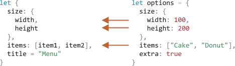

# Destruktiv topshiriq

JavaScript-da eng ko'p qo'llaniladigan ikkita ma'lumotlar tuzilmasi Ob'ekt va Massivdir.

- Ob'ektlar bizga kalit bo'yicha ma'lumotlar elementlarini saqlaydigan yagona ob'ektni yaratishga imkon beradi.
- Massivlar bizga ma'lumotlar elementlarini tartiblangan ro'yxatga yig'ish imkonini beradi.

Garchi biz ularni funktsiyaga o'tkazsak, u umuman ob'ekt/massiv bo'lishi shart emas. Buning uchun alohida qismlar kerak bo'lishi mumkin.

_Destruktiv topshiriq_ - bu massivlar yoki ob'ektlarni o'zgaruvchilar to'plamiga "ochish" imkonini beruvchi maxsus sintaksis, chunki ba'zida bu qulayroq.

Yo'q qilish, shuningdek, juda ko'p parametrlarga, standart qiymatlarga va boshqalarga ega bo'lgan murakkab funktsiyalar bilan ajoyib ishlaydi. Tez orada buni ko'ramiz.

## Massivni destruksiya qilish

Massivning o‘zgaruvchilarga qanday tuzilishiga misol:

```js
// bizda ism va familiyaga ega massiv bor
let arr = ["John", "Smith"]

*!*
// destruktiv topshiriq
// sets firstName = arr[0]
// and surname = arr[1]
let [firstName, surname] = arr;
*/!*

alert(firstName); // John
alert(surname);  // Smith
```

Endi biz massiv a'zolari o'rniga o'zgaruvchilar bilan ishlashimiz mumkin.

Bu `split` yoki massivni qaytarishning boshqa metodlari bilan birlashganda ajoyib koʻrinadi:

```js run
let [firstName, surname] = "John Smith".split(" ");
alert(firstName); // John
alert(surname); // Smith
```

Ko'rib turganingizdek, sintaksis oddiy. Biroq, bir nechta o'ziga xos tafsilotlar mavjud. Buni yaxshiroq tushunish uchun ko'proq misollarni ko'rib chiqaylik.

``smart header="\"Destrukturlash\" \"destruktiv\" degani emas."
U "destrukturizatsiya topshirig'i" deb ataladi, chunki u elementlarni o'zgaruvchilarga nusxalash orqali "destrukturizatsiya qiladi". Ammo massivning o'zi o'zgartirilmagan.

Bu yozishning qisqaroq yo'li:

````js
// let [firstName, surname] = arr;
let firstName = arr[0];
let surname = arr[1];
```
````

``smart header="Vergul yordamida elementlarga e'tibor bermang"
Massivning keraksiz elementlarini qo'shimcha vergul orqali ham tashlash mumkin:

```js run
*!*
// ikkinchi element kerak emas
let [firstName, , title] = ["Julius", "Caesar", "Consul", "of the Roman Republic"];
*/!*

alert( title ); // Consul
```

In the code above, the second element of the array is skipped, the third one is assigned to `title`, and the rest of the array items is also skipped (as there are no variables for them).

````

``smart header="Works with any iterable on the right-side"

...Aslida, biz uni faqat massivlar bilan emas, balki har qanday iteratsiya bilan ishlatishimiz mumkin:
```js
let [a, b, c] = "abc"; // ["a", "b", "c"]
let [one, two, three] = new Set([1, 2, 3]);
````

Bu ishlaydi, chunki ichki tuzilmani buzish topshirig'i to'g'ri qiymatni takrorlash orqali ishlaydi. Bu `=` ning o'ng tomonidagi qiymatdan `for..of` ni chaqirish va qiymatlarni belgilash uchun bir xil sintaksis shakaridir.

``smart header="Chap tarafdagi har qanday narsani tayinlang"
Chap tomonda har qanday "tayinlash" dan foydalanishimiz mumkin.

Masalan, ob'ekt xususiyati:

```js run
let user = {};
[user.name, user.surname] = "John Smith".split(" ");

alert(user.name); // John
alert(user.surname); // Smith
```

``smart header=".entries() bilan tsikllash"

Oldingi bobda biz [Object.entries(obj)](mdn:js/Object/entries) metodini ko‘rdik.

Ob'ektning kalitlari va qiymatlari ustidan aylanish uchun biz uni tuzilmani buzish bilan ishlatishimiz mumkin:

```js run
let user = {
  ism: "John",
  yosh: 30
};

// kalitlar va qiymatlar ustidan tsikllash
*!*
for (let [key, value] of Object.entries(user)) {
*/!*
  alert(`${key}:${value}`); // name:John, then age:30
}
```

`Map` uchun oʻxshash kod oddiyroq, chunki u takrorlanadi:

```js run
let user = new Map();
user.set("name", "John");
user.set("age", "30");

*!*
// Map [kalit, qiymat] juftlari sifatida takrorlanadi, tuzilmani buzish uchun juda qulay
for (let [key, value] of user) {
*/!*
  alert(`${key}:${value}`); // ism:John, keyin yosh:30
}
```

``smart header="O'zgaruvchilarni almashtirish hiylasi"
Ikki o'zgaruvchining qiymatlarini tuzilmani buzish topshirig'i yordamida almashtirishning mashhur hiylasi mavjud:

```js run
let guest = "Jane";
let admin = "Pete";

// Keling, qiymatlarni almashtiramiz: make guest=Pete, admin=Jane
*!*
[guest, admin] = [admin, guest];
*/!*

alert(`${guest} ${admin}`); // Pete Jane (muvaffaqiyatli almashtirildi!)
```

Bu yerda biz ikkita o'zgaruvchidan iborat vaqtinchalik massivni yaratamiz va uni almashtirilgan tartibda darhol yo'q qilamiz.

Shu tarzda ikkitadan ortiq o'zgaruvchilarni almashtirishimiz mumkin.
``

### Rest metodi '...'

Odatda, agar massiv chapdagi ro'yxatdan uzunroq bo'lsa, "qo'shimcha" elementlar o'tkazib yuboriladi.

Masalan, bu yerda faqat ikkita element olinadi, qolganlari esa e'tiborga olinmaydi:

```js run
let [name1, name2] = ["Julius", "Caesar", "Consul", "of the Roman Republic"];

alert(name1); // Julius
alert(name2); // Caesar
// Boshqa narsalar hech qayerga tayinlanmagan
```

Agar biz quyidagi narsalarni to'plashni istasak -- uchta nuqta `"..."` yordamida "qolganini" oladigan yana bitta parametr qo'shishimiz mumkin:

```js run
let [name1, name2, *!*...rest*/!*] = ["Julius", "Caesar", *!*"Consul", "of the Roman Republic"*/!*];

*!*
// rest 3-chidan boshlab elementlar to'plamidir
alert(rest[0]); // Consul
alert(rest[1]); // of the Roman Republic
alert(rest.length); // 2
*/!*
```

`rest` qiymati massivning qolgan elementlari massividir.

Biz `rest` oʻrniga istalgan boshqa oʻzgaruvchi nomidan foydalanishimiz mumkin, shunchaki uning oldida uchta nuqta borligiga ishonch hosil qiling va tuzilmani buzish topshirigʻida oxirgi oʻrinda turadi.

```js run
let [name1, name2, *!*...titles*/!*] = ["Julius", "Caesar", "Consul", "of the Roman Republic"];
// now titles = ["Consul", "of the Roman Republic"]
```

### Standart qiymatlar

Agar massiv chap tarafdagi oʻzgaruvchilar roʻyxatidan qisqaroq boʻlsa, xatolik boʻlmaydi. Yo'q qiymatlar aniqlanmagan deb hisoblanadi:

```js run
*!*
let [firstName, surname] = [];
*/!*

alert(firstName); // undefined
alert(surname); // undefined
```

Agar etishmayotgan qiymatni almashtirish uchun "standart" qiymatni xohlasak, biz uni `=` yordamida ta'minlashimiz mumkin:

```js run
*!*
// default values
let [name = "Guest", surname = "Anonymous"] = ["Julius"];
*/!*

alert(name);    // Julius (massivdan)
alert(surname); // Anonymous (standart)
```

Standart qiymatlar murakkabroq ifodalar yoki hatto funksiya chaqiruvlari bo'lishi mumkin. Agar qiymat ko'rsatilmagan bo'lsa, ular baholanadi.

Misol uchun, bu erda biz ikkita standart uchun `prompt` funksiyasidan foydalanamiz:

```js run
// faqat surname so'rovini ishga tushiradi
let [name = prompt("name?"), surname = prompt("surname?")] = ["Julius"];

alert(name); // Julius (from array)
alert(surname); // nima bo'lishidan qat'iy nazar
```

E'tibor bering: `prompt` faqat etishmayotgan qiymat uchun ishlaydi ("surname").

## Ob'ektni destrukturlash

Destrukturlash topshirig'i ob'ektlar bilan ham ishlaydi.

Asosiy sintaksis:

```js
let {var1, var2} = {var1:…, var2:…}
```

O'ng tomonda biz o'zgaruvchilarga bo'linmoqchi bo'lgan mavjud ob'ektga ega bo'lishimiz kerak. Chap tomonda mos keladigan xususiyatlar uchun ob'ektga o'xshash "naqsh" mavjud. Eng oddiy holatda, bu `{...}` ichidagi o'zgaruvchilar nomlari ro'yxati.

Masalan:

```js run
let options = {
  title: "Menu",
  width: 100,
  height: 200
};

*!*
let {title, width, height} = options;
*/!*

alert(title);  // Menu
alert(width);  // 100
alert(height); // 200
```

`options.title`, `options.width` va `options.height` xossalari mos keladigan o`zgaruvchilarga tayinlanadi.

Buyurtma muhim emas. Bu ham ishlaydi:

```js
// letdagi tartibni o'zgartirdi {...}
let { height, width, title } = { title: "Menu", height: 200, width: 100 };
```

Chap tarafdagi naqsh murakkabroq bo'lishi mumkin va xususiyatlar va o'zgaruvchilar o'rtasidagi xaritalashni belgilang.

Agar biz boshqa nomdagi oʻzgaruvchiga xususiyat tayinlashni istasak, masalan, `options.width` ni `w` nomli oʻzgaruvchiga kiriting, u holda oʻzgaruvchi nomini ikki nuqta yordamida oʻrnatishimiz mumkin:

```js run
let options = {
  title: "Menu",
  width: 100,
  height: 200
};

*!*
// { sourceProperty: targetVariable }
let {width: w, height: h, title} = options;
*/!*

// width -> w
// height -> h
// title -> title

alert(title);  // Menu
alert(w);      // 100
alert(h);      // 200
```

Ikki nuqta "nima : qayerga ketadi" ni ko'rsatadi. Yuqoridagi misolda `width` xususiyati `w` ga, `height` xususiyati `h` ga, `title` esa bir xil nomga tayinlangan.

Potensial etishmayotgan xususiyatlar uchun biz `"="` yordamida standart qiymatlarni o'rnatishimiz mumkin, masalan:

```js run
let options = {
  title: "Menu"
};

*!*
let {width = 100, height = 200, title} = options;
*/!*

alert(title);  // Menu
alert(width);  // 100
alert(height); // 200
```

Massivlar yoki funksiya parametrlari kabi standart qiymatlar har qanday ifoda yoki hatto funksiya chaqiruvi bo‘lishi mumkin. Qiymat taqdim etilmasa, ular baholanadi.

Quyidagi kodda `prompt` `width` ni so'raydi, lekin `title` uchun emas:

```js run
let options = {
  title: "Menu"
};

*!*
let {width = prompt("width?"), title = prompt("title?")} = options;
*/!*

alert(title);  // Menu
alert(width);  // (whatever the result of prompt is)
```

We also can combine both the colon and equality:

```js run
let options = {
  title: "Menu"
};

*!*
let {width: w = 100, height: h = 200, title} = options;
*/!*

alert(title);  // Menu
alert(w);      // 100
alert(h);      // 200
```

Agar bizda juda ko'p xususiyatlarga ega bo'lgan murakkab ob'ekt bo'lsa, biz faqat kerakli narsani olishimiz mumkin:

```js run
let options = {
  title: "Menu",
  width: 100,
  height: 200,
};

// only extract title as a variable
let { title } = options;

alert(title); // Menu
```

### Rest ko'rinishi "..."

Agar ob'ekt o'zgaruvchilarga qaraganda ko'proq xususiyatlarga ega bo'lsa-chi? Bir oz olib, keyin "rest" ni biron joyga tayinlashimiz mumkinmi?

Biz massivlarda bo'lgani kabi qolgan naqshdan ham foydalanishimiz mumkin. Bu ba'zi eski brauzerlar tomonidan qo'llab-quvvatlanmaydi (IE, uni polifill qilish uchun Babel-dan foydalaning), ammo zamonaviylarida ishlaydi.

Bu shunday ko'rinadi:

```js run
let options = {
  title: "Menu",
  height: 200,
  width: 100
};

*!*
// title = nomli xususiyat
// rest = rest xususiyatlariga ega ob'ekt
let {title, ...rest} = options;
*/!*

// endi title="Menu", rest={height: 200, width: 100}
alert(rest.height);  // 200
alert(rest.width);   // 100
```

``smart header="Agar 'let' bo'lmasa"

Yuqoridagi misollarda o'zgaruvchilar to'g'ridan-to'g'ri topshiriqda e'lon qilingan: `let {…} = {…}`. Albatta, biz mavjud o'zgaruvchilardan "let"siz ham foydalanishimiz mumkin. Lekin bir narsa bor.

Bu ishlamaydi:

```js run
let title, width, height;

// bu qatordagi error
{title, width, height} = {title: "Menu", width: 200, height: 100};
```

Muammo shundaki, JavaScript asosiy kod oqimidagi `{...}` ni (boshqa ifoda ichida emas) kod bloki sifatida ko‘radi. Bunday kod bloklari bayonotlarni guruhlash uchun ishlatilishi mumkin, masalan:

```js run
{
  // a code block
  let message = "Hello";
  // ...
  alert(message);
}
```

Shunday qilib, bu erda JavaScript bizda kod bloki bor deb taxmin qiladi, shuning uchun xatolik yuz berdi. Buning o'rniga biz buzilishni xohlaymiz.

JavaScriptni bu kod bloki emasligini ko'rsatish uchun biz ifodani `(...)` qavs ichiga o'rashimiz mumkin:

```js run
let title, width, height;

// Endi yaxshi
*!*(*/!*{title, width, height} = {title: "Menu", width: 200, height: 100}*!*)*/!*;

alert( title ); // Menu
```

``

## Ichma ich destruksiya

Agar ob'ekt yoki massiv boshqa o'rnatilgan ob'ektlar va massivlarni o'z ichiga olsa, biz chuqurroq qismlarni ajratib olish uchun chap tomondagi murakkabroq naqshlardan foydalanishimiz mumkin.

Quyidagi kodda `options` `size` xususiyatidagi boshqa ob'ekt va `items` xususiyatidagi massivga ega. Topshiriqning chap tomonidagi naqsh ulardan qiymatlarni olish uchun bir xil tuzilishga ega:

```js run
let options = {
  size: {
    width: 100,
    height: 200,
  },
  items: ["Cake", "Donut"],
  extra: true,
};

// aniqlik uchun bir nechta satrlarga bo'lingan destrukturlash
let {
  size: {
    // hajmini bu yerga qo'ying
    width,
    height,
  },
  items: [item1, item2], // elementlarni bu yerga kiriting
  title = "Menu", // ob'ektda mavjud emas (standart qiymat ishlatiladi)
} = options;

alert(title); // Menu
alert(width); // 100
alert(height); // 200
alert(item1); // Cake
alert(item2); // Donut
```

Chap qismda mavjud bo'lmagan `extra` dan tashqari `options` ob'ektining barcha xususiyatlari tegishli o'zgaruvchilarga tayinlanadi:



Nihoyat, bizda standart qiymatdan `width`, `height`, `item1`, `item2` va `title` mavjud.

E'tibor bering, `size` va `items` uchun hech qanday o'zgaruvchi yo'q, chunki biz ularning o'rniga ularning mazmunini olamiz.

## Smart funksiya parametrlari

Funktsiyaning ko'p parametrlari bo'lgan holatlar mavjud, ularning aksariyati ixtiyoriydir. Bu, ayniqsa, foydalanuvchi interfeyslari uchun to'g'ri keladi. Menyu yaratuvchi funksiyani tasavvur qiling. Uning kengligi, balandligi, sarlavhasi, elementlar ro'yxati va boshqalar bo'lishi mumkin.

Mana bunday funktsiyani yozishning yomon yo'li:

```js
function showMenu(title = "Untitled", width = 200, height = 100, items = []) {
  // ...
}
```

Haqiqiy hayotda muammo argumentlar tartibini qanday eslab qolishdir. Odatda IDElar bizga yordam berishga harakat qiladi, ayniqsa kod yaxshi hujjatlashtirilgan bo'lsa, lekin baribir ... Yana bir muammo - ko'pchilik parametrlar sukut bo'yicha ok bo'lsa, funktsiyani qanday chaqirishdir.

Like this?

```js
// standart qiymatlar yaxshi bo'lgan joyda undefined
showMenu("My Menu", undefined, undefined, ["Item1", "Item2"]);
```

Bu xunuk. Va biz ko'proq parametrlar bilan shug'ullansak, o'qib bo'lmaydi.

Destrukturlash yordamga keladi!

Biz parametrlarni ob'ekt sifatida o'tkazishimiz mumkin va funktsiya ularni darhol o'zgaruvchilarga tuzatmaydi:

```js run
// ob'ektni funktsiyaga o'tkazamiz
let options = {
  title: "My menu",
  items: ["Item1", "Item2"]
};

// ...va u darhol uni o'zgaruvchilarga kengaytiradi
function showMenu(*!*{title = "Untitled", width = 200, height = 100, items = []}*/!*) {
  // title, items – optionsdan olingan,
  // width, height – standart ishlatilgan
  alert( `${title} ${width} ${height}` ); // My Menu 200 100
  alert( items ); // Item1, Item2
}

showMenu(options);
```

Shuningdek, biz ichki o'rnatilgan ob'ektlar va ikki nuqtali xaritalar bilan murakkabroq destruksiyadan foydalanishimiz mumkin:

```js run
let options = {
  title: "My menu",
  items: ["Item1", "Item2"]
};

*!*
function showMenu({
  title = "Untitled",
  width: w = 100,  // width w ga boradi
  height: h = 200, // height h ga boradi
  items: [item1, item2] // elementlar birinchi element item1ga, ikkinchi item2ga o'tadi
}) {
*/!*
  alert( `${title} ${w} ${h}` ); // My Menu 100 200
  alert( item1 ); // Item1
  alert( item2 ); // Item2
}

showMenu(options);
```

To'liq sintaksis tuzilmani buzish topshirig'i bilan bir xil:

```js
function({
  incomingProperty: varName = defaultValue
  ...
})
```

Keyin, parametrlar ob'ekti uchun `incomingProperty` xususiyati uchun `varName` o'zgaruvchisi bo'ladi, sukut bo'yicha `defaultValue`.

Iltimos, shuni yodda tutingki, bunday destruksiya `showMenu()`da argument borligini nazarda tutadi. Agar biz barcha qiymatlarni sukut bo'yicha xohlasak, bo'sh ob'ektni ko'rsatishimiz kerak:

```js
showMenu({}); // yaxshi, barcha qiymatlar standart bo'yicha

showMenu(); // bu xatolikka olib keladi
```

Buni barcha parametrlar obyekti uchun `{}` standart qiymat qilib tuzatamiz:

```js run
function showMenu({ title = "Menu", width = 100, height = 200 }*!* = {}*/!*) {
  alert( `${title} ${width} ${height}` );
}

showMenu(); // Menu 100 200
```

Yuqoridagi kodda barcha argumentlar ob'ekti sukut bo'yicha `{}`dir, shuning uchun har doim tuzilmani buzish uchun biror narsa mavjud.

## Xulosa

- Tuzilishni buzish ob'ekt yoki massivni ko'p o'zgaruvchilarga bir zumda xaritalash imkonini beradi.
- To'liq ob'ekt sintaksisi:

  ```js
  let {prop : varName = default, ...rest} = object
  ```

  Bu `prop` xususiyati `varName` o‘zgaruvchisiga kirishi va agar bunday xususiyat mavjud bo‘lmasa, `default` qiymatidan foydalanish kerakligini anglatadi.

  Xaritaga ega bo'lmagan ob'ekt xususiyatlari `rest` ob'ektiga ko'chiriladi.

- To'liq massiv sintaksisi:

  ```js
  let [item1 = default, item2, ...rest] = array
  ```

  Birinchi element `item1`ga o'tadi; ikkinchisi `item2` ga kiradi, qolganlari esa massivni `rest` qiladi.

- Ichki massivlar/obyektlardan ma'lumotlarni ajratib olish mumkin, buning uchun chap tomon o'ng tomon bilan bir xil tuzilishga ega bo'lishi kerak.
