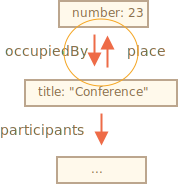

# JSON methods, toJSON

Let's say we have a complex object, and we'd like to convert it into a string, to send it over a network, or just to output it for logging purposes.

Naturally, such a string should include all important properties.

We could implement the conversion like this:

```js run
let user = {
  name: "John",
  age: 30,

*!*
  toString() {
    return `{name: "${this.name}", age: ${this.age}}`;
  }
*/!*
};

alert(user); // {name: "John", age: 30}
```

...But in the process of development, new properties are added, old properties are renamed and removed. Updating such `toString` every time can become a pain. We could try to loop over properties in it, but what if the object is complex and has nested objects in properties? We'd need to implement their conversion as well.

Luckily, there's no need to write the code to handle all this. The task has been solved already.

## JSON.stringify

The [JSON](http://en.wikipedia.org/wiki/JSON) (JavaScript Object Notation) is a general format to represent values and objects. It is described as in [RFC 4627](http://tools.ietf.org/html/rfc4627) standard. Initially it was made for JavaScript, but many other languages have libraries to handle it as well.  So it's easy to use JSON for data exchange when the client uses JavaScript and the server is written on Ruby/PHP/Java/Whatever.

JavaScript provides methods:

- `JSON.stringify` to convert objects into JSON.
- `JSON.parse` to convert JSON back into an object.

For instance, here we `JSON.stringify` a student:
```js run
let student = {
  name: 'John',
  age: 30,
  isAdmin: false,
  courses: ['html', 'css', 'js'],
  wife: null
};

*!*
let json = JSON.stringify(student);
*/!*

alert(typeof json); // we've got a string!

alert(json);
*!*
/* JSON-encoded object:
{
  "name": "John",
  "age": 30,
  "isAdmin": false,
  "courses": ["html", "css", "js"],
  "wife": null
}
*/
*/!*
```

The method `JSON.stringify(student)` takes the object and converts it into a string.

The resulting `json` string is called a *JSON-encoded* or *serialized* or *stringified* or *marshalled* object. We are ready to send it over the wire or put into a plain data store.


Please note that a JSON-encoded object has several important differences from the object literal:

- Strings use double quotes. No single quotes or backticks in JSON. So `'John'` becomes `"John"`.
- Object property names are double-quoted also. That's obligatory. So `age:30` becomes `"age":30`.

`JSON.stringify` can be applied to primitives as well.

JSON supports following data types:

- Objects `{ ... }`
- Arrays `[ ... ]`
- Primitives:
    - strings,
    - numbers,
    - boolean values `true/false`,
    - `null`.

For instance:

```js run
// a number in JSON is just a number
alert( JSON.stringify(1) ) // 1

// a string in JSON is still a string, but double-quoted
alert( JSON.stringify('test') ) // "test"

alert( JSON.stringify(true) ); // true

alert( JSON.stringify([1, 2, 3]) ); // [1,2,3]
```

JSON is data-only language-independent specification, so some JavaScript-specific object properties are skipped by `JSON.stringify`.

Namely:

- Function properties (methods).
- Symbolic properties.
- Properties that store `undefined`.

```js run
let user = {
  sayHi() { // ignored
    alert("Hello");
  },
  [Symbol("id")]: 123, // ignored
  something: undefined // ignored
};

alert( JSON.stringify(user) ); // {} (empty object)
```

Usually that's fine. If that's not what we want, then soon we'll see how to customize the process.

The great thing is that nested objects are supported and converted automatically.

For instance:

```js run
let meetup = {
  title: "Conference",
*!*
  room: {
    number: 23,
    participants: ["john", "ann"]
  }
*/!*
};

alert( JSON.stringify(meetup) );
/* The whole structure is stringified:
{
  "title":"Conference",
  "room":{"number":23,"participants":["john","ann"]},
}
*/
```

The important limitation: there must be no circular references.

For instance:

```js run
let room = {
  number: 23
};

let meetup = {
  title: "Conference",
  participants: ["john", "ann"]
};

meetup.place = room;       // meetup references room
room.occupiedBy = meetup; // room references meetup

*!*
JSON.stringify(meetup); // Error: Converting circular structure to JSON
*/!*
```

Here, the conversion fails, because of circular reference: `room.occupiedBy` references `meetup`, and `meetup.place` references `room`:




## Excluding and transforming: replacer

The full syntax of `JSON.stringify` is:

```js
let json = JSON.stringify(value[, replacer, space])
```

value
: A value to encode.

replacer
: Array of properties to encode or a mapping function `function(key, value)`.

space
: Amount of space to use for formatting

Most of the time, `JSON.stringify` is used with the first argument only. But if we need to fine-tune the replacement process, like to filter out circular references, we can use the second argument of `JSON.stringify`.

If we pass an array of properties to it, only these properties will be encoded.

For instance:

```js run
let room = {
  number: 23
};

let meetup = {
  title: "Conference",
  participants: [{name: "John"}, {name: "Alice"}],
  place: room // meetup references room
};

room.occupiedBy = meetup; // room references meetup

alert( JSON.stringify(meetup, *!*['title', 'participants']*/!*) );
// {"title":"Conference","participants":[{},{}]}
```

Here we are probably too strict. The property list is applied to the whole object structure. So the objects in `participants` are empty, because `name` is not in the list.

Let's include in the list every property except `room.occupiedBy` that would cause the circular reference:

```js run
let room = {
  number: 23
};

let meetup = {
  title: "Conference",
  participants: [{name: "John"}, {name: "Alice"}],
  place: room // meetup references room
};

room.occupiedBy = meetup; // room references meetup

alert( JSON.stringify(meetup, *!*['title', 'participants', 'place', 'name', 'number']*/!*) );
/*
{
  "title":"Conference",
  "participants":[{"name":"John"},{"name":"Alice"}],
  "place":{"number":23}
}
*/
```

Now everything except `occupiedBy` is serialized. But the list of properties is quite long.

Fortunately, we can use a function instead of an array as the `replacer`.

The function will be called for every `(key, value)` pair and should return the "replaced" value, which will be used instead of the original one. Or `undefined` if the value is to be skipped.

In our case, we can return `value` "as is" for everything except `occupiedBy`. To ignore `occupiedBy`, the code below returns `undefined`:

```js run
let room = {
  number: 23
};

let meetup = {
  title: "Conference",
  participants: [{name: "John"}, {name: "Alice"}],
  place: room // meetup references room
};

room.occupiedBy = meetup; // room references meetup

alert( JSON.stringify(meetup, function replacer(key, value) {
  alert(`${key}: ${value}`);
  return (key == 'occupiedBy') ? undefined : value;
}));

/* key:value pairs that come to replacer:
:             [object Object]
title:        Conference
participants: [object Object],[object Object]
0:            [object Object]
name:         John
1:            [object Object]
name:         Alice
place:        [object Object]
number:       23
*/
```

Please note that `replacer` function gets every key/value pair including nested objects and array items. It is applied recursively. The value of `this` inside `replacer` is the object that contains the current property.

The first call is special. It is made using a special "wrapper object": `{"": meetup}`. In other words, the first `(key, value)` pair has an empty key, and the value is the target object as a whole. That's why the first line is `":[object Object]"` in the example above.

The idea is to provide as much power for `replacer` as possible: it has a chance to analyze and replace/skip even the whole object if necessary.


## Formatting: space

The third argument of `JSON.stringify(value, replacer, space)` is the number of spaces to use for pretty formatting.

Previously, all stringified objects had no indents and extra spaces. That's fine if we want to send an object over a network. The `space` argument is used exclusively for a nice output.

Here `space = 2` tells JavaScript to show nested objects on multiple lines, with indentation of 2 spaces inside an object:

```js run
let user = {
  name: "John",
  age: 25,
  roles: {
    isAdmin: false,
    isEditor: true
  }
};

alert(JSON.stringify(user, null, 2));
/* two-space indents:
{
  "name": "John",
  "age": 25,
  "roles": {
    "isAdmin": false,
    "isEditor": true
  }
}
*/

/* for JSON.stringify(user, null, 4) the result would be more indented:
{
    "name": "John",
    "age": 25,
    "roles": {
        "isAdmin": false,
        "isEditor": true
    }
}
*/
```

The `space` parameter is used solely for logging and nice-output purposes.

## Custom "toJSON"

Like `toString` for string conversion, an object may provide method `toJSON` for to-JSON conversion. `JSON.stringify` automatically calls it if available.

For instance:

```js run
let room = {
  number: 23
};

let meetup = {
  title: "Conference",
  date: new Date(Date.UTC(2017, 0, 1)),
  room
};

alert( JSON.stringify(meetup) );
/*
  {
    "title":"Conference",
*!*
    "date":"2017-01-01T00:00:00.000Z",  // (1)
*/!*
    "room": {"number":23}               // (2)
  }
*/
```

Here we can see that `date` `(1)` became a string. That's because all dates have a built-in `toJSON` method which returns such kind of string.

Now let's add a custom `toJSON` for our object `room` `(2)`:

```js run
let room = {
  number: 23,
*!*
  toJSON() {
    return this.number;
  }
*/!*
};

let meetup = {
  title: "Conference",
  room
};

*!*
alert( JSON.stringify(room) ); // 23
*/!*

alert( JSON.stringify(meetup) );
/*
  {
    "title":"Conference",
*!*
    "room": 23
*/!*
  }
*/
```

As we can see, `toJSON` is used both for the direct call `JSON.stringify(room)` and when `room` is nested in another encoded object.


## JSON.parse

To decode a JSON-string, we need another method named [JSON.parse](mdn:js/JSON/parse).

The syntax:
```js
let value = JSON.parse(str, [reviver]);
```

str
: JSON-string to parse.

reviver
: Optional function(key,value) that will be called for each `(key, value)` pair and can transform the value.

For instance:

```js run
// stringified array
let numbers = "[0, 1, 2, 3]";

numbers = JSON.parse(numbers);

alert( numbers[1] ); // 1
```

Or for nested objects:

```js run
let userData = '{ "name": "John", "age": 35, "isAdmin": false, "friends": [0,1,2,3] }';

let user = JSON.parse(userData);

alert( user.friends[1] ); // 1
```

The JSON may be as complex as necessary, objects and arrays can include other objects and arrays. But they must obey the same JSON format.

Here are typical mistakes in hand-written JSON (sometimes we have to write it for debugging purposes):

```js
let json = `{
  *!*name*/!*: "John",                     // mistake: property name without quotes
  "surname": *!*'Smith'*/!*,               // mistake: single quotes in value (must be double)
  *!*'isAdmin'*/!*: false                  // mistake: single quotes in key (must be double)
  "birthday": *!*new Date(2000, 2, 3)*/!*, // mistake: no "new" is allowed, only bare values
  "friends": [0,1,2,3]              // here all fine
}`;
```

Besides, JSON does not support comments. Adding a comment to JSON makes it invalid.

There's another format named [JSON5](http://json5.org/), which allows unquoted keys, comments etc. But this is a standalone library, not in the specification of the language.

The regular JSON is that strict not because its developers are lazy, but to allow easy, reliable and very fast implementations of the parsing algorithm.

## Using reviver

Imagine, we got a stringified `meetup` object from the server.

It looks like this:

```js
// title: (meetup title), date: (meetup date)
let str = '{"title":"Conference","date":"2017-11-30T12:00:00.000Z"}';
```

...And now we need to *deserialize* it, to turn back into JavaScript object.

Let's do it by calling `JSON.parse`:

```js run
let str = '{"title":"Conference","date":"2017-11-30T12:00:00.000Z"}';

let meetup = JSON.parse(str);

*!*
alert( meetup.date.getDate() ); // Error!
*/!*
```

Whoops! An error!

The value of `meetup.date` is a string, not a `Date` object. How could `JSON.parse` know that it should transform that string into a `Date`?

Let's pass to `JSON.parse` the reviving function as the second argument, that returns all values "as is", but `date` will become a `Date`:

```js run
let str = '{"title":"Conference","date":"2017-11-30T12:00:00.000Z"}';

*!*
let meetup = JSON.parse(str, function(key, value) {
  if (key == 'date') return new Date(value);
  return value;
});
*/!*

alert( meetup.date.getDate() ); // now works!
```

By the way, that works for nested objects as well:

```js run
let schedule = `{
  "meetups": [
    {"title":"Conference","date":"2017-11-30T12:00:00.000Z"},
    {"title":"Birthday","date":"2017-04-18T12:00:00.000Z"}
  ]
}`;

schedule = JSON.parse(schedule, function(key, value) {
  if (key == 'date') return new Date(value);
  return value;
});

*!*
alert( schedule.meetups[1].date.getDate() ); // works!
*/!*
```


## Summary

- JSON is a data format that has its own independent standard and libraries for most programming languages.
- JSON supports plain objects, arrays, strings, numbers, booleans, and `null`.
- JavaScript provides methods [JSON.stringify](mdn:js/JSON/stringify) to serialize into JSON and [JSON.parse](mdn:js/JSON/parse) to read from JSON.
- Both methods support transformer functions for smart reading/writing.
- If an object has `toJSON`, then it is called by `JSON.stringify`.
