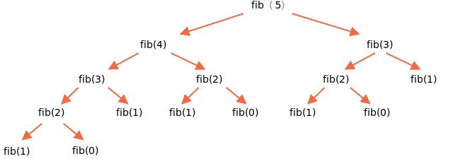

The first solution we could try here is the recursive one.

Fibonacci numbers are recursive by definition:

```js run
function fib(n) {
  return n <= 1 ? n : fib(n - 1) + fib(n - 2);
}

alert( fib(3) ); // 2
alert( fib(7) ); // 13
// fib(77); // will be extremely slow!
```

...But for big values of `n` it's very slow. For instance, `fib(77)` may hang up the engine for some time eating all CPU resources.

That's because the function makes too many subcalls. The same values are re-evaluated again and again.

For instance, let's see a piece of calculations for `fib(5)`:

```js no-beautify
...
fib(5) = fib(4) + fib(3)
fib(4) = fib(3) + fib(2)
...
```

Here we can see that the value of `fib(3)` is needed for both `fib(5)` and `fib(4)`. So `fib(3)` will be called and evaluated two times completely independently.

Here's the full recursion tree:



We can clearly notice that `fib(3)` is evaluated two times and `fib(2)` is evaluated three times. The total amount of computations grows much faster than `n`, making it enormous even for `n=77`.

We can optimize that by remembering already-evaluated values: if a value of say `fib(3)` is calculated once, then we can just reuse it in future computations.

Another variant would be to give up recursion and use a totally different loop-based algorithm.

Instead of going from `n` down to lower values, we can make a loop that starts from `1` and `2`, then gets `fib(3)` as their sum, then `fib(4)` as the sum of two previous values, then `fib(5)` and goes up and up, till it gets to the needed value. On each step we only need to remember two previous values.

Here are the steps of the new algorithm in details.

The start:

```js
// a = fib(1), b = fib(2), these values are by definition 1
let a = 1, b = 1;

// get c = fib(3) as their sum
let c = a + b;

/* we now have fib(1), fib(2), fib(3)
a  b  c
1, 1, 2
*/
```

Now we want to get `fib(4) = fib(2) + fib(3)`.

Let's shift the variables: `a,b` will get `fib(2),fib(3)`, and `c` will get their sum:

```js no-beautify
a = b; // now a = fib(2)
b = c; // now b = fib(3)
c = a + b; // c = fib(4)

/* now we have the sequence:
   a  b  c
1, 1, 2, 3
*/
```

The next step gives another sequence number:

```js no-beautify
a = b; // now a = fib(3)
b = c; // now b = fib(4)
c = a + b; // c = fib(5)

/* now the sequence is (one more number):
      a  b  c
1, 1, 2, 3, 5
*/
```

...And so on until we get the needed value. That's much faster than recursion and involves no duplicate computations.

The full code:

```js run
function fib(n) {
  let a = 1;
  let b = 1;
  for (let i = 3; i <= n; i++) {
    let c = a + b;
    a = b;
    b = c;
  }
  return b;
}

alert( fib(3) ); // 2
alert( fib(7) ); // 13
alert( fib(77) ); // 5527939700884757
```

The loop starts with `i=3`, because the first and the second sequence values are hard-coded into variables `a=1`, `b=1`.

The approach is called [dynamic programming bottom-up](https://en.wikipedia.org/wiki/Dynamic_programming).
