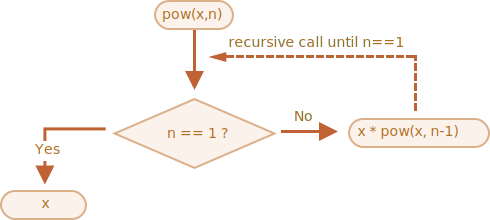
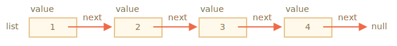
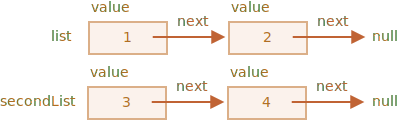
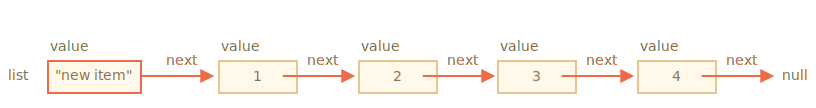

# Recursion and stack

Let's return to functions and study them more in-depth.

Our first topic will be *recursion*.

If you are not new to programming, then it is probably familiar and you could skip this chapter.

Recursion is a programming pattern that is useful in situations when a task can be naturally split into several tasks of the same kind, but simpler. Or when a task can be simplified into an easy action plus a simpler variant of the same task. Or, as we'll see soon, to deal with certain data structures.

When a function solves a task, in the process it can call many other functions. A partial case of this is when a function calls *itself*. That's called *recursion*.

## Two ways of thinking

For something simple to start with -- let's write a function `pow(x, n)` that raises `x` to a natural power of `n`. In other words, multiplies `x` by itself `n` times.

```js
pow(2, 2) = 4
pow(2, 3) = 8
pow(2, 4) = 16
```

There are two ways to implement it.

1. Iterative thinking: the `for` loop:

    ```js run
    function pow(x, n) {
      let result = 1;

      // multiply result by x n times in the loop
      for (let i = 0; i < n; i++) {
        result *= x;
      }

      return result;
    }

    alert( pow(2, 3) ); // 8
    ```

2. Recursive thinking: simplify the task and call self:

    ```js run
    function pow(x, n) {
      if (n == 1) {
        return x;
      } else {
        return x * pow(x, n - 1);
      }
    }

    alert( pow(2, 3) ); // 8
    ```

Please note how the recursive variant is fundamentally different.

When `pow(x, n)` is called, the execution splits into two branches:

```js
              if n==1  = x
             /
pow(x, n) =
             \       
              else     = x * pow(x, n - 1)
```

1. If `n == 1`, then everything is trivial. It is called *the base* of recursion, because it immediately produces the obvious result: `pow(x, 1)` equals `x`.
2. Otherwise, we can represent `pow(x, n)` as `x * pow(x, n - 1)`. In maths, one would write <code>x<sup>n</sup> = x * x<sup>n-1</sup></code>. This is called *a recursive step*: we transform the task into a simpler action (multiplication by `x`) and a simpler call of the same task (`pow` with lower `n`). Next steps simplify it further and further until `n` reaches `1`.

We can also say that `pow` *recursively calls itself* till `n == 1`.




For example, to calculate `pow(2, 4)` the recursive variant does these steps:

1. `pow(2, 4) = 2 * pow(2, 3)`
2. `pow(2, 3) = 2 * pow(2, 2)`
3. `pow(2, 2) = 2 * pow(2, 1)`
4. `pow(2, 1) = 2`

So, the recursion reduces a function call to a simpler one, and then -- to even more simpler, and so on, until the result becomes obvious.

````smart header="Recursion is usually shorter"
A recursive solution is usually shorter than an iterative one.

Here we can rewrite the same using the conditional operator `?` instead of `if` to make `pow(x, n)` more terse and still very readable:

```js run
function pow(x, n) {
  return (n == 1) ? x : (x * pow(x, n - 1));
}
```
````

The maximal number of nested calls (including the first one) is called *recursion depth*. In our case, it will be exactly `n`.

The maximal recursion depth is limited by JavaScript engine. We can rely on it being 10000, some engines allow more, but 100000 is probably out of limit for the majority of them. There are automatic optimizations that help alleviate this ("tail calls optimizations"), but they are not yet supported everywhere and work only in simple cases.

That limits the application of recursion, but it still remains very wide. There are many tasks where recursive way of thinking gives simpler code, easier to maintain.

## The execution context and stack

Now let's examine how recursive calls work. For that we'll look under the hood of functions.

The information about the process of execution of a running function is stored in its *execution context*.

The [execution context](https://tc39.github.io/ecma262/#sec-execution-contexts) is an internal data structure that contains details about the execution of a function: where the control flow is now, the current variables, the value of `this` (we don't use it here) and few other internal details.

One function call has exactly one execution context associated with it.

When a function makes a nested call, the following happens:

- The current function is paused.
- The execution context associated with it is remembered in a special data structure called *execution context stack*.
- The nested call executes.
- After it ends, the old execution context is retrieved from the stack, and the outer function is resumed from where it stopped.

Let's see what happens during the `pow(2, 3)` call.

### pow(2, 3)

In the beginning of the call `pow(2, 3)` the execution context will store variables: `x = 2, n = 3`, the execution flow is at line `1` of the function.

We can sketch it as:

<ul class="function-execution-context-list">
  <li>
    <span class="function-execution-context">Context: { x: 2, n: 3, at line 1 }</span>
    <span class="function-execution-context-call">pow(2, 3)</span>
  </li>
</ul>

That's when the function starts to execute. The condition `n == 1` is false, so the flow continues into the second branch of `if`:

```js run
function pow(x, n) {
  if (n == 1) {
    return x;
  } else {
*!*
    return x * pow(x, n - 1);
*/!*
  }
}

alert( pow(2, 3) );
```


The variables are same, but the line changes, so the context is now:

<ul class="function-execution-context-list">
  <li>
    <span class="function-execution-context">Context: { x: 2, n: 3, at line 5 }</span>
    <span class="function-execution-context-call">pow(2, 3)</span>
  </li>
</ul>

To calculate `x * pow(x, n - 1)`, we need to make a subcall of `pow` with new arguments `pow(2, 2)`.

### pow(2, 2)

To do a nested call, JavaScript remembers the current execution context in the *execution context stack*.

Here we call the same function `pow`, but it absolutely doesn't matter. The process is the same for all functions:

1. The current context is "remembered" on top of the stack.
2. The new context is created for the subcall.
3. When the subcall is finished -- the previous context is popped from the stack, and its execution continues.

Here's the context stack when we entered the subcall `pow(2, 2)`:

<ul class="function-execution-context-list">
  <li>
    <span class="function-execution-context">Context: { x: 2, n: 2, at line 1 }</span>
    <span class="function-execution-context-call">pow(2, 2)</span>
  </li>
  <li>
    <span class="function-execution-context">Context: { x: 2, n: 3, at line 5 }</span>
    <span class="function-execution-context-call">pow(2, 3)</span>
  </li>
</ul>

The new current execution context is on top (and bold), and previous remembered contexts are below.

When we finish the subcall -- it is easy to resume the previous context, because it keeps both variables and the exact place of the code where it stopped. Here in the picture we use the word "line", but of course it's more precise.

### pow(2, 1)

The process repeats: a new subcall is made at line `5`, now with arguments `x=2`, `n=1`.

A new execution context is created, the previous one is pushed on top of the stack:

<ul class="function-execution-context-list">
  <li>
    <span class="function-execution-context">Context: { x: 2, n: 1, at line 1 }</span>
    <span class="function-execution-context-call">pow(2, 1)</span>
  </li>
  <li>
    <span class="function-execution-context">Context: { x: 2, n: 2, at line 5 }</span>
    <span class="function-execution-context-call">pow(2, 2)</span>
  </li>
  <li>
    <span class="function-execution-context">Context: { x: 2, n: 3, at line 5 }</span>
    <span class="function-execution-context-call">pow(2, 3)</span>
  </li>
</ul>

There are 2 old contexts now and 1 currently running for `pow(2, 1)`.

### The exit

During the execution of `pow(2, 1)`, unlike before, the condition `n == 1` is truthy, so the first branch of `if` works:

```js
function pow(x, n) {
  if (n == 1) {
*!*
    return x;
*/!*
  } else {
    return x * pow(x, n - 1);
  }
}
```

There are no more nested calls, so the function finishes, returning `2`.

As the function finishes, its execution context is not needed anymore, so it's removed from the memory. The previous one is restored off the top of the stack:


<ul class="function-execution-context-list">
  <li>
    <span class="function-execution-context">Context: { x: 2, n: 2, at line 5 }</span>
    <span class="function-execution-context-call">pow(2, 2)</span>
  </li>
  <li>
    <span class="function-execution-context">Context: { x: 2, n: 3, at line 5 }</span>
    <span class="function-execution-context-call">pow(2, 3)</span>
  </li>
</ul>

The execution of `pow(2, 2)` is resumed. It has the result of the subcall `pow(2, 1)`, so it also can finish the evaluation of `x * pow(x, n - 1)`, returning `4`.

Then the previous context is restored:

<ul class="function-execution-context-list">
  <li>
    <span class="function-execution-context">Context: { x: 2, n: 3, at line 5 }</span>
    <span class="function-execution-context-call">pow(2, 3)</span>
  </li>
</ul>

When it finishes, we have a result of `pow(2, 3) = 8`.

The recursion depth in this case was: **3**.

As we can see from the illustrations above, recursion depth equals the maximal number of context in the stack.

Note the memory requirements. Contexts take memory. In our case, raising to the power of `n` actually requires the memory for `n` contexts, for all lower values of `n`.

A loop-based algorithm is more memory-saving:

```js
function pow(x, n) {
  let result = 1;

  for (let i = 0; i < n; i++) {
    result *= x;
  }

  return result;
}
```

The iterative `pow` uses a single context changing `i` and `result` in the process. Its memory requirements are small, fixed and do not depend on `n`.

**Any recursion can be rewritten as a loop. The loop variant usually can be made more effective.**

...But sometimes the rewrite is non-trivial, especially when function uses different recursive subcalls depending on conditions and merges their results or when the branching is more intricate. And the optimization may be unneeded and totally not worth the efforts.

Recursion can give a shorter code, easier to understand and support. Optimizations are not required in every place, mostly we need a good code, that's why it's used.

## Recursive traversals

Another great application of the recursion is a recursive traversal.

Imagine, we have a company. The staff structure can be presented as an object:

```js
let company = {
  sales: [{
    name: 'John',
    salary: 1000
  }, {
    name: 'Alice',
    salary: 600
  }],

  development: {
    sites: [{
      name: 'Peter',
      salary: 2000
    }, {
      name: 'Alex',
      salary: 1800
    }],

    internals: [{
      name: 'Jack',
      salary: 1300
    }]
  }
};
```

In other words, a company has departments.

- A department may have an array of staff. For instance, `sales` department has 2 employees: John and Alice.
- Or a department may split into subdepartments, like `development` has two branches: `sites` and `internals`. Each of them has their own staff.
- It is also possible that when a subdepartment grows, it divides into subsubdepartments (or teams).

    For instance, the `sites` department in the future may be split into teams for `siteA` and `siteB`. And they, potentially, can split even more. That's not on the picture, just something to have in mind.

Now let's say we want a function to get the sum of all salaries. How can we do that?

An iterative approach is not easy, because the structure is not simple. The first idea may be to make a `for` loop over `company` with nested subloop over 1st level departments. But then we need more nested subloops to iterate over the staff in 2nd level departments like `sites`... And then another subloop inside those for 3rd level departments that might appear in the future? If we put 3-4 nested subloops in the code to traverse a single object, it becomes rather ugly.

Let's try recursion.

As we can see, when our function gets a department to sum, there are two possible cases:

1. Either it's a "simple" department with an *array* of people -- then we can sum the salaries in a simple loop.
2. Or it's *an object* with `N` subdepartments -- then we can make `N` recursive calls to get the sum for each of the subdeps and combine the results.

The 1st case is the base of recursion, the trivial case, when we get an array.

The 2nd case when we get an object is the recursive step. A complex task is split into subtasks for smaller departments. They may in turn split again, but sooner or later the split will finish at (1).

The algorithm is probably even easier to read from the code:


```js run
let company = { // the same object, compressed for brevity
  sales: [{name: 'John', salary: 1000}, {name: 'Alice', salary: 600 }],
  development: {
    sites: [{name: 'Peter', salary: 2000}, {name: 'Alex', salary: 1800 }],
    internals: [{name: 'Jack', salary: 1300}]
  }
};

// The function to do the job
*!*
function sumSalaries(department) {
  if (Array.isArray(department)) { // case (1)
    return department.reduce((prev, current) => prev + current.salary, 0); // sum the array
  } else { // case (2)
    let sum = 0;
    for (let subdep of Object.values(department)) {
      sum += sumSalaries(subdep); // recursively call for subdepartments, sum the results
    }
    return sum;
  }
}
*/!*

alert(sumSalaries(company)); // 6700
```

The code is short and easy to understand (hopefully?). That's the power of recursion. It also works for any level of subdepartment nesting.

Here's the diagram of calls:


We can easily see the principle: for an object `{...}` subcalls are made, while arrays `[...]` are the "leaves" of the recursion tree, they give immediate result.

Note that the code uses smart features that we've covered before:

- Method `arr.reduce` explained in the chapter <info:array-methods> to get the sum of the array.
- Loop `for(val of Object.values(obj))` to iterate over object values: `Object.values` returns an array of them.


## Recursive structures

A recursive (recursively-defined) data structure is a structure that replicates itself in parts.

We've just seen it in the example of a company structure above.

A company *department* is:
- Either an array of people.
- Or an object with *departments*.

For web-developers there are much better-known examples: HTML and XML documents.

In the HTML document, an *HTML-tag* may contain a list of:
- Text pieces.
- HTML-comments.
- Other *HTML-tags* (that in turn may contain text pieces/comments or other tags etc).

That's once again a recursive definition.

For better understanding, we'll cover one more recursive structure named "Linked list" that might be a better alternative for arrays in some cases.

### Linked list

Imagine, we want to store an ordered list of objects.

The natural choice would be an array:

```js
let arr = [obj1, obj2, obj3];
```

...But there's a problem with arrays. The "delete element" and "insert element" operations are expensive. For instance, `arr.unshift(obj)` operation has to renumber all elements to make room for a new `obj`, and if the array is big, it takes time. Same with `arr.shift()`.

The only structural modifications that do not require mass-renumbering are those that operate with the end of array: `arr.push/pop`. So an array can be quite slow for big queues, when we have to work with the beginning.

Alternatively, if we really need fast insertion/deletion, we can choose another data structure called a [linked list](https://en.wikipedia.org/wiki/Linked_list).

The *linked list element* is recursively defined as an object with:
- `value`.
- `next` property referencing the next *linked list element* or `null` if that's the end.

For instance:

```js
let list = {
  value: 1,
  next: {
    value: 2,
    next: {
      value: 3,
      next: {
        value: 4,
        next: null
      }
    }
  }
};
```

Graphical representation of the list:



An alternative code for creation:

```js no-beautify
let list = { value: 1 };
list.next = { value: 2 };
list.next.next = { value: 3 };
list.next.next.next = { value: 4 };
```

Here we can even more clearer see that there are multiple objects, each one has the `value` and `next` pointing to the neighbour. The `list` variable is the first object in the chain, so following `next` pointers from it we can reach any element.

The list can be easily split into multiple parts and later joined back:

```js
let secondList = list.next.next;
list.next.next = null;
```



To join:

```js
list.next.next = secondList;
```

And surely we can insert or remove items in any place.

For instance, to prepend a new value, we need to update the head of the list:

```js
let list = { value: 1 };
list.next = { value: 2 };
list.next.next = { value: 3 };
list.next.next.next = { value: 4 };

*!*
// prepend the new value to the list
list = { value: "new item", next: list };
*/!*
```



To remove a value from the middle, change `next` of the previous one:

```js
list.next = list.next.next;
```


We made `list.next` jump over `1` to value `2`. The value `1` is now excluded from the chain. If it's not stored anywhere else, it will be automatically removed from the memory.

Unlike arrays, there's no mass-renumbering, we can easily rearrange elements.

Naturally, lists are not always better than arrays. Otherwise everyone would use only lists.

The main drawback is that we can't easily access an element by its number. In an array that's easy: `arr[n]` is a direct reference. But in the list we need to start from the first item and go `next` `N` times to get the Nth element.

...But we don't always need such operations. For instance, when we need a queue or even a [deque](https://en.wikipedia.org/wiki/Double-ended_queue) -- the ordered structure that must allow very fast adding/removing elements from both ends, but access to its middle is not needed.

Lists can be enhanced:
- We can add property `prev` in addition to `next` to reference the previous element, to move back easily.
- We can also add a variable named `tail` referencing the last element of the list (and update it when adding/removing elements from the end).
- ...The data structure may vary according to our needs.

## Summary

Terms:
- *Recursion*  is a programming term that means calling a function from itself. Recursive functions can be used to solve tasks in elegant ways.

    When a function calls itself, that's called a *recursion step*. The *basis* of recursion is function arguments that make the task so simple that the function does not make further calls.

- A [recursively-defined](https://en.wikipedia.org/wiki/Recursive_data_type) data structure is a data structure that can be defined using itself.

    For instance, the linked list can be defined as a data structure consisting of an object referencing a list (or null).

    ```js
    list = { value, next -> list }
    ```

    Trees like HTML elements tree or the department tree from this chapter are also naturally recursive: they branch and every branch can have other branches.

    Recursive functions can be used to walk them as we've seen in the `sumSalary` example.

Any recursive function can be rewritten into an iterative one. And that's sometimes required to optimize stuff. But for many tasks a recursive solution is fast enough and easier to write and support.
