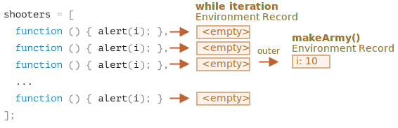

Let's examine what exactly happens inside `makeArmy`, and the solution will become obvious.

1. It creates an empty array `shooters`:

    ```js
    let shooters = [];
    ```
2. Fills it with functions via `shooters.push(function)` in the loop.

    Every element is a function, so the resulting array looks like this:

    ```js no-beautify
    shooters = [
      function () { alert(i); },
      function () { alert(i); },
      function () { alert(i); },
      function () { alert(i); },
      function () { alert(i); },
      function () { alert(i); },
      function () { alert(i); },
      function () { alert(i); },
      function () { alert(i); },
      function () { alert(i); }
    ];
    ```

3. The array is returned from the function.
    
    Then, later, the call to any member, e.g. `army[5]()` will get the element `army[5]` from the array (which is a function) and calls it.
    
    Now why do all such functions show the same value, `10`?
    
    That's because there's no local variable `i` inside `shooter` functions. When such a function is called, it takes `i` from its outer lexical environment.
    
    Then, what will be the value of `i`?
    
    If we look at the source:
    
    ```js
    function makeArmy() {
      ...
      let i = 0;
      while (i < 10) {
        let shooter = function() { // shooter function
          alert( i ); // should show its number
        };
        shooters.push(shooter); // add function to the array
        i++;
      }
      ...
    }
    ```
    
    We can see that all `shooter` functions are created in the lexical environment of `makeArmy()` function. But when `army[5]()` is called, `makeArmy` has already finished its job, and the final value of `i` is `10` (`while` stops at `i=10`).
    
    As the result, all `shooter` functions get the same value from the outer lexical environment and that is, the last value, `i=10`.
    
    
    
    As you can see above, on each iteration of a `while {...}` block, a new lexical environment is created. So, to fix this, we can copy the value of `i` into a variable within the `while {...}` block, like this:
    
    ```js run
    function makeArmy() {
      let shooters = [];
    
      let i = 0;
      while (i < 10) {
        *!*
          let j = i;
        */!*
          let shooter = function() { // shooter function
            alert( *!*j*/!* ); // should show its number
          };
        shooters.push(shooter);
        i++;
      }
    
      return shooters;
    }
    
    let army = makeArmy();
    
    // Now the code works correctly
    army[0](); // 0
    army[5](); // 5
    ```
    
    Here `let j = i` declares an "iteration-local" variable `j` and copies `i` into it. Primitives are copied "by value", so we actually get an independent copy of `i`, belonging to the current loop iteration.
    
    The shooters work correctly, because the value of `i` now lives a little bit closer. Not in `makeArmy()` Lexical Environment, but in the Lexical Environment that corresponds to the current loop iteration:
    
    
    
    Such a problem could also be avoided if we used `for` in the beginning, like this:
    
    ```js run demo
    function makeArmy() {
    
      let shooters = [];
    
    *!*
      for(let i = 0; i < 10; i++) {
    */!*
        let shooter = function() { // shooter function
          alert( i ); // should show its number
        };
        shooters.push(shooter);
      }
    
      return shooters;
    }
    
    let army = makeArmy();
    
    army[0](); // 0
    army[5](); // 5
    ```
    
    That's essentially the same, because `for` on each iteration generates a new lexical environment, with its own variable `i`. So `shooter` generated in every iteration references its own `i`, from that very iteration.
    
    

Now, as you've put so much effort into reading this, and the final recipe is so simple - just use `for`, you may wonder -- was it worth that?

Well, if you could easily answer the question, you wouldn't read the solution. So, hopefully this task must have helped you to understand things a bit better. 

Besides, there are indeed cases when one prefers `while` to `for`, and other scenarios, where such problems are real.

