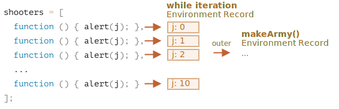
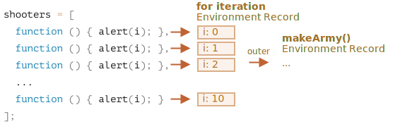

Keling, `makeArmy` ichida nima sodir bo'lishini ko'rib chiqaylik va yechim aniq bo'ladi.

1. U bo'sh `shooters` massivini yaratadi:

    ```js
    let shooters = [];
    ```
2. Uni tsikldagi `shooters.push(function)` orqali funksiyalar bilan to‘ldiradi.

    Har bir element funktsiyadir, shuning uchun olingan massiv quyidagicha ko'rinadi:

    ```js no-beautify
    shooters = [
      function () { alert(i); },
      function () { alert(i); },
      function () { alert(i); },
      function () { alert(i); },
      function () { alert(i); },
      function () { alert(i); },
      function () { alert(i); },
      function () { alert(i); },
      function () { alert(i); },
      function () { alert(i); }
    ];
    ```

3. Massiv funksiyadan qaytariladi.
    
    Keyin, keyinroq, har qanday a'zoga chaqiruv, masalan. `army[5]()` massivdan `army[5]` elementini oladi (bu funksiya) va uni chaqiradi.
    
    Endi nima uchun bunday funktsiyalarning barchasi bir xil qiymatni ko'rsatadi, `10`?
    
    Buning sababi, `shooter` funksiyalarida mahalliy `i` o'zgaruvchisi mavjud emas. Bunday funksiya chaqirilsa, u tashqi leksik muhitdan `i` ni oladi.
    
    Keyin `i` qiymati qanday bo'ladi?
    
    Agar manbaga qarasak:
    
    ```js
    function makeArmy() {
      ...
      let i = 0;
      while (i < 10) {
        let shooter = function() { // shooter funksiyasi
          alert( i ); // raqamini ko'rsatishi kerak
        };
        shooters.push(shooter); // massivga funksiya qo'shing
        i++;
      }
      ...
    }
    ```
    
    Barcha “shooter” funksiyalari “makeArmy()” funksiyasining leksik muhitida yaratilganligini ko‘rishimiz mumkin. Lekin `army[5]()` chaqirilganda, `makeArmy` allaqachon o'z ishini tugatgan va `i` ning yakuniy qiymati `10` (``i=10`da to`xtagan paytda) dir.
    
    Natijada, barcha `shooter` funksiyalari tashqi leksik muhitdan bir xil qiymatga ega bo'ladi, ya'ni oxirgi qiymat `i=10`.
    
    
    
    Yuqorida ko'rib turganingizdek, `while {...}` blokining har bir iteratsiyasida yangi leksik muhit yaratiladi. Buni tuzatish uchun biz “i” qiymatini `while {...}` blokidagi o‘zgaruvchiga ko‘chirib olishimiz mumkin, masalan:
    
    ```js run
    function makeArmy() {
      let shooters = [];
    
      let i = 0;
      while (i < 10) {
        *!*
          let j = i;
        */!*
          let shooter = function() { // shooter funksiyasi
            alert( *!*j*/!* ); // raqamini ko'rsatishi kerak
          };
        shooters.push(shooter);
        i++;
      }
    
      return shooters;
    }
    
    let army = makeArmy();
    
    // Endi kod to'g'ri ishlaydi
    army[0](); // 0
    army[5](); // 5
    ```
    
    Bu erda `let j = i` `takrorlash-mahalliy` o'zgaruvchi `j`ni e'lon qiladi va unga `i` nusxa ko`chiradi. Primitivlar "qiymati bo'yicha" ko'chiriladi, shuning uchun biz amaldagi sikl iteratsiyasiga tegishli bo'lgan "i" ning mustaqil nusxasini olamiz.
    
    Otishmalar to'g'ri ishlaydi, chunki `i` qiymati endi biroz yaqinroq yashaydi. `makeArmy()` leksik muhitida emas, balki joriy sikl iteratsiyasiga mos keladigan leksik muhitda:
    
    
    
    Agar boshida `for` dan foydalansak, bunday muammoning oldini olish mumkin, masalan:
    
    ```js run demo
    function makeArmy() {
    
      let shooters = [];
    
    *!*
      for(let i = 0; i < 10; i++) {
    */!*
        let shooter = function() { // shooter funksiyasi
          alert( i ); // raqamini ko'rsatishi kerak
        };
        shooters.push(shooter);
      }
    
      return shooters;
    }
    
    let army = makeArmy();
    
    army[0](); // 0
    army[5](); // 5
    ```
    
    Bu aslida bir xil, chunki har bir iteratsiyada `for` o'zining `i` o'zgaruvchisi bilan yangi leksik muhitni yaratadi. Shunday qilib, har bir iteratsiyada yaratilgan `shooter` o'sha iteratsiyadan boshlab o'zining "i" ga murojaat qiladi.
    
    

Endi siz buni o'qish uchun juda ko'p kuch sarflaganingiz uchun va yakuniy retsept juda oddiy - shunchaki `for` dan foydalaning, hayron bo'lishingiz mumkin - bunga arziydimi?

Xo'sh, agar siz savolga osongina javob bera olsangiz, yechimni o'qimagan bo'lar edingiz. Umid qilamanki, bu vazifa sizga narsalarni biroz yaxshiroq tushunishga yordam bergan bo'lsa kerak.

Bundan tashqari, haqiqatan ham borki, `for`dan ko'ra `while` ni afzal ko'radigan holatlar va bunday muammolar haqiqiy bo'lgan boshqa stsenariylar mavjud.

