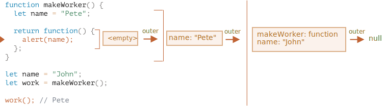

The answer is: **Pete**.

The `work()` function in the code below gets `name` from the place of its origin through the outer lexical environment reference:

So, the result is `"Pete"` here.

But if there were no `let name` in `makeWorker()`, then the search would go outside and take the global variable as we can see from the chain above. In that case the result would be `"John"`.
