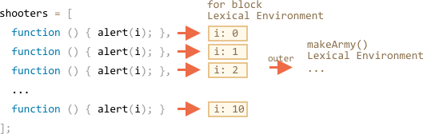

Let's examine what's done inside `makeArmy`, and the solution will become obvious.

1. It creates an empty array `shooters`:

    ```js
    let shooters = [];
    ```
2. Fills it in the loop via `shooters.push(function...)`.

    Every element is a function, so the resulting array looks like this:

    ```js no-beautify
    shooters = [
      function () { alert(i); },
      function () { alert(i); },
      function () { alert(i); },
      function () { alert(i); },
      function () { alert(i); },
      function () { alert(i); },
      function () { alert(i); },
      function () { alert(i); },
      function () { alert(i); },
      function () { alert(i); }
    ];
    ```

3. The array is returned from the function.

Then, later, the call to `army[5]()` will get the element `army[5]` from the array (it will be a function) and call it.

Now why all such functions show the same?

That's because there's no local variable `i` inside `shooter` functions. When such a function is called, it takes `i` from its outer lexical environment.

What will be the value of `i`?

If we look at the source:

```js
function makeArmy() {
  ...
  let i = 0;
  while (i < 10) {
    let shooter = function() { // shooter function
      alert( i ); // should show its number
    };
    ...
  }
  ...
}
```

...We can see that it lives in the lexical environment associated with the current `makeArmy()` run. But when `army[5]()` is called, `makeArmy` has already finished its job, and `i` has the last value: `10` (the end of `while`).

As a result, all `shooter` functions get from the outer lexical envrironment the same, last value `i=10`.

We can fix it by moving the variable definition into the loop:

```js run demo
function makeArmy() {

  let shooters = [];

*!*
  for(let i = 0; i < 10; i++) {
*/!*
    let shooter = function() { // shooter function
      alert( i ); // should show its number
    };
    shooters.push(shooter);
  }

  return shooters;
}

let army = makeArmy();

army[0](); // 0
army[5](); // 5
```

Now it works correctly, because every time the code block in `for (let i=0...) {...}` is executed, a new Lexical Environment is created for it, with the corresponding variable `i`.

So, the value of `i` now lives a little bit closer. Not in `makeArmy()` Lexical Environment, but in the Lexical Environment that corresponds the current loop iteration. That's why now it works.



Here we rewrote `while` into `for`.

Another trick could be possible, let's see it for better understanding of the subject:

```js run
function makeArmy() {
  let shooters = [];

  let i = 0;
  while (i < 10) {
*!*
    let j = i;
*/!*
    let shooter = function() { // shooter function
      alert( *!*j*/!* ); // should show its number
    };
    shooters.push(shooter);
    i++;
  }

  return shooters;
}

let army = makeArmy();

army[0](); // 0
army[5](); // 5
```

The `while` loop, just like `for`, makes a new Lexical Environment for each run. So here we make sure that it gets the right value for a `shooter`.

We copy `let j = i`. This makes a loop body local `j` and copies the value of `i` to it. Primitives are copied "by value", so we actually get a complete independent copy of `i`, belonging to the current loop iteration.
