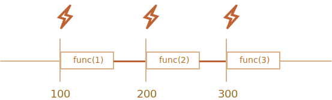
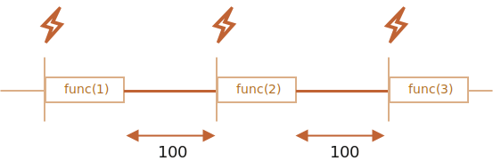

# Rejalashtirish: setTimeout and setInterval

Biz funktsiyani hozir emas, balki ma'lum bir vaqtda bajarishga qaror qilishimiz mumkin. Bu "chaqiruvni rejalashtirish" deb ataladi.

Buning uchun ikkita metod mavjud:

- `setTimeout` vaqt oralig'idan keyin funktsiyani bir marta ishga tushirishga imkon beradi.
- `setInterval` vaqt oralig'idan keyin boshlab, so'ngra shu oraliqda uzluksiz takrorlanadigan funksiyani qayta-qayta ishga tushirishga imkon beradi.

Bu metodlar JavaScript spetsifikatsiyasining bir qismi emas. Ammo ko'pgina muhitlar ichki rejalashtiruvchiga ega va bu metodlarni ta'minlaydi. Xususan, ular barcha brauzerlarda va Node.js da qo'llab-quvvatlanadi.
## setTimeout

Sintaksis:

```js
let timerId = setTimeout(func|code, [delay], [arg1], [arg2], ...)
```

Parametrlari:

`func|code`
: Funktsiya yoki bajariladigan kodlar stringi.
Odatda, bu funktsiya. Tarixiy sabablarga ko'ra kodlar stringi uzatilishi mumkin, ammo bu tavsiya etilmaydi.

`delay`
: Ishlashdan oldingi kechikish, millisekundlarda (1000 ms = 1 soniya), standard bo'yicha 0.

`arg1`, `arg2`...
: Funktsiya uchun argumentlar (IE9da qo'llab-quvvatlanmaydi)

Masalan, bu kod bir soniyadan keyin `sayHi()` ni chaqiradi:

```js run
function sayHi() {
  alert('Hello');
}

*!*
setTimeout(sayHi, 1000);
*/!*
```

Argumentlar bilan:

```js run
function sayHi(phrase, who) {
  alert( phrase + ', ' + who );
}

*!*
setTimeout(sayHi, 1000, "Hello", "John"); // Hello, John
*/!*
```

Agar birinchi argument string bo'lsa, JavaScript undan funksiya yaratadi.

Shunday qilib, bu ham ishlaydi:

```js run no-beautify
setTimeout("alert('Hello')", 1000);
```

Ammo stringlardan foydalanish tavsiya etilmaydi, ular o'rniga arrow funktsiyalaridan foydalaning, masalan:

```js run no-beautify
setTimeout(() => alert('Hello'), 1000);
```
``
``smart header="Funktsiyani topshiring, lekin uni ishga tushirmang"
Yangi dasturchilar ba'zan funksiyadan keyin `()` qavs qo'yish orqali xato qilishadi:
``
```js
// noto'g'ri!
setTimeout(sayHi(), 1000);
```
Bu ishlamaydi, chunki `setTimeout` funksiyaga havolani kutadi. Va bu yerda `sayHi()` funksiyani ishga tushiradi va *uning bajarilishining natijasi* `setTimeout` ga uzatiladi. Bizning holatlarimizda `sayHi()` natijasi `undefined` (funksiya hech narsani qaytarmaydi), shuning uchun hech narsa rejalashtirilmagan.
````
````
### clearTimeout bilan bekor qilish

`setTimeout`ni chaqirish "taymer identifikatori" `timerId`ni qaytaradi, biz uni bajarishni bekor qilish uchun ishlatishimiz mumkin.

Bekor qilish uchun sintaksis:

```js
let timerId = setTimeout(...);
clearTimeout(timerId);
```

Quyidagi kodda biz funktsiyani rejalashtiramiz va keyin uni bekor qilamiz (fikrimizni o'zgartirdik). Natijada, hech narsa sodir bo'lmaydi:

```js run no-beautify
let timerId = setTimeout(() => alert("never happens"), 1000);
alert(timerId); // timer identifikatori

clearTimeout(timerId);
alert(timerId); // bir xil identifikator (bekor qilingandan keyin null bo'lmaydi)
```

`alert` chiqishidan ko'rib turganimizdek, brauzerda timer identifikatori raqamdir. Boshqa muhitlarda bu boshqa narsa bo'lishi mumkin. Masalan, Node.js qo'shimcha metodlar bilan timer ob'ektini qaytaradi.

Shunga qaramay, bu metodlar uchun universal spetsifikatsiya yo'q, shuning uchun bu yaxshi.

Brauzerlar uchun timerlar HTML Living Standardning [timerlar bo'limida](https://html.spec.whatwg.org/multipage/timers-and-user-prompts.html#timers) tasvirlangan.

## setInterval

“setInterval” usuli “setTimeout” bilan bir xil sintaksisga ega:

```js
let timerId = setInterval(func|code, [delay], [arg1], [arg2], ...)
```

Barcha argumentlar bir xil ma'noga ega. Lekin `setTimeout` dan farqli o'laroq, u funksiyani faqat bir marta emas, balki belgilangan vaqt oralig'idan keyin muntazam ravishda bajaradi.

Keyingi chaqiruvlarni to'xtatish uchun biz `clearInterval(timerId)` ni chaqirishimiz kerak.

Quyidagi misolda xabar har 2 soniyada ko'rsatiladi. 5 soniyadan so'ng chiqish to'xtatiladi:

```js run
// repeat with the interval of 2 seconds
let timerId = setInterval(() => alert('tick'), 2000);

// after 5 seconds stop
setTimeout(() => { clearInterval(timerId); alert('stop'); }, 5000);
```

smart header="`Alert` ko'rsatilganda vaqt davom etadi"

Ko'pgina brauzerlarda, jumladan, Chrome va Firefox brauzerlarida `alert/confirm/prompt` ko'rsatilayotganda ichki timer "belgilashda" davom etadi.

Shunday qilib, agar siz yuqoridagi kodni ishga tushirsangiz va `alert` oynasini bir muncha vaqt o‘tkazib yubormasangiz, keyingi `alert` buni qilganingizda darhol ko‘rsatiladi. Alertlar orasidagi haqiqiy interval 2 soniyadan qisqaroq bo'ladi.
```
```
## Ichma-ich setTimeout

Biror narsani muntazam ravishda ishlatishning ikki yo'li mavjud.

Ulardan biri `setInterval`. Ikkinchisi ichki o'rnatilgan `setTimeout` dir, quyidagicha:

```js
/** o'rniga:
let timerId = setInterval(() => alert('tick'), 2000);
*/

let timerId = setTimeout(function tick() {
  alert('tick');
*!*
  timerId = setTimeout(tick, 2000); // (*)
*/!*
}, 2000);
```

Yuqoridagi `setTimeout` keyingi chaqiruvni joriy chaqiruvning `(*)` oxirida rejalashtiradi.

Ichki `setTimeout` `setInterval` ga qaraganda ancha moslashuvchan usul. Shunday qilib, keyingi chaqiruv joriy chaqiruvning natijalariga qarab boshqacha rejalashtirilishi mumkin.

Misol uchun, biz serverga har 5 soniyada ma'lumot so'rab so'rov yuboradigan xizmatni yozishimiz kerak, ammo agar server haddan tashqari yuklangan bo'lsa, u intervalni 10, 20, 40 soniyagacha oshirishi kerak ...

Quyida psevdokod:
```js
let delay = 5000;

let timerId = setTimeout(function request() {
  ...send request...

  if (request failed due to server overload) {
    // keyingi ishga tushirishgacha oralig'ini oshiring
    delay *= 2;
  }

  timerId = setTimeout(request, delay);

}, delay);
```


Va agar biz rejalashtirayotgan funksiyalar CPUga och bo'lsa, biz bajarilish vaqtini o'lchashimiz va keyingi chaqiruvni ertami-kechmi rejalashtirishimiz mumkin.

**Ichki `setTimeout` bajarilishlar orasidagi kechikishni `setInterval` dan aniqroq belgilash imkonini beradi.**

Keling, ikkita kod fragmentlarini solishtiramiz. Birinchisi `setInterval`dan foydalanadi:

```js
let i = 1;
setInterval(function() {
  func(i++);
}, 100);
```

Ikkinchisi ichki o'rnatilgan `setTimeout` dan foydalanadi:

```js
let i = 1;
setTimeout(function run() {
  func(i++);
  setTimeout(run, 100);
}, 100);
```

`setInterval` uchun ichki rejalashtiruvchi har 100msda `func(i++)` ishlaydi:



Siz sezdingizmi?

**`setInterval` uchun `func` chaqiruvlari orasidagi haqiqiy kechikish koddagidan kamroq!**

Bu normal holat, chunki `func` ning bajarilishi uchun vaqt oralig'ining bir qismini "iste'mol qiladi".

Balki `func` ning bajarilishi biz kutganimizdan uzoqroq va 100 ms dan ortiq vaqtni oladi.

Bunday holda, vosita `func` tugashini kutadi, keyin rejalashtiruvchini tekshiradi va agar vaqt tugasa, uni yana *darhol* ishga tushiradi.

Kengaytirilgan holatda, agar funktsiya har doim `delay` ms dan uzoqroq bajarilsa, chaqiruvlar umuman pauzasiz amalga oshiriladi.

Va bu yerda ichki o'rnatilgan `setTimeout` uchun rasm:



**Ichki `setTimeout` belgilangan kechikishni kafolatlaydi (bu yerda 100ms).**

Buning sababi, avvalgi chaqiruvning oxirida yangi chaqiruv rejalashtirilgan.

``smart header="Axlat yig'ish va setInterval/setTimeout callback"
Funktsiya `setInterval/setTimeout` da uzatilganda, unga ichki havola yaratiladi va rejalashtiruvchida saqlanadi. Bu funktsiyaga boshqa havolalar bo'lmasa ham, axlat yig'ilishining oldini oladi.

```js
// funktsiya rejalashtiruvchi uni chaqirmaguncha xotirada qoladi
setTimeout(function() {...}, 100);
```

`setInterval` uchun funksiya `clearInterval` chaqirilguncha xotirada qoladi.

Yon ta'siri bor. Funktsiya tashqi leksik muhitga ishora qiladi, shuning uchun u yashashi bilan birga, tashqi o'zgaruvchilar ham yashaydi. Ular funktsiyaning o'zidan ko'ra ko'proq xotirani egallashi mumkin. Shunday qilib, rejalashtirilgan funksiya endi kerak bo'lmaganda, uni juda kichik bo'lsa ham bekor qilish yaxshiroqdir.
``

## Zero delay setTimeout

Maxsus foydalanish holatlari mavjud: `setTimeout(func, 0)` yoki shunchaki `setTimeout(func)`.

Bu imkon qadar tezroq `func` ning bajarilishini rejalashtiradi. Ammo rejalashtiruvchi uni hozir bajarilayotgan skript tugallangandan keyingina ishga tushiradi.

Shunday qilib, funktsiya joriy skriptdan "darhol" ishlashi uchun rejalashtirilgan.

Masalan, quyida "Hello", keyin darhol "World" ni chiqaradi:

```js run
setTimeout(() => alert("World"));

alert("Hello");
```

Birinchi qator "chaqiruvni kalendarga 0ms dan keyin qo'yadi". Ammo rejalashtiruvchi joriy skript tugallangandan keyingina "kalendarni tekshiradi", shuning uchun `"Hello"` birinchi, `"World"` -- undan keyin.

Shuningdek, brauzer bilan bog'liq bo'lgan nol kechikish vaqti tugashi bilan bog'liq ilg'or foydalanish holatlari ham mavjud, biz ularni <info:event-loop> bobida muhokama qilamiz.

``smart header="Zero delay aslida nolga teng emas (brauzerda)"
Brauzerda ichki o'rnatilgan taymerlarning qanchalik tez-tez ishlashiga cheklovlar mavjud. [HTML Living Standard](https://html.spec.whatwg.org/multipage/timers-and-user-prompts.html#timers) shunday deydi: "beshta ichki o'rnatilgan taymerdan keyin interval kamida 4 millisekund bo'lishi kerak. "

Keling, bu nimani anglatishini quyidagi misol bilan ko'rsatamiz. Undagi `setTimeout` chaqiruvi nol kechikish bilan o'zini qayta rejalashtiradi. Har bir chaqiruv `times` massividagi oldingisidan real vaqtni eslab qoladi. Haqiqiy kechikishlar qanday ko'rinadi? Ko'raylikchi:

```js run
let start = Date.now();
let times = [];

setTimeout(function run() {
  times.push(Date.now() - start); // oldingi chaqiruvdagi kechikishni unutmang

  if (start + 100 < Date.now()) alert(times); // 100ms dan keyin kechikishlarni ko'rsatish
  else setTimeout(run); // aks holda qayta rejalashtirish
});

// chiqishga misol:
// 1,1,1,1,9,15,20,24,30,35,40,45,50,55,59,64,70,75,80,85,90,95,100
```

Birinchi taymerlar zudlik bilan ishga tushadi (xuddi spetsifikatsiyada yozilganidek) va keyin biz `9, 15, 20, 24...` ni ko'ramiz. Chaqiruvlar orasidagi 4+ ms majburiy kechikish kuchga kiradi.

Agar biz `setTimeout` o‘rniga `setInterval` dan foydalansak, xuddi shunday holat yuz beradi: `setInterval(f)` `f`ni bir necha marta nol kechikish bilan, keyin esa 4+ ms kechikish bilan ishlaydi.

Bu cheklash qadim zamonlardan kelib chiqqan va ko'plab skriptlar unga tayanadi, shuning uchun u tarixiy sabablarga ko'ra mavjud.

Server tomonidagi JavaScript uchun bunday cheklov mavjud emas va Node.js uchun [setImmediate](https://nodejs.org/api/timers.html#timers_stimmediate_callback_args) kabi darhol asinxron ishni rejalashtirishning boshqa metodlari mavjud. Shunday qilib, bu eslatma brauzerga xosdir.
`````
`````
## Xulosa

- `setTimeout(func, delay, ...args)` va `setInterval(fuc, delay, ...args)` usullari bizga `func` ni bir marta/muntazam ravishda `delay` millisekunddan keyin ishga tushirishga imkon beradi.
- Amalga oshirishni bekor qilish uchun biz `setTimeout/setInterval` tomonidan qaytarilgan qiymat bilan `clearTimeout/clearInterval` ni chaqirishimiz kerak.
- Ichma ich `setTimeout` chaqiruvlari `setInterval` ga yanada moslashuvchan muqobil bo'lib, bizga *ijrolar orasidagi* vaqtni aniqroq belgilash imkonini beradi.
- `setTimeout(func, 0)` (`setTimeout(func)` bilan bir xil) bilan zero delay rejalashtirish qo'ng'iroqni "imkon qadar tezroq, lekin joriy skript tugagandan keyin" rejalashtirish uchun ishlatiladi.
- Brauzer `setTimeout` yoki `setInterval` uchun (5-qo'ng'iroqdan keyin) besh yoki undan ortiq ichki qo'ng'iroqlar uchun minimal kechikishni 4ms bilan cheklaydi. Bu tarixiy sabablarga ko'ra.

Shuni esda tutingki, barcha rejalashtirish usullari aniq kechikishga *kafolat* bermaydi.

Masalan, brauzerdagi taymer ko'p sabablarga ko'ra sekinlashishi mumkin:
- CPU haddan tashqari yuklangan.
- Brauzer yorlig'i fon rejimida.
- Noutbuk batareyani tejash rejimida.

Bularning barchasi brauzer va operatsion tizim darajasidagi ishlash sozlamalariga qarab taymerning minimal ruxsatini (minimal kechikish) 300 ms yoki hatto 1000 ms ga oshirishi mumkin.
