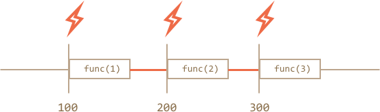
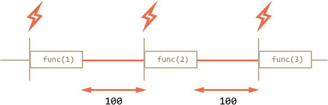

# Scheduling: setTimeout and setInterval

We may decide to execute a function not right now, but at a certain time later. That's called "scheduling a call".

There are two methods for it:

- `setTimeout` allows to run a function once after the interval of time.
- `setInterval` allows to run a function regularly with the interval between the runs.

These methods are not a part of JavaScript specification. But most environments have the internal scheduler and provide these methods. In particular, they are supported in all browsers and Node.js.


## setTimeout

The syntax:

```js
let timerId = setTimeout(func|code, [delay], [arg1], [arg2], ...)
```

Parameters:

`func|code`
: Function or a string of code to execute.
Usually, that's a function. For historical reasons, a string of code can be passed, but that's not recommended.

`delay`
: The delay before run, in milliseconds (1000 ms = 1 second), by default 0.

`arg1`, `arg2`...
: Arguments for the function (not supported in IE9-)

For instance, this code calls `sayHi()` after one second:

```js run
function sayHi() {
  alert('Hello');
}

*!*
setTimeout(sayHi, 1000);
*/!*
```

With arguments:

```js run
function sayHi(phrase, who) {
  alert( phrase + ', ' + who );
}

*!*
setTimeout(sayHi, 1000, "Hello", "John"); // Hello, John
*/!*
```

If the first argument is a string, then JavaScript creates a function from it.

So, this will also work:

```js run no-beautify
setTimeout("alert('Hello')", 1000);
```

But using strings is not recommended, use functions instead of them, like this:

```js run no-beautify
setTimeout(() => alert('Hello'), 1000);
```

````smart header="Pass a function, but don't run it"
Novice developers sometimes make a mistake by adding brackets `()` after the function:

```js
// wrong!
setTimeout(sayHi(), 1000);
```
That doesn't work, because `setTimeout` expects a reference to function. And here `sayHi()` runs the function, and the *result of its execution* is passed to `setTimeout`. In our case the result of `sayHi()` is `undefined` (the function returns nothing), so nothing is scheduled.
````

### Canceling with clearTimeout

A call to `setTimeout` returns a "timer identifier" `timerId` that we can use to cancel the execution.

The syntax to cancel:

```js
let timerId = setTimeout(...);
clearTimeout(timerId);
```

In the code below, we schedule the function and then cancel it (changed our mind). As a result, nothing happens:

```js run no-beautify
let timerId = setTimeout(() => alert("never happens"), 1000);
alert(timerId); // timer identifier

clearTimeout(timerId);
alert(timerId); // same identifier (doesn't become null after canceling)
```

As we can see from `alert` output, in a browser the timer identifier is a number. In other environments, this can be something else. For instance, Node.js returns a timer object with additional methods.

Again, there is no universal specification for these methods, so that's fine.

For browsers, timers are described in the [timers section](https://www.w3.org/TR/html5/webappapis.html#timers) of HTML5 standard.

## setInterval

The `setInterval` method has the same syntax as `setTimeout`:

```js
let timerId = setInterval(func|code, [delay], [arg1], [arg2], ...)
```

All arguments have the same meaning. But unlike `setTimeout` it runs the function not only once, but regularly after the given interval of time.

To stop further calls, we should call `clearInterval(timerId)`.

The following example will show the message every 2 seconds. After 5 seconds, the output is stopped:

```js run
// repeat with the interval of 2 seconds
let timerId = setInterval(() => alert('tick'), 2000);

// after 5 seconds stop
setTimeout(() => { clearInterval(timerId); alert('stop'); }, 5000);
```

```smart header="Time goes on while `alert` is shown"
In most browsers, including Chrome and Firefox the internal timer continues "ticking" while showing `alert/confirm/prompt`.

So if you run the code above and don't dismiss the `alert` window for some time, then in the next `alert` will be shown immediately as you do it. The actual interval between alerts will be shorter than 5 seconds.
```

## Recursive setTimeout

There are two ways of running something regularly.

One is `setInterval`. The other one is a recursive `setTimeout`, like this:

```js
/** instead of:
let timerId = setInterval(() => alert('tick'), 2000);
*/

let timerId = setTimeout(function tick() {
  alert('tick');
*!*
  timerId = setTimeout(tick, 2000); // (*)
*/!*
}, 2000);
```

The `setTimeout` above schedules the next call right at the end of the current one `(*)`.

The recursive `setTimeout` is a more flexible method than `setInterval`. This way the next call may be scheduled differently, depending on the results of the current one.

For instance, we need to write a service that sends a request to the server every 5 seconds asking for data, but in case the server is overloaded, it should increase the interval to 10, 20, 40 seconds...

Here's the pseudocode:
```js
let delay = 5000;

let timerId = setTimeout(function request() {
  ...send request...

  if (request failed due to server overload) {
    // increase the interval to the next run
    delay *= 2;
  }

  timerId = setTimeout(request, delay);

}, delay);
```


And if we the functions that we're scheduling are CPU-hungry, then we can measure the time taken by the execution and plan the next call sooner or later.

**Recursive `setTimeout` guarantees a delay between the executions, `setInterval` -- does not.**

Let's compare two code fragments. The first one uses `setInterval`:

```js
let i = 1;
setInterval(function() {
  func(i);
}, 100);
```

The second one uses recursive `setTimeout`:

```js
let i = 1;
setTimeout(function run() {
  func(i);
  setTimeout(run, 100);
}, 100);
```

For `setInterval` the internal scheduler will run `func(i)` every 100ms:



Did you notice?

**The real delay between `func` calls for `setInterval` is less than in the code!**

That's normal, because the time taken by `func`'s execution "consumes" a part of the interval.

It is possible that `func`'s execution turns out to be longer than we expected and takes more than 100ms.

In this case the engine waits for `func` to complete, then checks the scheduler and if the time is up, runs it again *immediately*.

In the edge case, if the function always executes longer than `delay` ms, then the calls will happen without a pause at all.

And here is the picture for the recursive `setTimeout`:



**The recursive `setTimeout` guarantees the fixed delay (here 100ms).**

That's because a new call is planned at the end of the previous one.

````smart header="Garbage collection"
When a function is passed in `setInterval/setTimeout`, an internal reference is created to it and saved in the scheduler. It prevents the function from being garbage collected, even if there are no other references to it.

```js
// the function stays in memory until the scheduler calls it
setTimeout(function() {...}, 100);
```

For `setInterval` the function stays in memory until `clearInterval` is called.

There's a side-effect. A function references the outer lexical environment, so, while it lives, outer variables live too. They may take much more memory than the function itself. So when we don't need the scheduled function anymore, it's better to cancel it, even if it's very small.
````

## setTimeout(...,0)

There's a special use case: `setTimeout(func, 0)`, or just `setTimeout(func)`.

This schedules the execution of `func` as soon as possible. But scheduler will invoke it only after the current code is complete.

So the function is scheduled to run "right after" the current code. In other words, *asynchronously*.

For instance, this outputs "Hello", then immediately "World":

```js run
setTimeout(() => alert("World"));

alert("Hello");
```

The first line "puts the call into calendar after 0ms". But the scheduler will only "check the calendar" after the current code is complete, so `"Hello"` is first, and `"World"` -- after it.

### Splitting CPU-hungry tasks

There's a trick to split CPU-hungry tasks using `setTimeout`.

For instance, a syntax-highlighting script (used to colorize code examples on this page) is quite CPU-heavy. To highlight the code, it performs the analysis, creates many colored elements, adds them to the document -- for a big text that takes a lot. It may even cause the browser to "hang", which is unacceptable.

So we can split the long text into pieces. First 100 lines, then plan another 100 lines using `setTimeout(..., 0)`, and so on.

For clarity, let's take a simpler example for consideration. We have a function to count from `1` to `1000000000`.

If you run it, the CPU will hang. For server-side JS that's clearly noticeable, and if you are running it in-browser, then try to click other buttons on the page -- you'll see that whole JavaScript actually is paused, no other actions work until it finishes.

```js run
let i = 0;

let start = Date.now();

function count() {

  // do a heavy job
  for (let j = 0; j < 1e9; j++) {
    i++;
  }

  alert("Done in " + (Date.now() - start) + 'ms');
}

count();
```

The browser may even show "the script takes too long" warning (but hopefully it won't, because the number is not very big).

Let's split the job using the nested `setTimeout`:

```js run
let i = 0;

let start = Date.now();

function count() {

  // do a piece of the heavy job (*)
  do {
    i++;
  } while (i % 1e6 != 0);

  if (i == 1e9) {
    alert("Done in " + (Date.now() - start) + 'ms');
  } else {
    setTimeout(count); // schedule the new call (**)
  }

}

count();
```

Now the browser UI is fully functional during the "counting" process.

We do a part of the job `(*)`:

1. First run: `i=1...1000000`.
2. Second run: `i=1000001..2000000`.
3. ...and so on, the `while` checks if `i` is evenly divided by `1000000`.

Then the next call is scheduled in `(**)` if we're not done yet.

Pauses between `count` executions provide just enough "breath" for the JavaScript engine to do something else, to react to other user actions.

The notable thing is that both variants -- with and without splitting the job by `setTimeout` -- are comparable in speed. There's no much difference in the overall counting time.

To make them closer, let's make an improvement.

We'll move the scheduling in the beginning of the `count()`:

```js run
let i = 0;

let start = Date.now();

function count() {

  // move the scheduling at the beginning
  if (i < 1e9 - 1e6) {
    setTimeout(count); // schedule the new call
  }

  do {
    i++;
  } while (i % 1e6 != 0);

  if (i == 1e9) {
    alert("Done in " + (Date.now() - start) + 'ms');
  }

}

count();
```

Now when we start to `count()` and see that we'll need to `count()` more, we schedule that immediately, before doing the job.

If you run it, it's easy to notice that it takes significantly less time.

````smart header="Minimal delay of nested timers in-browser"
In the browser, there's a limitation of how often nested timers can run. The [HTML5 standard](https://www.w3.org/TR/html5/webappapis.html#timers) says: "after five nested timers, the interval is forced to be at least four milliseconds.".

Let's demonstrate what it means with the example below. The `setTimeout` call in it re-schedules itself after `0ms`. Each call remembers the real time from the previous one in the `times` array. What do the real delays look like? Let's see:

```js run
let start = Date.now();
let times = [];

setTimeout(function run() {
  times.push(Date.now() - start); // remember delay from the previous call

  if (start + 100 < Date.now()) alert(times); // show the delays after 100ms
  else setTimeout(run); // else re-schedule
});

// an example of the output:
// 1,1,1,1,9,15,20,24,30,35,40,45,50,55,59,64,70,75,80,85,90,95,100
```

First timers run immediately (just as written in the spec), and then the delay comes into play and we see `9, 15, 20, 24...`.

That limitation comes from ancient times and many scripts rely on it, so it exists for historical reasons.

For server-side JavaScript, that limitation does not exist, and there exist other ways to schedule an immediate asynchronous job, like [process.nextTick](https://nodejs.org/api/process.html) and [setImmediate](https://nodejs.org/api/timers.html) for Node.js. So the notion is browser-specific only.
````

### Allowing the browser to render

Another benefit of splitting heavy tasks for browser scripts is that we can show a progress bar or something to the user.

Usually the browser does all "repainting" after the currently running code is complete. So if we do a single huge function that changes many elements, the changes are not painted out till it finishes.

Here's the demo:
```html run
<div id="progress"></div>

<script>
  let i = 0;

  function count() {
    for (let j = 0; j < 1e6; j++) {
      i++;
      // put the current i into the <div>
      // (we'll talk about innerHTML in the specific chapter, it just writes into element here)
      progress.innerHTML = i;
    }
  }

  count();
</script>
```

If you run it, the changes to `i` will show up after the whole count finishes.

And if we use `setTimeout` to split it into pieces then changes are applied in-between the runs, so this looks better:

```html run
<div id="progress"></div>

<script>
  let i = 0;

  function count() {

    // do a piece of the heavy job (*)
    do {
      i++;
      progress.innerHTML = i;
    } while (i % 1e3 != 0);

    if (i < 1e9) {
      setTimeout(count);
    }

  }

  count();
</script>
```

Now the `<div>` shows increasing values of `i`.

## Summary

- Methods `setInterval(func, delay, ...args)` and `setTimeout(func, delay, ...args)` allow to run the `func` regularly/once after `delay` milliseconds.
- To cancel the execution, we should call `clearInterval/clearTimeout` with the value returned by `setInterval/setTimeout`.
- Nested `setTimeout` calls is a more flexible alternative to `setInterval`. Also they can guarantee the minimal time *between* the executions.
- Zero-timeout scheduling `setTimeout(func, 0)` (the same as `setTimeout(func)`) is used to schedule the call "as soon as possible, but after the current code is complete".

Some use cases of `setTimeout(func)`:
- To split CPU-hungry tasks into pieces, so that the script doesn't "hang"
- To let the browser do something else while the process is going on (paint the progress bar).

Please note that all scheduling methods do not *guarantee* the exact delay. We should not rely on that in the scheduled code.

For example, the in-browser timer may slow down for a lot of reasons:
- The CPU is overloaded.
- The browser tab is in the background mode.
- The laptop is on battery.

All that may increase the minimal timer resolution (the minimal delay) to 300ms or even 1000ms depending on the browser and settings.
