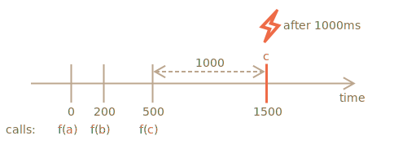

muhimlik: 5

---

# Debounce dekoratori

`Debounce(f, ms)` dekoratorining natijasi `ms` millisekundlik harakatsizlik (chawiruvlar yo'q, "sovutish davri") bo'lgunga qadar "f" ga chaqiruvlarni to'xtatib turadigan, so'ngra so'nggi argumentlar bilan `f` ni bir marta chaqiradigan o'ramdir. .

Boshqacha qilib aytadigan bo'lsak, `debounce` "telefon chaqiruvlarini" qabul qiladigan kotibga o'xshaydi va `ms` millisekundlar jim bo'lguncha kutadi. Va shundan keyingina u so'nggi chaqiruv ma'lumotlarini "xo'jayin" ga o'tkazadi (haqiqiy `f` ni chaqiradi).

Masalan, bizda `f` funksiyasi bor edi va uni `f = debounce(f, 1000)` bilan almashtirdik.

Agar o'ralgan funksiya 0ms, 200ms va 500ms da chaqirilsa va keyin hech qanday chaqiruvlar bo'lmasa, u holda haqiqiy `f` faqat bir marta, 1500ms da chaqiriladi. Ya'ni: oxirgi chaqiruvdan 1000 ms sovutish davridan keyin.



...Va u eng oxirgi chaqqiruvning dalillarini oladi, boshqa chaqiruvlar e'tiborga olinmaydi.

Quyida buning kodi ([Lodash kutubxonasi](https://lodash.com/docs/4.17.15#debounce) dan bekor qilish dekoratoridan foydalanadi):

```js
let f = _.debounce(alert, 1000);

f("a");
setTimeout( () => f("b"), 200);
setTimeout( () => f("c"), 500);
// o'chirilgan funksiya oxirgi chaqiruvdan keyin 1000 ms kutadi va keyin ishlaydi: alert("c")
```

Endi amaliy misol. Aytaylik, foydalanuvchi biror narsani yozadi va biz kiritish tugagach, serverga so‘rov yubormoqchimiz.

Har bir kiritilgan belgi uchun so'rov yuborishning ma'nosi yo'q. Buning o'rniga biz kutishni va keyin butun natijani qayta ishlashni xohlaymiz.

Veb-brauzerda biz event handlerni o'rnatishimiz mumkin -- kirish maydonining har bir o'zgarishida chaqiriladigan funksiya. Odatda, har bir kiritilgan kalit uchun eventhandler tez-tez chaqiriladi. Ammo agar biz uni 1000 ms ga `debounce` qilsak, u oxirgi kiritishdan keyin 1000 ms dan keyin faqat bir marta chaqiriladi.

```online

Ushbu jonli misolda event handler natijani quyidagi qutiga qo'yadi, sinab ko'ring:

[iframe border=1 src="debounce" height=200]

Ko'rdingizmi? Ikkinchi kirish o'chirilgan funksiyani chaqiradi, shuning uchun uning mazmuni oxirgi kirishdan 1000ms keyin qayta ishlanadi.
```

Shunday qilib, `debounce` - bu hodisalar ketma-ketligini qayta ishlashning ajoyib usuli: tugmachalarni bosish ketma-ketligi, sichqoncha harakati yoki boshqa narsa.

U oxirgi chaqiruvdan keyin berilgan vaqtni kutadi va keyin natijani qayta ishlay oladigan o'z funksiyasini ishga tushiradi.

Vazifa `debounce` dekoratorini amalga oshirishdir.

Maslahat: agar siz bu haqda o'ylab ko'rsangiz, bu faqat bir nechta satr :)
