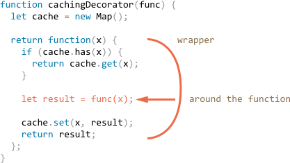

# Decorators and forwarding, call/apply

JavaScript gives exceptional flexibility when dealing with functions. They can be passed around, used as objects, and now we'll see how to *forward* calls between them and *decorate* them.

[cut]

## Transparent caching

Let's say we have a function `slow(x)` which is CPU-heavy, but its results are stable. In other words, for the same `x` it always returns the same result.

If the function is called often, we may want to cache (remember) the results for different `x` to avoid spending extra-time on recalculations.

But instead of adding that functionality into `slow()` we'll create a wrapper. As we'll see, there are many benefits of doing so.

Here's the code, and explanations follow:

```js run
function slow(x) {
  // there can be a heavy CPU-intensive job here
  alert(`Called with ${x}`);
  return x;
}

function cachingDecorator(func) {
  let cache = new Map();

  return function(x) {
    if (cache.has(x)) { // if the result is in the map
      return cache.get(x); // return it
    }

    let result = func(x); // otherwise call func

    cache.set(x, result); // and cache (remember) the result
    return result;
  };
}

slow = cachingDecorator(slow);

alert( slow(1) ); // slow(1) is cached
alert( "Again: " + slow(1) ); // the same

alert( slow(2) ); // slow(2) is cached
alert( "Again: " + slow(2) ); // the same as the previous line
```

In the code above `cachingDecorator` is a *decorator*: a special function that takes another function and alters its behavior.

The idea is that we can call `cachingDecorator` for any function, and it will return the caching wrapper. That's great, because we can have many functions that could use such a feature, and all we need to do is to apply `cachingDecorator` to them.

By separating caching from the main function code we also keep the main code simpler.

Now let's get into details of how it works.

The result of `cachingDecorator(func)` is a "wrapper": `function(x)` that "wraps" the call of `func(x)` into caching logic:



As we can see, the wrapper returns the result of `func(x)` "as is". From an outside code, the wrapped `slow` function still does the same. It just got a caching aspect added to its behavior.

To summarize, there are several benefits of using a separate `cachingDecorator` instead of altering the code of `slow` itself:

- The `cachingDecorator` is reusable. We can apply it to another function.
- The caching logic is separate, it did not increase the complexity of `slow` itself (if there were any).
- We can combine multiple decorators if needed (other decorators will follow).


## Using "func.call" for the context

The caching decorator mentioned above is not suited to work with object methods.

For instance, in the code below `user.format()` stops working after the decoration:

```js run
// we'll make worker.slow caching
let worker = {
  someMethod() {
    return 1;
  },

  slow(x) {
    // actually, there can be a scary CPU-heavy task here  
    alert("Called with " + x);
    return x * this.someMethod(); // (*)
  }
};

// same code as before
function cachingDecorator(func) {
  let cache = new Map();
  return function(x) {
    if (cache.has(x)) {
      return cache.get(x);
    }
*!*
    let result = func(x); // (**)
*/!*
    cache.set(x, result);
    return result;
  };
}

alert( worker.slow(1) ); // the original method works

worker.slow = cachingDecorator(worker.slow); // now make it caching

*!*
alert( worker.slow(2) ); // Whoops! Error: Cannot read property 'someMethod' of undefined
*/!*
```

The error occurs in the line `(*)` that tries to access `this.someMethod` and fails. Can you see why?

The reason is that the wrapper calls the original function as `func(x)` in the line `(**)`. And, when called like that, the function gets `this = undefined`.

We would observe a similar symptom if we tried to run:

```js
let func = worker.slow;
func(2);
```

So, the wrapper passes the call to the original method, but without the context `this`. Hence the error.

Let's fix it.

There's a special built-in function method [func.call(context, ...args)](mdn:js/Function/call) that allows to call a function explicitly setting `this`.

The syntax is:

```js
func.call(context, arg1, arg2, ...)
```

It runs `func` providing the first argument as `this`, and the next as the arguments.

To put it simply, these two calls do almost the same:
```js
func(1, 2, 3);
func.call(obj, 1, 2, 3)
```

They both call `func` with arguments `1`, `2` and `3`. The only difference is that `func.call` also sets `this` to `obj`.

As an example, in the code below we call `sayHi` in the context of different objects: `sayHi.call(user)` runs `sayHi` providing `this=user`, and the next line sets `this=admin`:

```js run
function sayHi() {
  alert(this.name);
}

let user = { name: "John" };
let admin = { name: "Admin" };

// use call to pass different objects as "this"
sayHi.call( user ); // this = John
sayHi.call( admin ); // this = Admin
```

And here we use `call` to call `say` with the given context and phrase:


```js run
function say(phrase) {
  alert(this.name + ': ' + phrase);
}

let user = { name: "John" };

// user becomes this, and "Hello" becomes the first argument
say.call( user, "Hello" ); // John: Hello
```


In our case, we can use `call` in the wrapper to pass the context to the original function:


```js run
let worker = {
  someMethod() {
    return 1;
  },

  slow(x) {
    alert("Called with " + x);
    return x * this.someMethod(); // (*)
  }
};

function cachingDecorator(func) {
  let cache = new Map();
  return function(x) {
    if (cache.has(x)) {
      return cache.get(x);
    }
*!*
    let result = func.call(this, x); // "this" is passed correctly now
*/!*
    cache.set(x, result);
    return result;
  };
}

worker.slow = cachingDecorator(worker.slow); // now make it caching

alert( worker.slow(2) ); // works
alert( worker.slow(2) ); // works, doesn't call the original (cached)
```

Now everything is fine.

To make it all clear, let's see more deeply how `this` is passed along:

1. After the decoration `worker.slow` is now the wrapper `function (x) { ... }`.
2. So when `worker.slow(2)` is executed, the wrapper gets `2` as an argument and `this=worker` (it's the object before dot).
3. Inside the wrapper, assuming the result is not yet cached, `func.call(this, x)` passes the current `this` (`=worker`) and the current argument (`=2`) to the original method.

## Going multi-argument with "func.apply"

Now let's make `cachingDecorator` even more universal. Till now it was working only with single-argument functions.

Now how to cache the multi-argument `worker.slow` method?

```js
let worker = {
  slow(min, max) {
    return min + max; // scary CPU-hogger is assumed
  }
};

// should remember same-argument calls
worker.slow = cachingDecorator(worker.slow);
```

We have two tasks to solve here.

First is how to use both arguments `min` and `max` for the key in `cache` map. Previously, for a single argument `x` we could just `cache.set(x, result)` to save the result and `cache.get(x)` to retrieve it. But now we need to remember the result for a *combination of arguments* `(min,max)`. The native `Map` takes single value only as the key.

There are many solutions possible:

1. Implement a new (or use a third-party) map-like data structure that is more versatile and allows multi-keys.
2. Use nested maps: `cache.set(min)` will be a `Map` that stores the pair `(max, result)`. So we can get `result` as `cache.get(min).get(max)`.
3. Join two values into one. In our particular case we can just use a string `"min,max"` as the `Map` key. For flexibility, we can allow to provide a *hashing function* for the decorator, that knows how to make one value from many.


For many practical applications, the 3rd variant is good enough, so we'll stick to it.

The second task to solve is how to pass many arguments to `func`. Currently, the wrapper `function(x)` assumes a single argument, and `func.call(this, x)` passes it.

Here we can use another built-in method [func.apply](mdn:js/Function/apply).

The syntax is:

```js
func.apply(context, args)
```

It runs the `func` setting `this=context` and using an array-like object `args` as the list of arguments.


For instance, these two calls are almost the same:

```js
func(1, 2, 3);
func.apply(context, [1, 2, 3])
```

Both run `func` giving it arguments `1,2,3`. But `apply` also sets `this=context`.

For instance, here `say` is called with `this=user` and `messageData` as a list of arguments:

```js run
function say(time, phrase) {
  alert(`[${time}] ${this.name}: ${phrase}`);
}

let user = { name: "John" };

let messageData = ['10:00', 'Hello']; // become time and phrase

*!*
// user becomes this, messageData is passed as a list of arguments (time, phrase)
say.apply(user, messageData); // [10:00] John: Hello (this=user)
*/!*
```

The only syntax difference between `call` and `apply` is that `call` expects a list of arguments, while `apply` takes an array-like object with them.

We already know the spread operator `...` from the chapter <info:rest-parameters-spread-operator> that can pass an array (or any iterable) as a list of arguments. So if we use it with `call`, we can achieve almost the same as `apply`.

These two calls are almost equivalent:

```js
let args = [1, 2, 3];

*!*
func.call(context, ...args); // pass an array as list with spread operator
func.apply(context, args);   // is same as using apply
*/!*
```

If we look more closely, there's a minor difference between such uses of `call` and `apply`.

- The spread operator `...` allows to pass *iterable* `args` as the list to `call`.
- The `apply` accepts only *array-like* `args`.

So, these calls complement each other. Where we expect an iterable, `call` works, where we expect an array-like, `apply` works.

And if `args` is both iterable and array-like, like a real array, then we technically could use any of them, but `apply` will probably be faster, because it's a single operation. Most JavaScript engines internally optimize is better than a pair `call + spread`.

One of the most important uses of `apply` is passing the call to another function, like this:

```js
let wrapper = function() {
  return anotherFunction.apply(this, arguments);
};
```

That's called *call forwarding*. The `wrapper` passes everything it gets: the context `this` and arguments to `anotherFunction` and returns back its result.

When an external code calls such `wrapper`, it is indistinguishable from the call of the original function.

Now let's bake it all into the more powerful `cachingDecorator`:

```js run
let worker = {
  slow(min, max) {
    alert(`Called with ${min},${max}`);
    return min + max;
  }
};

function cachingDecorator(func, hash) {
  let cache = new Map();
  return function() {
*!*
    let key = hash(arguments); // (*)
*/!*
    if (cache.has(key)) {
      return cache.get(key);
    }

*!*
    let result = func.apply(this, arguments); // (**)
*/!*

    cache.set(key, result);
    return result;
  };
}

function hash(args) {
  return args[0] + ',' + args[1];
}

worker.slow = cachingDecorator(worker.slow, hash);

alert( worker.slow(3, 5) ); // works
alert( "Again " + worker.slow(3, 5) ); // same (cached)
```

Now the wrapper operates with any number of arguments.

There are two changes:

- In the line `(*)` it calls `hash` to create a single key from `arguments`. Here we use a simple "joining" function that turns arguments `(3, 5)` into the key `"3,5"`. More complex cases may require other hashing functions.
- Then `(**)` uses `func.apply` to pass both the context and all arguments the wrapper got (no matter how many) to the original function.


## Borrowing a method [#method-borrowing]

Now let's make one more minor improvement in the hashing function:

```js
function hash(args) {
  return args[0] + ',' + args[1];
}
```

As of now, it works only on two arguments. It would be better if it could glue any number of `args`.

The natural solution would be to use [arr.join](mdn:js/Array/join) method:

```js
function hash(args) {
  return args.join();
}
```

...Unfortunately, that won't work. Because we are calling `hash(arguments)` and `arguments` object is both iterable and array-like, but not a real array.

So calling `join` on it would fail, as we can see below:

```js run
function hash() {
*!*
  alert( arguments.join() ); // Error: arguments.join is not a function
*/!*
}

hash(1, 2);
```

Still, there's an easy way to use array join:

```js run
function hash() {
*!*
  alert( [].join.call(arguments) ); // 1,2
*/!*
}

hash(1, 2);
```

The trick is called *method borrowing*.

We take (borrow) a join method from a regular array `[].join`. And use `[].join.call` to run it in the context of `arguments`.

Why does it work?

That's because the internal algorithm of the native method `arr.join(glue)` is very simple.

Taken from the specification almost "as-is":

1. Let `glue` be the first argument or, if no arguments, then a comma `","`.
2. Let `result` be an empty string.
3. Append `this[0]` to `result`.
4. Append `glue` and `this[1]`.
5. Append `glue` and `this[2]`.
6. ...Do so until `this.length` items are glued.
7. Return `result`.

So, technically it takes `this` and joins `this[0]`, `this[1]` ...etc together. It's intentionally written in a way that allows any array-like `this` (not a coincidence, many methods follow this practice). That's why it also works with `this=arguments`.

## Summary

*Decorator* is a wrapper around a function that alters its behavior. The main job is still carried out by the function.

It is generally safe to replace a function or a method with a decorated one, except for one little thing. If the original function had properties on it, like `func.calledCount` or whatever, then the decorated one will not provide them. Because that is a wrapper. So one needs to be careful if one uses them. Some decorators provide their own properties.

Decorators can be seen as "features" or "aspects" that can be added to a function. We can add one or add many. And all this without changing its code!

To implement `cachingDecorator`, we studied methods:

- [func.call(context, arg1, arg2...)](mdn:js/Function/call) -- calls `func` with given context and arguments.
- [func.apply(context, args)](mdn:js/Function/apply) -- calls `func` passing `context` as `this` and array-like `args` into a list of arguments.

The generic *call forwarding* is usually done with `apply`:

```js
let wrapper = function() {
  return original.apply(this, arguments);
}
```

We also saw an example of *method borrowing* when we take a method from an object and `call` it in the context of another object. It is quite common to take array methods and apply them to arguments. The alternative is to use rest parameters object that is a real array.


There are many decorators there in the wild. Check how well you got them by solving the tasks of this chapter.
