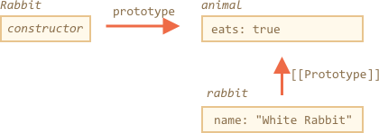
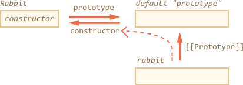

# F.prototype

In modern JavaScript we can set a prototype using `__proto__`, as described in the previous article. But it wasn't like that all the time.

[cut]

JavaScript has had prototypal inheritance from the beginning. It was one of the core features of the language.

But in the old times, there was another (and the only) way to set it: to use a `"prototype"` property of the constructor function. And there are still many scripts that use it.

## The "prototype" property

As we know already, `new F()` creates a new object.

When a new object is created with `new F()`, the object's `[[Prototype]]` is set to `F.prototype`.

In other words, if `F` has a `prototype` property with a value of the object type, then `new` operator uses it to set `[[Prototype]]` for the new object.

Please note that `F.prototype` here means a regular property named `"prototype"` on `F`. It sounds something similar to the term "prototype", but here we really mean a regular property with this name.

Here's the example:

```js run
let animal = {
  eats: true
};

function Rabbit(name) {
  this.name = name;
}

*!*
Rabbit.prototype = animal;
*/!*

let rabbit = new Rabbit("White Rabbit"); //  rabbit.__proto__ == animal

alert( rabbit.eats ); // true
```

Setting `Rabbit.prototype = animal` literally states the following: "When a `new Rabbit` is created, assign its `[[Prototype]]` to `animal`".

That's the resulting picture:



On the picture, `"prototype"` is a horizontal arrow, it's a regular property, and `[[Prototype]]` is vertical, meaning the inheritance of `rabbit` from `animal`.


## Default F.prototype, constructor property

Every function has the `"prototype"` property even if we don't supply it.

The default `"prototype"` is an object with the only property `constructor` that points back to the function itself.

Like this:

```js
function Rabbit() {}

/* default prototype
Rabbit.prototype = { constructor: Rabbit };
*/
```


We can check it:

```js run
function Rabbit() {}
// by default:
// Rabbit.prototype = { constructor: Rabbit }

alert( Rabbit.prototype.constructor == Rabbit ); // true
```

Naturally, if we do nothing, the `constructor` property is available to all rabbits through  `[[Prototype]]`:

```js run
function Rabbit() {}
// by default:
// Rabbit.prototype = { constructor: Rabbit }

let rabbit = new Rabbit(); // inherits from {constructor: Rabbit}

alert(rabbit.constructor == Rabbit); // true (from prototype)
```



We can use `constructor` property to create a new object using the same constructor as the existing one.

Like here:

```js run
function Rabbit(name) {
  this.name = name;
  alert(name);
}

let rabbit = new Rabbit("White Rabbit");

*!*
let rabbit2 = new rabbit.constructor("Black Rabbit");
*/!*
```

That's handy when we have an object, don't know which constructor was used for it (e.g. it comes from a 3rd party library), and we need to create another one of the same kind.

But probably the most important thing about `"constructor"` is that...

**...JavaScript itself does not ensure the right `"constructor"` value.**

Yes, it exists in the default `"prototype"` for functions, but that's all. What happens with it later -- is totally on us.

In particular, if we replace the default prototype as a whole, then there will be no `"constructor"` in it.

For instance:

```js run
function Rabbit() {}
Rabbit.prototype = {
  jumps: true
};

let rabbit = new Rabbit();
*!*
alert(rabbit.constructor === Rabbit); // false
*/!*
```

So, to keep the right `"constructor"` we can choose to add/remove properties to the default `"prototype"` instead of overwriting it as a whole:

```js
function Rabbit() {}

// Not overwrite Rabbit.prototype totally
// just add to it
Rabbit.prototype.jumps = true
// the default Rabbit.prototype.constructor is preserved
```

Or, alternatively, recreate the `constructor` property it manually:

```js
Rabbit.prototype = {
  jumps: true,
*!*
  constructor: Rabbit
*/!*
};

// now constructor is also correct, because we added it
```


## Summary

In this chapter we briefly described the way of setting a `[[Prototype]]` for objects created via a constructor function. Later we'll see more advanced programming patterns that rely on it.

Everything is quite simple, just few notes to make things clear:

- The `F.prototype` property is not the same as `[[Prototype]]`. The only thing `F.prototype` does: it sets `[[Prototype]]` of new objects when `new F()` is called.
- The value of `F.prototype` should be either an object or null: other values won't work.
-  The `"prototype"` property only has such a special effect when is set to a constructor function, and invoked with `new`.

On regular objects the `prototype` is nothing special:
```js
let user = {
  name: "John",
  prototype: "Bla-bla" // no magic at all
};
```

By default all functions have `F.prototype = { constructor: F }`, so we can get the constructor of an object by accessing its `"constructor"` property.
