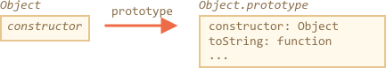
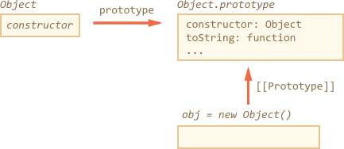
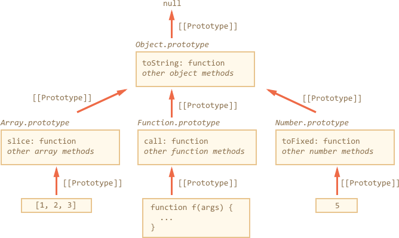
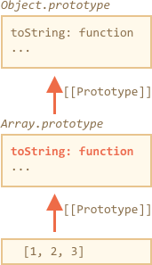

# Native prototypes

The `"prototype"` property is widely used by the core of JavaScript itself. All built-in constructor functions use it.

We'll see how it is for plain objects first, and then for more complex ones.

## Object.prototype

Let's say we output an empty object:

```js run
let obj = {};
alert( obj ); // "[object Object]" ?
```

Where's the code that generates the string `"[object Object]"`? That's a built-in `toString` method, but where is it? The `obj` is empty!

...But the short notation `obj = {}` is the same as `obj = new Object()`, where `Object` -- is a built-in object constructor function. And that function has `Object.prototype` that references a huge object with `toString` and other functions.

Like this (all that is built-in):



When `new Object()` is called (or a literal object `{...}` is created), the `[[Prototype]]` of it is set to `Object.prototype` by the rule that we've discussed in the previous chapter:



Afterwards when `obj.toString()` is called -- the method is taken from `Object.prototype`.

We can check it like this:

```js run
let obj = {};

alert(obj.__proto__ === Object.prototype); // true
// obj.toString === obj.__proto__.toString == Object.prototype.toString
```

Please note that there is no additional `[[Prototype]]` in the chain above `Object.prototype`:

```js run
alert(Object.prototype.__proto__); // null
```

## Other built-in prototypes

Other built-in objects such as `Array`, `Date`, `Function` and others also keep methods in prototypes.

For instance, when we create an array `[1, 2, 3]`, the default `new Array()` constructor is  used internally. So the array data is written into the new object, and `Array.prototype` becomes its prototype and provides methods. That's very memory-efficient.

By specification, all built-in prototypes have `Object.prototype` on the top. Sometimes people say that "everything inherits from objects".

Here's the overall picture (for 3 built-ins to fit):



Let's check the prototypes manually:

```js run
let arr = [1, 2, 3];

// it inherits from Array.prototype?
alert( arr.__proto__ === Array.prototype ); // true

// then from Object.prototype?
alert( arr.__proto__.__proto__ === Object.prototype ); // true

// and null on the top.
alert( arr.__proto__.__proto__.__proto__ ); // null
```

Some methods in prototypes may overlap, for instance, `Array.prototype` has its own `toString` that lists comma-delimited elements:

```js run
let arr = [1, 2, 3]
alert(arr); // 1,2,3 <-- the result of Array.prototype.toString
```

As we've seen before, `Object.prototype` has `toString` as well, but `Array.prototype` is closer in the chain, so the array variant is used.





In-browser tools like Chrome developer console also show inheritance (may need to use `console.dir` for built-in objects):


Other built-in objects also work the same way. Even functions. They are objects of a built-in `Function` constructor, and their methods: `call/apply` and others are taken from `Function.prototype`. Functions have their own `toString` too.

```js run
function f() {}

alert(f.__proto__ == Function.prototype); // true
alert(f.__proto__.__proto__ == Object.prototype); // true, inherit from objects
```

## Primitives

The most intricate thing happens with strings, numbers and booleans.

As we remember, they are not objects. But if we try to access their properties, then temporary wrapper objects are created using built-in constructors `String`, `Number`, `Boolean`, they provide the methods and disappear.

These objects are created invisibly to us and most engines optimize them out, but the specification describes it exactly this way. Methods of these objects also reside in prototypes, available as `String.prototype`, `Number.prototype` and `Boolean.prototype`.

```warn header="Values `null` and `undefined` have no object wrappers"
Special values `null` and `undefined` stand apart. They have no object wrappers, so methods and properties are not available for them. And there are no corresponding prototypes too.
```

## Changing native prototypes [#native-prototype-change]

Native prototypes can be modified. For instance, if we add a method to `String.prototype`,  it becomes available to all strings:

```js run
String.prototype.show = function() {
  alert(this);
};

"BOOM!".show(); // BOOM!
```

During the process of development we may have ideas which new built-in methods we'd like to have. And there may be a slight temptation to add them to native prototypes. But that is generally a bad idea.

Prototypes are global, so it's easy to get a conflict. If two libraries add a method `String.prototype.show`, then one of them overwrites the other one.

In modern programming, there is only one case when modifying native prototypes is approved. That's polyfills. In other words, if there's a method in JavaScript specification that is not yet supported by our JavaScript engine (or any of those that we want to support), then may implement it manually and populate the built-in prototype with it.

For instance:

```js run
if (!String.prototype.repeat) { // if there's no such method
  // add it to the prototype

  String.prototype.repeat = function(n) {
    // repeat the string n times

    // actually, the code should be more complex than that,
    // throw errors for negative values of "n"
    // the full algorithm is in the specification
    return new Array(n + 1).join(this);
  };
}

alert( "La".repeat(3) ); // LaLaLa
```

## Borrowing from prototypes

In the chapter <info:call-apply-decorators#method-borrowing> we talked about method borrowing:

```js run
function showArgs() {
*!*
  // borrow join from array and call in the context of arguments
  alert( [].join.call(arguments, " - ") );
*/!*
}

showArgs("John", "Pete", "Alice"); // John - Pete - Alice
```

Because `join` resides in `Array.prototype`, we can call it from there directly and rewrite it as:

```js
function showArgs() {
*!*
  alert( Array.prototype.join.call(arguments, " - ") );
*/!*
}
```

That's more efficient, because it avoids the creation of an extra array object `[]`. On the other hand, it is longer to write.

## Summary

- All built-in objects follow the same pattern:
    - The methods are stored in the prototype (`Array.prototype`, `Object.prototype`, `Date.prototype` etc).
    - The object itself stores only the data (array items, object properties, the date).
- Primitives also store methods in prototypes of wrapper objects: `Number.prototype`, `String.prototype`, `Boolean.prototype`. There are no wrapper objects only for `undefined` and `null`.
- Built-in prototypes can be modified or populated with new methods. But it's not recommended to change them. Probably the only allowable cause is when we add-in a new standard, but not yet supported by the engine JavaScript method.
