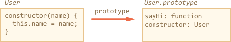

# Classes

The "class" construct allows to define prototype-based classes with a clean, nice-looking syntax.

[cut]

## The "class" syntax

The `class` syntax is versatile, we'll start from a simple example first.

Here's a prototype-based class `User`:

```js run
function User(name) {
  this.name = name;
}

User.prototype.sayHi = function() {
  alert(this.name);
}

let user = new User("John");
user.sayHi();
```

...And that's the same using `class` syntax:

```js run
class User {

  constructor(name) {
    this.name = name;
  }

  sayHi() {
    alert(this.name);
  }

}

let user = new User("John");
user.sayHi();
```

It's easy to see that the two examples are alike. Just please note that methods in a class do not have a comma between them. Novice developers sometimes forget it and put a comma between class methods, and things don't work. That's not a literal object, but a class syntax.

So, what exactly does `class` do? We may think that it defines a new language-level entity, but that would be wrong.

The `class User {...}` here actually does two things:

1. Declares a variable `User` that references the function named `"constructor"`.
2. Puts into `User.prototype` methods listed in the definition. Here it includes `sayHi` and the `constructor`.

Here's the code to dig into the class and see that:

```js run
class User {
  constructor(name) { this.name = name; }
  sayHi() { alert(this.name);  }
}

*!*
// proof: User is the "constructor" function
*/!*
alert(User == User.prototype.constructor); // true

*!*
// proof: there are two methods in its "prototype"
*/!*
alert(Object.getOwnPropertyNames(User.prototype)); // constructor, sayHi
```

Here's the illustration of what `class User` creates:




So `class` is a special syntax to define a constructor together with its prototype methods.

...But not only that. There are minor tweaks here and there:

Constructors require `new`
: Unlike a regular function, a class `constructor` can't be called without `new`:

```js run
class User {
  constructor() {}
}

alert(typeof User); // function
User(); // Error: Class constructor User cannot be invoked without 'new'
```

Different string output
: If we output it like `alert(User)`, some engines show `"class User..."`, while others show `"function User..."`.

Please don't be confused: the string representation may vary, but that's still a function, there is no separate "class" entity in JavaScript language.

Class methods are non-enumerable
: A class definition sets `enumerable` flag to `false` for all methods in the `"prototype"`. That's good, because if we `for..in` over an object, we usually don't want its class methods.

Classes have a default `constructor() {}`
: If there's no `constructor` in the `class` construct, then an empty function is generated, same as if we had written `constructor() {}`.

Classes always `use strict`
: All code inside the class construct is automatically in strict mode.

### Getters/setters

Classes may also include getters/setters. Here's an example with `user.name` implemented using them:

```js run
class User {

  constructor(name) {
    // invokes the setter
    this.name = name;
  }

*!*
  get name() {
*/!*
    return this._name;
  }

*!*
  set name(value) {
*/!*
    if (value.length < 4) {
      alert("Name too short.");
      return;
    }
    this._name = value;
  }

}

let user = new User("John");
alert(user.name); // John

user = new User(""); // Name too short.
```

Internally, getters and setters are also created on the `User` prototype, like this:

```js
Object.defineProperty(User.prototype, {
  name: {
    get() {
      return this._name
    },
    set(name) {
      // ...
    }
  }
});
```

### Only methods

Unlike object literals, no `property:value` assignments are allowed inside `class`. There may be only methods and getters/setters. There is some work going on in the specification to lift that limitation, but it's not yet there.

If we really need to put a non-function value into the prototype, then we can alter `prototype` manually, like this:

```js run
class User { }

User.prototype.test = 5;

alert( new User().test ); // 5
```

So, technically that's possible, but we should know why we're doing it. Such properties will be shared among all objects of the class.

An "in-class" alternative is to use a getter:

```js run
class User {
  get test() {
    return 5;
  }
}

alert( new User().test ); // 5
```

From the external code, the usage is the same. But the getter variant is a bit slower.

## Class Expression

Just like functions, classes can be defined inside another expression, passed around, returned etc.

Here's a class-returning function ("class factory"):

```js run
function makeClass(phrase) {
*!*
  // declare a class and return it
  return class {
    sayHi() {
      alert(phrase);
    };
  };
*/!*
}

let User = makeClass("Hello");

new User().sayHi(); // Hello
```

That's quite normal if we recall that `class` is just a special form of a function-with-prototype definition.

And, like Named Function Expressions, such classes also may have a name, that is visible inside that class only:

```js run
// "Named Class Expression" (alas, no such term, but that's what's going on)
let User = class *!*MyClass*/!* {
  sayHi() {
    alert(MyClass); // MyClass is visible only inside the class
  }
};

new User().sayHi(); // works, shows MyClass definition

alert(MyClass); // error, MyClass not visible outside of the class
```

## Static methods

We can also assign methods to the class function, not to its `"prototype"`. Such methods are called *static*.

An example:

```js run
class User {
*!*
  static staticMethod() {
*/!*
    alert(this == User);
  }
}

User.staticMethod(); // true
```

That actually does the same as assigning it as a function property:

```js
function User() { }

User.staticMethod = function() {
  alert(this == User);
};
```

The value of `this` inside `User.staticMethod()` is the class constructor `User` itself (the "object before dot" rule).

Usually, static methods are used to implement functions that belong to the class, but not to any particular object of it.

For instance, we have `Article` objects and need a function to compare them. The natural choice would be `Article.compare`, like this:

```js run
class Article {
  constructor(title, date) {
    this.title = title;
    this.date = date;
  }

*!*
  static compare(articleA, articleB) {
    return articleA.date - articleB.date;
  }
*/!*
}

// usage
let articles = [
  new Article("Mind", new Date(2016, 1, 1)),
  new Article("Body", new Date(2016, 0, 1)),
  new Article("JavaScript", new Date(2016, 11, 1))
];

*!*
articles.sort(Article.compare);
*/!*

alert( articles[0].title ); // Body
```

Here `Article.compare` stands "over" the articles, as a means to compare them. It's not a method of an article, but rather of the whole class.

Another example would be a so-called "factory" method. Imagine, we need few ways to create an article:

1. Create by given parameters (`title`, `date` etc).
2. Create an empty article with today's date.
3. ...

The first way can be implemented by the constructor. And for the second one we can make a static method of the class.

Like `Article.createTodays()` here:

```js run
class Article {
  constructor(title, date) {
    this.title = title;
    this.date = date;
  }

*!*
  static createTodays() {
    // remember, this = Article
    return new this("Todays digest", new Date());
  }
*/!*
}

let article = Article.createTodays();

alert( article.title ); // Todays digest
```

Now every time we need to create a todays digest, we can call `Article.createTodays()`. Once again, that's not a method of an article, but a method of the whole class.

Static methods are also used in database-related classes to search/save/remove entries from the database, like this:

```js
// assuming Article is a special class for managing articles
// static method to remove the article:
Article.remove({id: 12345});
```

## Summary

The basic class syntax looks like this:

```js
class MyClass {
  constructor(...) {
    // ...
  }
  method1(...) {}
  method2(...) {}
  get something(...) {}
  set something(...) {}
  static staticMethod(..) {}
  // ...
}
```

The value of `MyClass` is a function provided as `constructor`. If there's no `constructor`, then an empty function.

In any case, methods listed in the class declaration become members of its `prototype`, with the exception of static methods that are written into the function itself and callable as `MyClass.staticMethod()`. Static methods are used when we need a function bound to a class, but not to any object of that class.

In the next chapter we'll learn more about classes, including inheritance.
