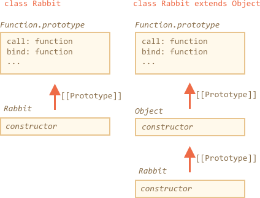

The answer has two parts.

The first, an easy one is that the inheriting class needs to call `super()` in the constructor. Otherwise `"this"` won't be "defined".

So here's the fix:

```js run
class Rabbit extends Object {
  constructor(name) {
*!*
    super(); // need to call the parent constructor when inheriting
*/!*
    this.name = name;
  }
}

let rabbit = new Rabbit("Rab");

alert( rabbit.hasOwnProperty('name') ); // true
```

But that's not all yet.

Even after the fix, there's still important difference in `"class Rabbit extends Object"` versus `class Rabbit`.

As we know, the "extends" syntax sets up two prototypes:

1. Between `"prototype"` of the constructor functions (for methods).
2. Between the constructor functions itself (for static methods).

In our case, for `class Rabbit extends Object` it means:

```js run
class Rabbit extends Object {}

alert( Rabbit.prototype.__proto__ === Object.prototype ); // (1) true
alert( Rabbit.__proto__ === Object ); // (2) true
```

So we can access static methods of `Object` via `Rabbit`, like this:

```js run
class Rabbit extends Object {}

*!*
// normally we call Object.getOwnPropertyNames
alert ( Rabbit.getOwnPropertyNames({a: 1, b: 2})); // a,b
*/!*
```

And if we don't use `extends`, then `class Rabbit` does not get the second reference.

Please compare with it:

```js run
class Rabbit {}

alert( Rabbit.prototype.__proto__ === Object.prototype ); // (1) true
alert( Rabbit.__proto__ === Object ); // (2) false (!)

*!*
// error, no such function in Rabbit
alert ( Rabbit.getOwnPropertyNames({a: 1, b: 2})); // Error
*/!*
```

For the simple `class Rabbit`, the `Rabbit` function has the same prototype

```js run
class Rabbit {}

// instead of (2) that's correct for Rabbit (just like any function):
alert( Rabbit.__proto__ === Function.prototype );
```

By the way, `Function.prototype` has "generic" function methods, like `call`, `bind` etc. They are ultimately available in both cases, because for the built-in `Object` constructor, `Object.__proto__ === Function.prototype`.

Here's the picture:



So, to put it short, there are two differences:

| class Rabbit | class Rabbit extends Object  |
|--------------|------------------------------|
| --             | needs to call `super()` in constructor |
| `Rabbit.__proto__ === Function.prototype` | `Rabbit.__proto__ === Object` |
