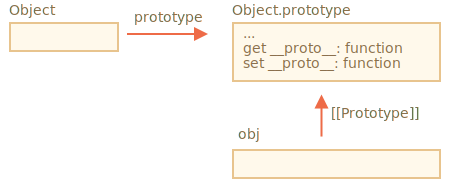
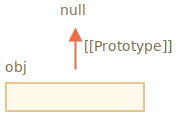

# Prototype methods, objects without __proto__

In the first chapter of this section, we mentioned that there are modern methods to setup a prototype.

Setting or reading the prototype with `obj.__proto__` is considered outdated and somewhat deprecated (moved to the so-called "Annex B" of the JavaScript standard, meant for browsers only).

The modern methods to get/set a prototype are:

- [Object.getPrototypeOf(obj)](mdn:js/Object/getPrototypeOf) -- returns the `[[Prototype]]` of `obj`.
- [Object.setPrototypeOf(obj, proto)](mdn:js/Object/setPrototypeOf) -- sets the `[[Prototype]]` of `obj` to `proto`.

The only usage of `__proto__`, that's not frowned upon, is as a property when creating a new object: `{ __proto__: ... }`.

Although, there's a special method for this too:

- [Object.create(proto[, descriptors])](mdn:js/Object/create) -- creates an empty object with given `proto` as `[[Prototype]]` and optional property descriptors.

For instance:

```js run
let animal = {
  eats: true
};

// create a new object with animal as a prototype
*!*
let rabbit = Object.create(animal); // same as {__proto__: animal}
*/!*

alert(rabbit.eats); // true

*!*
alert(Object.getPrototypeOf(rabbit) === animal); // true
*/!*

*!*
Object.setPrototypeOf(rabbit, {}); // change the prototype of rabbit to {}
*/!*
```

The `Object.create` method is a bit more powerful, as it has an optional second argument: property descriptors.

We can provide additional properties to the new object there, like this:

```js run
let animal = {
  eats: true
};

let rabbit = Object.create(animal, {
  jumps: {
    value: true
  }
});

alert(rabbit.jumps); // true
```

The descriptors are in the same format as described in the chapter <info:property-descriptors>.

We can use `Object.create` to perform an object cloning more powerful than copying properties in `for..in`:

```js
let clone = Object.create(
  Object.getPrototypeOf(obj), Object.getOwnPropertyDescriptors(obj)
);
```

This call makes a truly exact copy of `obj`, including all properties: enumerable and non-enumerable, data properties and setters/getters -- everything, and with the right `[[Prototype]]`.


## Brief history

There're so many ways to manage `[[Prototype]]`. How did that happen? Why?

That's for historical reasons.

The prototypal inheritance was in the language since its dawn, but the ways to manage it evolved over time.

- The `prototype` property of a constructor function has worked since very ancient times. It's the oldest way to create objects with a given prototype.
- Later, in the year 2012, `Object.create` appeared in the standard. It gave the ability to create objects with a given prototype, but did not provide the ability to get/set it. Some browsers implemented the non-standard `__proto__` accessor that allowed the user to get/set a prototype at any time, to give more flexibility to developers.
- Later, in the year 2015, `Object.setPrototypeOf` and `Object.getPrototypeOf` were added to the standard, to perform the same functionality as `__proto__`. As `__proto__` was de-facto implemented everywhere, it was kind-of deprecated and made its way to the Annex B of the standard, that is: optional for non-browser environments.
- Later, in the year 2022, it was officially allowed to use `__proto__` in object literals `{...}` (moved out of Annex B), but not as a getter/setter `obj.__proto__` (still in Annex B).

Why was `__proto__` replaced by the functions `getPrototypeOf/setPrototypeOf`?

Why was `__proto__` partially rehabilitated and its usage allowed in `{...}`, but not as a getter/setter?

That's an interesting question, requiring us to understand why `__proto__` is bad.

And soon we'll get the answer.

```warn header="Don't change `[[Prototype]]` on existing objects if speed matters"
Technically, we can get/set `[[Prototype]]` at any time. But usually we only set it once at the object creation time and don't modify it anymore: `rabbit` inherits from `animal`, and that is not going to change.

And JavaScript engines are highly optimized for this. Changing a prototype "on-the-fly" with `Object.setPrototypeOf` or `obj.__proto__=` is a very slow operation as it breaks internal optimizations for object property access operations. So avoid it unless you know what you're doing, or JavaScript speed totally doesn't matter for you.
```

## "Very plain" objects [#very-plain]

As we know, objects can be used as associative arrays to store key/value pairs.

...But if we try to store *user-provided* keys in it (for instance, a user-entered dictionary), we can see an interesting glitch: all keys work fine except `"__proto__"`.

Check out the example:

```js run
let obj = {};

let key = prompt("What's the key?", "__proto__");
obj[key] = "some value";

alert(obj[key]); // [object Object], not "some value"!
```

Here, if the user types in `__proto__`, the assignment in line 4 is ignored!

That could surely be surprising for a non-developer, but pretty understandable for us. The `__proto__` property is special: it must be either an object or `null`. A string can not become a prototype. That's why an assignment a string to `__proto__` is ignored.

But we didn't *intend* to implement such behavior, right? We want to store key/value pairs, and the key named `"__proto__"` was not properly saved. So that's a bug!

Here the consequences are not terrible. But in other cases we may be storing objects instead of strings in `obj`, and then the prototype will indeed be changed. As a result, the execution will go wrong in totally unexpected ways.

What's worse -- usually developers do not think about such possibility at all. That makes such bugs hard to notice and even turn them into vulnerabilities, especially when JavaScript is used on server-side.

Unexpected things also may happen when assigning to `obj.toString`, as it's a built-in object method.

How can we avoid this problem?

First, we can just switch to using `Map` for storage instead of plain objects, then everything's fine:

```js run
let map = new Map();

let key = prompt("What's the key?", "__proto__");
map.set(key, "some value");

alert(map.get(key)); // "some value" (as intended)
```

...But `Object` syntax is often more appealing, as it's more concise.

Fortunately, we *can* use objects, because language creators gave thought to that problem long ago.

As we know, `__proto__` is not a property of an object, but an accessor property of `Object.prototype`:



So, if `obj.__proto__` is read or set, the corresponding getter/setter is called from its prototype, and it gets/sets `[[Prototype]]`.

As it was said in the beginning of this tutorial section: `__proto__` is a way to access `[[Prototype]]`, it is not `[[Prototype]]` itself.

Now, if we intend to use an object as an associative array and be free of such problems, we can do it with a little trick:

```js run
*!*
let obj = Object.create(null);
// or: obj = { __proto__: null }
*/!*

let key = prompt("What's the key?", "__proto__");
obj[key] = "some value";

alert(obj[key]); // "some value"
```

`Object.create(null)` creates an empty object without a prototype (`[[Prototype]]` is `null`):



So, there is no inherited getter/setter for `__proto__`. Now it is processed as a regular data property, so the example above works right.

We can call such objects "very plain" or "pure dictionary" objects, because they are even simpler than the regular plain object `{...}`.

A downside is that such objects lack any built-in object methods, e.g. `toString`:

```js run
*!*
let obj = Object.create(null);
*/!*

alert(obj); // Error (no toString)
```

...But that's usually fine for associative arrays.

Note that most object-related methods are `Object.something(...)`, like `Object.keys(obj)` -- they are not in the prototype, so they will keep working on such objects:


```js run
let chineseDictionary = Object.create(null);
chineseDictionary.hello = "你好";
chineseDictionary.bye = "再见";

alert(Object.keys(chineseDictionary)); // hello,bye
```

## Summary

- To create an object with the given prototype, use:

    - literal syntax: `{ __proto__: ... }`, allows to specify multiple properties
    - or [Object.create(proto[, descriptors])](mdn:js/Object/create), allows to specify property descriptors.

    The `Object.create` provides an easy way to shallow-copy an object with all descriptors:

    ```js
    let clone = Object.create(Object.getPrototypeOf(obj), Object.getOwnPropertyDescriptors(obj));
    ```

- Modern methods to get/set the prototype are:

    - [Object.getPrototypeOf(obj)](mdn:js/Object/getPrototypeOf) -- returns the `[[Prototype]]` of `obj` (same as `__proto__` getter).
    - [Object.setPrototypeOf(obj, proto)](mdn:js/Object/setPrototypeOf) -- sets the `[[Prototype]]` of `obj` to `proto` (same as `__proto__` setter).

- Getting/setting the prototype using the built-in `__proto__` getter/setter isn't recommended, it's now in the Annex B of the specification.

- We also covered prototype-less objects, created with `Object.create(null)` or `{__proto__: null}`.

    These objects are used as dictionaries, to store any (possibly user-generated) keys.

    Normally, objects inherit built-in methods and `__proto__` getter/setter from `Object.prototype`, making corresponding keys "occupied" and potentially causing side effects. With `null` prototype, objects are truly empty.
