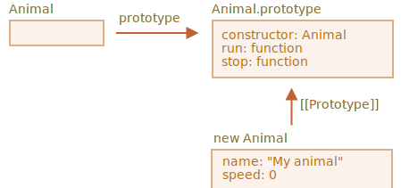

# Class inheritance

Let's say we have two classes.

`Animal`:

```js
class Animal {
  constructor(name) {
    this.speed = 0;
    this.name = name;
  }
  run(speed) {
    this.speed += speed;
    alert(`${this.name} runs with speed ${this.speed}.`);
  }
  stop() {
    this.speed = 0;
    alert(`${this.name} stopped.`);
  }
}

let animal = new Animal("My animal");
```




...And `Rabbit`:

```js
class Rabbit {
  constructor(name) {
    this.name = name;
  }
  hide() {
    alert(`${this.name} hides!`);
  }
}

let rabbit = new Rabbit("My rabbit");
```


Right now they are fully independent.

But we'd want `Rabbit` to extend `Animal`. In other words, rabbits should be based on animals, have access to methods of `Animal` and extend them with its own methods.

To inherit from another class, we should specify `"extends"` and the parent class before the braces `{..}`.

Here `Rabbit` inherits from `Animal`:

```js run
class Animal {
  constructor(name) {
    this.speed = 0;
    this.name = name;
  }
  run(speed) {
    this.speed += speed;
    alert(`${this.name} runs with speed ${this.speed}.`);
  }
  stop() {
    this.speed = 0;
    alert(`${this.name} stopped.`);
  }
}

// Inherit from Animal by specifying "extends Animal"
*!*
class Rabbit extends Animal {
*/!*
  hide() {
    alert(`${this.name} hides!`);
  }
}

let rabbit = new Rabbit("White Rabbit");

rabbit.run(5); // White Rabbit runs with speed 5.
rabbit.hide(); // White Rabbit hides!
```

Now the `Rabbit` code became a bit shorter, as it uses `Animal` constructor by default, and it also can `run`, as animals do.

Internally, `extends` keyword adds `[[Prototype]]` reference from `Rabbit.prototype` to `Animal.prototype`:


So, if a method is not found in `Rabbit.prototype`, JavaScript takes it from `Animal.prototype`.

As we can recall from the chapter <info:native-prototypes>, JavaScript uses the same prototypal inheritance for build-in objects. E.g. `Date.prototype.[[Prototype]]` is `Object.prototype`, so dates have generic object methods.

````smart header="Any expression is allowed after `extends`"
Class syntax allows to specify not just a class, but any expression after `extends`.

For instance, a function call that generates the parent class:

```js run
function f(phrase) {
  return class {
    sayHi() { alert(phrase) }
  }
}

*!*
class User extends f("Hello") {}
*/!*

new User().sayHi(); // Hello
```
Here `class User` inherits from the result of `f("Hello")`.

That may be useful for advanced programming patterns when we use functions to generate classes depending on many conditions and can inherit from them.
````

## Overriding a method

Now let's move forward and override a method. As of now, `Rabbit` inherits the `stop` method that sets `this.speed = 0` from `Animal`.

If we specify our own `stop` in `Rabbit`, then it will be used instead:

```js
class Rabbit extends Animal {
  stop() {
    // ...this will be used for rabbit.stop()
  }
}
```


...But usually we don't want to totally replace a parent method, but rather to build on top of it, tweak or extend its functionality. We do something in our method, but call the parent method before/after it or in the process.

Classes provide `"super"` keyword for that.

- `super.method(...)` to call a parent method.
- `super(...)` to call a parent constructor (inside our constructor only).

For instance, let our rabbit autohide when stopped:

```js run
class Animal {

  constructor(name) {
    this.speed = 0;
    this.name = name;
  }

  run(speed) {
    this.speed += speed;
    alert(`${this.name} runs with speed ${this.speed}.`);
  }

  stop() {
    this.speed = 0;
    alert(`${this.name} stopped.`);
  }

}

class Rabbit extends Animal {
  hide() {
    alert(`${this.name} hides!`);
  }

*!*
  stop() {
    super.stop(); // call parent stop
    this.hide(); // and then hide
  }
*/!*
}

let rabbit = new Rabbit("White Rabbit");

rabbit.run(5); // White Rabbit runs with speed 5.
rabbit.stop(); // White Rabbit stopped. White rabbit hides!
```

Now `Rabbit` has the `stop` method that calls the parent `super.stop()` in the process.

````smart header="Arrow functions have no `super`"
As was mentioned in the chapter <info:arrow-functions>, arrow functions do not have `super`.

If accessed, it's taken from the outer function. For instance:
```js
class Rabbit extends Animal {
  stop() {
    setTimeout(() => super.stop(), 1000); // call parent stop after 1sec
  }
}
```

The `super` in the arrow function is the same as in `stop()`, so it works as intended. If we specified a "regular" function here, there would be an error:

```js
// Unexpected super
setTimeout(function() { super.stop() }, 1000);
```
````


## Overriding constructor

With constructors it gets a little bit tricky.

Till now, `Rabbit` did not have its own `constructor`.

According to the [specification](https://tc39.github.io/ecma262/#sec-runtime-semantics-classdefinitionevaluation), if a class extends another class and has no `constructor`, then the following "empty" `constructor` is generated:

```js
class Rabbit extends Animal {
  // generated for extending classes without own constructors
*!*
  constructor(...args) {
    super(...args);
  }
*/!*
}
```

As we can see, it basically calls the parent `constructor` passing it all the arguments. That happens if we don't write a constructor of our own.

Now let's add a custom constructor to `Rabbit`. It will specify the `earLength` in addition to `name`:

```js run
class Animal {
  constructor(name) {
    this.speed = 0;
    this.name = name;
  }
  // ...
}

class Rabbit extends Animal {

*!*
  constructor(name, earLength) {
    this.speed = 0;
    this.name = name;
    this.earLength = earLength;
  }
*/!*

  // ...
}

*!*
// Doesn't work!
let rabbit = new Rabbit("White Rabbit", 10); // Error: this is not defined.
*/!*
```

Whoops! We've got an error. Now we can't create rabbits. What went wrong?

The short answer is: constructors in inheriting classes must call `super(...)`, and (!) do it before using `this`.

...But why? What's going on here? Indeed, the requirement seems strange.

Of course, there's an explanation. Let's get into details, so you'd really understand what's going on.

In JavaScript, there's a distinction between a "constructor function of an inheriting class" and all others. In an inheriting class, the corresponding constructor function is labelled with a special internal property `[[ConstructorKind]]:"derived"`.

The difference is:

- When a normal constructor runs, it creates an empty object as `this` and continues with it.
- But when a derived constructor runs, it doesn't do it. It expects the parent constructor to do this job.

So if we're making a constructor of our own, then we must call `super`, because otherwise the object with `this` reference to it won't be created. And we'll get an error.

For `Rabbit` to work, we need to call `super()` before using `this`, like here:

```js run
class Animal {

  constructor(name) {
    this.speed = 0;
    this.name = name;
  }

  // ...
}

class Rabbit extends Animal {

  constructor(name, earLength) {
*!*
    super(name);
*/!*
    this.earLength = earLength;
  }

  // ...
}

*!*
// now fine
let rabbit = new Rabbit("White Rabbit", 10);
alert(rabbit.name); // White Rabbit
alert(rabbit.earLength); // 10
*/!*
```


## Super: internals, [[HomeObject]]

Let's get a little deeper under the hood of `super`. We'll see some interesting things by the way.

First to say, from all that we've learned till now, it's impossible for `super` to work at all!

Yeah, indeed, let's ask ourselves, how it could technically work? When an object method runs, it gets the current object as `this`. If we call `super.method()` then, it needs to retrieve the `method` from the prototype of the current object.

The task may seem simple, but it isn't. The engine knows the current object `this`, so it could get the parent `method` as `this.__proto__.method`. Unfortunately, such a "naive" solution won't work.

Let's demonstrate the problem. Without classes, using plain objects for the sake of simplicity.

In the example below, `rabbit.__proto__ = animal`. Now let's try: in `rabbit.eat()` we'll call `animal.eat()`, using `this.__proto__`:

```js run
let animal = {
  name: "Animal",
  eat() {
    alert(`${this.name} eats.`);
  }
};

let rabbit = {
  __proto__: animal,
  name: "Rabbit",
  eat() {
*!*
    // that's how super.eat() could presumably work
    this.__proto__.eat.call(this); // (*)
*/!*
  }
};

rabbit.eat(); // Rabbit eats.
```

At the line `(*)` we take `eat` from the prototype (`animal`) and call it in the context of the current object. Please note that `.call(this)` is important here, because a simple `this.__proto__.eat()` would execute parent `eat` in the context of the prototype, not the current object.

And in the code above it actually works as intended: we have the correct `alert`.

Now let's add one more object to the chain. We'll see how things break:

```js run
let animal = {
  name: "Animal",
  eat() {
    alert(`${this.name} eats.`);
  }
};

let rabbit = {
  __proto__: animal,
  eat() {
    // ...bounce around rabbit-style and call parent (animal) method
    this.__proto__.eat.call(this); // (*)
  }
};

let longEar = {
  __proto__: rabbit,
  eat() {
    // ...do something with long ears and call parent (rabbit) method
    this.__proto__.eat.call(this); // (**)
  }
};

*!*
longEar.eat(); // Error: Maximum call stack size exceeded
*/!*
```

The code doesn't work anymore! We can see the error trying to call `longEar.eat()`.

It may be not that obvious, but if we trace `longEar.eat()` call, then we can see why. In both lines `(*)` and `(**)` the value of `this` is the current object (`longEar`). That's essential: all object methods get the current object as `this`, not a prototype or something.

So, in both lines `(*)` and `(**)` the value of `this.__proto__` is exactly the same: `rabbit`. They both call `rabbit.eat` without going up the chain in the endless loop.

Here's the picture of what happens:


1. Inside `longEar.eat()`, the line `(**)` calls `rabbit.eat` providing it with `this=longEar`.
    ```js
    // inside longEar.eat() we have this = longEar
    this.__proto__.eat.call(this) // (**)
    // becomes
    longEar.__proto__.eat.call(this)
    // that is
    rabbit.eat.call(this);
    ```
2. Then in the line `(*)` of `rabbit.eat`, we'd like to pass the call even higher in the chain, but `this=longEar`, so `this.__proto__.eat` is again `rabbit.eat`!

    ```js
    // inside rabbit.eat() we also have this = longEar
    this.__proto__.eat.call(this) // (*)
    // becomes
    longEar.__proto__.eat.call(this)
    // or (again)
    rabbit.eat.call(this);
    ```

3. ...So `rabbit.eat` calls itself in the endless loop, because it can't ascend any further.

The problem can't be solved by using `this` alone.

### `[[HomeObject]]`

To provide the solution, JavaScript adds one more special internal property for functions: `[[HomeObject]]`.

When a function is specified as a class or object method, its `[[HomeObject]]` property becomes that object.

Then `super` uses it to resolve the parent prototype and its methods.

Let's see how it works, first with plain objects:

```js run
let animal = {
  name: "Animal",
  eat() {         // animal.eat.[[HomeObject]] == animal
    alert(`${this.name} eats.`);
  }
};

let rabbit = {
  __proto__: animal,
  name: "Rabbit",
  eat() {         // rabbit.eat.[[HomeObject]] == rabbit
    super.eat();
  }
};

let longEar = {
  __proto__: rabbit,
  name: "Long Ear",
  eat() {         // longEar.eat.[[HomeObject]] == longEar
    super.eat();
  }
};

*!*
// works correctly
longEar.eat();  // Long Ear eats.
*/!*
```

It works as intended, due to `[[HomeObject]]` mechanics. A method, such as `longEar.eat`, knows its `[[HomeObject]]` and takes the parent method from its prototype. Without any use of `this`.

### Methods are not "free"

As we've known before, generally functions are "free", not bound to objects in JavaScript. So they can be copied between objects and called with another `this`.

The very existance of `[[HomeObject]]` violates that principle, because methods remember their objects. `[[HomeObject]]` can't be changed, so this bond is forever.

The only place in the language where `[[HomeObject]]` is used -- is `super`. So, if a method does not use `super`, then we can still consider it free and copy between objects. But with `super` things may go wrong.

Here's the demo of a wrong `super` call:

```js run
let animal = {
  sayHi() {
    console.log(`I'm an animal`);
  }
};

let rabbit = {
  __proto__: animal,
  sayHi() {
    super.sayHi();
  }
};

let plant = {
  sayHi() {
    console.log("I'm a plant");
  }
};

let tree = {
  __proto__: plant,
*!*
  sayHi: rabbit.sayHi // (*)
*/!*
};

*!*
tree.sayHi();  // I'm an animal (?!?)
*/!*
```

A call to `tree.sayHi()` shows "I'm an animal". Definitevely wrong.

The reason is simple:
- In the line `(*)`, the method `tree.sayHi` was copied from `rabbit`. Maybe we just wanted to avoid code duplication?
- So its `[[HomeObject]]` is `rabbit`, as it was created in `rabbit`. There's no way to change `[[HomeObject]]`.
- The code of `tree.sayHi()` has `super.sayHi()` inside. It goes up from `rabbit` and takes the method from `animal`.


### Methods, not function properties

`[[HomeObject]]` is defined for methods both in classes and in plain objects. But for objects, methods must be specified exactly as `method()`, not as `"method: function()"`.

The difference may be non-essential for us, but it's important for JavaScript.

In the example below a non-method syntax is used for comparison. `[[HomeObject]]` property is not set and the inheritance doesn't work:

```js run
let animal = {
  eat: function() { // should be the short syntax: eat() {...}
    // ...
  }
};

let rabbit = {
  __proto__: animal,
  eat: function() {
    super.eat();
  }
};

*!*
rabbit.eat();  // Error calling super (because there's no [[HomeObject]])
*/!*
```

## Summary

1. To extend a class: `class Child extends Parent`:
    - That means `Child.prototype.__proto__` will be `Parent.prototype`, so methods are inherited.
2. When overriding a constructor:
    - We must call parent constructor as `super()` in `Child` constructor before using `this`.
3. When overriding another method:
    - We can use `super.method()` in a `Child` method to call `Parent` method.
4. Internals:
    - Methods remember their class/object in the internal `[[HomeObject]]` property. That's how `super` resolves parent methods.
    - So it's not safe to copy a method with `super` from one object to another.

Also:
- Arrow functions don't have own `this` or `super`, so they transparently fit into the surrounding context.
