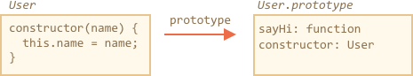

# Classes

The "class" construct allows one to define prototype-based classes with a clean, nice-looking syntax. It also introduces great new features which are useful for object-oriented programming.

## The "class" syntax

The `class` syntax is versatile, we'll start with a simple example first.

Here's a prototype-based class `User`:

```js run
function User(name) {
  this.name = name;
}

User.prototype.sayHi = function() {
  alert(this.name);
}

let user = new User("John");
user.sayHi();
```

...And here's the same using `class` syntax:

```js run
class User {

  constructor(name) {
    this.name = name;
  }

  sayHi() {
    alert(this.name);
  }

}

let user = new User("John");
user.sayHi();
```

It's easy to see that these two examples are alike. Be sure to note that methods in a class do not have a comma between them. A common pitfall for novice developers is to put a comma between class methods, which would result in a syntax error. The notation here is not to be confused with object literals. Within the class syntactical sugar, no commas are required.

## What is a class?

So, what exactly is a `class`? We may think that it defines a new language-level entity, but that would be wrong.

In Javascript, a class is a kind of function.

The definition `class User {...}` creates a function under the same name and puts the methods into `User.prototype`. So the structure is similar.

This is demonstrated in the following code, which you can run yourself:

```js run
class User {
  constructor(name) { this.name = name; }
  sayHi() { alert(this.name); }
}

*!*
// proof: User is a function
alert(typeof User); // function
*/!*

*!*
// proof: User is the "constructor" function
*/!*
alert(User === User.prototype.constructor); // true

*!*
// proof: there are two methods in its "prototype"
*/!*
alert(Object.getOwnPropertyNames(User.prototype)); // constructor, sayHi
```

Abstractly, we can illustrate this process of `class User` creating a function as:



`Class` is a special syntax to define a constructor together with its prototype methods. In addition to its basic operation, the `Class` syntax brings many other features with it which we'll explore later.

## Class Expression

Just like functions, classes can be defined inside another expression, passed around, returned etc.

Here's a class-returning function - otherwise known as a "class factory":

```js run
function makeClass(phrase) {
*!*
  // declare a class and return it
  return class {
    sayHi() {
      alert(phrase);
    };
  };
*/!*
}

let User = makeClass("Hello");

new User().sayHi(); // Hello
```

That's quite normal if we recall that `class` is just a special form of a function-with-prototype definition.

And, like Named Function Expressions, such classes also may have a name, that is visible inside that class only:

```js run
// "Named Class Expression" (alas, no such term, but that's what's going on)
let User = class *!*MyClass*/!* {
  sayHi() {
    alert(MyClass); // MyClass is visible only inside the class
  }
};

new User().sayHi(); // works, shows MyClass definition

alert(MyClass); // error, MyClass not visible outside of the class
```

## Differences between classes and functions

Classes have some differences compared to regular functions:

Constructors require `new`
: Unlike a regular function, a class `constructor` can't be called without `new`:

```js run
class User {
  constructor() {}
}

alert(typeof User); // function
User(); // Error: Class constructor User cannot be invoked without 'new'
```

Different string output
: If we output it like `alert(User)`, some engines show `"class User..."`, while others show `"function User..."`.

Please don't be confused: the string representation may vary, but that's still a function, there is no separate "class" entity in JavaScript language.

Class methods are non-enumerable
: A class definition sets `enumerable` flag to `false` for all methods in the `"prototype"`. That's good, because if we `for..in` over an object, we usually don't want its class methods.

Classes have a default `constructor() {}`
: If there's no `constructor` in the `class` construct, then an empty function is generated, just as if we had written `constructor() {}`.

Classes always `use strict`
: All code inside the class construct is automatically in strict mode.


## Getters/setters, other shorthands

Classes also include getters/setters, generators, computed properties etc.

Here's an example for `user.name` implemented using `get/set`:

```js run
class User {

  constructor(name) {
    // invokes the setter
    this._name = name;
  }

*!*
  get name() {
*/!*
    return this._name;
  }

*!*
  set name(value) {
*/!*
    if (value.length < 4) {
      alert("Name is too short.");
      return;
    }
    this._name = value;
  }

}

let user = new User("John");
alert(user.name); // John

user = new User(""); // Name too short.
```

Internally, getters and setters are created on `User.prototype`, like this:

```js
Object.defineProperties(User.prototype, {
  name: {
    get() {
      return this._name
    },
    set(name) {
      // ...
    }
  }
});
```

Here's an example with computed properties:

```js run
function f() { return "sayHi"; }

class User {
  [f()]() {
    alert("Hello");
  }

}

new User().sayHi();
```

For a generator method, similarly, prepend it with `*`.

## Class properties

```warn header="Old browsers may need a polyfill"
Class-level properties are a recent addition to the language.
```

In the example above, `User` only had methods. Let's add a property:

```js run
class User {
  name = "Anonymous";

  sayHi() {
    alert(`Hello, ${this.name}!`);
  }
}

new User().sayHi();
```

The property is not placed into `User.prototype`. Instead, it is created by `new`, separately for every object. So, the property will never be shared between different objects of the same class.


## Summary

The basic class syntax looks like this:

```js
class MyClass {
  prop = value;

  constructor(...) {
    // ...
  }

  method(...) {}

  get something(...) {}
  set something(...) {}

  [Symbol.iterator]() {}
  // ...
}
```

`MyClass` is technically a function, while methods are written to `MyClass.prototype`.

In the next chapters we'll learn more about classes, including inheritance and other features.
