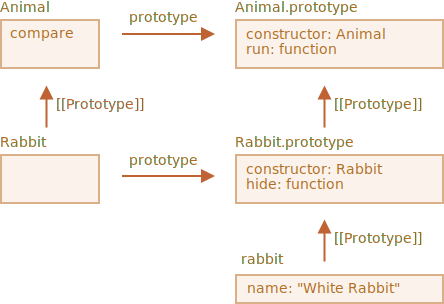

# Static properties and methods

We can also assign a method to the class function itself, not to its `"prototype"`. Such methods are called *static*.

In a class, they are prepended by `static` keyword, like this:

```js run
class User {
*!*
  static staticMethod() {
*/!*
    alert(this === User);
  }
}

User.staticMethod(); // true
```

That actually does the same as assigning it as a property directly:

```js
class User() { }

User.staticMethod = function() {
  alert(this === User);
};
```

The value of `this` in `User.staticMethod()` call is the class constructor `User` itself (the "object before dot" rule).

Usually, static methods are used to implement functions that belong to the class, but not to any particular object of it.

For instance, we have `Article` objects and need a function to compare them. A natural solution would be to add `Article.compare` method, like this:

```js run
class Article {
  constructor(title, date) {
    this.title = title;
    this.date = date;
  }

*!*
  static compare(articleA, articleB) {
    return articleA.date - articleB.date;
  }
*/!*
}

// usage
let articles = [
  new Article("HTML", new Date(2019, 1, 1)),
  new Article("CSS", new Date(2019, 0, 1)),
  new Article("JavaScript", new Date(2019, 11, 1))
];

*!*
articles.sort(Article.compare);
*/!*

alert( articles[0].title ); // CSS
```

Here `Article.compare` stands "above" articles, as a means to compare them. It's not a method of an article, but rather of the whole class.

Another example would be a so-called "factory" method. Imagine, we need few ways to create an article:

1. Create by given parameters (`title`, `date` etc).
2. Create an empty article with today's date.
3. ...or else somehow.

The first way can be implemented by the constructor. And for the second one we can make a static method of the class.

Like `Article.createTodays()` here:

```js run
class Article {
  constructor(title, date) {
    this.title = title;
    this.date = date;
  }

*!*
  static createTodays() {
    // remember, this = Article
    return new this("Today's digest", new Date());
  }
*/!*
}

let article = Article.createTodays();

alert( article.title ); // Today's digest
```

Now every time we need to create a today's digest, we can call `Article.createTodays()`. Once again, that's not a method of an article, but a method of the whole class.

Static methods are also used in database-related classes to search/save/remove entries from the database, like this:

```js
// assuming Article is a special class for managing articles
// static method to remove the article:
Article.remove({id: 12345});
```

## Static properties

[recent browser=Chrome]

Static properties are also possible, they look like regular class properties, but prepended by `static`:

```js run
class Article {
  static publisher = "Ilya Kantor";
}

alert( Article.publisher ); // Ilya Kantor
```

That is the same as a direct assignment to `Article`:

```js
Article.publisher = "Ilya Kantor";
```

## Inheritance of static methods

Static methods are inherited.

For instance, `Animal.compare` in the code below is inherited and accessible as `Rabbit.compare`:

```js run
class Animal {

  constructor(name, speed) {
    this.speed = speed;
    this.name = name;
  }

  run(speed = 0) {
    this.speed += speed;
    alert(`${this.name} runs with speed ${this.speed}.`);
  }

*!*
  static compare(animalA, animalB) {
    return animalA.speed - animalB.speed;
  }
*/!*

}

// Inherit from Animal
class Rabbit extends Animal {
  hide() {
    alert(`${this.name} hides!`);
  }
}

let rabbits = [
  new Rabbit("White Rabbit", 10),
  new Rabbit("Black Rabbit", 5)
];

*!*
rabbits.sort(Rabbit.compare);
*/!*

rabbits[0].run(); // Black Rabbit runs with speed 5.
```

Now when we call `Rabbit.compare`, the inherited `Animal.compare` will be called.

How does it work? Again, using prototypes. As you might have already guessed, `extends` gives `Rabbit` the `[[Prototype]]` reference to `Animal`.



So, `Rabbit extends Animal` creates two `[[Prototype]]` references:

1. `Rabbit` function prototypally inherits from `Animal` function.
2. `Rabbit.prototype` prototypally inherits from `Animal.prototype`.

As a result, inheritance works both for regular and static methods.

Here, let's check that by code:

```js run
class Animal {}
class Rabbit extends Animal {}

// for statics
alert(Rabbit.__proto__ === Animal); // true

// for regular methods
alert(Rabbit.prototype.__proto__ === Animal.prototype); // true
```

## Summary

Static methods are used for the functionality that belongs to the class "as a whole". It doesn't relate to a concrete class instance.

For example, a method for comparison `Article.compare(article1, article2)` or a factory method `Article.createTodays()`.

They are labeled by the word `static` in class declaration.

Static properties are used when we'd like to store class-level data, also not bound to an instance.

The syntax is:

```js
class MyClass {
  static property = ...;

  static method() {
    ...
  }
}
```

Technically, static declaration is the same as assigning to the class itself:

```js
MyClass.property = ...
MyClass.method = ...
```

Static properties and methods are inherited.

For `class B extends A` the prototype of the class `B` itself points to `A`: `B.[[Prototype]] = A`. So if a field is not found in `B`, the search continues in `A`.
