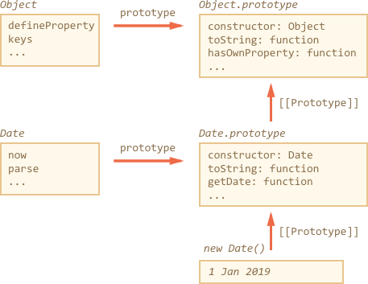

# Extending built-in classes

Built-in classes like Array, Map and others are extendable also.

For instance, here `PowerArray` inherits from the native `Array`:

```js run
// add one more method to it (can do more)
class PowerArray extends Array {
  isEmpty() {
    return this.length === 0;
  }
}

let arr = new PowerArray(1, 2, 5, 10, 50);
alert(arr.isEmpty()); // false

let filteredArr = arr.filter(item => item >= 10);
alert(filteredArr); // 10, 50
alert(filteredArr.isEmpty()); // false
```

Please note a very interesting thing. Built-in methods like `filter`, `map` and others -- return new objects of exactly the inherited type. They rely on the `constructor` property to do so.

In the example above,
```js
arr.constructor === PowerArray
```

So when `arr.filter()` is called, it internally creates the new array of results exactly as `new PowerArray`.
That's actually very cool, because we can keep using `PowerArray` methods further on the result.

Even more, we can customize that behavior.

There's a special static getter `Symbol.species`, if exists, it returns the constructor to use in such cases.

If we'd like built-in methods like `map`, `filter` will return regular arrays, we can return `Array` in `Symbol.species`, like here:

```js run
class PowerArray extends Array {
  isEmpty() {
    return this.length === 0;
  }

*!*
  // built-in methods will use this as the constructor
  static get [Symbol.species]() {
    return Array;
  }
*/!*
}

let arr = new PowerArray(1, 2, 5, 10, 50);
alert(arr.isEmpty()); // false

// filter creates new array using arr.constructor[Symbol.species] as constructor
let filteredArr = arr.filter(item => item >= 10);

*!*
// filteredArr is not PowerArray, but Array
*/!*
alert(filteredArr.isEmpty()); // Error: filteredArr.isEmpty is not a function
```

As you can see, now `.filter` returns `Array`. So the extended functionality is not passed any further.

## No static inheritance in built-ins

Built-in objects have their own static methods, for instance `Object.keys`, `Array.isArray` etc.

And we've already been talking about native classes extending each other: `Array.[[Prototype]] = Object`.

But statics are an exception. Built-in classes don't inherit static properties from each other.

In other words, the prototype of built-in constructor `Array` does not point to `Object`. This way `Array` and `Date` do not have `Array.keys` or `Date.keys`. And that feels natural.

Here's the picture structure for `Date` and `Object`:



Note, there's no link between `Date` and `Object`. Both `Object` and `Date` exist independently. `Date.prototype` inherits from `Object.prototype`, but that's all.
