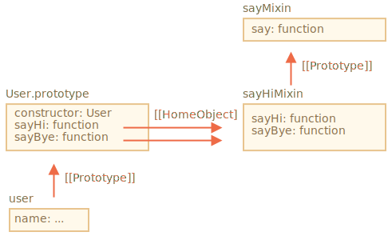

# Mixins

In JavaScript we can only inherit from a single object. There can be only one `[[Prototype]]` for an object. And a class may extend only one other class.

But sometimes that feels limiting. For instance, I have a class `StreetSweeper` and a class `Bicycle`, and want to make a `StreetSweepingBicycle`.

Or, talking about programming, we have a class `User` and a class `EventEmitter` that implements event generation, and we'd like to add the functionality of `EventEmitter` to `User`, so that our users can emit events.

There's a concept that can help here, called "mixins".

As defined in Wikipedia, a [mixin](https://en.wikipedia.org/wiki/Mixin) is a class that contains methods for use by other classes without having to be the parent class of those other classes.

In other words, a *mixin* provides methods that implement a certain behavior, but we do not use it alone, we use it to add the behavior to other classes.

## A mixin example

The simplest way to make a mixin in JavaScript is to make an object with useful methods, so that we can easily merge them into a prototype of any class.

For instance here the mixin `sayHiMixin` is used to add some "speech" for `User`:

```js run
*!*
// mixin
*/!*
let sayHiMixin = {
  sayHi() {
    alert(`Hello ${this.name}`);
  },
  sayBye() {
    alert(`Bye ${this.name}`);
  }
};

*!*
// usage:
*/!*
class User {
  constructor(name) {
    this.name = name;
  }
}

// copy the methods
Object.assign(User.prototype, sayHiMixin);

// now User can say hi
new User("Dude").sayHi(); // Hello Dude!
```

There's no inheritance, but a simple method copying. So `User` may inherit from another class and also include the mixin to "mix-in" the additional methods, like this:

```js
class User extends Person {
  // ...
}

Object.assign(User.prototype, sayHiMixin);
```

Mixins can make use of inheritance inside themselves.

For instance, here `sayHiMixin` inherits from `sayMixin`:

```js run
let sayMixin = {
  say(phrase) {
    alert(phrase);
  }
};

let sayHiMixin = {
  __proto__: sayMixin, // (or we could use Object.create to set the prototype here)

  sayHi() {
    *!*
    // call parent method
    */!*
    super.say(`Hello ${this.name}`);
  },
  sayBye() {
    super.say(`Bye ${this.name}`);
  }
};

class User {
  constructor(name) {
    this.name = name;
  }
}

// copy the methods
Object.assign(User.prototype, sayHiMixin);

// now User can say hi
new User("Dude").sayHi(); // Hello Dude!
```

Please note that the call to the parent method `super.say()` from `sayHiMixin` looks for the method in the prototype of that mixin, not the class.



That's because methods `sayHi` and `sayBye` were initially created in `sayHiMixin`. So their `[[HomeObject]]` internal property references `sayHiMixin`, as shown on the picture above.

As `super` looks for parent methods in `[[HomeObject]].[[Prototype]]`, that means it searches `sayHiMixin.[[Prototype]]`, not `User.[[Prototype]]`.

## EventMixin

Now let's make a mixin for real life.

An important feature of many browser objects (for instance) is that they can generate events. Events is a great way to "broadcast information" to anyone who wants it. So let's make a mixin that allows to easily add event-related functions to any class/object.

- The mixin will provide a method `.trigger(name, [...data])` to "generate an event" when something important happens to it. The `name` argument is a name of the event, optionally followed by additional arguments with event data.
- Also the method `.on(name, handler)` that adds `handler` function as the listener to events with the given name. It will be called when an event with the given `name` triggers, and get the arguments from `.trigger` call.
- ...And the method `.off(name, handler)` that removes `handler` listener.

After adding the mixin, an object `user` will become able to generate an event `"login"` when the visitor logs in. And another object, say, `calendar` may want to listen to such events to load the calendar for the logged-in person.

Or, a `menu` can generate the event `"select"` when a menu item is selected, and other objects may assign handlers to react on that event. And so on.

Here's the code:

```js run
let eventMixin = {
  /**
   * Subscribe to event, usage:
   *  menu.on('select', function(item) { ... }
  */
  on(eventName, handler) {
    if (!this._eventHandlers) this._eventHandlers = {};
    if (!this._eventHandlers[eventName]) {
      this._eventHandlers[eventName] = [];
    }
    this._eventHandlers[eventName].push(handler);
  },

  /**
   * Cancel the subscription, usage:
   *  menu.off('select', handler)
   */
  off(eventName, handler) {
    let handlers = this._eventHandlers && this._eventHandlers[eventName];
    if (!handlers) return;
    for (let i = 0; i < handlers.length; i++) {
      if (handlers[i] === handler) {
        handlers.splice(i--, 1);
      }
    }
  },

  /**
   * Generate an event with the given name and data
   *  this.trigger('select', data1, data2);
   */
  trigger(eventName, ...args) {
    if (!this._eventHandlers || !this._eventHandlers[eventName]) {
      return; // no handlers for that event name
    }

    // call the handlers
    this._eventHandlers[eventName].forEach(handler => handler.apply(this, args));
  }
};
```


- `.on(eventName, handler)` -- assigns function `handler` to run when the event with that name happens. Technically, there's `_eventHandlers` property, that stores an array of handlers for each event name. So it just adds it to the list.
- `.off(eventName, handler)` -- removes the function from the handlers list.
- `.trigger(eventName, ...args)` -- generates the event: all handlers from `_eventHandlers[eventName]` are called, with a list of arguments `...args`.

Usage:

```js run
// Make a class
class Menu {
  choose(value) {
    this.trigger("select", value);
  }
}
// Add the mixin with event-related methods
Object.assign(Menu.prototype, eventMixin);

let menu = new Menu();

// add a handler, to be called on selection:
*!*
menu.on("select", value => alert(`Value selected: ${value}`));
*/!*

// triggers the event => the handler above runs and shows:
// Value selected: 123
menu.choose("123");
```

Now if we'd like any code to react on menu selection, we can listen to it with `menu.on(...)`.

And `eventMixin` mixin makes it easy to add such behavior to as many classes as we'd like, without interfering with the inheritance chain.

## Summary

*Mixin* -- is a generic object-oriented programming term: a class that contains methods for other classes.

Some other languages like e.g. Python allow to create mixins using multiple inheritance. JavaScript does not support multiple inheritance, but mixins can be implemented by copying methods into prototype.

We can use mixins as a way to augment a class by multiple behaviors, like event-handling as we have seen above.

Mixins may become a point of conflict if they occasionally overwrite existing class methods. So generally one should think well about the naming methods of a mixin, to minimize the probability of that.
