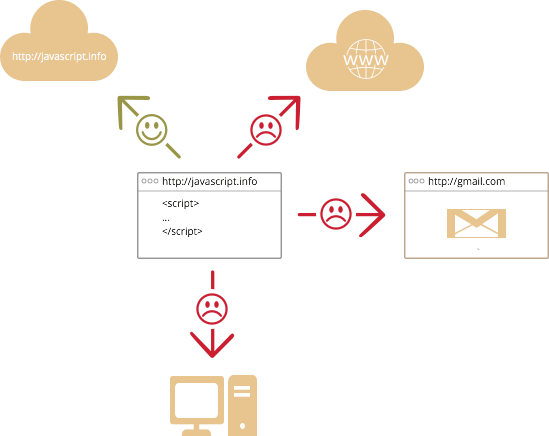

# An introduction to JavaScript 

Let's see what's so special about JavaScript, what we can achieve with it and what other technologies coexist with it.

## What is JavaScript?   

*JavaScript* was initially created to *"make webpages alive"*.

The programs in this language are called *scripts*. They are put directly into HTML and execute automatically as it loads.

Scripts are provided and executed a plain text. They don't need a special preparation or compilation to run.

In this aspect, JavaScript is very different from another language called [Java](http://en.wikipedia.org/wiki/Java).

[smart header="Why <u>Java</u>Script?"]
When JavaScript was created, it initially had another name: "LiveScript". But Java language was very popular at that time, so it was decided that positioning a new language as a "younger brother" of Java would help.

But as it evolved, JavaScript became a fully independent language, with its own specification called [ECMAScript](http://en.wikipedia.org/wiki/ECMAScript), and now it has no relation to Java altogether.

It has quite a few special features that make mastering a bit hard at first, but we'll nicely deal with them later.
[/smart]

Since the time of its creation, JavaScript evolved.

As of now, JavaScript can execute not only in the browser, but also on the server, or actually on any device where a special program called [an interpreter]("http://en.wikipedia.org/wiki/Interpreter_(computing)") is installed. The execution process is called "an interpretation". The browser has an embedded JavaScript interpreter.

[smart header="Compilation and interpretation"]
There are in fact two general approaches to execute programs: "compilers" and "interpreters".

<ul>
<li>*Compilers* convert the program text (source code) to binary code (usually) without executing it. This is done by the developer and then the binary code is distributed to the system which actually runs it.</li>
<li>*Interpreters*, and in particular the one embedded in the browser -- get the source code and execute it "as is". The source code (script) is distributed to the system as a plain text.</li>
</ul>

Modern interpreters actually combine these approaches into one: the script is distributed as a plain text, but prior to execution is converted to the machine language. That's why JavaScript executes very fast.
[/smart]

The modern JavaScript is a "safe" programming language. It does not provide low-level access to memory or CPU, because it was initially created for browsers which do not require it. 

Other capabilities depend on the environment which runs JavaScript. In the browser JavaScript is able to do everything related to webpage manipulation, interaction with the user and the webserver.

## What in-browser JavaScript can do?

In more details, JavaScript is able to:

<ul>
<li>Create new HTML tags, remove the existing ones, change styles, hide/show elements...</li>
<li>React on user actions, run on mouse clicks, pointer movements, key presses...</li>
<li>Send requests over the network to remote servers, download and upload data without reloading the page (a so-called "AJAX" technology)...</li>
<li>Get and set cookies, ask for data, show messages...</li>
<li>...and can actually do almost anything with the page and it's content!</li> 
</ul>

## What in-browser JavaScript can NOT do?

JavaScript abilities in the browser are limited. That is for user safety, mainly not to let an evil webpage access private information or harm the user's data.

<ul>
<li>JavaScript may not read/write arbitrary files on the hard disk, copy them or execute programs. It has no direct access to OS system functions.

Modern browsers allow it to work with files, but limit the access to a specially created directory called "a sandbox". There are ways to interact with camera/microphone and other devices, but they require an explicit user's permission.
</li>
<li>JavaScript may not freely access other pages opened in the same browser. The exception is when the pages come from the same site.

There are ways to workaround this, of course. But if two pages come from different sites (different domain, protocol or port), they require a special code on *both of them* allowing to interact.

The limitation is again for user safety. A page from evilsite.com which a user has opened occasionaly will be unable to access other browser tabs and steal information from there.
</li>
<li>JavaScript can easily communicate over the net to the server where the current page came from. But it's ability to receive data from other sites/domains is crippled. Though possible, it requires the explicit agreement (expressed in HTTP headers) from the remote side. Once again, that's safety limitations.
</li>
</ul>

Such limits do not exist if JavaScript is used outside of the browser, for example on a server. Modern browsers also allow installing plugin/extensions which get extended permissions.

## Why JavaScript is unique?   

There are at least *three* great things about JavaScript:

[compare]
+Full integration with HTML/CSS.
+Simple things done simply.
+Supported by all major browsers and enabled by default.
[/compare]

Combined, these 3 things only exist in JavaScript and no other browser technology. 

That's what makes JavaScript unique. That's why it is the most widespread way of creating browser interfaces.

Of course, there are certain trends including new languages and browser abilities. While planning to learn a new technology, it's beneficial to check it's perspectives, so we go ahead with that.

## HTML 5

*HTML 5* is an evolution of HTML which adds new tags and what's more important -- new browser abilities, accessable from JavaScript.

Few examples:

<ul>
<li>Read/write files on disk (in a "sandbox", not just any file).</li>
<li>A database embedded in the browser, to keep data on a user's computer and effeciently operate on it.</li>
<li>Multitasking with the usage of many CPU cores in one time.</li>
<li>Audio/video playback.</li>
<li>2d and 3d-drawing with hardware acceleration support, just like in modern games.</li>
</ul>

Many new abilities are still in progress, but browsers gradually improve the support for them.

[summary]
The trend: browser can do more and more, it is becoming more like an all-purpose desktop application.
[/summary]

Still, there is a small gotcha with those "extra-fresh" modern browser abilities. Sometimes browsers try to implement them on very early stages when they are nor fully defined neither agreed upon, but still are so  interesting that the developers just can't wait.

...As the time goes, the specification matures and changes, and browsers must adapt it. That may lead to errors in the older code which was too eager to use the early browser implementation. So one should think twice before relying on things that are in draft yet.

But what's great -- eventually all browsers tend to follow the standard. There are much less differences between them now than only a couple years ago.

[summary]
The trend: browsers, though eager for new features, tend to be compatible with the standard.
[/summary]

## New EcmaScript

JavaScript evolves. The upcoming EcmaScript-2016 standard adds more language-level features which make the syntax more capable and expressive.

Modern browsers improve their engines to raise JavaScript execution script, fix bugs and try to follow the standards.

[summary]
The trend: JavaScript is becoming faster, gets new syntax and language features.
[/summary]

## Languages over JavaScript

The syntax of JavaScript does not suit everyone's needs: some people think that it's too flexible, the others consider it too limited, the third ones want to add new features absent in the standard...

That's normal, because projects and requirements are different for everyone. There's no a single standard for a carpenter's hammer, why should it exist for the language?

So recently a plethora of new languages appeared, which are *transpiled* (converted) to JavaScript before they run.

The transpilation happens automatically, modern tools make the process very fast and transparent, actually allowing developers to code in another language. But they still should know JavaScript, to better understand what they are doing.

Examples of such languages:

<ul>
<li>[CoffeeScript](http://coffeescript.org/) is a "syntax sugar" for JavaScript, it introduces shorter syntax, allowing to write more precise and clear code. Usually Ruby guys like it.</li>
<li>[TypeScript](http://www.typescriptlang.org/) is concentrated on adding "strict data typing", to simplify development and support of complex systems. Developed by Microsoft.</li>
<li>[Dart](https://www.dartlang.org/) was offered by Google as a replacement for JavaScript, but other leading internet companies declared that they are not interested. Maybe later, we'll see. Right now it can be transpiled to JavaScript, but used less often compared to two previous alternatives.</li>
</ul>

## Summary

As of now, JavaScript is unique due it's full integration with HTML/CSS and wide browser adoption.

Other languages like TypeScript can help to write less bug-proof code. It is recommended to take a look at them, at least briefly, after mastering JavaScript.

