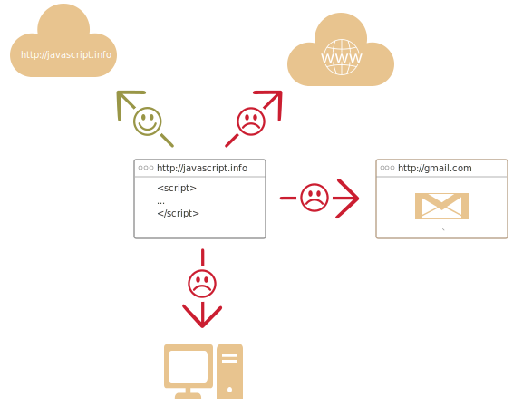

# JavaScript Intoduction

Let's see what's so special about JavaScript, what we can achieve with it and what other technologies coexist with it.

## What is JavaScript?   

*JavaScript* was initially created to *make webpages live".

The programs in this language are called *scripts*. They are put directly into HTML and execute automatically as it loads.

**Scripts are provided and executed a plain text.**. 

They don't need a special preparation or compilation to run.

In this aspect, JavaScript is very different from another language called [Java](http://en.wikipedia.org/wiki/Java).

[smart header="Why <u>Java</u>Script?"]
When JavaScript was created, it initially had another name: "LiveScript". But Java language was very popular at that time and it was decided that positioning a new language as a "younger brother" to Java would help.

But as it evolved, JavaScript became a fully independent language, with its specification called [ECMAScript](http://en.wikipedia.org/wiki/ECMAScript), and has no relation to Java altogether.

It has quite a few special features that make mastering it a bit hard at first, but we'll deal with them as the tutorial goes on.
[/smart]

JavaScript can execute not only in the browser, but anywhere, with the help of a special program called [an interpreter]("http://en.wikipedia.org/wiki/Interpreter_(computing)"). The execution process is called "an interpretation".

[smart header="Compilation and interpretation, for programmers"]
There are in fact two main means to execute programs: "compilers" and "interpreters".

<ul>
<li>*Compilers* convert the program text (source code) to another language, usually machine language (binary code) without executing it. The binary code is then distributed to the system which runs it.</li>
<li>*Interpreters*, and in particular the one embedded in the browser -- get the source code and execute it "as is". The source code (script) is distributed to the system.</li>
</ul>

Modern interpreters actually convert the JavaScript to machine language or close to it, and then execute. That's why JavaScript is very fast.
[/smart]

All major browsers have an embedded JavaScript interpreter, that's why they are capable of script execution.

But naturally JavaScript can be used not only in-browser. It's a full-fledged language usable at the server too and even in a washing machine if the interpreter is installed.

[warn header="Let's talk browsers"]
Further in the chapter we talk about capabilities and limitaitons of JavaScript in the browser.
[/warn]

## What JavaScript can do?   

The modern JavaScript is a "safe" general purpose programming language. It does not provide low-level access to memory or CPU, because it was initially created for browsers which do not require it.

Other capabilities depend on the environment which runs JavaScript. In the browser JavaScript is able to do everything related to webpage manipulation, talk to the visitor and, to some extent, talk to the internet.

Or, in more details:

<ul>
<li>To create new HTML tags, remove the existing ones, change styles, hide/show elements...</li>
<li>To react on user actions, run on mouse clicks, pointer movements, key presses...</li>
<li>To send requests over the network to remote servers, download and upload data without reloading the page (a so-called "AJAX" technology)...</li>
<li>To get and set cookies, ask for data, show messages...</li>
<li>...and much much more!</li> 
</ul>

## What JavaScript can NOT do?

JavaScript abilities in the browser are limited for user safety, mainly not to let an evil webpage access private information or harm the user's data.

Such limits do not exist if JavaScript is used outside of the browser, for example on server. Besides, modern browsers allow to install plugins and extensions which get extended permissions, but require actions from the user to accept that.

**JavaScript abilities are limited when it tries to access things outside of the current window/page.**



<ul>
<li>JavaScript may not read/write arbitrary files on the hard disk, copy them or execute programs. It has no direct access to the OS.

Modern browsers allow it to work with files, but limit with a specially created directory called "a sandbox". There is a work going on to allow access to devices, the means are partially implemented in modern browsers.
</li>
<li>JavaScript from a browser tab may not access other tabs and windows with the exception when they were opened by this script and come from the same origin (domain, port, protocol).

There are ways to workaround this, and they are explained in the tutorial, but they require a special code on both documents which reside in different tabs/windows. Without it, for the sake of safety, JavaScript is disallowed to delve into another tab contents.
</li>
<li>JavaScript can easily send requests over the net to the server where the current page came from. But requests to other sites/domains are limited. Though possible, it requires the agreement (expressed in HTTP headers) from the remote side. That's less convenient, but again it's safety limitations.
</li>
</ul>

## Why JavaScript is unique?   

There are at least *three* great features in JavaScript:

[compare]
+Full integration with HTML/CSS.
+Simple things done simply.
+Supported by all major browsers and enabled by default.
[/compare]

Combined, they only exist in JavaScript and no other browser technology. 

That makes JavaScript unique. That's why it is the most widespread way of creating browser interfaces.

## The Trends

While planning to learn a new technology, it's beneficial to check it's trends and perspectives.

JavaScript shines in this aspect.

### HTML 5

*HTML 5* is an evolution of HTML standard which adds new tags and what's more important -- new browser abilities, accessable from JavaScript.

A few examples:

<ul>
<li>Read/write files on disk (in a "sandbox", not just any file).</li>
<li>A database embedded in the browser, to keep data on a user's computer and effeciently operate on it.</li>
<li>Multitasking with the usage of many CPU cores in one time.</li>
<li>Audio/video playback.</li>
<li>2d and 3d-drawing with hardware acceleration support, just like in modern games.</li>
</ul>

Many new abilities are still in progress, but browsers gradually start to support them.

[summary]
The trend: JavaScript can do more and more, as features are added to browsers, it is becoming more like a desktop application.
[/summary]

### EcmaScript 6

JavaScript evolves. The upcoming EcmaScript 6 standard adds many new language-level features which make it's syntax more capable and expressive.

Modern browsers improve their engines to raise JavaScript execution script, fix bugs and try to follow the standards.

[summary]
The trend: JavaScript is becoming faster and more stable, gets new syntax.[/summary]

It's crucially important that new standards, HTML5, EcmaScript 6 are still compatible with the previous code, so there are no problems with the existing applications.

Still, there is a small gotcha with those "extra-fresh" modern browser abilities. Sometimes browsers try to implement them on very early stages when they are not fully described neither agreed upon, but still so  interesting that the developers just can't wait.

...But as the time goes, the specification matures and changes, and browsers must adopt it. That may lead to errors in JavaScript code which was too eager to use the early browser implementation. So one should think twice before relying on things that are in draft yet.

But what's great -- all browsers tend to follow the standard. There are much less differences between them now than only a couple years ago.

[summary]
The trend: browsers, though eager for new features, become compatible with the standard.
[/summary]


## Альтернативные браузерные технологии

Современный JavaScript используется во многих областях. Если говорить о браузерах, то вместе с JavaScript на страницах используются и другие технологии.

Самые извеcтные -- это Flash, Java, ActiveX/NPAPI. Связка с ними может помочь достигнуть более интересных результатов в тех местах, где браузерный JavaScript пока не столь хорош, как хотелось бы. 

### Java   

Java -- язык общего назначения, на нем можно писать самые разные программы. Для интернет-страниц есть особая возможность - написание *апплетов*.

*Апплет* -- это программа на языке Java, которую можно подключить к HTML при помощи тега `applet`, выглядит это примерно так:

```html
<!--+ run -->
<applet code="BTApplet.class" codebase="/files/tutorial/intro/alt/">
  <param name="nodes" value="50,30,70,20,40,60,80,35,65,75,85,90">
  <param name="root" value="50">
</applet>
```

Такой тег загружает Java-программу из файла `BTApplet.class` и выполняет ее с параметрами `param`. Апплет выполняется в отдельной части страницы, в прямоугольном "контейнере". Все действия пользователя внутри него обрабатывает апплет. Контейнер, впрочем, может быть и спрятан, если апплету нечего показывать.

Конечно, для этого на компьютере должна быть установлена и включена среда выполнения Java, включая браузерный плагин. Кроме того, апплет должен быть подписан сертификатом издателя (в примере выше апплет без подписи), иначе Java заблокирует его.

**Чем нам, JavaScript-разработчикам, может быть интересен Java?**

В первую очередь тем, что подписанный Java-апплет может всё то же, что и обычная программа, установленая на компьютере посетителя. Конечно, для этого понадобится согласие пользователя при открытии такого апплета.

[compare]
+Java может делать *всё* от имени посетителя, совсем как установленная программа. Потенциально опасные действия требуют подписанного апплета и согласия пользователя.
-Java требует больше времени для загрузки.
-Среда выполнения Java, включая браузерный плагин, должна быть установлена на компьютере посетителя и включена.
-Java-апплет не интегрирован с HTML-страницей, а выполняется отдельно. Но он может вызывать функции JavaScript.
[/compare]


### Плагины и расширения для браузера

Все современные браузеры предоставляют возможность написать плагины. Для этого можно использовать JavaScript (Chrome, Opera, Firefox), так и язык С (ActiveX для Internet Explorer).

Эти плагины могут как отображать содержимое специального формата (плагин для проигрывания музыки, для показа PDF), так и взаимодействовать со страницей.

Как и в ситуации с Java-апплетом, у них широкие возможности, но посетитель поставит их в том случае, если вам доверяет.

### Adobe Flash   

Adobe Flash -- кросс-браузерная платформа для мультимедиа-приложений, анимаций, аудио и видео. 

*Flash-ролик* -- это скомпилированная программа, написанная на языке ActionScript. Ее можно подключить к HTML-странице и запустить в прямоугольном контейнере.

В первую очередь Flash полезен тем, что позволяет **кросс-браузерно** работать с микрофоном, камерой, с буфером обмена, а также поддерживает продвинутые возможности по работе с сетевыми соединениями. 

[compare]
+Сокеты, UDP для P2P и другие продвинутые возможности по работе с сетевыми соединениями
+Поддержка мультмедиа: изображения, аудио, видео. Работа с веб-камерой и микрофоном.
-Flash должен быть установлен и включен. А на некоторых устройствах он вообще не поддерживается.
-Flash не интегрирован с HTML-страницей, а выполняется отдельно.
-Существуют ограничения безопасности, однако они немного другие, чем в JavaScript.
[/compare]

Из Flash можно вызывать JavaScript и наоборот, поэтому обычно сайты используют JavaScript, а там, где он не справляется -- можно подумать о Flash.


## Языки поверх JavaScript


Синтаксис JavaScript устраивает не всех: одним он кажется слишком свободным, другим -- наоборот, слишком ограниченным, третьи хотят добавить в язык дополнительные возможности, которых нет в стандарте...

Это нормально, ведь требования и проекты у всех разные. 

В последние годы появилось много языков, которые добавляют различные возможности "поверх" JavaScript, а для запуска в браузере -- при помощи специальных инструментов "трансляторов" превращаются в обычный JavaScript-код.

Это преобразование происходит автоматически и совершенно прозрачно, при этом неудобств в разработке и отладке практически нет.

При этом разные языки выглядят по-разному и добавляют совершенно разные вещи:

<ul>
<li>Язык [CoffeeScript](http://coffeescript.org/) -- это "синтаксический сахар" поверх JavaScript, он сосредоточен на большей ясности и краткости кода. Как правило, его особенно любят программисты на Ruby.</li>
<li>Язык [TypeScript](http://www.typescriptlang.org/) сосредоточен на добавлении строгой типизации данных, он предназначен для упрощения разработки и поддержки больших систем. Его разрабатывает MicroSoft.</li>
<li>Язык [Dart](https://www.dartlang.org/) предложен компанией Google как замена JavaScript, но другие ведущие интернет-компании объявили о своей незаинтересованности в Dart. Возможно, в будущем он может составить конкуренцию JS.</li>
</ul>

[smart header="ES6 и ES7 прямо сейчас"]
Существуют также трансляторы, которые берут код, использующий возможности будущих стандартов JavaScript, и преобразуют его в более старый вариант, который понимают все браузеры.

Например, [6to5](https://6to5.org/).

Благодаря этому, мы можем использовать многие возможности будущего уже сегодня.
[/smart]


## Итого

Язык JavaScript уникален благодаря своей полной интеграции с HTML/CSS. Он работает почти у всех посетителей.

...Но хороший JavaScript-программист не должен забывать и о других технологиях.

Ведь наша цель -- создание хороших приложений, и здесь Flash, Java, ActiveX/NPAPI и браузерные расширения имеют свои уникальные возможности, которые можно использовать вместе с JavaScript.

Что же касается CoffeeScript, TypeScript и других языков, построенных над JavaScript -- они могут быть очень полезны, рекомендуется посмотреть их, хотя бы в общих чертах, но, конечно, после освоения самого JavaScript.

