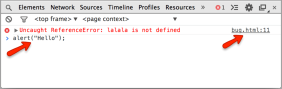
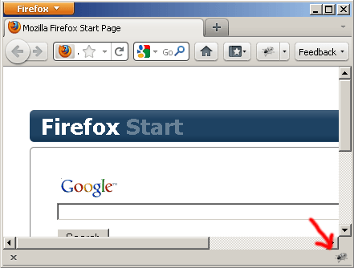
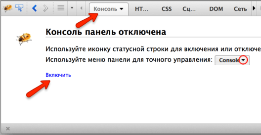
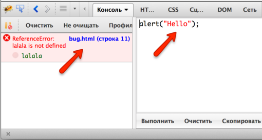
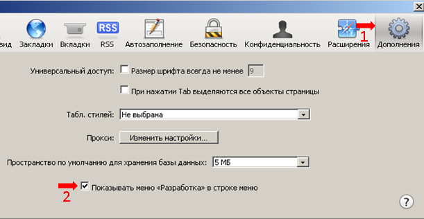

# Консоль разработчика

При разработке скриптов всегда возможны ошибки... Впрочем, что я говорю? У вас абсолютно точно будут ошибки, если конечно вы -- человек, а не <a href="http://ru.wikipedia.org/wiki/%D0%91%D0%B5%D0%BD%D0%B4%D0%B5%D1%80_(%D0%A4%D1%83%D1%82%D1%83%D1%80%D0%B0%D0%BC%D0%B0)">робот</a>.

Чтобы читать их в удобном виде, а также получать массу полезной информации о выполнении скриптов, в браузерах есть *инструменты разработки*.  

**Для разработки рекомендуется использовать Chrome или Firefox.**

Другие браузеры, как правило, находятся в положении "догоняющих" по возможностям встроенных инструментов разработки. Если ошибка, к примеру, именно в Internet Explorer, тогда уже смотрим конкретно в нём, но обычно -- Chrome/Firefox.

В инструментах разработчика предусмотрена масса возможностей, но на текущем этапе мы просто посмотрим, как их открывать, смотреть в консоли ошибки и запускать команды JavaScript.

[cut]

## Google Chrome   

Откройте страницу [bug.html](bug.html). 

В её JavaScript-коде есть ошибка. Конечно, обычному посетителю она не видна, нужно открыть инструменты разработчика.

Для этого используйте сочетание клавиш [key Ctrl+Shift+J], а если у вас Mac, то [key Cmd+Shift+J].

При этом откроются инструменты разработчика и вкладка Console, в которой будет ошибка.

Выглядеть будет примерно так:

<ul>
<li>При клике на `bug.html` вы перейдёте во вкладку с кодом к месту ошибки, там будет и краткое описание ошибки. 
В данном случае ошибка вызвана строкой `lalala`, которая интерпретатору непонятна. </li>
<li>В этом же окошке вы можете набирать команды на JavaScript. Например, наберите `alert("Hello")` -- команду вывода сообщения и запустите её нажатием [key Enter]. Мы познакомимся с этой и другими командами далее.</li>
<li>Для перевода курсора на следующую строку (если команда состоит из нескольких строк) --  используется сочетание [key Shift+Enter].</li> 
</ul>

Далее в учебнике мы подробнее рассмотрим отладку в Chrome в главе .

## Firefox   

Для разработки в Firefox используется расширение Firebug. 

<ol>
<li>Первым делом его надо установить.

Это можно сделать со страницы <a href="https://addons.mozilla.org/ru/firefox/addon/firebug/">https://addons.mozilla.org/ru/firefox/addon/firebug/</a>.

Перезапустите браузер. Firebug появится в правом-нижнем углу окна:

Если иконки не видно -- возможно, у вас выключена панель расширений. Нажмите [key Ctrl+\] для её отображения. 

Ну а если её нет и там, то нажмите [key F12] -- это горячая клавиша для запуска Firebug, расширение появится, если установлено.
</li>
<li>Далее, для того чтобы консоль заработала, её надо включить.

Если консоль уже была включена ранее, то этот шаг не нужен, но если она серая -- выберите в меню `Консоль` и включите её:

</li>
<li>Для того, чтобы Firebug работал без глюков, желательно сначала открыть Firebug, а уже потом -- зайти на страницу.

С открытым Firebug зайдите на страницу с ошибкой: [bug.html](/devtools/bug.html).

Консоль покажет ошибку:

Кликните на строчке с ошибкой и браузер покажет исходный код. При необходимости включайте дополнительные панели.
</li>
</ol>

Как и в Chrome, можно набирать и запускать команды. Область для команд на рисунке находится справа, запуск команд осуществляется нажатием [key Ctrl+Enter] (для Mac -- [key Cmd+Enter]).

Можно перенести её вниз, нажав на кнопочку  (на рисунке её не видно, но она присутствует в правом нижнем углу панели разработки).

Об основных возможностях можно прочитать на сайте <a href="http://firebug.ru">firebug.ru</a>.

## Internet Explorer   

Панель разработчика запускается нажатием [key F12].

Откройте её и зайдите на страницу с ошибкой: [bug.html](/devtools/bug.html). Если вы разобрались с Chrome/Firefox, то дальнейшее будет вам более-менее понятно, так как инструменты IE построены позже и по аналогии с Chrome/Firefox.

## Safari   

Горячие клавиши: [key Ctrl+Shift+I], [key Ctrl+Alt+C] для Mac -- [key Cmd] вместо [key Ctrl].

Для доступа к функционалу разработки через меню:

<ol>
<li>
В Safari первым делом нужно активировать меню разработки.

Откройте меню, нажав на колесико справа-сверху и выберите `Настройки`.

Затем вкладка `Дополнительно`:

Отметьте `Показывать меню "Разработка" в строке меню`. Закройте настройки.
</li>
<li>Нажмите на колесико и выберите `Показать строку меню`.

Инструменты будут доступны в появившейся строке меню, в пункте `Разработка`.</li>
</ol>

## Итого

Мы разобрали, как открывать инструменты разработчика и смотреть ошибки, а также запускать простые команды, не отходя от браузера.

Далее мы приступим к изучению JavaScript.
