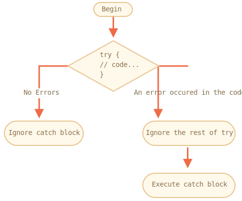

# Error handling, "try..catch"

No matter how great we are at programming, sometimes our scripts have errors. They may occur because of our mistakes, an unexpected user input, an erroneous server response, and for a thousand other reasons.

Usually, a script "dies" (immediately stops) in case of an error, printing it to console.

But there's a syntax construct `try..catch` that allows to "catch" errors and, instead of dying, do something more reasonable.

## The "try..catch" syntax

The `try..catch` construct has two main blocks: `try`, and then `catch`:

```js
try {

  // code...

} catch (err) {

  // error handling

}
```

It works like this:

1. First, the code in `try {...}` is executed.
2. If there were no errors, then `catch(err)` is ignored: the execution reaches the end of `try` and goes on, skipping `catch`.
3. If an error occurs, then `try` execution is stopped, and the control flows to the beginning of `catch(err)`. The `err` variable (can use any name for it) will contain an error object with details about what happened.



So, an error inside the `try {…}` block does not kill the script: we have a chance to handle it in `catch`.

Let's see examples.

- An errorless example: shows `alert` `(1)` and `(2)`:

    ```js run
    try {

      alert('Start of try runs');  // *!*(1) <--*/!*

      // ...no errors here

      alert('End of try runs');   // *!*(2) <--*/!*

    } catch(err) {

      alert('Catch is ignored, because there are no errors'); // (3)

    }
    ```
- An example with an error: shows `(1)` and `(3)`:

    ```js run
    try {

      alert('Start of try runs');  // *!*(1) <--*/!*

    *!*
      lalala; // error, variable is not defined!
    */!*

      alert('End of try (never reached)');  // (2)

    } catch(err) {

      alert(`Error has occurred!`); // *!*(3) <--*/!*

    }
    ```


````warn header="`try..catch` only works for runtime errors"
For `try..catch` to work, the code must be runnable. In other words, it should be valid JavaScript.

It won't work if the code is syntactically wrong, for instance it has unmatched curly braces:

```js run
try {
  {{{{{{{{{{{{
} catch(e) {
  alert("The engine can't understand this code, it's invalid");
}
```

The JavaScript engine first reads the code, and then runs it. The errors that occur on the reading phase are called "parse-time" errors and are unrecoverable (from inside that code). That's because the engine can't understand the code.

So, `try..catch` can only handle errors that occur in the valid code. Such errors are called "runtime errors" or, sometimes, "exceptions".
````


````warn header="`try..catch` works synchronously"
If an exception happens in "scheduled" code, like in `setTimeout`, then `try..catch` won't catch it:

```js run
try {
  setTimeout(function() {
    noSuchVariable; // script will die here
  }, 1000);
} catch (e) {
  alert( "won't work" );
}
```

That's because the function itself is executed later, when the engine has already left the `try..catch` construct.

To catch an exception inside a scheduled function, `try..catch` must be inside that function:
```js run
setTimeout(function() {
  try {    
    noSuchVariable; // try..catch handles the error!
  } catch {
    alert( "error is caught here!" );
  }
}, 1000);
```
````

## Error object

When an error occurs, JavaScript generates an object containing the details about it. The object is then passed as an argument to `catch`:

```js
try {
  // ...
} catch(err) { // <-- the "error object", could use another word instead of err
  // ...
}
```

For all built-in errors, the error object has two main properties:

`name`
: Error name. For instance, for an undefined variable that's `"ReferenceError"`.

`message`
: Textual message about error details.

There are other non-standard properties available in most environments. One of most widely used and supported is:

`stack`
: Current call stack: a string with information about the sequence of nested calls that led to the error. Used for debugging purposes.

For instance:

```js run untrusted
try {
*!*
  lalala; // error, variable is not defined!
*/!*
} catch(err) {
  alert(err.name); // ReferenceError
  alert(err.message); // lalala is not defined
  alert(err.stack); // ReferenceError: lalala is not defined at (...call stack)

  // Can also show an error as a whole
  // The error is converted to string as "name: message"
  alert(err); // ReferenceError: lalala is not defined
}
```

## Optional "catch" binding

[recent browser=new]

If we don't need error details, `catch` may omit it:

```js
try {
  // ...
} catch { // <-- without (err)
  // ...
}
```

## Using "try..catch"

Let's explore a real-life use case of `try..catch`.

As we already know, JavaScript supports the [JSON.parse(str)](mdn:js/JSON/parse) method to read JSON-encoded values.

Usually it's used to decode data received over the network, from the server or another source.

We receive it and call `JSON.parse` like this:

```js run
let json = '{"name":"John", "age": 30}'; // data from the server

*!*
let user = JSON.parse(json); // convert the text representation to JS object
*/!*

// now user is an object with properties from the string
alert( user.name ); // John
alert( user.age );  // 30
```

You can find more detailed information about JSON in the <info:json> chapter.

**If `json` is malformed, `JSON.parse` generates an error, so the script "dies".**

Should we be satisfied with that? Of course not!

This way, if something's wrong with the data, the visitor will never know that (unless they open the developer console). And people really don't like when something "just dies" without any error message.

Let's use `try..catch` to handle the error:

```js run
let json = "{ bad json }";

try {

*!*
  let user = JSON.parse(json); // <-- when an error occurs...
*/!*
  alert( user.name ); // doesn't work

} catch (e) {
*!*
  // ...the execution jumps here
  alert( "Our apologies, the data has errors, we'll try to request it one more time." );
  alert( e.name );
  alert( e.message );
*/!*
}
```

Here we use the `catch` block only to show the message, but we can do much more: send a new network request, suggest an alternative to the visitor, send information about the error to a logging facility, ... . All much better than just dying.

## Throwing our own errors

What if `json` is syntactically correct, but doesn't have a required `name` property?

Like this:

```js run
let json = '{ "age": 30 }'; // incomplete data

try {

  let user = JSON.parse(json); // <-- no errors
*!*
  alert( user.name ); // no name!
*/!*

} catch (e) {
  alert( "doesn't execute" );
}
```

Here `JSON.parse` runs normally, but the absence of `name` is actually an error for us.

To unify error handling, we'll use the `throw` operator.

### "Throw" operator

The `throw` operator generates an error.

The syntax is:

```js
throw <error object>
```

Technically, we can use anything as an error object. That may be even a primitive, like a number or a string, but it's better to use objects, preferably with `name` and `message` properties (to stay somewhat compatible with built-in errors).

JavaScript has many built-in constructors for standard errors: `Error`, `SyntaxError`, `ReferenceError`, `TypeError` and others. We can use them to create error objects as well.

Their syntax is:

```js
let error = new Error(message);
// or
let error = new SyntaxError(message);
let error = new ReferenceError(message);
// ...
```

For built-in errors (not for any objects, just for errors), the `name` property is exactly the name of the constructor. And `message` is taken from the argument.

For instance:

```js run
let error = new Error("Things happen o_O");

alert(error.name); // Error
alert(error.message); // Things happen o_O
```

Let's see what kind of error `JSON.parse` generates:

```js run
try {
  JSON.parse("{ bad json o_O }");
} catch(e) {
*!*
  alert(e.name); // SyntaxError
*/!*
  alert(e.message); // Unexpected token o in JSON at position 2
}
```

As we can see, that's a `SyntaxError`.

And in our case, the absence of `name` is an error, as users must have a `name`.

So let's throw it:

```js run
let json = '{ "age": 30 }'; // incomplete data

try {

  let user = JSON.parse(json); // <-- no errors

  if (!user.name) {
*!*
    throw new SyntaxError("Incomplete data: no name"); // (*)
*/!*
  }

  alert( user.name );

} catch(e) {
  alert( "JSON Error: " + e.message ); // JSON Error: Incomplete data: no name
}
```

In the line `(*)`, the `throw` operator generates a `SyntaxError` with the given `message`, the same way as JavaScript would generate it itself. The execution of `try` immediately stops and the control flow jumps into `catch`.

Now `catch` became a single place for all error handling: both for `JSON.parse` and other cases.

## Rethrowing

In the example above we use `try..catch` to handle incorrect data. But is it possible that *another unexpected error* occurs within the `try {...}` block? Like a programming error (variable is not defined) or something else, not just this "incorrect data" thing.

For example:

```js run
let json = '{ "age": 30 }'; // incomplete data

try {
  user = JSON.parse(json); // <-- forgot to put "let" before user

  // ...
} catch(err) {
  alert("JSON Error: " + err); // JSON Error: ReferenceError: user is not defined
  // (no JSON Error actually)
}
```

Of course, everything's possible! Programmers do make mistakes. Even in open-source utilities used by millions for decades -- suddenly a bug may be discovered that leads to terrible hacks.

In our case, `try..catch` is meant to catch "incorrect data" errors. But by its nature, `catch` gets *all* errors from `try`. Here it gets an unexpected error, but still shows the same `"JSON Error"` message. That's wrong and also makes the code more difficult to debug.

Fortunately, we can find out which error we get, for instance from its `name`:

```js run
try {
  user = { /*...*/ };
} catch(e) {
*!*
  alert(e.name); // "ReferenceError" for accessing an undefined variable
*/!*
}
```

The rule is simple:

**Catch should only process errors that it knows and "rethrow" all others.**

The "rethrowing" technique can be explained in more detail as:

1. Catch gets all errors.
2. In the `catch(err) {...}` block we analyze the error object `err`.
2. If we don't know how to handle it, we do `throw err`.

In the code below, we use rethrowing so that `catch` only handles `SyntaxError`:

```js run
let json = '{ "age": 30 }'; // incomplete data
try {

  let user = JSON.parse(json);

  if (!user.name) {
    throw new SyntaxError("Incomplete data: no name");
  }

*!*
  blabla(); // unexpected error
*/!*

  alert( user.name );

} catch(e) {

*!*
  if (e.name == "SyntaxError") {
    alert( "JSON Error: " + e.message );
  } else {
    throw e; // rethrow (*)
  }
*/!*

}
```

The error throwing on line `(*)` from inside `catch` block "falls out" of `try..catch` and can be either caught by an outer `try..catch` construct (if it exists), or it kills the script.

So the `catch` block actually handles only errors that it knows how to deal with and "skips" all others.

The example below demonstrates how such errors can be caught by one more level of `try..catch`:

```js run
function readData() {
  let json = '{ "age": 30 }';

  try {
    // ...
*!*
    blabla(); // error!
*/!*
  } catch (e) {
    // ...
    if (e.name != 'SyntaxError') {
*!*
      throw e; // rethrow (don't know how to deal with it)
*/!*
    }
  }
}

try {
  readData();
} catch (e) {
*!*
  alert( "External catch got: " + e ); // caught it!
*/!*
}
```

Here `readData` only knows how to handle `SyntaxError`, while the outer `try..catch` knows how to handle everything.

## try..catch..finally

Wait, that's not all.

The `try..catch` construct may have one more code clause: `finally`.

If it exists, it runs in all cases:

- after `try`, if there were no errors,
- after `catch`, if there were errors.

The extended syntax looks like this:

```js
*!*try*/!* {
   ... try to execute the code ...
} *!*catch*/!*(e) {
   ... handle errors ...
} *!*finally*/!* {
   ... execute always ...
}
```

Try running this code:

```js run
try {
  alert( 'try' );
  if (confirm('Make an error?')) BAD_CODE();
} catch (e) {
  alert( 'catch' );
} finally {
  alert( 'finally' );
}
```

The code has two ways of execution:

1. If you answer "Yes" to "Make an error?", then `try -> catch -> finally`.
2. If you say "No", then `try -> finally`.

The `finally` clause is often used when we start doing something and want to finalize it in any case of outcome.

For instance, we want to measure the time that a Fibonacci numbers function `fib(n)` takes. Naturally, we can start measuring before it runs and finish afterwards. But what if there's an error during the function call? In particular, the implementation of `fib(n)` in the code below returns an error for negative or non-integer numbers.

The `finally` clause is a great place to finish the measurements no matter what.

Here `finally` guarantees that the time will be measured correctly in both situations -- in case of a successful execution of `fib` and in case of an error in it:

```js run
let num = +prompt("Enter a positive integer number?", 35)

let diff, result;

function fib(n) {
  if (n < 0 || Math.trunc(n) != n) {
    throw new Error("Must not be negative, and also an integer.");
  }
  return n <= 1 ? n : fib(n - 1) + fib(n - 2);
}

let start = Date.now();

try {
  result = fib(num);
} catch (e) {
  result = 0;
*!*
} finally {
  diff = Date.now() - start;
}
*/!*

alert(result || "error occurred");

alert( `execution took ${diff}ms` );
```

You can check by running the code with entering `35` into `prompt` -- it executes normally, `finally` after `try`. And then enter `-1` -- there will be an immediate error, and the execution will take `0ms`. Both measurements are done correctly.

In other words, the function may finish with `return` or `throw`, that doesn't matter. The `finally` clause executes in both cases.


```smart header="Variables are local inside `try..catch..finally`"
Please note that `result` and `diff` variables in the code above are declared *before* `try..catch`.

Otherwise, if we declared `let` in `try` block, it would only be visible inside of it.
```

````smart header="`finally` and `return`"
The `finally` clause works for *any* exit from `try..catch`. That includes an explicit `return`.

In the example below, there's a `return` in `try`. In this case, `finally` is executed just before the control returns to the outer code.

```js run
function func() {

  try {
*!*
    return 1;
*/!*

  } catch (e) {
    /* ... */
  } finally {
*!*
    alert( 'finally' );
*/!*
  }
}

alert( func() ); // first works alert from finally, and then this one
```
````

````smart header="`try..finally`"

The `try..finally` construct, without `catch` clause, is also useful. We apply it when we don't want to handle errors here (let them fall through), but want to be sure that processes that we started are finalized.

```js
function func() {
  // start doing something that needs completion (like measurements)
  try {
    // ...
  } finally {
    // complete that thing even if all dies
  }
}
```
In the code above, an error inside `try` always falls out, because there's no `catch`. But `finally` works before the execution flow leaves the function.
````

## Global catch

```warn header="Environment-specific"
The information from this section is not a part of the core JavaScript.
```

Let's imagine we've got a fatal error outside of `try..catch`, and the script died. Like a programming error or some other terrible thing.

Is there a way to react on such occurrences? We may want to log the error, show something to the user (normally they don't see error messages), etc.

There is none in the specification, but environments usually provide it, because it's really useful. For instance, Node.js has [`process.on("uncaughtException")`](https://nodejs.org/api/process.html#process_event_uncaughtexception) for that. And in the browser we can assign a function to the special [window.onerror](mdn:api/GlobalEventHandlers/onerror) property, that will run in case of an uncaught error.

The syntax:

```js
window.onerror = function(message, url, line, col, error) {
  // ...
};
```

`message`
: Error message.

`url`
: URL of the script where error happened.

`line`, `col`
: Line and column numbers where error happened.

`error`
: Error object.

For instance:

```html run untrusted refresh height=1
<script>
*!*
  window.onerror = function(message, url, line, col, error) {
    alert(`${message}\n At ${line}:${col} of ${url}`);
  };
*/!*

  function readData() {
    badFunc(); // Whoops, something went wrong!
  }

  readData();
</script>
```

The role of the global handler `window.onerror` is usually not to recover the script execution -- that's probably impossible in case of programming errors, but to send the error message to developers.

There are also web-services that provide error-logging for such cases, like <https://errorception.com> or <http://www.muscula.com>.

They work like this:

1. We register at the service and get a piece of JS (or a script URL) from them to insert on pages.
2. That JS script sets a custom `window.onerror` function.
3. When an error occurs, it sends a network request about it to the service.
4. We can log in to the service web interface and see errors.

## Summary

The `try..catch` construct allows to handle runtime errors. It literally allows to "try" running the code and "catch" errors that may occur in it.

The syntax is:

```js
try {
  // run this code
} catch(err) {
  // if an error happened, then jump here
  // err is the error object
} finally {
  // do in any case after try/catch
}
```

There may be no `catch` section or no `finally`, so shorter constructs `try..catch` and `try..finally` are also valid.

Error objects have following properties:

- `message` -- the human-readable error message.
- `name` -- the string with error name (error constructor name).
- `stack` (non-standard, but well-supported) -- the stack at the moment of error creation.

If an error object is not needed, we can omit it by using `catch {` instead of `catch(err) {`.

We can also generate our own errors using the `throw` operator. Technically, the argument of `throw` can be anything, but usually it's an error object inheriting from the built-in `Error` class. More on extending errors in the next chapter.

*Rethrowing* is a very important pattern of error handling: a `catch` block usually expects and knows how to handle the particular error type, so it should rethrow errors it doesn't know.

Even if we don't have `try..catch`, most environments allow us to setup a "global" error handler to catch errors that "fall out". In-browser, that's `window.onerror`.
