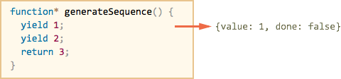
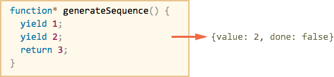
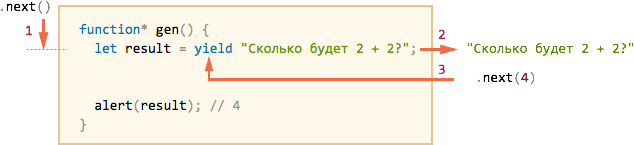
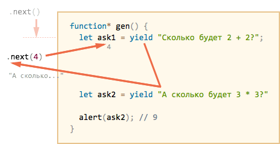

# Генераторы [todo]

Генераторы -- новый вид функций в современном JavaScript. Они отличаются от обычных тем, что могут приостанавливать своё выполнение, возвращать промежуточный результат и далее возобновлять его позже, в произвольный момент времени.

## Создание генератора

Для объявления генератора используется новая синтаксическая конструкция: `function*` (функция со звёздочкой).

Её называют "функция-генератор" (generator function).

Выглядит это так:

```js
function* generateSequence() {
  yield 1;
  yield 2;
  return 3;
}
```

При запуске `generateSequence()` код такой функции не выполняется! 

Вместо этого она возвращает специальный объект, который как раз и называют "генератором". 

```js
// generator function создаёт generator
let generator = generateSequence();
```

Правильнее всего будет воспринимать генератор как "замороженный вызов функции":


При создании генератора код находится в начале своего выполнения.

Основным методом генератора является `next()`. При вызове он возобновляет выполнение кода до ближайшего ключевого слова `yield`. По достижении `yield` выполнение приостанавливается, а значение -- возвращается во внешний код:

```js
//+ run
'use strict';

function* generateSequence() {
  yield 1;
  yield 2;
  return 3;
}

let generator = generateSequence();

let one = generator.next();

alert(JSON.stringify(one)); // {value: 1, done: false}
```



Повторный вызов `generator.next()` возобновит выполнение и вернёт результат следующего `yield`:

```js
let two = generator.next();

alert(JSON.stringify(two)); // {value: 2, done: false}
```



И, наконец, последний вызов завершит выполнение функции и вернёт результат `return`:

```js
let three = generator.next();

alert(JSON.stringify(three)); // {value: 3, *!*done: true*/!*}
```


Функция завершена. Внешний код должен увидить это из свойства `done:true` и прекратить вызовы. Впрочем, если новые вызовы `generator.next()` и будут, то они не вызовут ошибки, но будут возвращать один и тот же объект: `{done: true}`.

"Открутить назад" завершившийся генератор нельзя, но можно создать новый ещё одним вызовом `generateSequence()` и выполнить его.

## Генератор -- итератор

Как вы, наверно, уже догадались по наличию метода `next()`, генератор является итерируемым объектом.

Его можно перебирать и через `for..of`:

```js
//+ run
'use strict';

function* generateSequence() {
  yield 1;
  yield 2;
  return 3;
}

let generator = generateSequence();

for(let value of generator) {
  alert(value); // 1, затем 2
}
```

Заметим, однако, существенную особенность такого перебора!

При запуске примера выше будет выведено значение `1`, затем `2`. Значение `3` выведено не будет. Это потому что стандартные перебор итератора игнорирует `value` на последнем значении, при `done: true`. Так что результат `return` в цикле `for..of` не выводится.

Соответственно, если мы хотим, чтобы все значения возвращались при переборе через `for..of`, то надо возвращать их через `yield`:


```js
//+ run
'use strict';

function* generateSequence() {
  yield 1;
  yield 2;
*!*
  yield 3;
*/!*
}

let generator = generateSequence();

for(let value of generator) {
  alert(value); // 1, затем 2, затем 3
}
```

...А зачем вообще `return` при таком раскладе, если его результат игнорируется? Он тоже нужен, но в других ситуациях. Перебор через `for..of` -- в некотором смысле "исключение". Как мы увидим дальше, в других контекстах `return` очень даже востребован.

## Композиция генераторов

Один генератор может включать в себя другие. Это называется композицией. 

Разберём композицию на примере.

Пусть у нас есть функция `generateSequence`, которая генерирует последовательность чисел:

```js
//+ run
'use strict';

function* generateSequence(start, end) {

  for (let i = start; i <= end; i++) {
    yield i;
  }

}

// Используем оператор … для преобразования итерируемого объекта в массив
let sequence = [...generateSequence(2,5)];

alert(sequence); // 2, 3, 4, 5
```

Мы хотим на её основе сделать другую функцию `generateAlphaNumCodes()`, которая будет генерировать коды для буквенно-цифровых символов латинского алфавита:

<ul>
<li>`48..57` -- для `0..9`</li>
<li>`65..90` -- для `A..Z`</li>
<li>`97..122` -- для `a..z`</li>
</ul>

Далее этот набор кодов можно превратить в строку и использовать, к примеру, для выбора из него случайного пароля. Только символы пунктуации ещё хорошо бы добавить для надёжности, но в этом примере мы будем без них.

Естественно, раз в нашем распоряжении есть готовый генератор `generateSequence`, то хорошо бы его использовать.

Конечно, можно внутри `generateAlphaNum` запустить несколько `generateSequence`, объединить результаты и вернуть, но композиция -- это кое-что получше.

Она выглядит так:

```js
//+ run
'use strict';

function* generateSequence(start, end) {
  for (let i = start; i <= end; i++) yield i;
}

function* generateAlphaNum() {

*!*
  // 0..9
  yield* generateSequence(48, 57);

  // A..Z
  yield* generateSequence(65, 90);

  // a..z
  yield* generateSequence(97, 122);
*/!*

}

let str = '';

for(let code of generateAlphaNum()) {
  str += String.fromCharCode(code);
}

alert(str); // 0..9A..Za..z
```

Здесь использована специальная форма `yield*`. Она применима только к другому генератору и *делегирует* ему выполнение.

То есть, при `yield*` интерпретатор переходит внутрь генератора-аргумента, к примеру, `generateSequence(48, 57)`, выполняет его, и все `yield`, которые он делает, выходят из внешнего генератора.

Получается -- как будто мы вставили код внутреннего генератора во внешний напрямую, вот так:

```js
//+ run
'use strict';

function* generateSequence(start, end) {
  for (let i = start; i <= end; i++) yield i;
}

function* generateAlphaNum() {

*!*
  // yield* generateSequence(48, 57);
  for (let i = 48; i <= 57; i++) yield i;

  // yield* generateSequence(65, 90);
  for (let i = 65; i <= 90; i++) yield i;

  // yield* generateSequence(97, 122);
  for (let i = 97; i <= 122; i++) yield i;
*/!*

}

let str = '';

for(let code of generateAlphaNum()) {
  str += String.fromCharCode(code);
}

alert(str); // 0..9A..Za..z
```

## yield -- дорога в обе стороны

До этого генераторы наиболее напоминали "итераторы на стероидах". Но, как мы сейчас увидим, это не так, есть фундаментальное различие, генераторы гораздо мощнее и гибче.

Всё дело в том, что `yield` -- дорога в обе стороны: он не только возвращает результат наружу, но и может передавать значение извне в генератор. 

Вызов `let result = yield value` делает следующее:

<ul>
<li>Возвращает `value` во внешний код, приостанавливая выполнение генератора.</li>
<li>Внешний код может обработать значение, и затем вызвать `next` с аргументом: `generator.next(result)`.</li>
<li>Генератор продолжит выполнение, этот аргумент будет записан в `result`.</li>
</ul>

Продемонстрируем это на примере:

```js
//+ run
'use strict';

function* gen() {
*!*
  // Передать вопрос во внешний код и подождать ответа
  let result = yield "Сколько будет 2 + 2?";
*/!*

  alert(result);
}

let generator = gen();

let question = generator.next().value;
// { value: "Сколько будет 2 + 2?", done: false }

setTimeout(() => generator.next(4), 2000);
```



Выше проиллюстрировано то, что происходит в генераторе:

<ol>
<li>Первый `.next()` всегда без аргумента, он начинает выполнение и возвращает результат первого `yield`.</li>
<li>Результат `yield` переходит во внешний код (в `question`), он может выполнять любые асинхронные задачи.</li>
<li>Когда асинхронные задачи готовы, внешний код вызывает `.next(result)`, при этом выполнение продолжается, а `result` выходит из присваивания как результат `yield`.</li>
</ol>

Посмотрим вариант побольше:

```js
//+ run
'use strict';

function* gen() {
  let ask1 = yield "Сколько будет 2 + 2?"; 

  alert(ask1); // 4

  let ask2 = yield "А сколько будет 3 * 3?"

  alert(ask2); // 9
}

let generator = gen();

alert( generator.next().value ); // "...2+2?"

alert( generator.next(4).value ); // "...3*3?"

alert( generator.next(9).done ); // true 
```


<ol>
<li>Первый `.next()` начинает выполнение... Оно доходит до первого `yield`.</li>
<li>Результат возвращается во внешний код.</li>
<li>Второй `.next(4)` передаёт `4` обратно в генератор как результат первого `yield` и возобновляет выполнение.</li>
<li>...Оно доходит до второго `yield`, который станет результатом `.next(4)`.</li>
<li>Третий `next(9)` передаёт `9` в генератор как результат второго `yield` и возобновляет выполнение, которое завершается окончанием функции, так что `done: true`.</li>
</ol>

Получается "пинг-понг": каждый `next(value)` передаёт в генератор значение, которое становится результатом текущего `yield`, возобновляет выполнение и получает выражение из следующего `yield`.



Исключением является первый вызов `next`, который не может передать значение в генератор, т.к. ещё не было ни одного `yield`.


## generator.throw

Как мы видели в примерах выше, внешний код может вернуть генератору в качестве результата `yield` любое значение.

Можно "вернуть" не только результат, но и ошибку!

Это делает вызов `generator.throw(err)`.

Например:


```js
//+ run
'use strict';

function* gen() {
  // Передать вопрос во внешний код и подождать ответа
  try {
    let result = yield "Сколько будет 2 + 2?";

    alert(result);
  } catch(e) {
    alert(e);
  } 
}

let generator = gen();

let question = generator.next().value;

*!*
generator.throw(new Error("ответ не найден в моей базе данных"));
*/!*
```

"Вброшенная" извне ошибка обрабатывается как обычно. Она возникает в строке с `yield` и может быть перехвачена `try..catch`, как продемонстрировано выше.


# Плоский асинхронный код

Одна из основных областей применения генераторов -- написание "плоского" асинхронного кода.

Общий принцип такой:
<ul>
<li>Генератор `yield'ит` не просто значения, а промисы.</li>
<li>Есть специальная "функция-чернорабочий" `execute(generator)` которая запускает генератор, последовательными вызовами `next` получает из него эти промисы, ждёт их выполнения и возвращает в генератор результат, пока генератор не завершится.</li>
<li>Последнее значение генератора `execute` возвращает через промис, коллбэк или просто использует, как в примере ниже.</li>
</ul>

Получается примерно так:

```js
//+ run
'use strict';

function* showUserAvatar() {

  let userFetch = yield fetch('/article/generator/user.json');
  let userInfo = yield userFetch.json();

  let githubFetch = yield fetch(`https://api.github.com/users/${userInfo.name}`); 
  let githubUserInfo = yield githubFetch.json();

  let img = new Image();
  img.src = githubUserInfo.avatar_url;
  img.className = "promise-avatar-example";
  document.body.appendChild(img);

  yield new Promise(resolve => setTimeout(resolve, 3000));

  img.remove();

  return img.src;
}

function execute(generator, yieldValue) {

  let next = generator.next(yieldValue);

  if (!next.done) {
    next.value.then(
      result => execute(generator, result),
      err => generator.throw(err)
    );
  } else {
    // return из генератора (его результат)
    alert(next.value);
  }

}

*!*
execute( showUserAvatar() );
*/!*
```


[head]
<style>
.promise-avatar-example {
  border-radius: 50%;
  position: fixed;
  right: 0;
  top: 0;
}
</style>
[/head]


