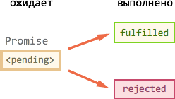
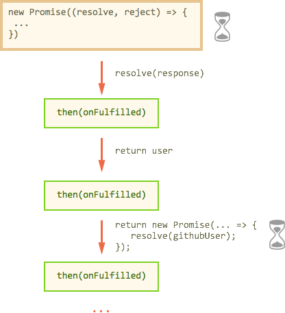

# Promise

Promise (обычно их так и называют "промисы") -- предоставляют удобный способ организации асинхронного кода.

В современном JavaScript промисы часто используются в том числе и неявно, при помощи генераторов, но об этом чуть позже. 

## Что такое Promise?

Promise -- это специальный объект, который содержит своё состояние. Вначале `pending` ("ожидание"), затем -- одно из: `fulfilled` ("выполнено успешно") или `rejected` ("выполнено с ошибкой").



На `promise` можно навешивать коллбэки двух типов:

<ul>
<li>`onFulfilled` -- срабатывают, когда `promise` в состоянии "выполнен успешно".</li>
<li>`onRejected` -- срабатывают, когда `promise` в состоянии "выполнен с ошибкой".</li>
</ul>

Способ использования, в общих чертах, такой:
<ol>
<li>Код, которому надо сделать что-то асинхронно, создаёт объект `promise` и возвращает его.</li>
<li>Внешний код, получив `promise`, навешивает на него обработчики.</li>
<li>По завершении асинхронного процесса асинхронный код переводит `promise` в состояние `fulfilled` (с результатом) или `rejected` (с ошибкой). При этом автоматически вызываются обработчики.</li>
</ol>

Синтаксис создания `Promise`:

```js
var promise = new Promise(function(resolve, reject) {
  // Эта функция будет вызвана автоматически 
  // В ней можно делать любые асинхронные операции, 
  // А когда они завершаться — вызвать:
  // resolve(результат) при успешном выполнении
  // reject(ошибка) при ошибке
})
```

Универсальный метод для навешивания обработчиков:

```
promise.then(onFulfilled, onRejected)
```

<ul>
<li>`onFulfilled` -- функция, которая будет вызвана с результатом при `resolve`.</li>
<li>`onRejected` -- функция, которая будет вызвана с ошибкой при `reject`.</li>
</ul>

С его помощью можно назначить как оба обработчика сразу, так и только один:

```js
// только на успешное выполнение
promise.then(onFulfilled)
// только на ошибку
promise.then(null, onRejected)
```

[smart header=".catch"]
Для того, чтобы поставить обработчик только на ошибку, вместо `.then(null, onRejected)` можно написать `.catch(onRejected)` -- это то же самое.
[/smart]

[smart header="Синхронный `throw` -- то же самое, что `reject`"]
Если в функции промиса происходит ошибка или синхронный `throw`, то вызывается `reject`:
```js
//+ run
var p = new Promise((resolve, reject) => {
  throw new Error("o_O");
})

p.catch(alert); // Error: o_O
```
[/smart]

Посмотрим, как это выглядит вместе, на простом примере.


## Пример с setTimeout

Возьмём `setTimeout` в качестве асинхронной операции, которая должна через некоторое время успешно завершиться с результатом "result":

```js
//+ run
// Создаётся объект promise
var promise = new Promise((resolve, reject) => {
  
  setTimeout(() => {
    // переводит в состояние fulfilled с результатом "result"
    resolve("result");
  }, 1000);

});

// promise.then навешивает обработчики на успешный результат или ошибку
promise
  .then(
    result => {
      // первая функция-обработчик - запустится при вызове resolve
      alert("Fulfilled: " + result); // result - аргумент resolve
    }, 
    error => {
      // вторая функция - запустится при вызове reject
      alert("Rejected: " + error); // error - аргумент reject
    }
  );

```

В результате запуска кода выше -- через 1 секунду выведется "Fulfilled: result".

А если бы вместо `resolve("result")` был вызов `reject("error")`, то вывелось бы "Rejected: error". Впрочем, как правило, если при выполнении возникла проблема, то `reject` вызывают не со строкой, а с объектом ошибки типа `new Error`:

```js
//+ run
// Этот promise завершится с ошибкой через 1 секунду
var promise = new Promise((resolve, reject) => {
  
  setTimeout(() => {
*!*
    reject(new Error("время вышло!"));
*/!*
  }, 1000);

});

promise
  .then(
    result => alert("Fulfilled: " + result),
*!*
    error => alert("Rejected: " + error.message) // Rejected: время вышло!
*/!*
  );

```

Конечно, вместо `setTimeout` мог бы быть и запрос к серверу и ожидание ввода пользователя, или другой асинхронный процесс. 


## Promise после reject/resolve -- неизменны

Заметим, что после вызова `resolve/reject` промис уже не может "передумать".

Когда промис переходит в состояние "выполнен" -- с результатом (resolve) или ошибкой (reject) -- это навсегда.

Например:

```js
//+ run
var promise = new Promise((resolve, reject) => {

*!*
  // через 1 секунду готов результат: result
*/!*
  setTimeout(() => resolve("result"), 1000);

*!*
  // через 2 секунды — reject с ошибкой, он будет проигнорирован
*/!*
  setTimeout(() => reject(new Error("ignored")), 2000);

});

promise
  .then(
    result => alert("Fulfilled: " + result), // сработает
    error => alert("Rejected: " + error) // не сработает
  );

```

В результате вызова этого кода сработает только первый обработчик `then`, так как после вызова `resolve` промис уже получил состояние (с результатом), и в дальнейшем его уже ничто не изменит.

Последующие вызовы resolve/reject  будут просто проигнороированы.

А так -- наоборот, ошибка будет раньше:


```js
//+ run
var promise = new Promise((resolve, reject) => {

  // reject вызван раньше, resolve будет проигнорирован
  setTimeout(() => reject(new Error("error")), 1000);

  setTimeout(() => resolve("ignored"), 2000);

});

promise
  .then(
    result => alert("Fulfilled: " + result), // не сработает
    error => alert("Rejected: " + error) // сработает
  );

```


## Промисификация

*Промисификация* -- это когда берут асинхронный функционал и делают для него обёртку, возвращающую промис.

После промисификации использование функционала зачастую становится гораздо удобнее.

В качестве примера сделаем такую обёртку для запросов при помощи XMLHttpRequest.

Функция `loadUrl(url)` будет возвращать промис, который при успешной загрузки данных с `url` будет переходить в `fulfilled` с этими данными, а при ошибке -- в `rejected` с информацией об ошибке:

```js
//+ autorun
function loadUrl(url) {

  return new Promise(function(resolve, reject) {

    var xhr = new XMLHttpRequest();
    xhr.open('GET', url, true);

    xhr.onload = function() {
      if (this.status == 200) {
*!*
        resolve(this.response);
*/!*  
      } else {
*!*
        reject(new Error(this.statusText));
*/!*
      }
    };

    xhr.onerror = function() {
*!*
      reject(new Error("Network Error"));
*/!*
    };

    xhr.send();
  });

}
```

Как видно, внутри функции объект `XMLHttpRequest` создаётся и отсылается как обычно, при `onload/onerror` вызываются, соответственно, `resolve` (при статусе 200) или `reject`.

Использование:

```js
//+ run
loadUrl("/article/promise/user.json")
  .then(
    response => alert(`Fulfilled: ${response}`),
    error => alert(`Rejected: ${error}`)
  );
```


[smart header="Метод `fetch`"]
Заметим, что ряд современных браузеров уже поддерживает [fetch](https://fetch.spec.whatwg.org) -- новый встроенный метод для AJAX-запросов, призванный заменить XMLHttpRequest. Он, конечно, гораздо мощнее, чем `loadUrl`. И -- да, этот метод использует промисы. Полифилл для него доступен на [](https://github.com/github/fetch). 
[/smart]

Далее мы увидим ещё примеры, а пока -- рассмотрим важные свойства `promise`.


## Цепочки промисов

"Чейнинг" (chaining), то есть возможность строить асинхронные цепочки из промисов -- пожалуй, основная причина, из-за которой существуют и активно используются промисы.

Например, мы хотим по очереди:
<ol>
<li>Загрузить данные посетителя с сервера (асинхронно).</li>
<li>Затем отправить запрос о нём на github (асинхронно).</li>
<li>Когда это будет готово, вывести его github-аватар на экран (асинхронно).</li>
<li>...И сделать код расширяемым, чтобы цепочку можно было легко продолжить.</li>
</ol>

Вот код для этого, использующий функцию `loadUrl`, описанную выше:

```js
//+ run
'use strict';

// сделать запрос
loadUrl('/article/promise/user.json')
*!*
  // 1. Получить данные о пользователе в JSON и передать дальше
*/!*
  .then(response => {
    console.log(response); 
    let user = JSON.parse(response);
*!*
    return user; 
*/!*
  })
*!*
  // 2. Получить информацию с github
*/!*
  .then(user => {
    console.log(user);
*!*
    return loadUrl(`https://api.github.com/users/${user.name}`); 
*/!*
  })
*!*
  // 3. Вывести аватар на 3 секунды (можно с анимацией)
*/!*
  .then(githubUser => {
    console.log(githubUser);
    githubUser = JSON.parse(githubUser);
    
    let img = new Image();
    img.src = githubUser.avatar_url;
    img.className = "promise-avatar-example";
    document.body.appendChild(img);

*!*
    setTimeout(() => img.remove(), 3000); // (*)
*/!*
  });
```

Самое главное в этом коде -- последовательность вызовов:

```js
loadUrl(...)
  .then(...)
  .then(...)
  .then(...)
```

При чейнинге, то есть последовательных вызовах `.then...then..then`, в каждый следующий `then` переходит результат от предыдущего.

**Причём, если `then` вернул промис, то в следующий `then` будет передан не сам промис, а его результат.**

В коде выше:

<ol>
<li>В первом `then` возвращается объект `user`, он переходит в следующий `then`.</li>
<li>Во втором `then` возвращается промис (результат `loadUser`). Когда он будет завершён (может пройти какое-то время), то будет вызван следующий `then`.</li>
<li>Третий `then` ничего не возвращает.</li>
</ol>

Схематично его работу можно изобразить так:



Обратим внимание, что последний `then` в нашем примере ничего не возвращает. Если мы хотим, чтобы после `setTimeout` `(*)` асинхронная цепочка могла быть продолжена, то последний `then` тоже должен вернуть промис.

Это общее правило. Если внутри `then` стартует новый асинхронный процесс, то для того, чтобы дождаться его окончания, мы должны вернуть промис, который перейдёт в состояние "выполнен" после `setTimeout`.

Строку `(*)` для этого нужно переписать так:
```js
.then(githubUser => {
  ...
  
  // вместо setTimeout(() => img.remove(), 3000);

  return new Promise((resolve, reject) => {
    setTimeout(() => {
      img.remove();
      // после таймаута — просто resolve, без результата, 
      // чтобы управление перешло в следующий then
      // (или можно передать данные пользователя дальше по цепочке)
      resolve(); 
    }, 3000);
  });
})
```

Теперь, если к цепочке добавится ещё `then`, то он будет вызван после окончания `setTimeout`.

## Перехват ошибок

Выше мы рассмотрели "идеальный случай" выполнения, когда ошибок нет.

А что, если github не отвечает? Или JSON.parse бросил синтаксическую ошибку при обработке данных?

Да мало ли, где ошибка...

Правило здесь очень простое.

**При возникновении ошибки -- она отправляется в ближайший обработчик `onRejected`.**

Такой обработчик нужно поставить через второй аргумент `.then(..., onRejected)` или, что то же самое, через `.catch(onRejected)`.

Чтобы поймать всевозможные ошибки, которые возникнут при загрузке и обработке данных, добавим `catch` в конец нашей цепочки:

```js
//+ run
'use strict';

*!*
// в loadUrl обратимся к несуществующей странице
*/!*
loadUrl('/page-not-exists')
  .then(response => JSON.parse(response))
  .then(user => loadUrl(`https://api.github.com/users/${user.name}`))
  .then(githubUser => {
    githubUser = JSON.parse(githubUser);

    let img = new Image();
    img.src = githubUser.avatar_url;
    img.className = "promise-avatar-example";
    document.body.appendChild(img);

    return new Promise((resolve, reject) => {
      setTimeout(() => {
        img.remove();
        resolve();
      }, 3000);
    });
  })
*!*
  .catch(error => {
    alert(error); // Error: Not Found
  });
*/!*
```

Принцип очень похож на обычный `try..catch`: мы делаем асинхронную цепочку из `.then`, а затем, когда нужно перехватить ошибки, вызываем `.catch(onRejected)`.


[smart header="А что после catch?"]
Обработчик `onRejected` получает ошибку и должен обработать её.

Здесь два варианта развития событий:
<ol>
<li>Если ошибка не критичная, то он возвращает значение через `return`, и управление переходит в ближайший `onFulfilled`.</li>
<li>Если продолжить выполнение с такой ошибкой нельзя, то он делает `throw`, и тогда ошибка переходит в ближайший `onRejected`.
</li>
</ol>
[/smart]

## Промисы в деталях

Посмотрим внимательнее, что такое промис и как он работает, в соответствии со стандартом ES-2015.


Поток выполнения сразу станет очевидным, как только мы разберём очень простое правило.

Оно состоит из трёх частей:

<ol>
<li>Каждый `promise.then/catch` возвращает новый промис `newPromise`.</li>
<li>Ссылка на `newPromise` сохраняется в записывается в `promise`.</li>
</li>При успешном выполнении этого промиса, вызывается следующий `onFulfilled`, если ошибка, то `onRejected`.</li>
<li>Этот обработчик возвращает... см. пункт 1.</li>
</ol>

Давайте по шагам.

Очевидно, что каждый .then/catch должен промис. Это всегда так, иначе мы бы не смогли организовать чейнинг.

Этот промис -- всегда новый, не равный предыдущему. 

Проверим это:

```js
//+ run
// Создадим промис и цепочку .then
var promise = new Promise((resolve, reject) => {
  setTimeout(() => resolve(1), 1000);
});

var promise2 = promise
  .then(alert);

// Выведем результат then 
alert(promise2); // да, это промис: [object Promise]
alert(promise == promise2); // да, это новый промис
```

[smart header="Обработчики -- всегда асинхронны"]
Кстати, обработчики в `.then/catch` всегда выполняются асинхронно, как будто обёрнуты в `setTimeout(..., 0)`, даже если внутри синхронная функция.

Например:
```js
//+ run
var promise = new Promise((resolve, reject) => {
  resolve("result")
});

// сработает асинхронно
promise.then(alert); // (2)

alert("before promise"); // (1)
```

При запуске этого кода выведется сначала `(1)`, а потом `(2)`.

Такая "форсированная" асинхронность предусмотрена стандартом, чтобы избежать ситуаций, когда некий код работает то синхронно, то асинхронно, и возможных при этом багов.
[/smart]

Обработчики добавляются в общий список.


При выполнении обработчика `.then/catch` -- он может либо что-то вернуть 

<ol>
<li>Обработчика вернул значение (или ничего не вернул, что можно считать `return undefined`)


Пример:


Ошибкой считается либо вызов `reject`, либо синхронный `throw` в promise-функции:

```js
var promise = new Promise((resolve, reject) {
  
  // эти две строки делают одно и то же:
  // переводят промис в состояние "rejected"
  throw new Error("...");
  reject(new Error("..."))

});
```

Обратим внимание, что `throw` корректно обрабатывается только если он синхронный. 

Вот так -- не подойдёт:

```js
var promise = new Promise((resolve, reject) {
  
  setTimeout(() => {
    // нельзя так делать, асинхронно должен быть reject
    throw new Error("...");
  }, 1000);
  
});
```

На


Мы уже использовали это неявно, при загрузке пользователя в примере выше:

```js
loadUrl('/article/promise/user.json')
  .then(response => {
    // ...
*!*
    let user = JSON.parse(response);
*/!*
    return user; 
  })
```

Если при `JSON.parse` будет синтаксическая ошибка (некорректный JSON), то 


[head]
<style>
.promise-avatar-example {
  border-radius: 50%;
  position: fixed;
  right: 0;
  top: 0;
}
</style>
[/head]
