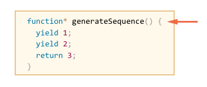
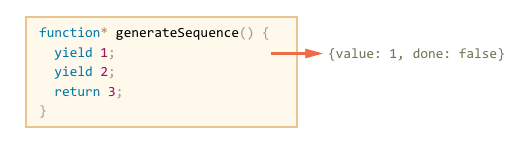
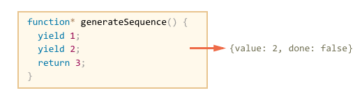
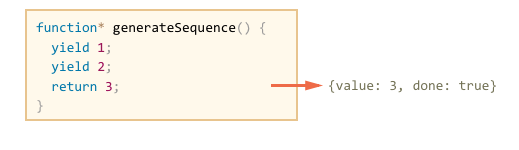
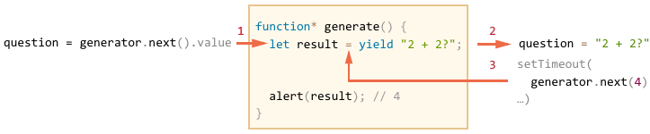
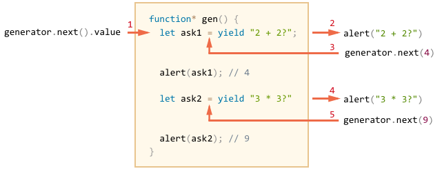

# Generators

Regular functions return only one, single value (or nothing).

Generators can return ("yield") multiple values, possibly an infinite number of values, one after another, on-demand.

## Generator functions

To create a generator, we need a special syntax construct: `function*`, so-called "generator function".

It looks like this:

```js
function* generateSequence() {
  yield 1;
  yield 2;
  return 3;
}
```

When `generateSequence()` is called, it does not execute the code. Instead, it returns a special object, called "generator".

```js
// "generator function" creates "generator object"
let generator = generateSequence();
```

The `generator` object can be perceived as a "frozen function call":



Upon creation, the code execution is paused at the very beginning.

The main method of a generator is `next()`. When called, it resumes execution till the nearest `yield <value>` statement. Then the execution pauses, and the value is returned to the outer code.

For instance, here we create the generator and get its first yielded value:

```js run
function* generateSequence() {
  yield 1;
  yield 2;
  return 3;
}

let generator = generateSequence();

*!*
let one = generator.next();
*/!*

alert(JSON.stringify(one)); // {value: 1, done: false}
```

The result of `next()` is always an object:
- `value`: the yielded value.
- `done`: `false` if the code is not finished yet, otherwise `true`.

As of now, we got the first value only:



Let's call `generator.next()` again. It resumes the execution and returns the next `yield`:

```js
let two = generator.next();

alert(JSON.stringify(two)); // {value: 2, done: false}
```



And, if we call it the third time, then the execution reaches `return` statement that finishes the function:

```js
let three = generator.next();

alert(JSON.stringify(three)); // {value: 3, *!*done: true*/!*}
```



Now the generator is done. We should see it from `done:true` and process `value:3` as the final result.

New calls `generator.next()` don't make sense any more. If we make them, they return the same object: `{done: true}`.

There's no way to "roll back" a generator. But we can create another one by calling `generateSequence()`.

So far, the most important thing to understand is that generator functions, unlike regular function, do not run the code. They serve as "generator factories". Running `function*` returns a generator, and then we ask it for values.

```smart header="`function* f(…)` or `function *f(…)`?"
That's a minor religious question, both syntaxes are correct.

But usually the first syntax is preferred, as the star `*` denotes that it's a generator function, it describes the kind, not the name, so it should stick with the `function` keyword.
```

## Generators are iterable

As you probably already guessed looking at the `next()` method, generators are [iterable](info:iterable).

We can get loop over values by `for..of`:

```js run
function* generateSequence() {
  yield 1;
  yield 2;
  return 3;
}

let generator = generateSequence();

for(let value of generator) {
  alert(value); // 1, then 2
}
```

...But please note: the example above shows `1`, then `2`, and that's all. It doesn't show `3`!

That's because a for-of iteration ignores the last `value`, when `done: true`. So the result of `return` is ignored.

So, if we want all results to be shown by `for..of`, we must return them with `yield`:

```js run
function* generateSequence() {
  yield 1;
  yield 2;
*!*
  yield 3;
*/!*
}

let generator = generateSequence();

for(let value of generator) {
  alert(value); // 1, then 2, then 3
}
```

Naturally, as generators are iterable, we can all related functionality, e.g. the spread operator `...`:

```js run
function* generateSequence() {
  yield 1;
  yield 2;
  yield 3;
}

let sequence = [0, ...generateSequence()];

alert(sequence); // 0, 1, 2, 3
```

In the code above, `...generateSequence()` turns the iterable into array of items (read more about the spread operator in the chapter [](info:rest-parameters-spread-operator#spread-operator))

Just like any function, generators may have arguments:

```js run
function* generateSequence(start, end) {
  for (let i = start; i <= end; i++) {
    yield i;
  }
}

let sequence = [...generateSequence(2,5)];

alert(sequence); // 2, 3, 4, 5
```

Here we had finite generators. but we also can make a generator that yields pseudo-random numbers, infinitely. No one requires a generator to ever stop yielding.

## Generator composition

A generator may include results from other generators in its yields. That's called "a composition of generators".

For instance, we'd like to generate a sequence of:
- digits `0..9` (character codes 48..57),
- followed by alphabet letters `a..z` (character codes 65..90)
- followed by uppercased letters `A..Z` (character codes 97..122)

Then we're going to create passwords by selecting characters from it (could add syntax characters as well).

We already have `function* generateSequence`, that generates a sequence of numbers, given its `start` and `end`.

So let's reuse it.

Of course, we could call `generateSequence` multiple times and then join the results. That's what we would do with regular functions. But generator composition allows us to do better.

It looks like this:

```js run
function* generateSequence(start, end) {
  for (let i = start; i <= end; i++) yield i;
}

function* generatePasswordCodes() {

*!*
  // 0..9
  yield* generateSequence(48, 57);

  // A..Z
  yield* generateSequence(65, 90);

  // a..z
  yield* generateSequence(97, 122);
*/!*

}

let str = '';

for(let code of generatePasswordCodes()) {
  str += String.fromCharCode(code);
}

alert(str); // 0..9A..Za..z
```

Here the special `yield*` directive is used. It only may apply to another generator and *delegates* the execution to it.

That is, `yield*` makes the execution go inside its argument, e.g `generateSequence(48, 57)`, run it and forward all its yields outside.

In other words, it's like we inserted the code from nested generators, equivalent to this:

```js run
function* generateSequence(start, end) {
  for (let i = start; i <= end; i++) yield i;
}

function* generateAlphaNum() {

*!*
  // yield* generateSequence(48, 57);
  for (let i = 48; i <= 57; i++) yield i;

  // yield* generateSequence(65, 90);
  for (let i = 65; i <= 90; i++) yield i;

  // yield* generateSequence(97, 122);
  for (let i = 97; i <= 122; i++) yield i;
*/!*

}

let str = '';

for(let code of generateAlphaNum()) {
  str += String.fromCharCode(code);
}

alert(str); // 0..9A..Za..z
```

A generator composition is a way to naturally insert one generator into another. It works even if the flow of values from the nested generator is infinite, without consuming extra memory.

## "yield" is a two-way road

Till this moment, generators were like "iterators on steroids". But as we'll see now, that is not so. There's a fundamental difference, generators are much more powerful and flexible.

That's because `yield` is a two-way road. It not only returns the result outside, but also can pass the value inside the generator.

- The call `let result = yield value` inside a generator returns `value` to the outer code, pausing the generator execution.
- The outer code may process that value, and call `next` with an argument: `generator.next(arg)`.
- The generator resumes execution, `result` gets the value of `arg`.

So, the argument of `next()` gets into the generator, that may use it to adjust further generation.

Let's see an example:

```js run
function* generate() {
*!*
  // Pass a question to the outer code and wait for an answer
  let result = yield "2 + 2?"; // (*)
*/!*

  alert(result);
}

let generator = generate();

let question = generator.next().value; // <-- yield returns the value

setTimeout(() => generator.next(4), 2000); // --> in two seconds we pass result
```

In the illustration below, the rectangle is a generator, and outside it is the "calling code" interacting with it:



The picture shows in detail what's going on in the line `(*)`:

1. The first call `generator.next()` is always without an argument. It starts the execution and returns the result of the first `yield` ("2+2?"). At this point the generator pauses the execution (still on that line).
2. The result of `yield` gets into the `question` variable in the calling code. The code now can do any tasks, the generator is paused.
3. On thee next call `generator.next(4)`, the generator execution resumes, and `4` gets out of the assignment as the result: `let result = yield ...`.

In the example above, there're only two `next()`.

Be sure to wrap your head around it, as the syntax may be a bit odd. It's quite uncommon for a function and the calling code to pass values around to each other. But that's exactly what's going on.

To make things even more obvious, here's another example, with more calls:

```js run
function* generate() {
  let ask1 = yield "2 + 2?";

  alert(ask1); // 4

  let ask2 = yield "3 * 3?"

  alert(ask2); // 9
}

let generator = generate();

alert( generator.next().value ); // "2 + 2?"

alert( generator.next(4).value ); // "3 * 3?"

alert( generator.next(9).done ); // true
```

The execution picture:



1. The first `.next()` starts the execution... It reaches the first `yield`.
2. The result is returned to the outer code.
3. The second `.next(4)` passes `4` back to the generator as the result of the first `yield`, and resumes the execution.
4. ...It reaches the second `yield`, that becomes the result of the generator call.
5. The third `next(9)` passes `9` into the generator as the result of the second `yield` and resumes the execution that reaches the end of the function, so `done: true`.

It's like a "ping-pong" game. Each `next(value)` (excluding the first one) passes a value into the generator, that becomes the result of the current `yield`, and then gets back the result of the next `yield`.

## generator.throw

As we observed in the examples above, the outer code may pass a value into the generator, as the result of `yield`.

...But it can also initiate (throw) an error there. That's natural, as an error is a kind of result.

To pass an error into a `yield`, we should call `generator.throw(err)`. In that case, the `err` is thrown in the line with that `yield`.

For instance, here the yield of `"2 + 2?"` leads to an error:

```js run
function* generate() {
  try {
    let result = yield "Сколько будет 2 + 2?"; // (1)

    alert("The execution does not reach here, because the exception is thrown above");
  } catch(e) {
    alert(e); // shows the error
  }
}

let generator = generate();

let question = generator.next().value;

*!*
generator.throw(new Error("The answer is not found in my database")); // (2)
*/!*
```

The error, thrown into the generator at the line `(2)` leads to an exception in the line `(1)` with `yield`. That exception is handled as usual. In the example above, `try..catch` catches it and shows.

If we don't catch it, then just like any exception, it "falls out" the generator into the calling code.

The current line of the calling code is the line with `generator.throw`, labelled as `(2)`. So we can catch it here, like this:

```js run
function* generate() {
  let result = yield "2 + 2?"; // Error in this line
}

let generator = generate();

let question = generator.next().value;

*!*
try {
  generator.throw(new Error("The answer is not found in my database"));
} catch(e) {
  alert(e); // shows the error
}
*/!*
```

If we don't catch the error there, then, as usual, it falls through to the outer calling code (if any) and, if uncaught, kills the script.

## Summary

- Generators are created by generator functions `function*(…) {…}`.
- Inside generators (only) there exists a `yield` operator.
- The outer code and the generator may exchange results via `next/yield` calls.

In modern Javascript, generators are rarely used. But sometimes they come in handy, because the ability of a function to exchange data with the calling code during the execution is quite unique.

Also, in the next chapter we'll learn async generators, which are used to read streams of asynchronously generated data in `for` loop.

In web-programming we often work with streamed data, e.g. need to fetch paginated results, so that's a very important use case.
