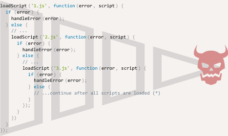

# Introduction: callbacks

Many actions in JavaScript are *asynchronous*.

For instance, take a look at the function `loadScript(src)`:

```js
function loadScript(src) {
  let script = document.createElement('script');
  script.src = src;
  document.head.append(script);
}
```

The purpose of the function is to load a new script. When it adds the `<script src="…">` to the document, the browser loads and executes it.

We can use it like this:

```js
// loads and executes the script
loadScript('/my/script.js');
```

The function is called "asynchronously," because the action (script loading) finishes not now, but later.

The call initiates the script loading, then the execution continues. While the script is loading, the code below may finish executing, and if the loading takes time, other scripts may run meanwhile too.

```js
loadScript('/my/script.js');
// the code below loadScript doesn't wait for the script loading to finish
// ...
```

Now let's say we want to use the new script when it loads. It probably declares new functions, so we'd like to run them.

But if we do that immediately after the `loadScript(…)` call, that wouldn't work:

```js
loadScript('/my/script.js'); // the script has "function newFunction() {…}"

*!*
newFunction(); // no such function!
*/!*
```

Naturally, the browser probably didn't have time to load the script. So the immediate call to the new function fails. As of now, the `loadScript` function doesn't provide a way to track the load completion. The script loads and eventually runs, that's all. But we'd like to know when it happens, to use new functions and variables from that script.

Let's add a `callback` function as a second argument to `loadScript` that should execute when the script loads:

```js
function loadScript(src, *!*callback*/!*) {
  let script = document.createElement('script');
  script.src = src;

*!*
  script.onload = () => callback(script);
*/!*

  document.head.append(script);
}
```

Now if we want to call new functions from the script, we should write that in the callback:

```js
loadScript('/my/script.js', function() {
  // the callback runs after the script is loaded
  newFunction(); // so now it works
  ...
});
```

That's the idea: the second argument is a function (usually anonymous) that runs when the action is completed.

Here's a runnable example with a real script:

```js run
function loadScript(src, callback) {
  let script = document.createElement('script');
  script.src = src;
  script.onload = () => callback(script);
  document.head.append(script);
}

*!*
loadScript('https://cdnjs.cloudflare.com/ajax/libs/lodash.js/3.2.0/lodash.js', script => {
  alert(`Cool, the ${script.src} is loaded`);
  alert( _ ); // function declared in the loaded script
});
*/!*
```

That's called a "callback-based" style of asynchronous programming. A function that does something asynchronously should provide a `callback` argument where we put the function to run after it's complete.

Here we did it in `loadScript`, but of course, it's a general approach.

## Callback in callback

How can we load two scripts sequentially: the first one, and then the second one after it?

The natural solution would be to put the second `loadScript` call inside the callback, like this:

```js
loadScript('/my/script.js', function(script) {

  alert(`Cool, the ${script.src} is loaded, let's load one more`);

*!*
  loadScript('/my/script2.js', function(script) {
    alert(`Cool, the second script is loaded`);
  });
*/!*

});
```

After the outer `loadScript` is complete, the callback initiates the inner one.

What if we want one more script...?

```js
loadScript('/my/script.js', function(script) {

  loadScript('/my/script2.js', function(script) {

*!*
    loadScript('/my/script3.js', function(script) {
      // ...continue after all scripts are loaded
    });
*/!*

  })

});
```

So, every new action is inside a callback. That's fine for few actions, but not good for many, so we'll see other variants soon.

## Handling errors

In the above examples we didn't consider errors. What if the script loading fails? Our callback should be able to react on that.

Here's an improved version of `loadScript` that tracks loading errors:

```js run
function loadScript(src, callback) {
  let script = document.createElement('script');
  script.src = src;

*!*
  script.onload = () => callback(null, script);
  script.onerror = () => callback(new Error(`Script load error for ${src}`));
*/!*

  document.head.append(script);
}
```

It calls `callback(null, script)` for successful load and `callback(error)` otherwise.

The usage:
```js
loadScript('/my/script.js', function(error, script) {
  if (error) {
    // handle error
  } else {
    // script loaded successfully
  }
});
```

Once again, the recipe that we used for `loadScript` is actually quite common. It's called the "error-first callback" style.

The convention is:
1. The first argument of the `callback` is reserved for an error if it occurs. Then `callback(err)` is called.
2. The second argument (and the next ones if needed) are for the successful result. Then `callback(null, result1, result2…)` is called.

So the single `callback` function is used both for reporting errors and passing back results.

## Pyramid of Doom

From the first look, it's a viable way of asynchronous coding. And indeed it is. For one or maybe two nested calls it looks fine.

But for multiple asynchronous actions that follow one after another we'll have code like this:

```js
loadScript('1.js', function(error, script) {

  if (error) {
    handleError(error);
  } else {
    // ...
    loadScript('2.js', function(error, script) {
      if (error) {
        handleError(error);
      } else {
        // ...
        loadScript('3.js', function(error, script) {
          if (error) {
            handleError(error);
          } else {
  *!*
            // ...continue after all scripts are loaded (*)
  */!*
          }
        });

      }
    })
  }
});
```

In the code above:
1. We load `1.js`, then if there's no error.
2. We load `2.js`, then if there's no error.
3. We load `3.js`, then if there's no error -- do something else `(*)`.

As calls become more nested, the code becomes deeper and increasingly more difficult to manage, especially if we have a real code instead of `...`, that may include more loops, conditional statements and so on.

That's sometimes called "callback hell" or "pyramid of doom."



The "pyramid" of nested calls grows to the right with every asynchronous action. Soon it spirals out of control.

So this way of coding isn't very good.

We can try to alleviate the problem by making every action a standalone function, like this:

```js
loadScript('1.js', step1);

function step1(error, script) {
  if (error) {
    handleError(error);
  } else {
    // ...
    loadScript('2.js', step2);
  }
}

function step2(error, script) {
  if (error) {
    handleError(error);
  } else {
    // ...
    loadScript('3.js', step3);
  }
}

function step3(error, script) {
  if (error) {
    handleError(error);
  } else {
    // ...continue after all scripts are loaded (*)
  }
};
```

See? It does the same, and there's no deep nesting now because we made every action a separate top-level function.

It works, but the code looks like a torn apart spreadsheet. It's difficult to read, and you probably noticed that one needs to eye-jump between pieces while reading it. That's inconvenient, especially if the reader is not familiar with the code and doesn't know where to eye-jump.

Also, the functions named `step*` are all of single use, they are created only to avoid the "pyramid of doom." No one is going to reuse them outside of the action chain. So there's a bit of a namespace cluttering here.

We'd like to have something better.

Luckily, there are other ways to avoid such pyramids. One of the best ways is to use "promises," described in the next chapter.
